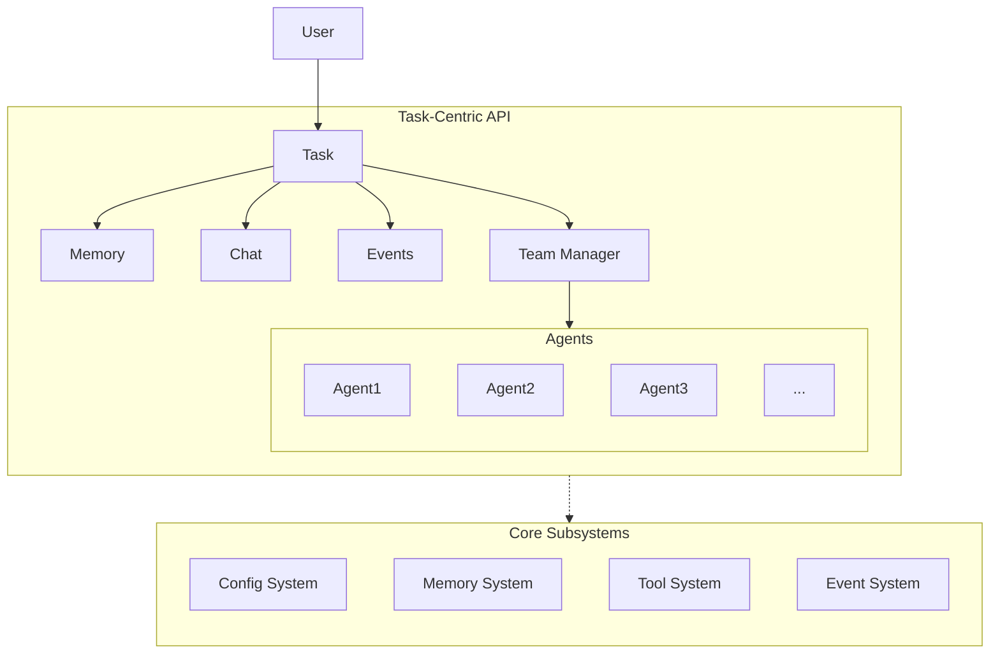

> [!Warning]
> This project is currently under development. Functionality and stability are not guaranteed.

# Roboco - Multi-Agent Collaboration Framework

[](https://www.python.org/downloads/)
[](https://opensource.org/licenses/Apache-2.0)

Roboco is a configuration-driven framework for building collaborative AI agent teams. Built on AG2 (AutoGen), it enables sophisticated multi-agent workflows through YAML configuration and a clean Task-centric API.

## 🚀 Key Features

- **Task-Centric API**: Clean, intuitive object-oriented interface
- **Configuration-Based**: Define agents, tools, and workflows in YAML
- **Memory System**: Intelligent storage with Mem0 integration (26% higher accuracy, 91% faster)
- **Search Integration**: Web search with SerpAPI backend
- **Tool Ecosystem**: Built-in tools (filesystem, memory, search) plus extensible registry
- **Event System**: Real-time monitoring and observability
- **Task Management**: Resume interrupted workflows with persistent sessions
- **Production Ready**: Designed for scalability and reliability

## 📦 Installation

```bash
git clone https://github.com/dustland/roboco.git
cd roboco
uv sync  # or pip install -e .
```

**Requirements:**

- Python 3.11+
- OpenAI API key (`OPENAI_API_KEY`)
- Optional: SerpAPI key (`SERPAPI_KEY`) for web search

## 🏃‍♂️ Quick Start

### New Task-Centric API (v0.8.0+)

```python
import asyncio
import roboco

async def main():
    # Create a task (but don't start it yet)
    task = roboco.create_task("config/team.yaml")

    # Start the collaboration
    result = await task.start("Write a brief report on renewable energy trends")

    print(f"Success: {result.success}")
    print(f"Summary: {result.summary}")

asyncio.run(main())
```

### Task Management

```python
import roboco

# Create and manage tasks
task = roboco.create_task("config/team.yaml", "Research AI trends")
task_id = task.task_id

# Retrieve existing tasks
task = roboco.get_task(task_id)
all_tasks = roboco.list_tasks()

# Task lifecycle
await task.start("Task description")  # Start or resume
await task.stop()                     # Stop if running
await task.delete()                   # Clean up
```

### Integrated Memory Operations

```python
# Memory operations are scoped to the task automatically
memory = task.get_memory()

# Add memories (task_id is automatic)
memory.add("Important context", agent_id="planner")

# Search memories (task_id is automatic)
results = memory.search("keyword", agent_id="planner")

# Get all memories (task_id is automatic)
all_memories = memory.get_all(agent_id="researcher")
```

### Event Handling

```python
# Event handling integrated with tasks
def on_completion(event):
    print(f"Task completed: {event.data}")

task.on("task.completed", on_completion)
task.off("task.completed", on_completion)
```

### Chat Session Access

```python
# Access chat functionality
chat = task.get_chat()
history = chat.get_chat_history()
await chat.send_message("Additional instruction")
```

## 📚 Examples

Complete working examples in `examples/`:

### [Simple Team](examples/simple_team/) - Basic Collaboration

Basic multi-agent collaboration with the new API:

```bash
cd examples/simple_team
python api_comparison_demo.py  # See old vs new API
```

### [SuperWriter](examples/superwriter/) - Production Multi-Agent System

A comprehensive writing system with research, planning, writing, and review agents:

```bash
cd examples/superwriter
python demo.py  # Will be updated to new API
```

## 🏗️ Architecture



**Core Components:**

1. **Task**: Central API object managing collaboration lifecycle
2. **TeamManager**: Orchestrates agent collaboration
3. **Memory System**: Mem0-powered intelligent storage and retrieval
4. **Search System**: Web search with multiple backend support
5. **Tool System**: Extensible plugin architecture
6. **Config System**: YAML-based configuration with Jinja2 templates

## 🆕 API Evolution

### v0.8.0: Task-Centric API

The new API is much cleaner and more intuitive:

```python
# OLD (v0.7.x) - Global functions
from roboco import start_task, stop_task, get_task_status
task_id = await start_task("config.yaml", "description")
status = get_task_status(task_id)
await stop_task(task_id)

# NEW (v0.8.0+) - Task-centric
import roboco
task = roboco.create_task("config.yaml")
await task.start("description")
await task.stop()
```

**Benefits:**

- ✅ Single Task class with all functionality
- ✅ No task_id parameters needed (automatic scoping)
- ✅ Integrated memory, chat, and events
- ✅ Object-oriented and discoverable
- ✅ Clean separation of concerns

## 📖 Documentation

- **[System Architecture](docs/system-architecture.md)** - Overall design and patterns
- **[Configuration Guide](docs/config-based-design.md)** - YAML configuration reference
- **[Memory System](docs/memory-system.md)** - Mem0 integration and usage
- **[Tool System](docs/tool-system.md)** - Plugin architecture and development

## 🤝 Contributing

We welcome contributions! Please see [CONTRIBUTING.md](CONTRIBUTING.md) for guidelines.

## 📄 License

Licensed under the Apache License 2.0 - see [LICENSE](LICENSE) for details.

## 🙋‍♀️ Support

- **Issues**: [GitHub Issues](https://github.com/dustland/roboco/issues)
- **Discussions**: [GitHub Discussions](https://github.com/dustland/roboco/discussions)

---

**Built with ❤️ by the [Dustland](https://github.com/dustland) team**
