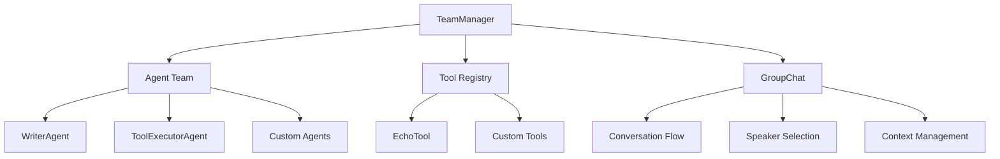

# Roboco: AI Agent Collaboration Framework

[](https://www.python.org/downloads/)
[](https://opensource.org/licenses/MIT)

Roboco is a modern AI agent collaboration framework built on top of AG2 (AutoGen). Unlike traditional workflow-based systems, Roboco focuses on **dynamic team collaboration** where AI agents work together naturally through conversation and shared context.

## 🌟 Key Features

### 🤝 Collaboration over Workflows

- **Dynamic Team Formation**: Agents collaborate naturally rather than following predefined workflows
- **GroupChat Orchestration**: Flexible multi-agent conversations with intelligent speaker selection
- **Context-Driven Interactions**: Agents adapt based on conversation context and expertise

### 🔧 Easy Configuration

- **YAML-Based Setup**: Define teams, agents, and tools through simple configuration files
- **Hot-Reloadable**: Update configurations without restarting your application
- **Modular Architecture**: Mix and match components as needed

### 🛠️ Powerful Tooling

- **Universal Tool Bridge**: Seamlessly integrate any Python function as an agent tool
- **Type-Safe**: Automatic schema generation from function signatures
- **Tool Sharing**: Tools can be shared across multiple agents in a team

### 🎯 Production Ready

- **FastAPI Integration**: Built-in web API for team collaboration
- **Event System**: Comprehensive event handling and logging
- **Context Management**: Persistent state across agent interactions

## 🚀 Quick Start

### Installation

```bash
git clone https://github.com/your-org/roboco.git
cd roboco
pip install -r requirements.txt
```

### Basic Usage

1. **Define Your Team** (`config/team.yaml`):

```yaml
agents:
  - name: WriterAgent
    class: roboco.agents.Agent
    system_message: "You are a creative writer who collaborates with others to create excellent content."
    llm_config:
      config_list:
        - model: "gpt-4o-mini"

  - name: ToolExecutorAgent
    class: roboco.agents.ToolExecutorAgent

tools:
  - class: roboco.tools.basic_tools.EchoTool
    name: "echo_tool"
    description: "Echoes back messages with confirmation"

team:
  chat_config:
    max_rounds: 15
    speaker_selection: "auto"
```

2. **Start Collaboration**:

```python
from roboco.orchestration import TeamManager

# Initialize team
team = TeamManager("config/team.yaml")

# Start collaboration
result = team.collaborate("Write a short story about AI collaboration")
print(result.summary)
```

3. **Run SuperWriter Example**:

```bash
cd examples/superwriter
python -m uvicorn app.main:app --reload
```

## 🏗️ Architecture

### Core Components



### Collaboration vs Workflow

| Aspect              | Traditional Workflow       | Roboco Collaboration |
| ------------------- | -------------------------- | -------------------- |
| **Flow**            | Predefined steps A → B → C | Dynamic conversation |
| **Adaptability**    | Fixed sequence             | Context-driven       |
| **Interaction**     | Sequential handoffs        | Natural discussion   |
| **Problem Solving** | Linear progression         | Emergent solutions   |
| **Scalability**     | Hard to modify             | Easy to extend       |

## 📖 Documentation

- [System Architecture](docs/system-architecture.md) - Core design principles
- [Configuration Guide](docs/config-based-design.md) - Detailed configuration options
- [Tool System](docs/tool-system.md) - Creating and using tools
- [Event System](docs/event-system.md) - Event handling and logging
- [Context Management](docs/context-management.md) - State management

## 🔄 Migration from v0

If you're migrating from the previous workflow-based system:

1. **Update Orchestration**:

   ```python
   # Old workflow approach
   from roboco.orchestration import WorkflowManager
   manager = WorkflowManager("workflow.yaml")
   result = manager.run(task)

   # New collaboration approach
   from roboco.orchestration import TeamManager
   team = TeamManager("team.yaml")
   result = team.collaborate(task)
   ```

2. **Update Configuration**:

   - Rename `workflow.yaml` to `team.yaml`
   - Replace `workflow:` section with `team:`
   - Use `collaborate()` instead of `run()`

3. **Benefits of Migration**:
   - More natural agent interactions
   - Better problem-solving through discussion
   - Flexible and adaptive to different tasks
   - Closer to human team dynamics

## 🎯 Examples

### SuperWriter - Collaborative Writing

A complete example demonstrating team-based content creation:

```bash
cd examples/superwriter
python test_collaboration.py  # Test the system
python -m uvicorn app.main:app --reload  # Start API server
```

**API Endpoints**:

- `POST /run-task` - Start a writing collaboration
- `GET /team-info` - Get team information
- `GET /` - Health check

## 🛠️ Development

### Project Structure

```
roboco/
├── src/roboco/           # Core framework
│   ├── agents/           # Agent implementations
│   ├── orchestration/    # Team management
│   ├── tools/            # Built-in tools
│   ├── config/           # Configuration system
│   ├── context/          # Context management
│   └── event/            # Event system
├── examples/             # Example applications
│   └── superwriter/      # Collaborative writing app
├── docs/                 # Documentation
└── tests/                # Test suite
```

### Running Tests

```bash
python test_collaboration.py  # Basic collaboration test
# More comprehensive tests coming soon
```

## 🤝 Contributing

We welcome contributions! Please see [CONTRIBUTING.md](CONTRIBUTING.md) for guidelines.

## 📄 License

This project is licensed under the MIT License - see the [LICENSE](LICENSE) file for details.

## 🙏 Acknowledgments

- Built on [AG2 (AutoGen)](https://github.com/ag2ai/ag2) framework
- Inspired by human team collaboration patterns
- Community feedback and contributions

---

**Ready to build collaborative AI teams?** Start with the [SuperWriter example](examples/superwriter/) and explore the power of agent collaboration!
