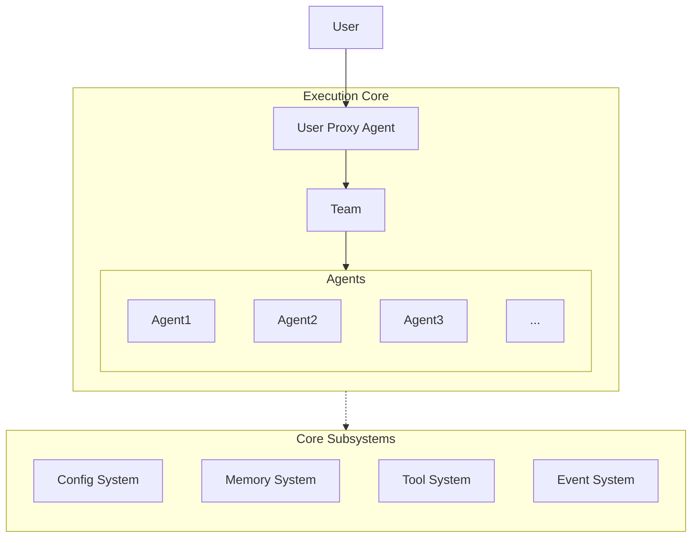

> [!Warning]
> This project is currently under development. Functionality and stability are not guaranteed.

# Roboco - Multi-Agent Collaboration Framework

[](https://www.python.org/downloads/)
[](https://opensource.org/licenses/Apache-2.0)

Roboco is a configuration-driven framework for building collaborative AI agent teams. Built on AG2 (AutoGen), it enables sophisticated multi-agent workflows through YAML configuration instead of complex code.

## 🚀 Key Features

- **Configuration-Based**: Define agents, tools, and workflows in YAML
- **Memory System**: Intelligent storage with Mem0 integration (26% higher accuracy, 91% faster)
- **Search Integration**: Web search with SerpAPI backend
- **Tool Ecosystem**: Built-in tools (filesystem, memory, search) plus extensible registry
- **Event System**: Real-time monitoring and observability
- **Production Ready**: Designed for scalability and reliability

## 📦 Installation

```bash
git clone https://github.com/dustland/roboco.git
cd roboco
uv sync  # or pip install -e .
```

**Requirements:**

- Python 3.11+
- OpenAI API key (`OPENAI_API_KEY`)
- Optional: SerpAPI key (`SERPAPI_KEY`) for web search

## 🏃‍♂️ Quick Start

```python
import asyncio
from roboco import run_team

async def main():
    # One-shot team execution
    result = await run_team(
        "examples/simple_team/config/team.yaml",
        "Write a brief report on renewable energy trends"
    )
    print(result.summary)

asyncio.run(main())
```

## 📚 Examples

Complete working examples in `examples/`:

- **[Simple Team](examples/simple_team/)**: Basic multi-agent collaboration with memory
- **[SuperWriter](examples/superwriter/)**: Production-quality research document generation

Run examples:

```bash
cd examples/simple_team && python demo.py
cd examples/superwriter && python demo.py
```

## 🏗️ Architecture



**Core Components:**

1. **TeamManager**: Orchestrates agent collaboration
2. **Memory System**: Mem0-powered intelligent storage and retrieval
3. **Search System**: Web search with multiple backend support
4. **Tool System**: Extensible plugin architecture
5. **Config System**: YAML-based configuration with Jinja2 templates

## 📖 Documentation

- **[System Architecture](docs/system-architecture.md)** - Overall design and patterns
- **[Configuration Guide](docs/config-based-design.md)** - YAML configuration reference
- **[Memory System](docs/memory-system.md)** - Mem0 integration and usage
- **[Tool System](docs/tool-system.md)** - Plugin architecture and development

## 🤝 Contributing

We welcome contributions! Please see [CONTRIBUTING.md](CONTRIBUTING.md) for guidelines.

## 📄 License

Licensed under the Apache License 2.0 - see [LICENSE](LICENSE) for details.

## 🙋‍♀️ Support

- **Issues**: [GitHub Issues](https://github.com/dustland/roboco/issues)
- **Discussions**: [GitHub Discussions](https://github.com/dustland/roboco/discussions)

---

**Built with ❤️ by the [Dustland](https://github.com/dustland) team**
