<div align="center">
  
</div>

# AgentX - Multi-Agent Collaboration Framework

[](https://www.python.org/downloads/)
[](https://opensource.org/licenses/Apache-2.0)

AgentX is a modern, configuration-driven framework for building collaborative AI agent teams. It features a clean Task-centric API, intelligent Brain-powered reasoning, secure code execution with Daytona sandboxes, and intelligent memory management for sophisticated multi-agent workflows.

## 🚀 Key Features

- **Brain-Powered Intelligence**: Each agent has a Brain component that handles all LLM reasoning, tool orchestration, and intelligent decision-making
- **Task-Centric API**: Clean, intuitive object-oriented interface with task-level conversation management
- **Configuration-Based**: Define agents, tools, and workflows in YAML
- **Modern Observability**: Built-in monitoring with CLI and web dashboard (FastAPI + Preline UI)
- **Secure Code Execution**: Daytona-powered sandboxes for safe AI code execution
- **Memory System**: Intelligent storage with Mem0 integration (26% higher accuracy, 91% faster)
- **Search Integration**: Web search with SerpAPI backend
- **Tool Ecosystem**: Built-in tools (filesystem, memory, search) plus extensible registry
- **Event System**: Real-time monitoring and observability
- **Git-Based Storage**: Advanced artifact versioning with Git integration for code generation workflows
- **Task Management**: Resume interrupted workflows with persistent sessions
- **Production Ready**: Designed for scalability and reliability

## 📦 Installation

```bash
git clone https://github.com/dustland/agentx.git
cd agentx
uv sync  # or pip install -e .
```

**Requirements:**

- Python 3.11+
- OpenAI API key (`OPENAI_API_KEY`)
- Optional: SerpAPI key (`SERPAPI_KEY`) for web search
- Optional: Daytona for secure code execution

## 🏃‍♂️ Quick Start

### CLI Commands

```bash
# Start API server with observability
agentx start

# Start observability monitor (CLI interface)
agentx monitor

# Start web dashboard
agentx monitor --web

# Run examples
agentx example superwriter

# Check system status
agentx status
```

### Python API

```python
import asyncio
import agentx

async def main():
    # Create a task with your team configuration
    task = agentx.create_task("config/team.yaml")

    # Start the collaboration - agents will use their Brains to think and collaborate
    result = await task.start("Write a brief report on renewable energy trends")

    print(f"Success: {result.success}")
    print(f"Summary: {result.summary}")
    print(f"Conversation rounds: {len(result.conversation_history)}")

asyncio.run(main())
```

### Task Management

```python
import agentx

# Create and manage tasks
task = agentx.create_task("config/team.yaml", "Research AI trends")
task_id = task.task_id

# Retrieve existing tasks
task = agentx.get_task(task_id)
all_tasks = agentx.list_tasks()

# Task lifecycle
await task.start("Task description")  # Start or resume
await task.stop()                     # Stop if running
await task.delete()                   # Clean up
```

### Memory Operations

```python
# Memory operations are automatically scoped to the task
memory = task.get_memory()

# Add memories (task_id is automatic)
memory.add("Important context", agent_id="planner")

# Search memories (task_id is automatic)
results = memory.search("keyword", agent_id="planner")

# Get all memories (task_id is automatic)
all_memories = memory.get_all(agent_id="researcher")
```

### Event Handling

```python
# Event handling integrated with tasks
def on_completion(event):
    print(f"Task completed: {event.data}")

task.on("task.completed", on_completion)
task.off("task.completed", on_completion)
```

### Chat Session Access

```python
# Access chat functionality
chat = task.get_chat()
history = chat.get_chat_history()
await chat.send_message("Additional instruction")
```

## 💾 Storage & Artifact Management

AgentX features Git-based artifact versioning for code generation and iterative workflows:

```python
# Automatic Git versioning for artifacts
workspace = task.get_workspace()

# Store versioned artifacts (creates Git commits automatically)
result = await workspace.store_artifact("fibonacci.py", code, "text/python")
print(f"Version: {result.data['version']}")  # Git commit hash

# Get specific versions and compare changes
latest = await workspace.get_artifact("fibonacci.py")
diff = await workspace.get_artifact_diff("fibonacci.py", "v1", "v2")
```

**Key Features**: Git integration, version control with meaningful commits, diff support, graceful fallback, workspace isolation. See [Storage Architecture](docs/04-storage-architecture.md) for details.

## 📊 Observability & Monitoring

AgentX includes a comprehensive observability system for monitoring and debugging multi-agent workflows:

### Web Dashboard

Modern FastAPI + Preline UI dashboard with:

- **Dashboard**: System overview with metrics and recent activity
- **Tasks**: Task conversation history viewer with export
- **Events**: Real-time event monitoring with filtering
- **Memory**: Memory browser with search and categories
- **Messages**: Agent conversation history during execution
- **Configuration**: System configuration and status viewer with data directory management

```bash
# Start web dashboard
agentx monitor --web

# Custom port
agentx monitor --web --port 8502
```

### CLI Monitor

Interactive command-line interface:

```bash
# Start CLI monitor
agentx monitor

# Start from any project subdirectory (auto-finds data)
cd examples/simple_team/config
agentx monitor --web

# Specify custom data directory
agentx monitor --data-dir /path/to/agentx_data

# Available commands:
monitor> status    # Show system status
monitor> tasks     # List recent tasks
monitor> memory    # Browse memory categories
monitor> search    # Search memory content
monitor> export    # Export data to JSON
monitor> web       # Launch web interface
```

### Programmatic Access

```python
from agentx.observability.monitor import get_monitor

# Get monitor instance
monitor = get_monitor()

# Access data
dashboard_data = monitor.get_dashboard_data()
recent_tasks = monitor.get_recent_tasks(10)
conversation = monitor.get_task_conversation(task_id)
memory_categories = monitor.get_memory_categories()
```

## 📚 Examples

Complete working examples in `examples/`:

### [Simple Team](examples/simple_team/) - Basic Collaboration

Basic multi-agent collaboration demonstrating Brain-powered reasoning:

```bash
# Using CLI
agentx example simple_team

# Or directly
cd examples/simple_team
python demo.py
```

### [SuperWriter](examples/superwriter/) - Production Multi-Agent System

A comprehensive writing system with research, planning, writing, and review agents:

```bash
# Using CLI
agentx example superwriter

# Or directly
cd examples/superwriter
python demo.py
```

## 🏗️ Architecture

```mermaid
flowchart TB
    User["User"] --> Task["Task"]

    subgraph TaskAPI["Task-Centric API"]
        direction TB
        Task --> Memory["Memory"]
        Task --> Chat["ChatHistory"]
        Task --> Events["Events"]
        Task --> Team["Team"]
    end

    subgraph Team["Team Management"]
        direction TB
        TeamMgr["Team Manager"] --> Agent1["Agent 1"]
        TeamMgr --> Agent2["Agent 2"]
        TeamMgr --> Agent3["Agent 3"]
    end

    subgraph Agent1["Agent Architecture (All Agents Same Structure)"]
        direction TB
        Brain["🧠 Brain<br/>(LLM Reasoning)"]
        Tools["🔧 Tools"]
        Memory["💾 Memory"]
        Events["📡 Events"]
    end

    TaskAPI --> Team
    Team --> Agent1
    Team --> Agent2
    Team --> Agent3

    subgraph CS["Core Subsystems"]
        direction LR
        Config["Config System"]:::sub
        MemSys["Memory System"]:::sub
        EventSys["Event System"]:::sub
    end

    TaskAPI -.-> CS
```



**Core Components:**

1. **Task**: Central API object managing collaboration lifecycle
2. **TeamManager**: Orchestrates agent collaboration
3. **Agent**: Coordinates Brain, Tools, Memory, and Events as peer modules
4. **Brain**: LLM reasoning and intelligent decision-making
5. **Memory System**: Mem0-powered intelligent storage and retrieval
6. **Tool System**: Extensible plugin architecture
7. **Config System**: YAML-based configuration with Jinja2 templates

### Brain Architecture

The **Brain** component handles all LLM-related intelligence:

- **LLM Integration**: Direct interface to OpenAI/providers
- **Reasoning Engine**: Complex thinking and decision-making
- **Tool Decision Making**: Determines which tools to call (Agent executes)
- **Context Management**: Token counting, window management
- **Response Generation**: Thoughtful, contextual responses

The Agent coordinates between Brain (for reasoning), Tools (for execution), Memory (for context), and Events (for communication), ensuring proper separation of concerns.

## 📖 Documentation

- **[System Architecture](docs/01-architecture.md)** - Overall design and Brain architecture
- **[Collaboration Model](docs/02-collaboration-model.md)** - Agent handoffs and team coordination
- **[Data and Events](docs/03-data-and-events.md)** - Event system and data flow
- **[Storage Architecture](docs/04-storage-architecture.md)** - Git-based artifact versioning and storage layer
- **[Requirements](docs/00-requirements.md)** - System requirements and design principles

## 🤝 Contributing

We welcome contributions! Please see [CONTRIBUTING.md](CONTRIBUTING.md) for guidelines.

## 🙏 Acknowledgments

This project was initially inspired by and built upon concepts from [AG2 (AutoGen)](https://github.com/ag2ai/ag2), an excellent multi-agent conversation framework. While AgentX has evolved into its own distinct architecture and approach, we're grateful for the foundational ideas and patterns that AG2 provided to the multi-agent AI community.

## 📄 License

Licensed under the Apache License 2.0 - see [LICENSE](LICENSE) for details.

## 🙋‍♀️ Support

- **Issues**: [GitHub Issues](https://github.com/dustland/agentx/issues)
- **Discussions**: [GitHub Discussions](https://github.com/dustland/agentx/discussions)

---

**Built with ❤️ by the [Dustland](https://github.com/dustland) team**
