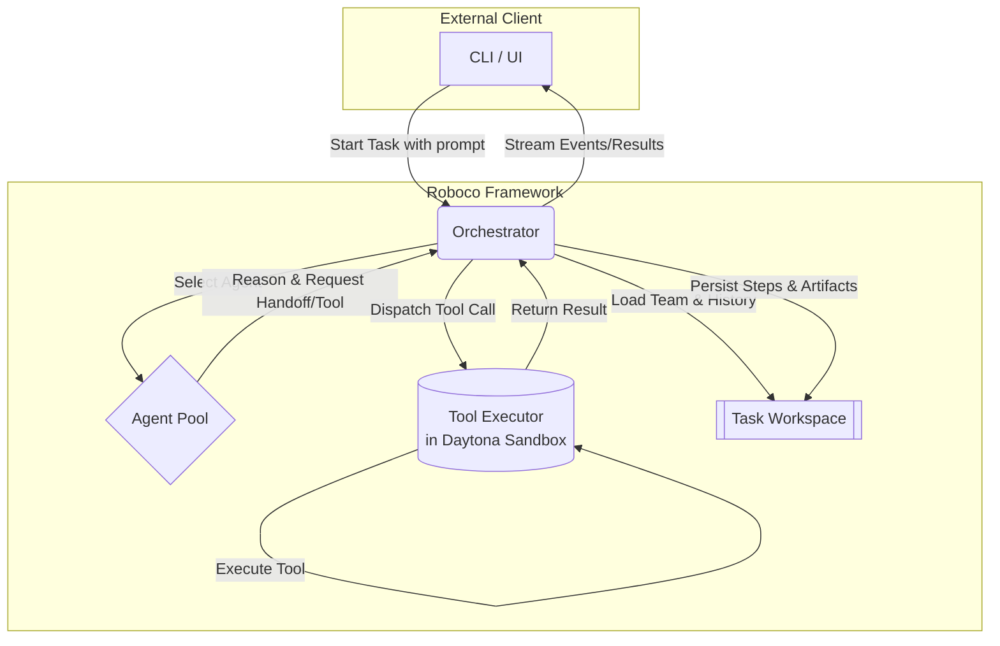

# 01: System Architecture

This document specifies the high-level, static architecture of the Roboco framework. It is guided by the principles defined in `requirements.md`.

## 1. Architectural Vision

The framework is designed as a **decoupled, headless system**. The core components provide the logic for orchestration, reasoning, and execution, while the client (e.g., a CLI, a web UI like Agentok Studio) is a separate entity that interacts with the framework via a well-defined API.

This separation ensures that the core framework remains a pure, stateful engine, while allowing for a variety of user-facing applications to be built on top of it.

## 2. Core Component Diagram

The following diagram illustrates the primary components of the Roboco framework and the flow of data and control between them.

## 3. Component Responsibilities

### 3.1. Orchestrator

- **Role:** The central nervous system and primary entry point of the framework. It is a stateful service that manages the entire lifecycle of a single task.
- **Responsibilities:**
  - **(Req #2)** Initializes a task by loading the `team.yaml` and creating the `Task Workspace`.
  - **(Req #2)** Accepts the initial prompt and subsequent user messages from the client.
  - Manages the main execution loop, deciding when to invoke an agent or the tool executor.
  - Dispatches `ToolCall` messages to the `Tool Executor`.
  - Processes `Handoff` requests to determine the next agent in the collaboration.
  - **(Req #8)** Persists every `TaskStep` and artifact to the `Task Workspace`, ensuring full auditability.
  - **(Req #11, #15)** Streams all real-time events, from token generation to tool call results, back to the client.

### 3.2. Agent Pool

- **Role:** A collection of reasoning units available to the `Orchestrator`. An "Agent" in our system is a configured entity, not a running process.
- **Responsibilities:**
  - Represents a specific configuration of a "Brain" (LLM gateway), prompt template, and a set of available tools.
  - When invoked by the `Orchestrator`, it receives the current task context.
  - Its sole output is a `TaskStep` containing parts like `TextPart` (the agent's response) or `ToolCallPart` (a request to execute a tool or perform a handoff).

### 3.3. Tool Executor

- **Role:** A specialized, non-reasoning component responsible for the secure execution of all tools.
- **Responsibilities:**
  - **(Req #6)** Receives `ToolCall` messages from the `Orchestrator`.
  - Executes the corresponding code (e.g., a built-in Python function, a user-defined script) within a secure sandbox.
  - **(Req #7)** The mandatory sandbox environment for untrusted code is **Daytona**. The framework's design must accommodate this.
  - Returns a structured `ToolResult` message to the `Orchestrator`.

### 3.4. Task Workspace

- **Role:** A self-contained directory on the file system that acts as the single source of truth for a task run.
- **Responsibilities:**
  - **(Req #8)** Provides durable, persistent storage, allowing a task to be paused and resumed.
  - Contains all necessary files for a run:
    - `team.yaml`: The initial configuration.
    - `plan.json`: The structured, evolving execution plan.
    - `history.jsonl`: An append-only log of every `TaskStep`.
    - `artifacts/`: A directory for all generated files (code, documents, images, etc.).
  - This file-based approach ensures the entire task history is transparent and auditable.

## 4. Next Steps

This document defines the _what_ (the components) and the _who_ (their responsibilities). The next document, **`02-collaboration-model.md`**, will define the _how_—the dynamic logic of Handoffs, the structure of the `plan.json`, and the rules that govern the agent interaction loop.
