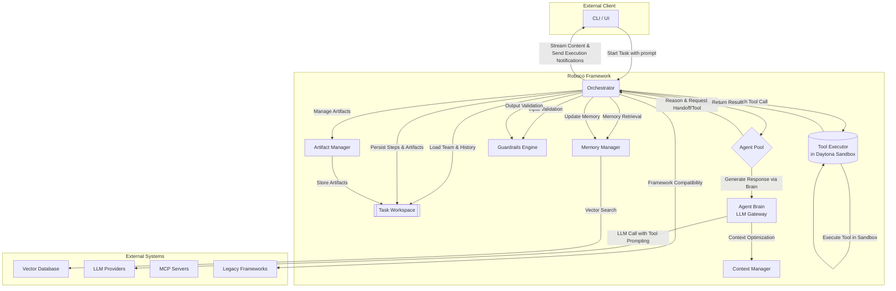

# 01: System Architecture

This document specifies the high-level, static architecture of the Roboco framework. It is guided by the principles defined in `requirements.md`.

## 1. Architectural Vision

The framework is designed as a **decoupled, headless system**. The core components provide the logic for orchestration, reasoning, and execution, while the client (e.g., a CLI, a web UI like Agentok Studio) is a separate entity that interacts with the framework via a well-defined API.

This separation ensures that the core framework remains a pure, stateful engine, while allowing for a variety of user-facing applications to be built on top of it.

**(Req #16)** The framework is designed to support flexible deployment models:

- **Single-use CLI mode**: Each task runs as a separate process that terminates upon completion
- **Long-running service mode**: A persistent service that can manage multiple concurrent tasks

**(Req #24)** Production-grade reliability features are built into the core architecture:

- **Error Recovery**: Automatic retry mechanisms and graceful degradation
- **Circuit Breakers**: Protection against cascading failures
- **Health Monitoring**: Real-time system health and performance metrics
- **Scalability**: Support for high-concurrency, multi-tenant deployments

## 2. Core Component Diagram

The following diagram illustrates the primary components of the Roboco framework and the flow of data and control between them.

## 3. Component Responsibilities

### 3.1. Orchestrator

- **Role:** The central nervous system and primary entry point of the framework. It is a stateful service that manages the entire lifecycle of a single task.
- **Responsibilities:**
  - **(Req #2)** Initializes a task by loading the `team.yaml` and creating the `Task Workspace`.
  - **(Req #2)** Accepts the initial prompt and subsequent user messages from the client.
  - Manages the main execution loop, deciding when to invoke an agent or the tool executor.
  - **(Req #13)** Supports step-through execution mode, allowing paused execution and user intervention.
  - **(Req #18)** Enables fully autonomous multi-step task execution without human intervention.
  - **(Req #19)** Provides Human-in-the-Loop (HITL) capabilities with configurable intervention points.
  - **(Req #23)** Supports advanced collaboration patterns including parallel execution and dynamic team formation.
  - Dispatches `ToolCall` messages to the `Tool Executor`.
  - Processes `Handoff` requests to determine the next agent in the collaboration.
  - **(Req #7)** Persists every `TaskStep` and artifact to the `Task Workspace`, ensuring full auditability.
  - **(Req #10)** Provides real-time updates to the client via two channels: message streaming token-by-token content (`StreamChunk`) and sending discrete execution notifications (`ExecutionEvent`).
  - **(Req #24)** Implements circuit breakers, error recovery, and health monitoring.

### 3.2. Agent Pool

- **Role:** A collection of reasoning units available to the `Orchestrator`. An "Agent" in our system is a configured entity, not a running process.
- **Responsibilities:**
  - **(Req #4)** Each agent is composed of:
    - A **Brain** sub-component (LLM gateway with provider/model configuration)
    - A **Prompt Template** (Jinja2 template file)
    - A **Tool Registry** (set of available tools)
  - When invoked by the `Orchestrator`, it receives the current task context.
  - **(Req #8, #17)** Each agent can override the default LLM configuration, with DeepSeek models preferred for reasoning and general scenarios.
  - Its sole output is a `TaskStep` containing parts like `TextPart` (the agent's response) or `ToolCallPart` (a request to execute a tool or perform a handoff).
  - **(Req #23)** Supports parallel execution coordination.

### 3.3. Agent Brain (LLM Gateway)

- **Role:** **(Req #4)** A dedicated LLM gateway component that handles all LLM interactions for an agent.
- **Responsibilities:**
  - **(Req #8, #17)** Manages LLM configuration (provider, model, parameters) per agent, with DeepSeek models as the preferred choice.
  - **(Req #15)** Formats prompts to enable tool use, assuming LLMs do not support native function calling.
  - Processes Jinja2 prompt templates with current context.
  - **(Req #10)** Provides token-by-token message streaming for real-time content updates.
  - Handles LLM provider-specific authentication and rate limiting.
  - **(Req #26)** Implements intelligent context management including compression, relevance filtering, and token optimization.

### 3.4. Tool Executor

- **Role:** A specialized, non-reasoning component responsible for the secure execution of all tools.
- **Responsibilities:**
  - **(Req #5)** Receives `ToolCall` messages from the `Orchestrator`.
  - **(Req #9)** Supports universal tool interface for built-in, custom, and MCP-based tools.
  - **(Req #6)** Executes all tools within a secure **Daytona** sandbox environment.
  - Returns a structured `ToolResult` message to the `Orchestrator`.
  - Manages sandbox lifecycle (creation, cleanup, resource limits).
  - **(Req #24)** Implements retry mechanisms and error recovery for tool execution.

### 3.5. Task Workspace

- **Role:** A self-contained directory on the file system that acts as the single source of truth for a task run.
- **Responsibilities:**
  - **(Req #7)** Provides durable, persistent storage, allowing a task to be paused and resumed.
  - Contains all necessary files for a run:
    - `team.yaml`: The initial configuration.
    - `plan.json`: The structured, evolving execution plan.
    - `history.jsonl`: An append-only log of every `TaskStep`.
    - `artifacts/`: A directory for all generated files (code, documents, images, etc.).
  - This file-based approach ensures the entire task history is transparent and auditable.
  - **(Req #25)** Supports rich artifact management with versioning and metadata.

### 3.6. Memory Manager

- **Role:** **(Req #20)** Manages sophisticated memory systems for enhanced agent performance.
- **Responsibilities:**
  - **Short-term Memory**: Maintains recent conversation context within token limits.
  - **Long-term Memory**: Provides persistent storage and retrieval of relevant historical information.
  - **Semantic Search**: Implements vector-based search across historical conversations and artifacts.
  - **Memory Consolidation**: Automatically summarizes and indexes important information.
  - **Cross-Task Memory**: Enables agents to learn from previous task executions.

### 3.7. Guardrails Engine

- **Role:** **(Req #21)** Implements comprehensive safety mechanisms throughout the framework.
- **Responsibilities:**
  - **Input Validation**: Sanitizes and validates all user inputs and agent outputs.
  - **Content Filtering**: Blocks inappropriate or harmful content using configurable policies.
  - **Rate Limiting**: Prevents abuse and manages resource consumption.
  - **Audit Trails**: Maintains complete logging of all actions for compliance and debugging.
  - **Policy Enforcement**: Applies organizational and regulatory compliance rules.

### 3.8. Artifact Manager

- **Role:** **(Req #25)** Manages creation, versioning, and lifecycle of various artifact types.
- **Responsibilities:**
  - **Code Files**: Handles generated scripts, applications, and configurations with syntax validation.
  - **Documents**: Manages reports, analyses, and structured content with format conversion.
  - **Media Files**: Processes images, audio, and video content with metadata extraction.
  - **Data Structures**: Handles JSON, CSV, and database exports with schema validation.
  - **Version Control**: Maintains artifact history and enables rollback capabilities.
  - **Metadata Management**: Tracks creation, modification, and usage statistics.

### 3.9. Context Manager

- **Role:** **(Req #26)** Implements intelligent context window management for optimal LLM performance.
- **Responsibilities:**
  - **Context Compression**: Summarizes older conversation parts while preserving key information.
  - **Relevance Filtering**: Automatically selects most relevant historical context for current tasks.
  - **Context Switching**: Efficiently handles multiple concurrent conversations.
  - **Token Optimization**: Minimizes token usage while preserving essential information.
  - **Dynamic Context**: Adapts context based on task complexity and agent requirements.

## 4. Cross-Framework Compatibility

**(Req #22)** The framework provides compatibility layers for popular frameworks:

### 4.1. LangChain Adapter

- Translates LangChain chains and agents to Roboco agent configurations
- Supports LangChain tool integrations
- Provides migration utilities for existing LangChain applications

### 4.2. AutoGen/AG2 Adapter

- Maps AutoGen conversation patterns to Roboco handoff mechanisms
- Converts AutoGen agent definitions to Roboco agent configurations
- Supports AutoGen's group chat and sequential chat patterns

### 4.3. CrewAI Adapter

- Translates CrewAI crew and task definitions to Roboco team configurations
- Maps CrewAI role-based agents to Roboco agent pool
- Supports CrewAI's hierarchical and sequential execution patterns

## 5. Deployment Architecture

### 5.1. Single-use CLI Mode

**(Req #16)** In CLI mode, each task execution creates:

- A new `Orchestrator` instance
- A dedicated `Task Workspace` directory
- Temporary Daytona sandbox instances
- Process terminates after task completion

### 5.2. Long-running Service Mode

**(Req #16, #24)** In service mode, the framework runs as a persistent service that:

- Manages multiple concurrent `Orchestrator` instances
- Maintains separate `Task Workspace` directories per task
- Pools and reuses Daytona sandbox instances
- Provides REST/WebSocket APIs for client interaction
- Implements load balancing and auto-scaling capabilities
- Supports multi-tenant isolation and resource management

### 5.3. Production Deployment Features

**(Req #24)** Production-grade deployment includes:

- **Container Orchestration**: Kubernetes-ready with Helm charts
- **Service Mesh**: Istio integration for traffic management and security
- **Monitoring**: Prometheus metrics and Grafana dashboards
- **Logging**: Structured logging with ELK stack integration
- **Backup & Recovery**: Automated backup of task workspaces and configurations
- **High Availability**: Multi-region deployment with failover capabilities

## 6. Advanced Collaboration Patterns

**(Req #23)** The framework supports sophisticated collaboration models:

### 6.1. Parallel Execution

- Multiple agents working simultaneously on different aspects of a task
- Coordination mechanisms to prevent conflicts and ensure consistency
- Result aggregation and conflict resolution strategies

### 6.2. Hierarchical Teams

- Nested team structures with supervisor-subordinate relationships
- Delegation patterns where senior agents assign work to junior agents
- Escalation mechanisms for complex decisions or failures

### 6.3. Dynamic Team Formation

- Runtime creation and modification of agent teams based on task requirements
- Automatic agent selection based on capabilities and workload
- Adaptive team scaling based on task complexity and deadlines

### 6.4. Consensus Building

- Mechanisms for agents to reach agreement on decisions
- Voting and deliberation protocols for multi-agent decisions
- Conflict resolution strategies when agents disagree

## 7. Step-Through Execution Support

**(Req #13, #19)** The `Orchestrator` supports paused execution modes:

- **Step Mode**: Execute one agent turn at a time, waiting for user approval
- **Breakpoint Mode**: Pause execution at specific conditions (e.g., before tool calls)
- **Inspection Mode**: Allow clients to examine current state and inject new instructions
- **HITL Mode**: Human-in-the-loop intervention points for approval, review, or redirection

This is implemented through execution state management and client notification events.

## 8. Next Steps

This document defines the _what_ (the components) and the _who_ (their responsibilities). The next document, **`02-collaboration-model.md`**, will define the _how_—the dynamic logic of Handoffs, the structure of the `plan.json`, and the rules that govern the agent interaction loop.
