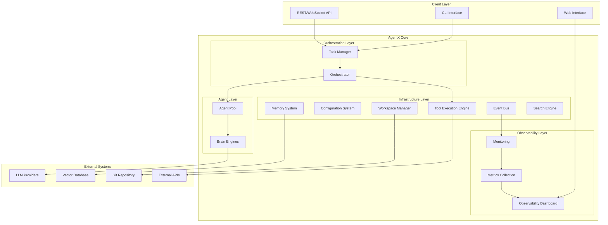

# AgentX System Architecture

## Executive Summary

AgentX is an enterprise-grade multi-agent orchestration framework designed for autonomous task execution through intelligent agent collaboration. The system employs a **microkernel architecture** with **centralized orchestration** to provide secure, scalable, and observable multi-agent workflows while maintaining strict isolation boundaries and event-driven coordination.

## 1. Architectural Vision & Principles

### 1.1 Core Vision
AgentX transforms complex tasks into coordinated multi-agent workflows where specialized agents collaborate autonomously under centralized governance to achieve objectives that exceed individual agent capabilities.

### 1.2 Architectural Principles

**Separation of Concerns**: Each subsystem has a single, well-defined responsibility with minimal overlap.

**Centralized Orchestration**: All coordination, security, and resource management flows through a central orchestrator to ensure consistency and control.

**Agent Autonomy**: Agents operate independently within their domains while delegating cross-cutting concerns to specialized subsystems.

**Event-Driven Coordination**: Asynchronous, loosely-coupled communication through structured events enables scalability and observability.

**Configuration-Driven Behavior**: System behavior is defined declaratively through configuration, enabling rapid iteration without code changes.

**Security by Design**: All external interactions and resource access are mediated through secured, audited channels.

**Workspace Isolation**: Each task execution operates in an isolated workspace with versioned state and artifacts.

## 2. System Quality Attributes

### 2.1 Primary Quality Attributes

**Scalability**: Support concurrent multi-agent workflows with linear resource scaling
**Security**: Zero-trust architecture with centralized access control and audit trails  
**Observability**: Complete visibility into system behavior through events and metrics
**Extensibility**: Pluggable architecture for agents, tools, and backends
**Reliability**: Fault tolerance through isolation boundaries and graceful degradation

### 2.2 Trade-off Decisions

| Attribute | Design Choice | Trade-off |
|-----------|---------------|-----------|
| Security vs Performance | Centralized tool execution | Higher latency for enhanced security |
| Flexibility vs Complexity | Configuration-driven behavior | Learning curve for declarative approach |
| Autonomy vs Control | Mediated agent interactions | Agent capabilities constrained by orchestrator |
| Observability vs Performance | Comprehensive event emission | Event processing overhead |

## 3. System Architecture Overview



## 4. Subsystem Architecture

### 4.1 Orchestration Layer

#### 4.1.1 Task Manager
**Responsibility**: Task lifecycle management and workspace coordination

**Scope**:
- Task initialization and termination
- Workspace setup and cleanup  
- State persistence and recovery
- Client interface abstraction

**Interfaces**:
- `TaskExecutor`: Execute tasks with streaming/non-streaming modes
- `WorkspaceManager`: Manage task-isolated workspaces
- `StateManager`: Persist and restore task state

**Boundaries**: Does not execute agents or tools directly; delegates to orchestrator

#### 4.1.2 Orchestrator  
**Responsibility**: Central coordination and security enforcement

**Scope**:
- Agent workflow routing and handoff decisions
- Centralized tool execution with security validation
- Resource management and quota enforcement
- Cross-agent collaboration patterns

**Interfaces**:
- `AgentRouter`: Route requests to appropriate agents
- `ToolDispatcher`: Execute tools with security controls
- `WorkflowEngine`: Manage multi-agent collaboration patterns

**Boundaries**: Does not contain agent logic; focuses purely on coordination and security

### 4.2 Agent Layer

#### 4.2.1 Agent Pool
**Responsibility**: Autonomous conversation management within assigned domains

**Scope**:
- Independent conversation flow management
- Domain-specific reasoning and response generation
- Context building from available information sources
- Tool requirement identification and requests

**Interfaces**:
- `ConversationManager`: Handle multi-turn conversations
- `ContextBuilder`: Construct agent-specific context
- `CapabilityProvider`: Expose agent capabilities to orchestrator

**Boundaries**: Agents are isolated from each other and external systems; all cross-cutting concerns delegated upward

#### 4.2.2 Brain Engines
**Responsibility**: LLM interaction abstraction and prompt management

**Scope**:
- LLM provider integration and failover
- Prompt template rendering and optimization
- Response streaming and processing
- Provider-specific optimizations

**Interfaces**:
- `LLMProvider`: Abstract interface for multiple LLM backends
- `PromptRenderer`: Jinja2-based template rendering with context
- `ResponseProcessor`: Handle streaming and structured responses

**Boundaries**: Pure LLM interface; no tool execution, state management, or coordination logic

### 4.3 Infrastructure Layer

#### 4.3.1 Tool Execution Engine
**Responsibility**: Secure, monitored tool execution with comprehensive audit trails

**Scope**:
- Tool registry and capability discovery
- Secure execution with resource limits
- Performance monitoring and logging
- Tool result processing and validation

**Interfaces**:
- `ToolRegistry`: Register and discover available tools
- `ExecutionEngine`: Execute tools with security and monitoring
- `AuditLogger`: Comprehensive execution audit trails

**Boundaries**: Executes tools only; does not make decisions about when or which tools to use

#### 4.3.2 Configuration System
**Responsibility**: Declarative system behavior definition and validation

**Scope**:
- Team and agent configuration loading
- Configuration validation and schema enforcement
- Runtime configuration updates
- Template and asset management

**Interfaces**:
- `ConfigLoader`: Load and validate YAML configurations
- `SchemaValidator`: Enforce configuration schemas
- `TemplateManager`: Manage prompt templates and assets

**Boundaries**: Configuration management only; does not execute or modify behavior

#### 4.3.3 Event Bus
**Responsibility**: Asynchronous event distribution and processing

**Scope**:
- Event publication and subscription
- Event routing and filtering
- Event persistence for replay and analysis
- Integration hooks for external systems

**Interfaces**:
- `EventPublisher`: Publish structured events
- `EventSubscriber`: Subscribe to event streams
- `EventStore`: Persist events for analysis and replay

**Boundaries**: Event distribution only; does not interpret or act on events

#### 4.3.4 Workspace Manager
**Responsibility**: Isolated workspace and artifact management

**Scope**:
- Task-isolated workspace creation
- Git-based artifact versioning
- File system abstraction
- Workspace cleanup and archival

**Interfaces**:
- `WorkspaceFactory`: Create isolated workspaces
- `ArtifactManager`: Version and manage generated artifacts
- `StorageBackend`: Abstract storage operations

**Boundaries**: Storage operations only; does not interpret or process stored content

#### 4.3.5 Memory System
**Responsibility**: Short-term and long-term memory management

**Scope**:
- Conversation context management
- Semantic search across historical data
- Memory consolidation and optimization
- Cross-task learning and knowledge retention

**Interfaces**:
- `MemoryBackend`: Pluggable memory storage implementations
- `SemanticSearch`: Vector-based information retrieval
- `ContextManager`: Optimize context for token limits

**Boundaries**: Memory operations only; does not make decisions about what to remember or forget

#### 4.3.6 Search Engine
**Responsibility**: External information retrieval and integration

**Scope**:
- Web search and information gathering
- Search result processing and ranking
- Provider abstraction and failover
- Query optimization and caching

**Interfaces**:
- `SearchProvider`: Abstract interface for search backends
- `ResultProcessor`: Process and rank search results
- `QueryOptimizer`: Optimize queries for better results

**Boundaries**: Information retrieval only; does not interpret or act on search results

### 4.4 Observability Layer

#### 4.4.1 Monitoring System
**Responsibility**: System health monitoring and alerting

**Scope**:
- Real-time system health tracking
- Performance metrics collection
- Error detection and alerting
- Resource utilization monitoring

**Interfaces**:
- `HealthChecker`: Monitor subsystem health
- `MetricsCollector`: Gather performance metrics
- `AlertManager`: Handle alerts and notifications

#### 4.4.2 Observability Dashboard
**Responsibility**: Real-time system visualization and debugging

**Scope**:
- Task execution visualization
- Agent performance analytics
- Tool usage statistics
- Configuration inspection

**Interfaces**:
- `DashboardAPI`: Web-based monitoring interface
- `VisualizationEngine`: Real-time data visualization
- `DebugInterface`: Interactive debugging tools

## 5. Subsystem Collaboration Patterns

### 5.1 Task Execution Flow

```
Client Request → Task Manager → Orchestrator → Agent Pool → Brain Engines → LLM Providers
                     ↓              ↓            ↓
                Workspace ←─── Tool Engine ←─ Tool Requests
                     ↓              ↓            ↓
                Event Bus ←─── All Components ──→ Observability
```

### 5.2 Information Flow Patterns

**Command Flow**: Client → Task Manager → Orchestrator → Agents
**Query Flow**: Agents → Orchestrator → Infrastructure Services
**Event Flow**: All Subsystems → Event Bus → Observability Layer
**Data Flow**: Infrastructure Services → Workspace Manager → Storage Backends

### 5.3 Security Boundaries

**Trust Boundary 1**: Client Layer ↔ Task Manager (Authentication/Authorization)
**Trust Boundary 2**: Orchestrator ↔ Tool Engine (Capability Validation)  
**Trust Boundary 3**: Infrastructure ↔ External Systems (Secure Integration)

## 6. Deployment Architecture

### 6.1 Single-Process Mode
- Embedded orchestrator and infrastructure
- File-based workspace storage
- Direct LLM provider integration
- Suitable for development and lightweight production

### 6.2 Distributed Mode
- Orchestrator as separate service
- Shared infrastructure services
- Network-based tool execution
- Suitable for high-scale production environments

### 6.3 Hybrid Mode
- Local task management with remote infrastructure
- Cached configuration and templates
- Fallback to embedded mode
- Suitable for edge deployment scenarios

## 7. Extension and Evolution Strategy

### 7.1 Extension Points

**Agent Extensions**: New agent types through configuration and prompt templates
**Tool Extensions**: Custom tool implementations through registry pattern
**Backend Extensions**: Pluggable storage, memory, and search backends
**Provider Extensions**: Additional LLM and external service providers

### 7.2 Evolution Principles

**Backward Compatibility**: Configuration format stability with versioned migrations
**Interface Stability**: Subsystem interfaces evolve through versioned APIs
**Incremental Enhancement**: New capabilities added through optional configuration
**Performance Optimization**: Infrastructure improvements without behavior changes

### 7.3 Migration Strategy

**Configuration Migration**: Automated migration tools for configuration updates
**Data Migration**: Workspace and artifact migration utilities
**API Evolution**: Versioned APIs with deprecation timelines
**Feature Flags**: Runtime feature toggling for safe rollouts

## 8. Decision Log

### 8.1 Centralized vs Distributed Orchestration
**Decision**: Centralized orchestration through single orchestrator instance
**Rationale**: Simplified coordination, consistent security enforcement, easier debugging
**Trade-offs**: Single point of failure vs coordination complexity

### 8.2 Event-Driven vs Direct Communication
**Decision**: Event-driven architecture with async event bus
**Rationale**: Loose coupling, scalability, comprehensive observability
**Trade-offs**: Message ordering complexity vs tight coupling

### 8.3 Configuration-Driven vs Code-Driven Behavior
**Decision**: Configuration-driven with YAML-based team definitions
**Rationale**: Rapid iteration, non-technical user accessibility, version control
**Trade-offs**: Learning curve vs development velocity

### 8.4 Workspace Isolation vs Shared State
**Decision**: Task-isolated workspaces with Git-based versioning
**Rationale**: Task independence, audit trails, reproducibility
**Trade-offs**: Storage overhead vs state management complexity

## 9. Success Criteria

### 9.1 Architectural Success Metrics

**Modularity**: New subsystem integration without core changes
**Scalability**: Linear performance scaling with concurrent tasks  
**Security**: Zero security incidents through centralized control
**Observability**: Complete task execution traceability
**Extensibility**: Third-party extensions without framework modifications

### 9.2 Quality Gates

**Component Independence**: Subsystems testable in isolation
**Interface Stability**: API compatibility across minor versions
**Configuration Validity**: 100% configuration validation coverage
**Event Coverage**: All significant operations emit structured events
**Security Audit**: All external interactions through secured channels

This architecture provides a robust foundation for building sophisticated multi-agent systems while maintaining clear separation of concerns, strong security boundaries, and comprehensive observability throughout the system lifecycle.
