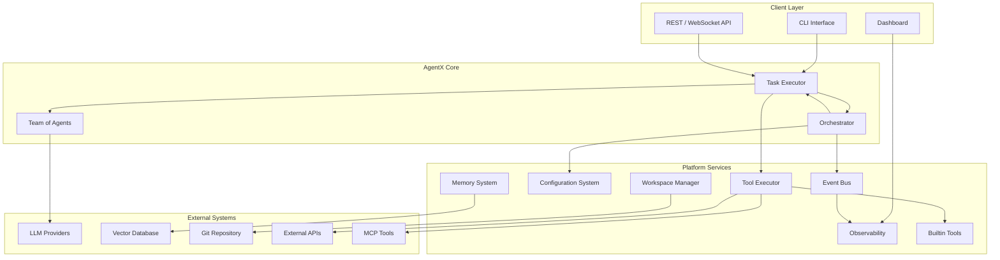
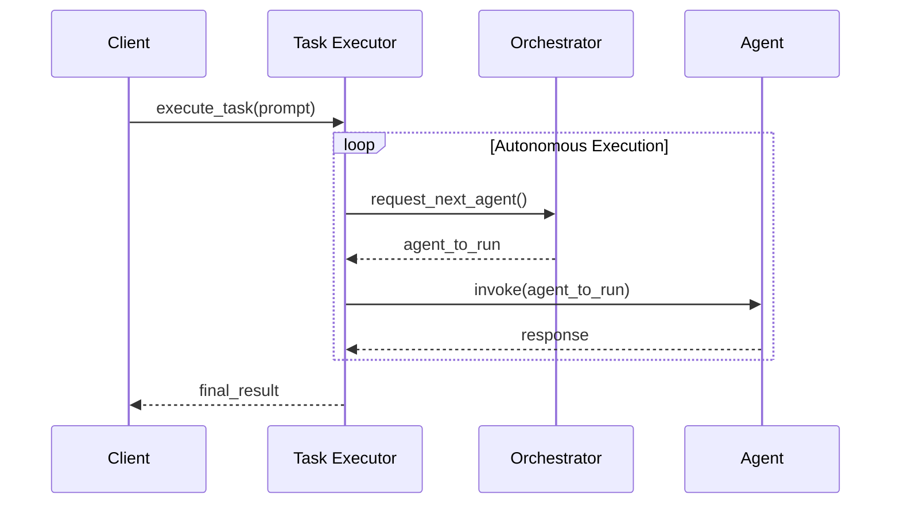
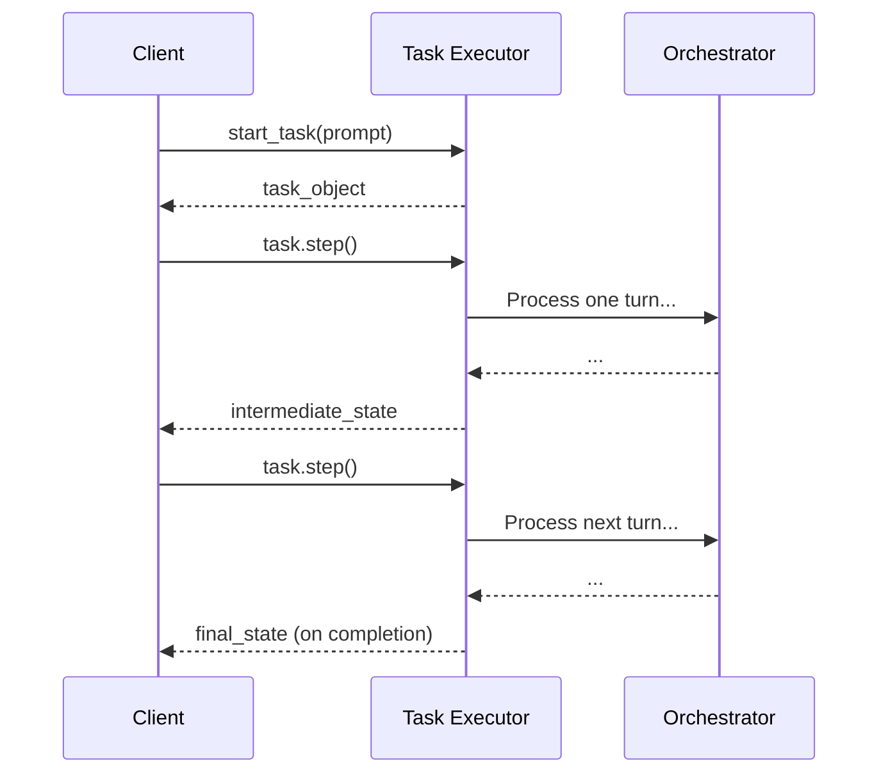
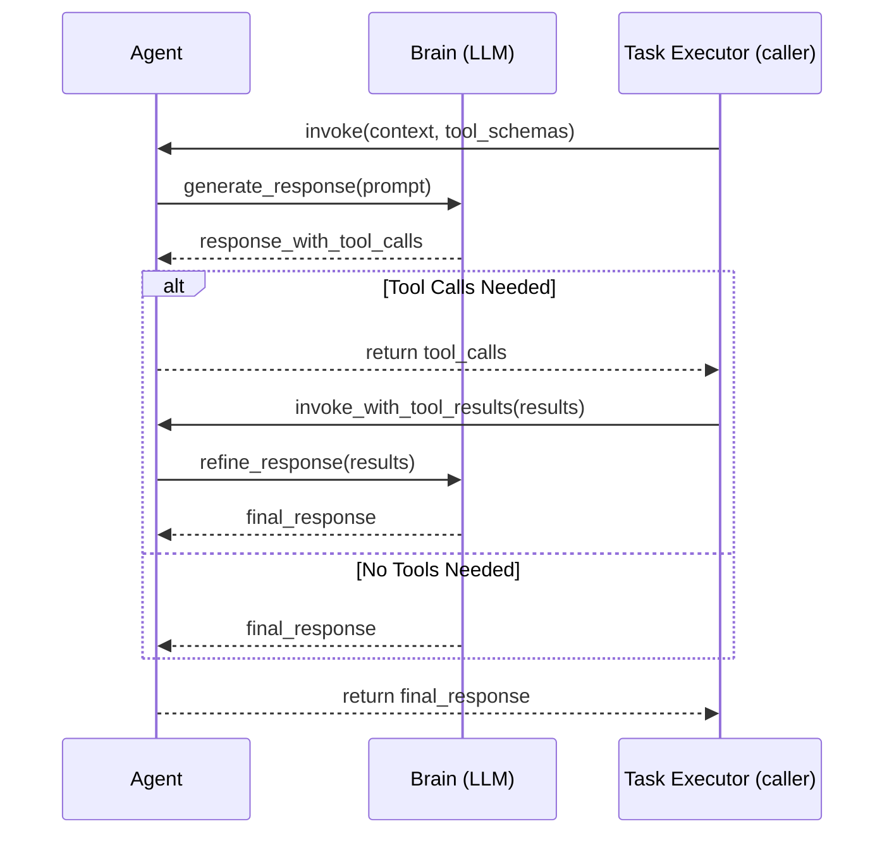

# AgentX System Architecture

## Executive Summary

AgentX is an open-source backbone for building secure, observable, and fully autonomous multi-agent systems. A lightweight micro-kernel orchestrates specialised agents, turning a single user request into a coordinated workflow that spans tool execution, memory retrieval, and artifact management—all within isolated, version-controlled workspaces. Every decision, message, and side effect is captured as a structured event, providing complete auditability and real-time insight into system behaviour.

## 1. Architectural Vision & Principles

### 1.1 Core Vision

AgentX enables organisations to decompose complex goals into collaborative Teams of agents, each focusing on a well-defined role. A central Orchestrator governs the conversation, selects the next agent to speak, executes tools on the agents' behalf, and enforces security boundaries. The result is a flexible framework that elevates individual agent capabilities into a cohesive, self-optimising system that can learn, adapt, and scale with minimal human intervention.

### 1.2 Architectural Principles

The architecture rests on the following foundational principles:

- **Separation of Concerns** – Each subsystem has a single, well-defined responsibility, which reduces coupling and simplifies maintenance.
- **Centralised Orchestration** – A single Orchestrator governs coordination, security, and resource allocation, providing a uniform control plane.
- **Agent Autonomy** – Agents manage their own reasoning loops and private Brains, delegating only cross-cutting concerns upward.
- **Event-Driven Coordination** – Asynchronous, structured events enable scalable, loosely-coupled communication among subsystems.
- **Configuration-Driven Behaviour** – Teams, agents, and workflows are defined declaratively, allowing rapid iteration without code changes.
- **Security by Design** – All external interactions pass through audited, policy-enforced channels; least-privilege boundaries are maintained throughout.
- **Workspace Isolation** – Every task executes in its own version-controlled workspace, ensuring reproducibility and clean separation of artifacts.

## 2. System Architecture Overview

The AgentX architecture is composed of four distinct layers:

- **Client Layer**: Provides the primary user-facing interfaces, including a Command-Line Interface (CLI) for developers, a REST/WebSocket API for programmatic integration, and a web-based Dashboard for real-time monitoring.
- **AgentX Core**: Contains the essential components for task execution and agent collaboration. The `Task Executor` drives the workflow, the `Orchestrator` makes routing decisions, and the `Team of Agents` performs the reasoning.
- **Platform Services**: A suite of shared, pluggable services that support the core. These include the secure `Tool Executor`, `Configuration System`, `Event Bus` for observability, and stateful services for `Workspace`, `Memory`, and `Builtin Tools`.
- **External Systems**: Represents all external dependencies, such as `LLM Providers`, `Vector Databases` for memory, `Git` for workspace versioning, and any third-party `APIs` that tools may call.

## 3. Team Collaboration

In AgentX, a **Team** of collaborating agents is the primary mechanism for executing complex, multi-step tasks. The core runtime consists of three key components—the Task Executor, the Orchestrator, and the Agents themselves—that work in concert to manage the entire task lifecycle.

## Key Roles

#### 3.1.1 Task Executor

The **Task Executor** owns the entire lifecycle of a single task. When a request arrives, it provisions an isolated workspace, hydrates the task context from configuration, and immediately consults the Orchestrator to determine which agent should act first. It then delivers the full conversational context and available tool schemas to that agent and waits for a response. If the agent requests tool calls, the Task Executor invokes the Tool Executor, captures the results, persists them to the workspace, and feeds them back to the agent for refinement.

This loop—**ask orchestrator → invoke agent → run tools → persist state**—continues until the Orchestrator signals completion. Throughout execution, the Task Executor streams structured events to the Event Bus, guaranteeing a real-time audit trail.

#### 3.1.2 Orchestrator

The **Orchestrator** is the policy brain—responsible for choosing the next speaker, enforcing guardrails, and applying system-wide limits. After each agent turn, the Task Executor submits the agent's response to the Orchestrator, which analyses it (often via a lightweight LLM prompt) and returns one of three decisions: **continue with same agent, hand off to another agent, or complete the task**. By centralising this logic, AgentX achieves a single control plane for quota management, compliance checks, and advanced collaboration strategies, while keeping agents focused purely on reasoning and content creation.

#### 3.1.3 Agents

Every **Agent** encapsulates a specialised role—researcher, writer, reviewer, etc.—and owns a private Brain that interfaces with the underlying LLM provider. Agents receive richly-structured context, reason about the task, optionally call tools, and return a response. Because they never execute tools directly or route messages themselves, agents remain lightweight and easily composable, allowing teams to be re-shaped through configuration alone.

### 3.2 Execution Modes

AgentX supports two primary modes of task execution, offering a trade-off between autonomy and control:

**1. Autonomous Execution (`execute_task`)**

This is the default "fire-and-forget" mode. A client submits a task with an initial prompt and waits for a final result. The `Task Executor` runs the entire multi-agent collaboration—including all agent turns and tool calls—autonomously until the `Orchestrator` signals completion. This mode is ideal for production deployments where the goal is to fully automate a workflow.

**2. Interactive Execution (`start_task` & `step`)**

For debugging, human-in-the-loop workflows, or fine-grained control, AgentX provides a step-wise execution model. The client first calls `start_task` to initialize the task and receive a `Task` object. The client then repeatedly calls the `step()` method on this object to advance the execution one turn at a time. After each step, control returns to the client with the latest state, allowing for inspection or user intervention before proceeding.

## 4. Agent Internals

While the `Task Executor` manages the high-level conversation flow between agents, each `Agent` is responsible for its own internal reasoning process. This process involves hydrating a prompt template with runtime context, executing a "monologue" with its private Brain, and optionally streaming its response back to the client.

#### 4.1 Prompt Templating

An agent's core behavior and persona are defined by its system prompt, which is typically loaded from a Jinja2 template file. Before the `Task Executor` invokes an agent, it injects dynamic context into this template. This ensures the agent is fully aware of the current state of the task. Common context variables include:

- The full conversation history.
- A list of available tools and their JSON schemas.
- The initial task objective and any user-provided parameters.
- Summaries or references to artifacts in the workspace.

This just-in-time templating allows agents to be both powerful and reusable, adapting their behavior to the specific needs of each task.

#### 4.2 Internal Monologue and Tool-Calling Loop

When an agent is invoked to generate a response, it enters an internal loop with its `Brain` to produce the most informed output possible.

1.  **Initial Reasoning**: The `Brain` first generates a response based on the hydrated prompt and conversation history.
2.  **Tool Identification**: The `Brain` analyzes its own draft response to determine if it contains implicit or explicit requests to call one or more tools. This self-correction step allows the agent to recognize when it needs more information or needs to perform an action.
3.  **Tool Execution Request**: If tools are required, the agent yields control back to the `Task Executor`, passing along the structured tool-call requests. The `Task Executor` is responsible for invoking the `Tool Executor` to securely run the tools.
4.  **Refinement with Results**: The `Task Executor` provides the tool results back to the agent. The agent's `Brain` then re-evaluates its initial reasoning in light of the new information and generates a final, more grounded response for that turn.

This loop ensures that agents can autonomously gather necessary information or perform actions before committing to a final answer, leading to more accurate and reliable outcomes.

#### 4.3 End-to-End Streaming

To provide maximum transparency and a highly responsive user experience, AgentX is designed for **end-to-end streaming**. This is more than just streaming the final answer; it means that every significant piece of text generated during the task lifecycle is yielded back to the client in real-time.

This is achieved by making streaming the default behavior at every layer of the stack:

- **Brain**: The `Brain` streams token-by-token output directly from the underlying LLM provider.
- **Agent**: The `Agent` streams its internal monologue, including its reasoning process and its decision to call tools.
- **Task Executor**: The `Task Executor` orchestrates these streams, interleaving agent monologues with tool execution status messages and final outputs.

This architecture allows a developer or user to watch the entire multi-agent collaboration unfold in real-time, offering unparalleled insight for debugging, monitoring, and human-in-the-loop interaction. It transforms the "black box" of agent reasoning into a transparent, observable process.

## 5. State and Context Management

AgentX is designed around the core principle that agents should operate on a rich, durable, and easily accessible context. This is achieved through two tightly integrated components: the **Workspace** and the **Memory System**.

### 5.1 The Workspace: A Durable Foundation

The **Workspace** is the stateful heart of every task. It is a version-controlled directory that provides the foundation for iterative development, task resumption, and human-in-the-loop collaboration. By persisting every message, artifact, and state change to the workspace, AgentX guarantees full auditability and allows tasks to be paused, inspected, modified, and resumed at any point.

Every workspace contains:

- A complete, append-only log of the conversation history (`history.jsonl`).
- A version-controlled `artifacts` directory where all agent outputs (code, documents, data) are stored.
- A `state.json` file capturing the latest state of the Task Executor and all agents.

This robust state management is what enables developers to treat tasks not as ephemeral processes, but as durable, long-running workflows that can be debugged, refined, and improved over time.

### 5.2 The Memory System: Intelligent Context Retrieval

The **Memory System** acts as the intelligent, unified gateway for retrieving contextual data from the Workspace. It is more than a simple wrapper around a vector database; it is the sole entry point for agents to perform intelligent data fetching, ensuring they have the most relevant information without exceeding token limits.

Its responsibilities are twofold:

1.  **Context Ingestion**: It automatically captures and indexes conversational history, agent-generated artifacts, and other designated data sources from the Workspace into a long-term, searchable store.
2.  **Intelligent Retrieval**: It provides a simple query interface for agents to retrieve contextually relevant information. The system handles the complexity of searching across different data types and uses semantic ranking to return only the most salient facts.

By abstracting away the complexities of data storage and retrieval, the Memory System allows agents to remain focused on reasoning, while ensuring their prompts are always grounded with high-quality, relevant context from the Workspace.

### 5.3 Example Scenario: Context-Aware Writing

To illustrate how these components work together, consider a `Writer` agent tasked with drafting a report. A `Researcher` agent has already run, populating the `Workspace` with dozens of source documents.

1.  **Initial State**: The `Workspace` contains all source documents as artifacts (e.g., `source_01.txt`, `source_02.txt`, etc.). The `Memory System` has indexed the content of each of these sources. The main report is still empty.
2.  **Writing the First Section**: The `Writer` is tasked with "Write the introduction." It queries the `Memory System`: _"Find sources relevant to the overall topic."_ The `Memory System` returns the most relevant source documents. The `Writer` uses them to draft the introduction, which is then saved back to the `Workspace` as `report_v1.md`.
3.  **Preventing Redundancy**: When the `Writer` is next tasked with "Write the 'History of AI' section," it performs a more sophisticated query: _"Find sources related to 'the history of AI' that are not already referenced in `report_v1.md`."_
4.  **Intelligent Retrieval**: The `Memory System` understands this query. It performs a semantic search for "history of AI" across all source documents, but it also performs a negative semantic search, filtering out any sources whose content closely matches what is already in `report_v1.md`.
5.  **Grounded Response**: The `Memory System` returns a fresh, relevant, and unused set of sources. The `Writer` can now draft the new section with confidence, knowing it is not repeating information.

This scenario demonstrates how the combination of a durable `Workspace` and an intelligent `Memory System` enables agents to perform complex, stateful tasks that would be impossible with a simple conversational context window.

## 6. Platform Services

Platform Services provide common capabilities that sit outside the tight execution loop yet remain essential to every task. They are deployed as shared, multi-tenant components and accessed via well-defined APIs, allowing the core runtime to stay lightweight while still benefiting from robust storage, configuration, and monitoring facilities.

#### 6.1 Configuration System

The Configuration System is the single source of truth for teams, agents, tools, and runtime policies. It loads declarative YAML files, validates them against versioned schemas, and exposes the resulting objects to the Task Executor and Orchestrator at startup or on hot-reload.

#### 6.2 Event Bus

All significant actions in the framework emit structured events that flow through the Event Bus. This design decouples producers from consumers, enabling real-time monitoring, auditing, and external integrations without burdening the hot code-path.

#### 6.3 Memory System

The Memory System acts as the intelligent, unified gateway for all contextual data. It is more than a simple wrapper around a vector database; it is the sole entry point for agents to perform intelligent data fetching, ensuring they have the most relevant information without exceeding token limits.

Its responsibilities are twofold:

1.  **Context Ingestion**: It automatically captures and indexes conversational history, agent-generated artifacts, and other designated data sources into a long-term, searchable store.
2.  **Intelligent Retrieval**: It provides a simple query interface for agents to retrieve contextually relevant information. The system handles the complexity of searching across different data types (conversations, documents, etc.) and uses semantic ranking to return only the most salient facts.

By abstracting away the complexities of data storage and retrieval, the Memory System allows agents to remain focused on reasoning, while ensuring their prompts are always grounded with high-quality, relevant context.

#### 6.4 Observability

The Observability service provides real-time insight into the inner workings of the AgentX framework. It subscribes to the `Event Bus` to receive a live stream of all system events—from task creation to agent handoffs to tool executions. This data is then exposed through a built-in web dashboard, allowing developers to:

- Visually trace the entire lifecycle of a task.
- Inspect the contents of any agent's workspace, including conversation history and artifacts.
- Debug complex multi-agent interactions in real-time.

By making the system transparent by default, the Observability service dramatically reduces the time required to build, test, and refine sophisticated agent-based workflows.

## 7. Builtin Tools

Builtin Tools extend AgentX with first-class capabilities without requiring users to write custom plugins. They are registered automatically at startup and are available to any agent subject to security policy. These tools are designed to be general-purpose and cover the most common needs of autonomous agents.

Key builtin tools include:

- **File System Tools**: A comprehensive set of tools for interacting with the task workspace, including `read_file`, `write_file`, `list_directory`, and `delete_file`. These are essential for agents that need to read data, generate code, or manage artifacts.
- **Web Tools**: Tools like `fetch_url` and `scrape_text` allow agents to retrieve information from the web, forming the foundation for research and data-gathering tasks.
- **Memory Tools**: The `store_memory` and `search_memory` tools provide a direct interface to the Memory System, allowing agents to explicitly commit information to long-term storage or perform semantic searches over past conversations.
- **Human-in-the-Loop Tools**: A special `request_human_input` tool allows an agent to pause the task and explicitly ask for user feedback or direction, which is critical for interactive workflows and safety guardrails.

By providing these foundational capabilities, AgentX ensures that developers can build powerful and effective agent teams from day one.

## 8. Extensibility

AgentX is designed to be a production-ready backbone, which means it must be extensible at every layer. The framework supports this through several key mechanisms:

- **Adding LLM Providers**: The `Brain` component uses a provider model that allows new LLMs to be integrated by implementing a simple, common interface. This ensures that AgentX can adapt to a rapidly changing landscape of foundation models.
- **Custom Tools**: Developers can easily add their own tools to the `Tool Executor` by decorating Python functions. These custom tools are registered alongside the builtin tools and are exposed to agents in the same way.
- **MCP Tools & API Integration**: For more complex integrations, AgentX supports Multi-Container Platform (MCP) tools, which run in their own secure sandboxes. This allows for safe integration with enterprise APIs, SaaS platforms, and other external systems, turning them into capabilities that agents can leverage.
- **Integration with API Marketplaces**: By exposing internal services and external tools through a consistent API, AgentX is ready to connect with emerging API marketplaces, allowing teams to monetize their custom agents or consume capabilities from a broader ecosystem.

## 9. The Future of AgentX

AgentX will continue to evolve along three pillars: performance, interoperability, and safety. Upcoming priorities include native support for streaming multimodal models, tighter integration with external knowledge graphs to improve grounding, and progressive guardrail policies that adapt to organisational compliance requirements. We also plan to introduce a plug-and-play planning module so that teams can experiment with alternative orchestration strategies without modifying core code. Finally, deeper observability hooks—spanning trace-level token accounting through to high-level outcome metrics—will help users fine-tune cost, latency, and quality trade-offs.
