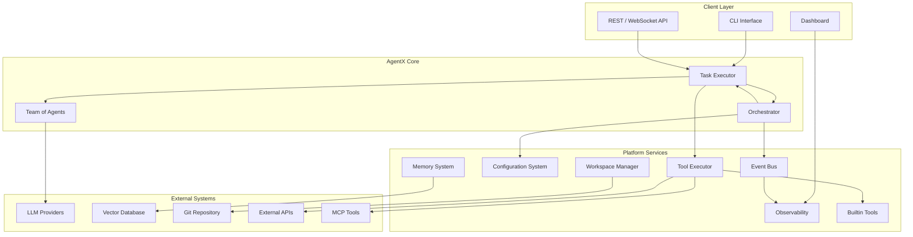
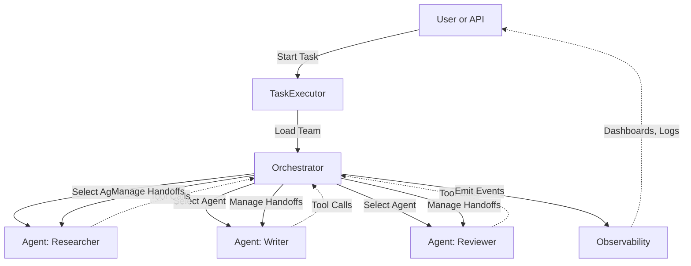
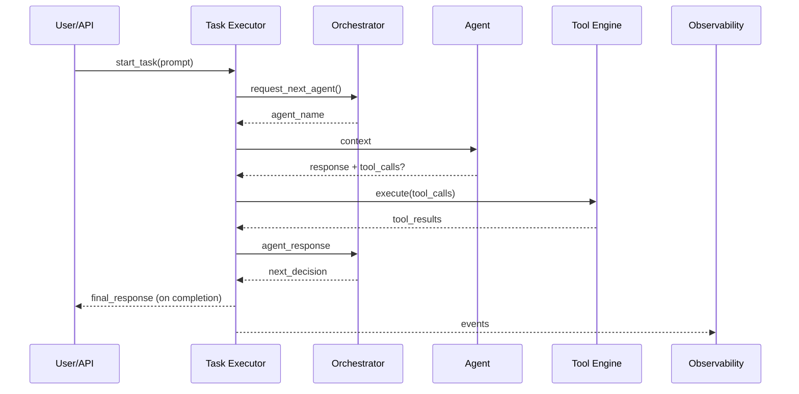
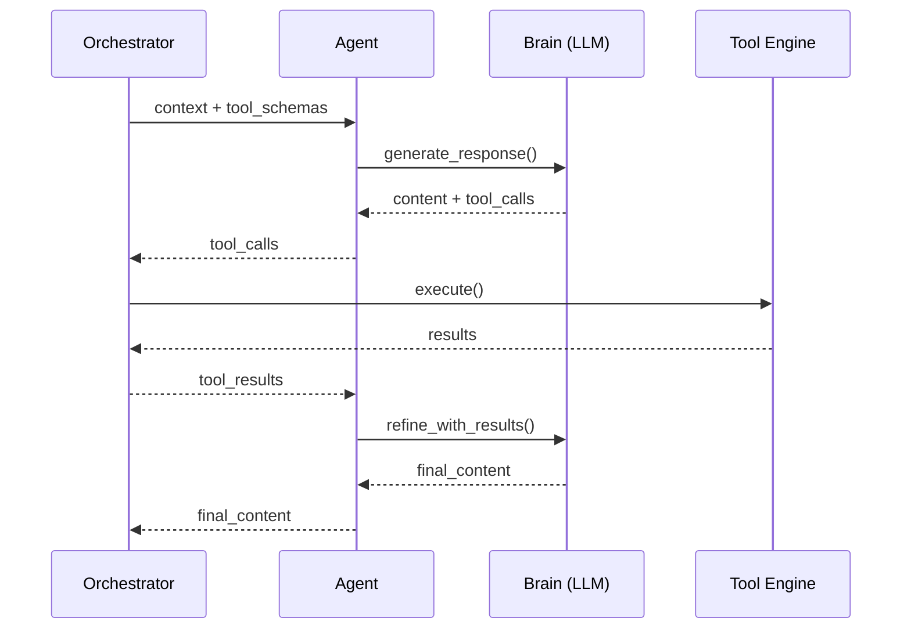

# AgentX System Architecture

## Executive Summary

AgentX is an open-source backbone for building secure, observable, and fully autonomous multi-agent systems. A lightweight micro-kernel orchestrates specialised agents, turning a single user request into a coordinated workflow that spans tool execution, memory retrieval, and artifact management—all within isolated, version-controlled workspaces. Every decision, message, and side effect is captured as a structured event, providing complete auditability and real-time insight into system behaviour.

## 1. Architectural Vision & Principles

### 1.1 Core Vision

AgentX enables organisations to decompose complex goals into collaborative Teams of agents, each focusing on a well-defined role. A central Orchestrator governs the conversation, selects the next agent to speak, executes tools on the agents' behalf, and enforces security boundaries. The result is a flexible framework that elevates individual agent capabilities into a cohesive, self-optimising system that can learn, adapt, and scale with minimal human intervention.

### 1.2 Architectural Principles

The architecture rests on the following foundational principles:

- **Separation of Concerns** – Each subsystem has a single, well-defined responsibility, which reduces coupling and simplifies maintenance.
- **Centralised Orchestration** – A single Orchestrator governs coordination, security, and resource allocation, providing a uniform control plane.
- **Agent Autonomy** – Agents manage their own reasoning loops and private Brains, delegating only cross-cutting concerns upward.
- **Event-Driven Coordination** – Asynchronous, structured events enable scalable, loosely-coupled communication among subsystems.
- **Configuration-Driven Behaviour** – Teams, agents, and workflows are defined declaratively, allowing rapid iteration without code changes.
- **Security by Design** – All external interactions pass through audited, policy-enforced channels; least-privilege boundaries are maintained throughout.
- **Workspace Isolation** – Every task executes in its own version-controlled workspace, ensuring reproducibility and clean separation of artifacts.

## 2. System Architecture Overview



## 3. Subsystem Architecture

### 3.1 Team Collaboration

This section focus on how to orchestrate multiple agents to get the task execution done.

#### 3.1.1 Task Executor

The **Task Executor** is the entry point for every user request. It prepares an isolated workspace, persists task state, and interfaces with the Orchestrator to determine which agent should act next. After receiving the decision, it delivers context to the chosen agent, captures tool requests, invokes the Tool Execution Engine, and loops until completion.

**Responsibility**: Single-task lifecycle orchestration

**Scope**:

- Workspace setup and teardown
- Persistent task state management
- Conversation loop with agents
- Secure invocation of Tool Execution Engine

**Interfaces**:

- `Orchestrator`: Request next-speaker decisions
- `Agent`: Deliver context and collect responses
- `ToolExecutionEngine`: Execute requested tools
- `WorkspaceManager`: Persist history and artifacts

**Boundaries**: Runs in task-scoped workspace; never bypasses Orchestrator for routing decisions.

#### 3.1.2 Orchestrator

Sitting at the heart of the runtime, the Orchestrator is responsible for all decision-making during execution. It routes messages to agents, dispatches tool calls through the secure Tool Engine, and enforces system-wide policies such as quotas and guardrails. By funnelling every cross-agent interaction through a single component, the architecture achieves both strong security guarantees and a unified place to observe and optimise collaboration patterns.

**Responsibility**: Central coordination and security enforcement

**Scope**:

- Agent workflow routing and handoff decisions
- Centralized tool execution with security validation
- Resource management and quota enforcement
- Cross-agent collaboration patterns

**Interfaces**:

- `AgentRouter`: Route requests to appropriate agents
- `ToolDispatcher`: Execute tools with security controls
- `WorkflowEngine`: Manage multi-agent collaboration patterns

**Boundaries**: Does not contain agent logic; focuses purely on coordination and security

#### 3.1.2 Agents

**Responsibility**: Represent a specific role in the collaboration, responsible to answer question or create output with selected tools.

**Scope**:

- LLM provider integration and failover
- Prompt template rendering and optimization
- Response streaming and processing
- Provider-specific optimizations

**Interfaces**:

- `LLMProvider`: Abstract interface for multiple LLM backends
- `PromptRenderer`: Jinja2-based template rendering with context
- `ResponseProcessor`: Handle streaming and structured responses

**Boundaries**: Pure LLM interface; no tool execution, state management, or coordination logic

### 3.3 Platform Services

Platform Services provide common capabilities that sit outside the tight execution loop yet remain essential to every task. They are deployed as shared, multi-tenant components and accessed via well-defined APIs, allowing the core runtime to stay lightweight while still benefiting from robust storage, configuration, and monitoring facilities.

#### 3.3.1 Configuration System

The Configuration System is the single source of truth for teams, agents, tools, and runtime policies. It loads declarative YAML files, validates them against versioned schemas, and exposes the resulting objects to the Task Executor and Orchestrator at startup or on hot-reload.

**Responsibility**: Declarative system behavior definition and validation

**Scope**:

- Team and agent configuration loading
- Configuration validation and schema enforcement
- Runtime configuration updates
- Template and asset management

**Interfaces**:

- `ConfigLoader`: Load and validate YAML configurations
- `SchemaValidator`: Enforce configuration schemas
- `TemplateManager`: Manage prompt templates and assets

**Boundaries**: Configuration management only; does not execute or modify behavior

#### 3.3.2 Event Bus

All significant actions in the framework emit structured events that flow through the Event Bus. This design decouples producers from consumers, enabling real-time monitoring, auditing, and external integrations without burdening the hot code-path.

**Responsibility**: Asynchronous event distribution and processing

**Scope**:

- Event publication and subscription
- Event routing and filtering
- Event persistence for replay and analysis
- Integration hooks for external systems

**Interfaces**:

- `EventPublisher`: Publish structured events
- `EventSubscriber`: Subscribe to event streams
- `EventStore`: Persist events for analysis and replay

**Boundaries**: Event distribution only; does not interpret or act on events

#### 3.3.3 Workspace Services

Workspace Services offer version-controlled, task-scoped storage. Every file write, artifact update, or history entry is committed here, guaranteeing reproducibility and a complete audit trail for each task.

**Responsibility**: Isolated workspace and artifact management

**Scope**:

- Task-isolated workspace creation
- Git-based artifact versioning
- File system abstraction
- Workspace cleanup and archival

**Interfaces**:

- `WorkspaceFactory`: Create isolated workspaces
- `ArtifactManager`: Version and manage generated artifacts
- `StorageBackend`: Abstract storage operations

**Boundaries**: Storage operations only; does not interpret or process stored content

#### 3.3.4 Memory System

The Memory System captures conversational context and long-term knowledge so that agents can retrieve relevant facts without exceeding token limits. It supports both short-term buffers and vector-based semantic search, with pluggable back-ends for different scale requirements.

**Responsibility**: Short-term and long-term memory management

**Scope**:

- Conversation context management
- Semantic search across historical data
- Memory consolidation and optimization
- Cross-task learning and knowledge retention

**Interfaces**:

- `MemoryBackend`: Pluggable memory storage implementations
- `SemanticSearch`: Vector-based information retrieval
- `ContextManager`: Optimize context for token limits

**Boundaries**: Memory operations only; does not make decisions about what to remember or forget

### 3.4 Builtin Tools

Builtin Tools extend AgentX with first-class capabilities—such as file I/O, web retrieval, and code execution—without requiring users to write custom plugins. They are registered automatically at startup and are available to any agent subject to security policy.

## 4. Team Collaboration Model

In AgentX, the concept of a **Team** is central to orchestrating complex, multi-step tasks. A Team is a collection of specialized agents, each with a distinct role, working together under the coordination of the Orchestrator to achieve a shared objective. This section describes how Teams, Tasks, the Orchestrator, and Agents interact to deliver robust, flexible, and auditable workflows.

### Relationship Between Task, Orchestrator, Team, and Agents

A **Task** represents a single unit of work initiated by a user or system. When a task is started, the system loads the corresponding Team configuration, which defines the agents, their roles, and available tools.

The **Orchestrator** acts as the central coordinator. It is responsible for:

- Managing the lifecycle of the task,
- Dynamically selecting the next agent to act based on the current context and agent states,
- Routing messages and tool calls,
- Ensuring isolation and security boundaries between agents.

**Agents** are autonomous components, each responsible for a specific aspect of the task (e.g., research, writing, review). Agents do not communicate directly with each other; all interactions are mediated by the Orchestrator, which provides the necessary context and manages handoffs.

The **Team** is the organizational structure that binds these agents together for the duration of a task. Team configuration (typically in `team.yaml`) specifies the agents, their roles, and any team-level settings such as memory, tools, and collaboration policies.

#### Diagram: Team Collaboration Overview



### Dynamic Agent Selection

Unlike systems with hardcoded agent handoff rules, AgentX empowers the Orchestrator to dynamically select the next agent based on the evolving context of the task. This enables flexible, adaptive workflows that can respond to the actual progress and needs of the task, rather than following a rigid sequence.

- The Orchestrator analyzes the current state, agent outputs, and team configuration to determine which agent should act next.
- This approach supports both simple and complex workflows, including iterative refinement, parallel work, and consensus-building, without requiring explicit handoff rules in the configuration.

### Team Configuration

Teams are defined declaratively, typically in a `team.yaml` file. This configuration specifies:

- The list of agents and their roles,
- Available tools and memory settings,
- Any team-level policies or parameters.

For a detailed guide on team configuration and advanced collaboration patterns, see the [Collaboration Model Document](./02-collaboration-model.md).

## 5. Task Execution Flow

A task begins when a user (or external system) submits an initial prompt. The Task Executor creates an isolated workspace, loads the Team configuration, and hands control to the **Orchestrator**.

1. **Initialize Task** – Task Executor sets up workspace/state and emits a `task_start` event.
2. **Load Team** – Orchestrator instantiates agents defined in `team.yaml`.
3. **Select First Agent** – Orchestrator chooses the starting agent (often based on role or explicit `entry_agent`).
4. **Agent Monologue & Tool Calls** – The selected agent reasons over the prompt, optionally requesting tool calls. Tool calls are executed by the Tool Execution Engine via the Orchestrator.
5. **Dynamic Handoff** – After each agent response, the Orchestrator decides whether to complete the task, continue with the same agent, or hand off to another agent.
6. **Completion** – When the stop condition is met, the Orchestrator marks the task complete and emits a `task_complete` event; artifacts and history are committed to the workspace.



Additional event and data structures are detailed in the [Data & Events Document](./03-data-and-events.md).

## 6. Agent Execution Model

An agent processes an incoming message through an inner loop we call the **monologue**. During this loop, the agent interacts with its private Brain (LLM), may request tool executions, and ultimately produces a final response or signals a handoff.

1. **Receive Context** – Agent receives full conversation history, relevant artifacts, and any tool schemas.
2. **Brain Reasoning** – Agent's Brain generates a draft response; if tool calls are needed, they are returned as part of the response.
3. **Tool Execution** – The Orchestrator validates and executes the requested tools, returning structured results to the agent.
4. **Refine & Respond** – Agent incorporates tool results (if any) and produces its final response for this turn.
5. **Handoff Signal** – The response is returned to the Orchestrator, which decides on next steps.



Advanced agent design patterns and guardrail strategies are covered in the [Agent Design Patterns Document](./agent-design-patterns.md).

## 7. Subsystem Collaboration Patterns

### 7.1 Task Execution Flow

```
Client Request → Task Executor → Orchestrator → Team (Agents) → LLM Providers
                     ↓              ↓
                Workspace ←── Tool Execution Engine
                     ↓              ↓
                Event Bus ←── All Components ──→ Observability
```

## 8. The Future of AgentX

AgentX will continue to evolve along three pillars: performance, interoperability, and safety. Upcoming priorities include native support for streaming multimodal models, tighter integration with external knowledge graphs to improve grounding, and progressive guardrail policies that adapt to organisational compliance requirements. We also plan to introduce a plug-and-play planning module so that teams can experiment with alternative orchestration strategies without modifying core code. Finally, deeper observability hooks—spanning trace-level token accounting through to high-level outcome metrics—will help users fine-tune cost, latency, and quality trade-offs.
