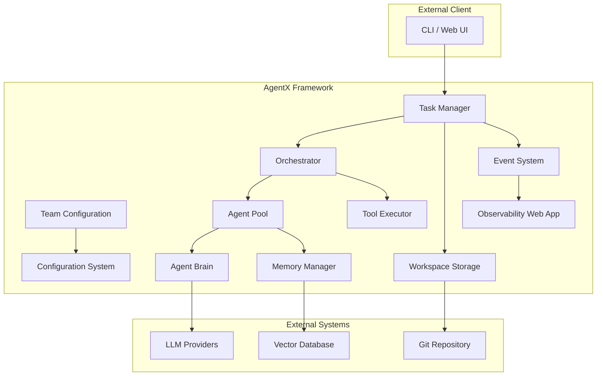

# 01: System Architecture

This document specifies the high-level, static architecture of the AgentX framework. It is guided by the principles defined in `requirements.md`.

## 1. Architectural Vision

AgentX is a **multi-agent conversation framework** designed as a decoupled, headless system. The core components provide the logic for orchestration, reasoning, and execution, while clients (CLI, web UI) interact with the framework via well-defined APIs.

The framework supports flexible deployment models:

- **Single-use CLI mode**: Each task runs as a separate process
- **Long-running service mode**: Persistent service managing multiple concurrent tasks

## 2. Core Component Overview



## 3. Component Architecture

### 3.1. Task

**Purpose**: Primary interface for AgentX task execution and workflow coordination.

**Key Responsibilities**:

- Manages complete task lifecycle from initialization to completion
- Provides both one-shot execution (`execute_task()`) and step-by-step execution (`step()`)
- Coordinates multi-agent workflows through orchestrator
- Maintains task history and state persistence
- Handles streaming and non-streaming execution modes
- Manages workspace setup and artifact storage

**API Surface**:

```python
# One-shot execution
task = create_task(config_path)
await task.execute_task(prompt)

# Step-by-step execution
task = create_task(config_path)
task.start_task(prompt)
while not task.is_complete:
    await task.step()
```

**Internal Architecture**:

- Uses internal `Orchestrator` for routing decisions
- Maintains conversation history as `List[TaskStep]`
- Manages workspace directory with Git-based artifact storage
- Publishes events for observability

### 3.2. Team

**Purpose**: Pure agent container and configuration manager.

**Key Responsibilities**:

- Load and validate team configuration from YAML files
- Initialize agent instances from configuration
- Provide access to agents, tools, and collaboration patterns
- Render agent prompts with Jinja2 templates and context
- Validate handoff rules between agents
- Manage team-level guardrail policies

**Configuration Structure**:

```yaml
name: "Research Team"
agents:
  - name: researcher
    description: "Research specialist"
    prompt_template: "prompts/researcher.md"
    tools: [web_search, store_artifact]
    llm_config:
      model: "deepseek/deepseek-chat"
handoffs:
  - from_agent: researcher
    to_agent: writer
```

**Does NOT Handle**: Task execution (delegated to Orchestrator)

### 3.3. Orchestrator

**Purpose**: Central nervous system for agent coordination and secure tool execution.

**Key Responsibilities**:

- **Core Orchestration**: Make routing decisions (complete, handoff, continue)
- **Agent Collaboration**: Facilitate agent-to-agent handoffs and workflows
- **Centralized Tool Execution**: Execute ALL tools for security and control
- **Intelligent Routing**: Use LLM-based decision making for complex handoffs
- **Security Control**: Single point of tool validation, audit, and resource limits

**Architecture Pattern**:

```python
# Routing decisions
async def decide_next_step(current_agent, response, context) -> RoutingDecision

# Agent delegation with tool security
async def route_to_agent(agent_name, messages) -> str

# Centralized tool dispatch
async def execute_tool_calls(tool_calls, agent_name) -> List[ToolResult]
```

**Security Benefits**:

- Single entry point for all tool execution
- Centralized security policies and audit trails
- Resource limits and monitoring
- Complete tool usage logging

### 3.4. Agent

**Purpose**: Autonomous conversation management with delegated tool execution.

**Key Principles**:

- Each agent is autonomous and manages its own conversation flow
- Agents communicate through public interfaces only
- Brain is private to each agent (no external access)
- Tool execution delegated to orchestrator for security

**Public Interface** (matches Brain for consistency):

```python
async def generate_response(messages, system_prompt=None, orchestrator=None) -> str
async def stream_response(messages, system_prompt=None, orchestrator=None) -> AsyncGenerator[str, None]
```

**Internal Architecture**:

- `_conversation_loop()`: Manages conversation rounds with tool calls
- `build_system_prompt()`: Creates context-aware system prompts
- Maintains `AgentState` for execution tracking
- Delegates all tool execution to orchestrator

**Agent Configuration**:

```python
@dataclass
class AgentConfig:
    name: str
    description: str
    prompt_template: str
    tools: List[str]
    llm_config: LLMConfig
    memory_enabled: bool = True
    max_iterations: int = 10
```

### 3.5. Brain

**Purpose**: Pure LLM interface (private to each agent).

**Key Responsibilities**:

- Generate LLM responses with potential tool calls
- Stream LLM responses token-by-token
- Format messages for LLM providers (OpenAI, Anthropic, etc.)
- Handle provider-specific authentication and rate limiting
- Process Jinja2 prompt templates with context

**Does NOT**:

- Execute tools (delegated to orchestrator)
- Manage conversation flow (handled by agent)
- Make routing decisions (handled by orchestrator)
- Store conversation state (handled by agent/task)

**LLM Configuration**:

```python
@dataclass
class LLMConfig:
    model: str = "deepseek/deepseek-chat"
    temperature: float = 0.7
    max_tokens: int = 4000
    timeout: int = 30
```

### 3.6. Tool System

**Purpose**: Secure, extensible tool execution framework.

**Architecture Components**:

#### Tool Registry

- **Purpose**: Tool definitions and discovery only
- **Responsibilities**: Register tools, provide schemas, tool lookup
- **Does NOT**: Execute tools (security separation)

#### Tool Executor

- **Purpose**: Secure execution with performance monitoring
- **Responsibilities**:
  - Execute tool calls with security validation
  - Resource limits and timeout enforcement
  - Performance monitoring and audit logging
  - Error handling and retry mechanisms

#### Tool Base Classes

```python
class Tool:
    """Base class for all tools."""

class ToolFunction:
    """Decorator for function-based tools."""

@register_tool
def web_search(query: str) -> str:
    """Search the web for information."""
```

**Built-in Tool Categories**:

- **Storage Tools**: File operations (read_file, write_file, etc.)
- **Artifact Tools**: Versioned artifact management
- **Search Tools**: Web search and information retrieval
- **Memory Tools**: Agent memory and context management
- **Planning Tools**: Task planning and status tracking
- **Context Tools**: Task context and metadata access

### 3.7. Storage System

**Purpose**: Git-based workspace and artifact management.

**Key Components**:

#### Workspace Storage

- **Factory Pattern**: `StorageFactory.create_workspace_storage()`
- **Git Integration**: Automatic repository initialization for versioning
- **Async Operations**: Non-blocking storage with ThreadPoolExecutor
- **Fallback Support**: Graceful degradation when Git unavailable

#### Artifact Management

- **Version Control**: Each artifact version stored as Git commit
- **Diff Support**: Compare any two artifact versions
- **Metadata Tracking**: Creation time, agent info, descriptions
- **File Type Detection**: Automatic extension based on content

**Workspace Structure**:

```
workspace/
├── team.yaml           # Team configuration
├── plan.json          # Structured execution plan
├── history.jsonl      # Append-only task steps
└── artifacts/         # Git-managed generated files
    ├── .git/         # Git repository
    ├── document.md   # Generated documents
    └── code.py       # Generated code
```

### 3.8. Memory System

**Purpose**: Sophisticated memory management for enhanced agent performance.

**Key Capabilities**:

- **Short-term Memory**: Recent conversation context within token limits
- **Long-term Memory**: Persistent storage and retrieval via vector search
- **Semantic Search**: Vector-based search across conversations and artifacts
- **Memory Consolidation**: Automatic summarization and indexing
- **Cross-Task Memory**: Learning from previous task executions

**Factory Pattern**:

```python
memory_manager = MemoryFactory.create_memory_backend(
    backend_type="mem0",  # or "simple", "vector"
    config=memory_config
)
```

### 3.9. Configuration System

**Purpose**: Centralized configuration management for all components.

**Key Components**:

#### Team Loader

- Load team configurations from YAML files
- Validate team structure and agent definitions
- Initialize agent instances from configuration

#### Agent Loader

- Load individual agent configurations
- Handle prompt template resolution
- Validate tool assignments and LLM configs

#### Configuration Models

```python
@dataclass
class TeamConfig:
    name: str
    agents: List[AgentConfig]
    tools: List[ToolConfig]
    handoffs: List[HandoffRule]
    execution: ExecutionConfig
```

### 3.10. Event System

**Purpose**: Comprehensive event-driven architecture for observability.

**Key Components**:

#### Event Bus

- Publish/subscribe event system
- Asynchronous event processing
- Event filtering and routing

#### Event Types

- **Task Events**: TaskStartEvent, TaskCompleteEvent, ErrorEvent
- **Agent Events**: AgentStartEvent, AgentCompleteEvent, AgentHandoffEvent
- **Tool Events**: ToolExecutionEvent, ToolResultEvent
- **Memory Events**: MemoryRetrievalEvent, MemoryStorageEvent

#### Event Middleware

- Event validation and transformation
- Event persistence and replay
- Event-based metrics collection

### 3.11. Observability System

**Purpose**: Real-time monitoring and debugging web interface.

**Key Features**:

- **Dashboard**: Real-time task execution status
- **Task History**: Complete task execution timelines
- **Agent Activity**: Individual agent performance metrics
- **Tool Usage**: Tool execution statistics and errors
- **Configuration Viewer**: Team and agent configuration inspection
- **Artifact Browser**: Generated artifact exploration

**Web Interface**:

- Flask-based web application
- Real-time updates via WebSocket
- Interactive task debugging
- Performance metrics visualization

### 3.12. Search System

**Purpose**: External information retrieval capabilities.

**Key Components**:

#### Search Manager

- Unified interface for multiple search backends
- Query optimization and result aggregation
- Caching and rate limiting

#### Search Backends

- **SerpAPI Backend**: Web search via SerpAPI
- **Custom Backends**: Extensible for additional providers

## 4. Data Flow Architecture

### 4.1. Single Agent Request Flow

```
1. External Request → Task.execute_task()
2. Task → Orchestrator.route_to_agent()
3. Orchestrator → Agent.generate_response()
4. Agent → Brain.generate_response() (with tools)
5. Brain → LLM Provider (returns response + tool calls)
6. Agent → Orchestrator.execute_tool_calls() (security)
7. Orchestrator → ToolExecutor.execute_tool_calls()
8. ToolExecutor → Tool implementations
9. ToolExecutor → Return results to Orchestrator
10. Orchestrator → Return results to Agent
11. Agent → Brain.generate_response() (with tool results)
12. Brain → LLM Provider (returns final response)
13. Agent → Return complete response to Orchestrator
14. Orchestrator → Return to Task
15. Task → Persist history and artifacts
```

### 4.2. Multi-Agent Collaboration Flow

```
1. Task → Orchestrator.route_to_agent(agent_a)
2. Agent_A → [Conversation loop with tool execution]
3. Agent_A → Return response to Orchestrator
4. Task → Orchestrator.decide_next_step()
5. Orchestrator → Routing decision (handoff to agent_b)
6. Task → Orchestrator.route_to_agent(agent_b)
7. Agent_B → [Conversation loop with tool execution]
8. Agent_B → Return response to Orchestrator
9. Task → Orchestrator.decide_next_step()
10. Orchestrator → Routing decision (complete)
11. Task → Complete and persist final state
```

## 5. Security Architecture

### 5.1. Centralized Tool Control

- **Single Entry Point**: All tools executed through `orchestrator.execute_tool_calls()`
- **Security Validation**: Tool permissions checked before execution
- **Resource Limits**: Prevent abuse through centralized monitoring
- **Audit Trail**: Complete logging of all tool usage
- **Policy Enforcement**: Consistent security policies across agents

### 5.2. Agent Isolation

- **Private Brains**: No external access to agent LLM interactions
- **Public Interfaces**: Agents communicate only through defined APIs
- **Capability Control**: Tools assigned per agent configuration
- **State Isolation**: Each agent manages independent state

## 6. Deployment Models

### 6.1. CLI Mode (Single-use)

- Each task creates new `Task` instance
- Dedicated workspace directory per task
- Process terminates after completion
- Suitable for batch processing and automation

### 6.2. Service Mode (Long-running)

- Persistent service managing multiple concurrent tasks
- REST/WebSocket APIs for client interaction
- Shared tool executor and orchestrator instances
- Suitable for interactive applications and web UIs

## 7. Extension Points

### 7.1. Custom Tools

```python
from agentx import register_tool

@register_tool
def custom_tool(param: str) -> str:
    """Custom tool implementation."""
    return f"Result: {param}"
```

### 7.2. Custom Memory Backends

```python
class CustomMemoryBackend(MemoryBackend):
    async def store(self, key: str, data: Any) -> None:
        # Custom storage implementation

    async def retrieve(self, query: str) -> List[Any]:
        # Custom retrieval implementation
```

### 7.3. Custom LLM Providers

```python
class CustomBrain(Brain):
    async def generate_response(self, messages, **kwargs) -> LLMResponse:
        # Custom LLM provider integration
```

## 8. Configuration Examples

### 8.1. Simple Team Configuration

```yaml
name: "Content Creation Team"
description: "AI team for research and writing"

agents:
  - name: researcher
    description: "Research specialist"
    prompt_template: "prompts/researcher.md"
    tools: [web_search, store_artifact, read_file]
    llm_config:
      model: "deepseek/deepseek-chat"
      temperature: 0.7

  - name: writer
    description: "Content writer"
    prompt_template: "prompts/writer.md"
    tools: [store_artifact, read_file, write_file]
    llm_config:
      model: "deepseek/deepseek-chat"
      temperature: 0.8

handoffs:
  - from_agent: researcher
    to_agent: writer
    condition: "research_complete"

execution:
  max_rounds: 20
  initial_agent: researcher
```

### 8.2. Tool Configuration

```yaml
tools:
  - name: web_search
    type: builtin
    description: "Search the web for information"

  - name: custom_api
    type: custom
    module: "my_tools.api_tool"
    config:
      api_key: "${API_KEY}"
      base_url: "https://api.example.com"
```

This architecture provides a robust, secure, and extensible foundation for building sophisticated multi-agent AI applications while maintaining clear separation of concerns and strong security boundaries.
