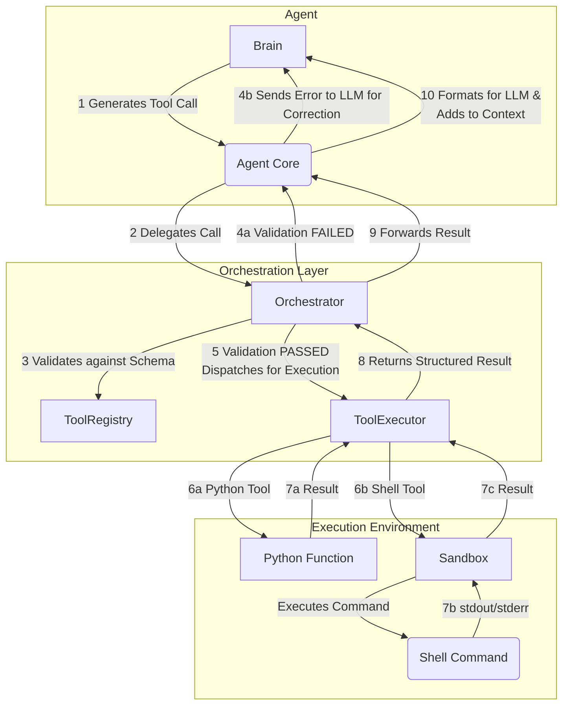

# Tool Call and Execution

## 1. Overview and Core Principles

This document details the architecture for defining, executing, and managing tools within AgentX. It is designed to be secure, robust, and extensible. The core principles are:

- **Security First**: Untrusted code (LLM-generated shell commands) must never execute directly on the host machine. All tool execution is centralized and sandboxed.
- **Robust Self-Correction**: LLM-generated tool calls can be malformed. The system must be able to detect this, provide corrective feedback to the LLM, and allow it to fix its own mistakes.
- **Structured and Extensible**: All tools are strongly-typed and their schemas are automatically generated. The system is designed to easily accommodate new types of tools, including custom user-defined functions and external integrations.

## 2. Tool Definition and Registration

A "tool" is a capability that an agent can call. This can be a Python function or a shell command.

### 2.1. Tool Definition

- **Python Functions**: Any Python function can be turned into a tool. The function must have type hints for all its arguments and a clear docstring. The docstring is critical as it is used in the prompt to tell the agent what the tool does.

  ```python
  def write_file(path: str, content: str) -> str:
      """Writes content to a file at the specified path."""
      # ... implementation ...
      return f"File '{path}' written successfully."
  ```

- **Shell Commands**: Shell commands are defined with a name, description, and an argument schema. The agent's LLM will generate the command string based on the arguments.

### 2.2. Tool Registration and Schema Generation

Tools are made available to agents via a central `ToolRegistry`.

- **Decorator-Based Registration**: The `@register_tool` decorator is the primary mechanism for adding a tool to the registry.

  ```python
  from agentx.core.tool import register_tool

  @register_tool
  def write_file(path: str, content: str) -> str:
      # ...
  ```

- **Automatic Schema Generation**: When a function is decorated, the `ToolRegistry` automatically inspects its signature and docstring to create a JSON schema. This schema is what the LLM sees and uses to construct a valid tool call. For the `write_file` example, the generated schema would look like this:

  ```json
  {
    "name": "write_file",
    "description": "Writes content to a file at the specified path.",
    "parameters": {
      "type": "object",
      "properties": {
        "path": { "type": "string" },
        "content": { "type": "string" }
      },
      "required": ["path", "content"]
    }
  }
  ```

## 3. The Tool Call Lifecycle

The following diagram and steps describe the end-to-end flow of a tool call, from generation to result.



**Step-by-Step Flow:**

1.  **Generation (Agent Brain)**: The `Orchestrator` provides the `Brain` (LLM) with the conversation history and a list of available tool schemas. The LLM determines a tool call is needed and generates the call in a structured format (e.g., JSON).

2.  **Delegation (Agent Core)**: The `Agent`'s core logic receives the raw text from the LLM, parses out the tool call request, and delegates it to the `Orchestrator` for execution. **The agent itself has no permission to execute tools.**

3.  **Validation (Orchestrator)**: The `Orchestrator` receives the tool call. It retrieves the corresponding schema from the `ToolRegistry` and validates the call. It checks for missing required arguments, incorrect types, etc.

4.  **Self-Correction Loop (If Validation Fails)**:

    - If validation fails, the `Orchestrator` does **not** attempt to run the tool.
    - It generates a structured error message (e.g., "Validation Error: Missing required argument 'path' for tool 'write_file'").
    - This error is sent back to the `Agent`, which in turn passes it back to the `Brain` (LLM) in the next turn.
    - The LLM now has the context of its previous failed attempt and the specific validation error, allowing it to generate a corrected tool call.

5.  **Dispatch (If Validation Succeeds)**: If the call is valid, the `Orchestrator` dispatches it to the `ToolExecutor`.

6.  **Secure Execution (ToolExecutor)**: The `ToolExecutor` inspects the tool type:

    - **Python Function**: The call is a standard Python function call. It is executed directly in the main process.
    - **Shell Command**: The command is executed inside a secure, isolated sandbox.

7.  **Result Capturing**: The `ToolExecutor` captures the result:

    - For Python functions, this is the return value.
    - For shell commands, this includes `stdout`, `stderr`, and the exit code.

8.  **Structured Result**: The result is packaged into a `ToolResult` object and returned to the `Orchestrator`.

9.  **Forwarding**: The `Orchestrator` forwards the `ToolResult` to the originating `Agent`.

10. **Contextualization**: The `Agent` formats the result into a clear, readable format (e.g., `<tool_result tool_name="write_file">File 'test.txt' written successfully.</tool_result>`) and adds it to the conversation history for the `Brain`'s next turn. The LLM can then use this result to form its final response to the user.

## 4. Security Architecture: The Sandbox

Executing arbitrary, LLM-generated shell commands is a major security risk. AgentX mitigates this by using a sandboxed execution environment.

- **Technology**: The default implementation uses **Docker containers**. Each shell tool execution spins up a new, short-lived container.
- **Isolation**:
  - **Network**: Containers run with networking disabled by default (`--net=none`) to prevent exfiltration of data or attacks on the local network. Tools that explicitly need network access must be granted it.
  - **Filesystem**: The container is only granted access to the current task's workspace directory (`/app/workspace`). It cannot read from or write to any other part of the host filesystem.
  - **Permissions**: The process inside the container runs as a non-root user to limit its privileges even within the sandbox.

## 5. Extensibility

### 5.1. Custom and Built-in Tools

- **Built-in Tools**: AgentX provides a core set of safe tools for file I/O, search, etc., located in `src/agentx/builtin_tools/`.
- **Custom Tools**: Users can easily define their own tools in their project's codebase. As long as the file is imported and the functions are decorated with `@register_tool`, they will be available to the agents.

### 5.2. MCP (Multi-Agent Communication Protocol) Integration

The tool architecture is extensible to other protocols. An MCP tool could be implemented as a special Python function:

```python
@register_tool
def send_mcp_message(recipient_agent: str, message_body: str):
    """Sends a message to another agent using the MCP protocol."""
    # Logic to connect to MCP broker and send message
    # ...
```

To the `Orchestrator` and `Agent`, this is just another tool. The implementation details are abstracted away.
