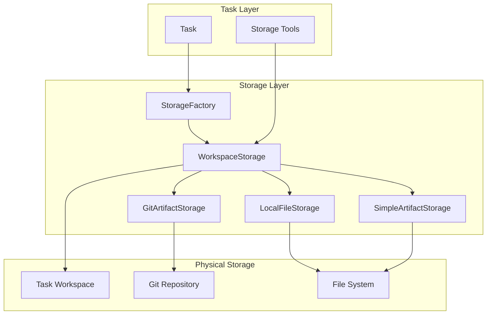

# 04: Storage Architecture

This document details the storage layer architecture of AgentX, focusing on the Git-based artifact versioning system and clean factory patterns that provide robust, version-controlled persistence for multi-agent workflows.

## 1. Overview

The AgentX storage system is built around a **factory pattern architecture** that eliminates redundant delegation layers and provides **Git-based artifact versioning** for sophisticated code generation and iterative content workflows.

### Key Design Principles

- **No Direct File Access**: All file operations must go through the storage layer
- **Factory Pattern**: Clean `StorageFactory.create_workspace_storage()` API
- **Git Integration**: Automatic version control for artifacts with meaningful commit history
- **Async Operations**: Non-blocking storage operations with proper error handling
- **Graceful Fallback**: Simple versioning when Git is unavailable
- **Workspace Isolation**: Each task gets its own isolated storage environment

## 2. Architecture Components



### 2.1. StorageFactory

**Role**: Central factory for creating storage providers with clean API

**Responsibilities**:

- Creates `WorkspaceStorage` instances with appropriate configuration
- Handles Git availability detection and fallback logic
- Provides consistent interface regardless of underlying storage type

```python
# Clean factory API
workspace = StorageFactory.create_workspace_storage(
    workspace_path="/path/to/workspace",
    use_git_artifacts=True  # Defaults to True
)
```

### 2.2. WorkspaceStorage

**Role**: High-level business logic layer for workspace operations

**Responsibilities**:

- Manages both file operations and artifact versioning
- Coordinates between file storage and artifact storage
- Provides unified API for all workspace operations
- Handles message storage for conversation history
- Manages execution plans and workspace metadata

**Key Methods**:

```python
# Artifact operations
await workspace.store_artifact(name, content, content_type, metadata)
await workspace.get_artifact(name, version=None)
await workspace.list_artifacts()
await workspace.get_artifact_versions(name)
await workspace.delete_artifact(name, version=None)

# Git-specific operations (when available)
await workspace.get_artifact_diff(name, version1, version2)

# File operations
await workspace.file_storage.write_text(path, content)
await workspace.file_storage.read_text(path)

# Message operations
await workspace.store_message(message_dict)
await workspace.get_conversation_history()
```

### 2.3. GitArtifactStorage

**Role**: Git-based artifact versioning with full version control capabilities

**Responsibilities**:

- Automatic Git repository initialization with AgentX identity
- Commit-based versioning with meaningful commit messages
- File extension detection based on content type
- Git diff functionality between any two versions
- Async operations using ThreadPoolExecutor
- Full Git history tracking and metadata

**Features**:

- **Automatic Repository Setup**: Creates `.git` repository with proper configuration
- **Meaningful Commits**: Each artifact version gets a descriptive commit message
- **Content Type Detection**: Automatically determines file extensions (`.py`, `.md`, `.json`, etc.)
- **Version Identification**: Uses Git commit hashes as version identifiers
- **Diff Support**: Full Git diff between any two versions
- **Async Operations**: Non-blocking Git operations for performance

**Example Git History**:

```bash
$ git log --oneline
a1b2c3d4 (HEAD -> main) Update fibonacci.py: Optimized with memoization
e5f6g7h8 Initial fibonacci.py: Basic recursive implementation
9i0j1k2l Initial commit: AgentX artifacts repository
```

### 2.4. SimpleArtifactStorage

**Role**: Fallback artifact storage when Git is unavailable

**Responsibilities**:

- UUID-based versioning system
- File-based metadata storage
- Simple version tracking without Git dependencies
- Compatible API with GitArtifactStorage

## 3. Git Integration Details

### 3.1. Repository Structure

Each task workspace contains an `artifacts/` directory that is a Git repository:

```
workspace/
├── task_state.json
├── history/
│   └── conversation.jsonl
├── logs/
│   └── task.log
└── artifacts/              # Git repository
    ├── .git/               # Git metadata
    ├── .gitignore          # Ignore patterns
    ├── fibonacci.py        # Versioned artifacts
    └── report.md
```

### 3.2. Commit Strategy

**Commit Messages**: Descriptive messages based on content and metadata

```
Initial fibonacci.py: Basic recursive implementation
Update fibonacci.py: Optimized with memoization
Create report.md: Analysis of remote work benefits
Update report.md: Added statistical data and references
```

**Commit Metadata**: Includes creation time, agent information, and descriptions

```python
commit_message = f"{action} {filename}: {description}"
# Example: "Update fibonacci.py: Optimized with memoization"
```

**File Extensions**: Automatically determined from content type

```python
CONTENT_TYPE_EXTENSIONS = {
    "text/python": ".py",
    "text/javascript": ".js",
    "text/markdown": ".md",
    "application/json": ".json",
    "text/yaml": ".yaml",
    "text/plain": ".txt"
}
```

### 3.3. Version Management

**Version Identification**: Git commit hashes (short form)

```python
version = "a1b2c3d4"  # Short Git commit hash
```

**Version Retrieval**: Get any version by commit hash

```python
# Get latest version
content = await workspace.get_artifact("fibonacci.py")

# Get specific version
content = await workspace.get_artifact("fibonacci.py", "a1b2c3d4")
```

**Version Comparison**: Full Git diff support

```python
diff = await workspace.get_artifact_diff("fibonacci.py", "v1", "v2")
print(diff)
# Output: Git diff showing exact changes between versions
```

## 4. Storage Tools Integration

### 4.1. Tool Architecture

Storage tools are created through the factory pattern and provide LLM-accessible interfaces:

```python
def create_storage_tools(workspace_path: str) -> tuple[StorageTool, ArtifactTool]:
    """Create storage tools for a workspace."""
    workspace = StorageFactory.create_workspace_storage(workspace_path)
    storage_tool = StorageTool(workspace)
    artifact_tool = ArtifactTool(workspace)
    return storage_tool, artifact_tool
```

### 4.2. Tool Capabilities

**StorageTool**: File system operations

- Read/write files
- Create/list directories
- File existence checks
- Directory operations

**ArtifactTool**: Versioned artifact management

- Store versioned artifacts with metadata
- Retrieve specific versions
- List all artifacts and versions
- Delete artifacts or specific versions
- View version history

### 4.3. LLM Integration

Tools provide natural language interfaces for agents:

```python
@tool(description="Store content as a versioned artifact")
async def store_artifact(
    self,
    task_id: str,
    agent_id: str,
    name: str,
    content: str,
    description: str = ""
) -> str:
    """Store content as a versioned artifact with Git versioning."""
    # Implementation uses workspace.store_artifact()
```

## 5. Task Integration

### 5.1. Task Lifecycle Integration

The Task class integrates with storage throughout its lifecycle:

**Initialization**:

```python
# Create workspace storage during task setup
self.workspace_storage = StorageFactory.create_workspace_storage(
    self.workspace_dir,
    use_git_artifacts=True
)
```

**State Persistence**:

```python
# Save task state through storage layer
await self.workspace_storage.file_storage.write_text(
    "task_state.json",
    json.dumps(state, indent=2)
)
```

**Conversation History**:

```python
# Save conversation history through storage layer
await self.workspace_storage.file_storage.write_text(
    "history/conversation.jsonl",
    '\n'.join(history_lines) + '\n'
)
```

### 5.2. No Direct File Access Rule

**Before (Problematic)**:

```python
# Direct file access - AVOID
with open(state_file, 'w') as f:
    json.dump(state, f, indent=2)
```

**After (Correct)**:

```python
# Through storage layer - CORRECT
await self.workspace_storage.file_storage.write_text(
    "task_state.json",
    json.dumps(state, indent=2)
)
```

## 6. Performance Considerations

### 6.1. Async Operations

All storage operations are async to prevent blocking:

```python
# Git operations use ThreadPoolExecutor
async def _git_commit(self, message: str) -> str:
    """Commit changes and return commit hash."""
    def _commit():
        self.repo.index.commit(message)
        return self.repo.head.commit.hexsha[:8]

    return await self.executor.run_in_executor(None, _commit)
```

### 6.2. Error Handling

Comprehensive error handling with graceful degradation:

```python
try:
    # Try Git-based storage
    result = await self.git_storage.store_artifact(...)
except Exception as e:
    logger.warning(f"Git storage failed, falling back to simple: {e}")
    # Fall back to simple storage
    result = await self.simple_storage.store_artifact(...)
```

### 6.3. Resource Management

- Git repositories are properly initialized and cleaned up
- ThreadPoolExecutor manages concurrent Git operations
- File handles are properly closed through context managers
- Memory usage is optimized for large artifacts

## 7. Benefits and Use Cases

### 7.1. Code Generation Workflows

Perfect for iterative code development:

- Each code iteration is a Git commit
- Full diff history shows evolution
- Easy rollback to previous versions
- Meaningful commit messages track changes

### 7.2. Document Collaboration

Ideal for multi-agent document creation:

- Track document evolution through versions
- Compare different agent contributions
- Maintain audit trail of all changes
- Support for various document formats

### 7.3. Debugging and Auditing

Comprehensive debugging capabilities:

- Full history of all artifact changes
- Git blame for tracking agent contributions
- Diff analysis for understanding changes
- Complete audit trail for compliance

## 8. Future Enhancements

### 8.1. Planned Features

- **Branch Support**: Multiple development branches per task
- **Merge Strategies**: Automatic conflict resolution for parallel agent work
- **Remote Repositories**: Push to external Git repositories
- **Artifact Tagging**: Semantic versioning and release tagging
- **Binary Support**: Enhanced handling of binary artifacts

### 8.2. Integration Opportunities

- **GitHub Integration**: Automatic repository creation and management
- **CI/CD Integration**: Trigger builds on artifact changes
- **Code Review**: Integration with code review platforms
- **Backup Systems**: Automatic backup to cloud storage

## 9. Migration Guide

### 9.1. From Legacy Storage

For existing AgentX installations:

1. **Automatic Migration**: New tasks automatically use Git-based storage
2. **Backward Compatibility**: Existing workspaces continue to work
3. **Gradual Adoption**: Teams can migrate at their own pace
4. **Data Preservation**: All existing data is preserved during migration

### 9.2. Configuration

Enable/disable Git storage:

```yaml
# team.yaml
storage:
  use_git_artifacts: true # Default: true
  fallback_to_simple: true # Default: true
```

This storage architecture provides AgentX with enterprise-grade artifact management while maintaining simplicity and performance for multi-agent workflows.
