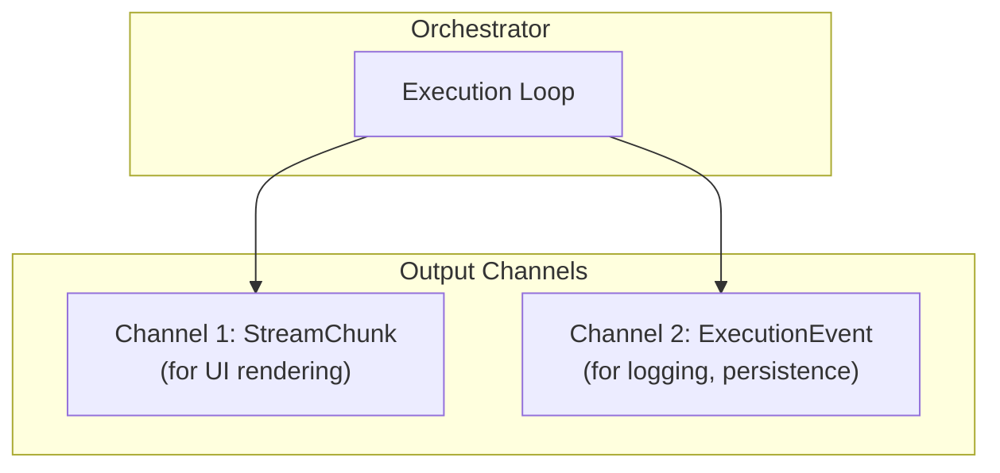
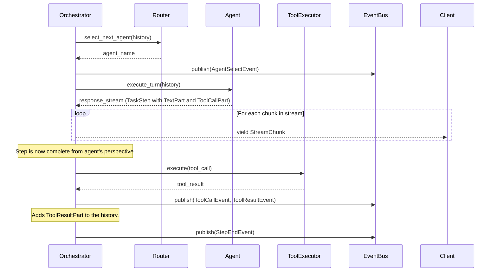

# Design Doc: Task-Oriented Collaboration

This document details the core runtime components and the "collaboration model" that drives a task forward. It builds on the high-level concepts in the [System Architecture](./system-architecture.md) document.

## 1. Core Runtime Concepts

The execution of a task is a **continuous loop** managed by the `Orchestrator`. This loop is not a simple back-and-forth conversation, but a structured process of selecting agents, executing their turns, and handling the outcomes.

### 1.1. `Orchestrator`: The Execution Engine

The `Orchestrator` is the heart of the framework. It is an active, stateful component that drives the task execution loop. Its primary responsibilities are:

- **State Management**: Holding the `Team` object, which contains the complete state of the task.
- **Agent Selection**: Consulting the `Router` to determine which agent should act next.
- **Turn Execution**: Invoking the selected agent to generate the next `TaskStep`.
- **Tool Handling**: Executing any `ToolCallPart`s from the `TaskStep` and creating a corresponding `ToolResultPart`.
- **Interruption Handling**: Gracefully handling user interruptions and integrating them into the task flow.
- **Output Generation**: Producing the dual output of `StreamChunk` and `ExecutionEvent`s.

### 1.2. `Router`: The Collaboration Engine

The `Router` is a stateless component that implements the `collaboration_model` defined in the team configuration. It is responsible for deciding which agent should act at any given point in the task.

- **Input**: The current `TaskStep` history.
- **Output**: The name of the next agent to act.
- **Implementations**:
  - `sequential`: A simple round-robin sequence.
  - `manual`: Control is always returned to the user.
  - `graph`: A state machine where nodes are agents and edges are transition conditions. The `Router` evaluates the last `TaskStep` to decide which path to take.

### 1.3. Dual-Channel Output

To meet the needs of both a real-time UI and robust backend integration, the `Orchestrator.run()` method will produce two distinct types of output on separate channels.

- **`StreamChunk`**: A simple data structure, often just a string, representing the raw, token-by-token output from the LLM. This is designed for low-latency streaming directly to a UI.
- **`ExecutionEvent`**: A structured object representing a significant lifecycle event in the task's execution. These events are used for logging, persistence, debugging, and other backend processes.

Example `ExecutionEvent`s:

- `TaskStart`
- `AgentSelect`
- `ToolCall`
- `ToolResult`
- `UserInterrupt`
- `TaskEnd`

## 2. Sequence of a Single Turn

This diagram details the interactions within a single step of the `Orchestrator`'s execution loop.

## 3. Handling User Interruptions

A critical feature is the ability for a user to interrupt the flow at any time.

- The `Orchestrator` will expose a non-blocking `run()` method (e.g., running in a separate thread or using async I/O).
- A separate `interrupt()` method will be available, which can be called by the client.
- When `interrupt()` is called with a user message, the `Orchestrator` will:
  1. Gracefully stop the current agent's generation if it's in progress.
  2. Create a new `TaskStep` containing the user's message.
  3. Append this step to the history.
  4. Publish a `UserInterruptEvent`.
  5. Restart the execution loop, which will now use the updated history (including the user's message) to decide the next action.
