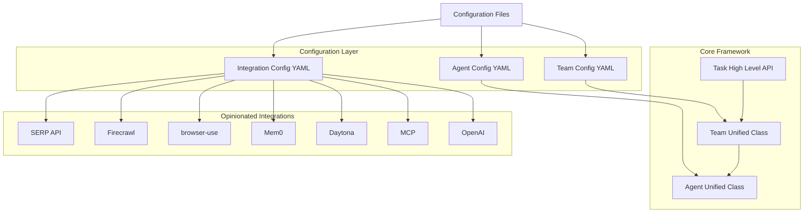

# Configuration-Based Design

The Roboco framework provides a flexible, configuration-based approach to defining and creating teams of AI agents using our unified architecture. This document explains how to use declarative configuration to create agent teams without writing specialized code, leveraging our opinionated integrations and simplified Agent/Team classes.

## Overview

The configuration-based system consists of three main components:

1. **Agent Configuration**: YAML files defining individual agent properties, roles, and capabilities
2. **Team Configuration**: YAML files defining team composition, collaboration patterns, and workflows
3. **Integration Configuration**: Settings for our opinionated best-in-class integrations

This approach offers several advantages:

- Create and modify teams through simple YAML configuration
- Share and version team configurations as declarative files
- Leverage opinionated integrations with minimal setup
- Experiment with different team compositions without code changes
- Type-safe configuration with validation and error checking

## Architecture Integration

Our configuration system works seamlessly with the unified architecture:

**Architecture Pattern**: `Task → Team → Agent → (Chat, Tool, Memory, Event)`



## Directory Structure

```
roboco/
├── config/
│   ├── agents/                 # Agent configuration files
│   │   ├── researcher.yaml
│   │   ├── writer.yaml
│   │   └── executor.yaml
│   ├── teams/                  # Team configuration files
│   │   ├── research_team.yaml
│   │   └── writing_team.yaml
│   ├── integrations/           # Integration configurations
│   │   ├── web_tools.yaml
│   │   ├── memory.yaml
│   │   └── execution.yaml
│   └── prompts/                # System message templates
│       ├── researcher.md
│       ├── writer.md
│       └── executor.md
└── src/
    └── roboco/
        ├── core/
        │   ├── agent.py        # Unified Agent class
        │   ├── team.py         # Unified Team class
        │   └── task.py         # High-level Task API
        └── config/             # Configuration loading
            └── loader.py
```

## Agent Configuration

Agent configurations define individual agent properties using our unified Agent class:

### Basic Agent Configuration

```yaml
# config/agents/researcher.yaml
name: "researcher"
role: "assistant" # assistant, user, system

# System message (can reference template file)
system_message: |
  You are a research specialist with expertise in AI and technology trends.
  Use web search and content extraction to gather comprehensive information.
  Always cite your sources and provide detailed analysis.

# Alternative: Reference template file
# system_message_template: "prompts/researcher.md"
# template_variables:
#   expertise_area: "AI and technology"
#   research_depth: "comprehensive"

# LLM Configuration
llm_config:
  model: "gpt-4o"
  temperature: 0.7
  max_tokens: 4000
  timeout: 30

# Tool Configuration (opinionated defaults)
tools:
  - "search" # SERP API web search
  - "web_extraction" # Firecrawl content extraction
  - "memory" # Mem0 intelligent memory

# Memory Configuration
memory_config:
  provider: "mem0"
  max_memories: 1000
  cleanup_threshold: 0.3
  auto_cleanup: true

# Event Configuration
events:
  emit_message_events: true
  emit_tool_events: true
  emit_memory_events: true
```

### Code Execution Agent

```yaml
# config/agents/executor.yaml
name: "executor"
role: "user" # User role for human interaction + code execution

system_message: |
  You are a code execution specialist. You can run Python code, 
  interact with users, and handle file operations safely.

# Human interaction settings
human_input_mode: "ALWAYS" # ALWAYS, NEVER, TERMINATE

# Code execution with Daytona
code_execution: true
execution_config:
  provider: "daytona"
  timeout: 30
  memory_limit: "512MB"
  cpu_limit: "1.0"
  allowed_languages: ["python", "bash"]

# Full tool access
tools: ["all"]

# Workspace configuration
workspace_config:
  path: "/workspaces/executor"
  max_size: "1GB"
  allowed_extensions: [".py", ".txt", ".md", ".json", ".csv"]
```

### System Agent

```yaml
# config/agents/coordinator.yaml
name: "coordinator"
role: "system" # System role for automated coordination

system_message: |
  You are a team coordinator. Monitor team progress, 
  manage handoffs, and ensure tasks are completed efficiently.

# System agents typically don't need LLM calls
llm_config: null

# Limited tool access
tools:
  - "memory"
  - "basic"

# Event handling for coordination
event_handlers:
  - event: "team.speaker_selected"
    action: "log_speaker_change"
  - event: "task.completed"
    action: "archive_results"
```

## Team Configuration

Team configurations define collaboration patterns using our unified Team class:

### Research Team Example

```yaml
# config/teams/research_team.yaml
name: "research_team"
description: "AI research and analysis team"

# Agent composition
agents:
  - "researcher" # References config/agents/researcher.yaml
  - "writer" # References config/agents/writer.yaml
  - "executor" # References config/agents/executor.yaml

# Collaboration settings
speaker_selection_method: "auto" # auto, round_robin, manual
max_round: 10
termination_condition: "TERMINATE"

# Team-level memory sharing
shared_memory: true
memory_namespace: "research_team"

# Team events
events:
  emit_speaker_events: true
  emit_termination_events: true
  log_conversations: true

# Integration overrides (optional)
integrations:
  search: "serp"
  web_extraction: "firecrawl"
  memory: "mem0"
  execution: "daytona"
```

### Sequential Workflow Team

```yaml
# config/teams/sequential_team.yaml
name: "sequential_workflow"
description: "Sequential processing team"

agents:
  - "planner"
  - "researcher"
  - "writer"
  - "reviewer"

# Sequential speaker selection
speaker_selection_method: "round_robin"
speaker_transitions:
  - from: "planner"
    to: "researcher"
    condition: "plan_approved"
  - from: "researcher"
    to: "writer"
    condition: "research_complete"
  - from: "writer"
    to: "reviewer"
    condition: "draft_ready"
  - from: "reviewer"
    to: "planner"
    condition: "revision_needed"

max_round: 20
termination_condition: "reviewer_approved"
```

## Integration Configuration

Configure our opinionated integrations:

### Web Tools Configuration

```yaml
# config/integrations/web_tools.yaml
search:
  provider: "serp"
  api_key: "${SERP_API_KEY}"
  default_results: 10
  rate_limit: "100/hour"

web_extraction:
  provider: "firecrawl"
  api_key: "${FIRECRAWL_API_KEY}"
  default_format: "markdown"
  include_links: true
  wait_for_js: true
  rate_limit: "1000/hour"

browser_automation:
  provider: "browser-use"
  headless: true
  max_steps: 10
  screenshot: true
  timeout: 30
```

### Memory Configuration

```yaml
# config/integrations/memory.yaml
provider: "mem0"
api_key: "${MEM0_API_KEY}"

# Global memory settings
global_config:
  embedding_model: "text-embedding-3-small"
  vector_store: "qdrant"
  graph_store: "neo4j"

# Per-agent memory limits
agent_limits:
  default:
    max_memories: 1000
    cleanup_threshold: 0.3
  researcher:
    max_memories: 2000 # Researchers need more memory
    cleanup_threshold: 0.2
  executor:
    max_memories: 500 # Executors need less memory
    cleanup_threshold: 0.4
```

### Code Execution Configuration

```yaml
# config/integrations/execution.yaml
provider: "daytona"
api_key: "${DAYTONA_API_KEY}"

# Default execution settings
default_config:
  timeout: 30
  memory_limit: "512MB"
  cpu_limit: "1.0"
  disk_limit: "100MB"

# Language-specific settings
languages:
  python:
    timeout: 60
    memory_limit: "1GB"
    allowed_packages: ["pandas", "numpy", "matplotlib", "requests"]
  bash:
    timeout: 10
    memory_limit: "256MB"
    restricted_commands: ["rm -rf", "sudo", "chmod +x"]

# Security settings
security:
  network_access: true
  internet_domains:
    - "api.openai.com"
    - "api.serp.com"
    - "api.firecrawl.dev"
  file_access: "workspace_only"
```

## System Message Templates

Use Jinja2 templates for dynamic system messages:

### Researcher Template

```jinja2
{# config/prompts/researcher.md #}
You are a {{ expertise_level }} research specialist with deep knowledge in {{ domain }}.

Your primary responsibilities:
- Conduct thorough research using web search and content extraction
- Analyze information for accuracy and relevance
- Provide detailed citations and source attribution
- Synthesize findings into clear, actionable insights

Research Guidelines:
- Always verify information from multiple sources
- Focus on {{ research_focus }} when gathering information
- Use recent sources (within {{ recency_threshold }} months when possible)
- Maintain objectivity and highlight any potential biases


Available Tools:

- {{ tool.name }}: {{ tool.description }}



Current Research Context:
- Project: {{ project_name }}
- Target Audience: {{ target_audience }}
- Research Depth: {{ research_depth }}

Remember to store important findings in memory for team collaboration.
```

### Agent Configuration with Template

```yaml
# config/agents/researcher.yaml
name: "researcher"
role: "assistant"

# Reference template with variables
system_message_template: "prompts/researcher.md"
template_variables:
  expertise_level: "senior"
  domain: "artificial intelligence and machine learning"
  research_focus: "practical applications and industry trends"
  recency_threshold: 12
  project_name: "AI Market Analysis"
  target_audience: "technical executives"
  research_depth: "comprehensive"

llm_config:
  model: "gpt-4o"
  temperature: 0.7

tools:
  - "search"
  - "web_extraction"
  - "memory"
```

## Configuration Loading and Usage

### Programmatic Usage

```python
from roboco.config import load_agent_config, load_team_config, create_team_from_config

# Load individual agent
agent_config = load_agent_config("config/agents/researcher.yaml")
researcher = Agent.from_config(agent_config)

# Load and create team
team_config = load_team_config("config/teams/research_team.yaml")
team = create_team_from_config(team_config)

# Execute team task
result = await team.run(
    message="Research the latest trends in AI agent frameworks",
    sender=researcher
)
```

### High-Level Task API

```python
from roboco.core import Task

# Create task from configuration
task = Task.from_config("config/teams/research_team.yaml")

# Execute with simple interface
result = await task.run("Research AI agent market trends and write a report")

print(f"Task completed: {result.success}")
print(f"Output: {result.output}")
print(f"Files created: {result.files}")
```

### CLI Usage

```bash
# Create team from configuration
roboco create-team --config config/teams/research_team.yaml

# Run task with team
roboco run --team research_team --message "Research AI trends"

# Validate configuration
roboco validate --config config/teams/research_team.yaml

# List available configurations
roboco list-configs
```

## Configuration Validation

### Schema Validation

```python
# Automatic validation on load
from roboco.config import ConfigValidator

validator = ConfigValidator()

# Validate agent configuration
agent_errors = validator.validate_agent_config("config/agents/researcher.yaml")
if agent_errors:
    print(f"Agent config errors: {agent_errors}")

# Validate team configuration
team_errors = validator.validate_team_config("config/teams/research_team.yaml")
if team_errors:
    print(f"Team config errors: {team_errors}")
```

### Configuration Schema

```yaml
# Agent configuration schema
agent_schema:
  required: ["name", "role"]
  properties:
    name:
      type: string
      pattern: "^[a-zA-Z0-9_]+$"
    role:
      type: string
      enum: ["assistant", "user", "system"]
    system_message:
      type: string
      minLength: 10
    llm_config:
      type: object
      properties:
        model:
          type: string
          enum: ["gpt-4o", "gpt-4", "gpt-3.5-turbo"]
        temperature:
          type: number
          minimum: 0.0
          maximum: 2.0
    tools:
      type: array
      items:
        type: string
        enum: ["search", "web_extraction", "memory", "basic", "all"]
```

## Environment Configuration

### Environment Variables

```bash
# API Keys for integrations
export OPENAI_API_KEY="sk-..."
export SERP_API_KEY="..."
export FIRECRAWL_API_KEY="fc-..."
export MEM0_API_KEY="..."
export DAYTONA_API_KEY="..."

# Configuration paths
export ROBOCO_CONFIG_PATH="/path/to/config"
export ROBOCO_WORKSPACE_PATH="/path/to/workspace"

# Integration settings
export ROBOCO_SEARCH_PROVIDER="serp"
export ROBOCO_MEMORY_PROVIDER="mem0"
export ROBOCO_EXECUTION_PROVIDER="daytona"
```

### Configuration Precedence

1. **Environment Variables**: Highest priority
2. **Configuration Files**: Medium priority
3. **Default Values**: Lowest priority

```python
# Configuration loading with precedence
config = {
    "search_provider": os.getenv("ROBOCO_SEARCH_PROVIDER", config_file.get("search_provider", "serp")),
    "api_key": os.getenv("SERP_API_KEY", config_file.get("api_key")),
    "max_results": int(os.getenv("SERP_MAX_RESULTS", config_file.get("max_results", 10)))
}
```

## Best Practices

### 1. Configuration Organization

```
config/
├── environments/
│   ├── development.yaml
│   ├── staging.yaml
│   └── production.yaml
├── agents/
│   ├── base/               # Base configurations
│   │   ├── assistant.yaml
│   │   └── user.yaml
│   └── specialized/        # Specialized agents
│       ├── researcher.yaml
│       └── writer.yaml
├── teams/
│   ├── research/
│   │   ├── basic.yaml
│   │   └── advanced.yaml
│   └── writing/
│       └── collaborative.yaml
└── integrations/
    ├── development.yaml
    └── production.yaml
```

### 2. Template Reuse

```yaml
# Base agent template
base_assistant: &base_assistant
  role: "assistant"
  llm_config:
    model: "gpt-4o"
    temperature: 0.7
  tools:
    - "memory"
    - "basic"

# Specialized agents inherit from base
researcher:
  <<: *base_assistant
  name: "researcher"
  tools:
    - "search"
    - "web_extraction"
    - "memory"

writer:
  <<: *base_assistant
  name: "writer"
  llm_config:
    temperature: 0.8 # Override for more creativity
```

### 3. Environment-Specific Configurations

```yaml
# config/environments/production.yaml
integrations:
  search:
    rate_limit: "1000/hour"
    timeout: 10
  memory:
    max_memories: 5000
    cleanup_threshold: 0.1
  execution:
    timeout: 60
    memory_limit: "2GB"

security:
  workspace_isolation: true
  network_restrictions: true
  audit_logging: true
```

### 4. Configuration Testing

```python
# Test configuration validity
import pytest
from roboco.config import load_team_config, create_team_from_config

def test_research_team_config():
    """Test research team configuration loads correctly."""
    config = load_team_config("config/teams/research_team.yaml")

    assert config.name == "research_team"
    assert len(config.agents) == 3
    assert "researcher" in config.agents

    # Test team creation
    team = create_team_from_config(config)
    assert team.name == "research_team"
    assert len(team.agents) == 3

def test_agent_config_validation():
    """Test agent configuration validation."""
    from roboco.config import ConfigValidator

    validator = ConfigValidator()
    errors = validator.validate_agent_config("config/agents/researcher.yaml")

    assert len(errors) == 0, f"Configuration errors: {errors}"
```

## Migration from Code-Based Approach

### Old Approach (Code-Based)

```python
# Old: Manual agent creation
from roboco.core import Agent, Team, AgentRole

researcher = Agent(
    name="researcher",
    role=AgentRole.ASSISTANT,
    system_message="You are a research specialist...",
    llm_config={"model": "gpt-4o", "temperature": 0.7},
    tools=["search", "web_extraction", "memory"]
)

writer = Agent(
    name="writer",
    role=AgentRole.ASSISTANT,
    system_message="You are a technical writer...",
    llm_config={"model": "gpt-4o", "temperature": 0.8},
    tools=["memory", "basic"]
)

team = Team(
    name="research_team",
    agents=[researcher, writer],
    speaker_selection_method=SpeakerSelectionMethod.AUTO
)
```

### New Approach (Configuration-Based)

```yaml
# New: Declarative configuration
# config/teams/research_team.yaml
name: "research_team"
agents: ["researcher", "writer"]
speaker_selection_method: "auto"
```

```python
# Simple loading
from roboco.config import create_team_from_config

team = create_team_from_config("config/teams/research_team.yaml")
```

## Conclusion

The configuration-based design provides:

**Declarative Simplicity**: Define complex agent teams through simple YAML files without writing code.

**Opinionated Defaults**: Leverage best-in-class integrations (Firecrawl, browser-use, Mem0, Daytona) with minimal configuration.

**Type Safety**: Full validation and error checking ensure configurations are correct before runtime.

**Environment Flexibility**: Easy switching between development, staging, and production configurations.

**Template Power**: Jinja2 templates enable dynamic, reusable system messages and configurations.

**Version Control**: Configuration files can be versioned, shared, and collaborated on like code.

The system transforms agent team creation from complex programming to simple configuration management while maintaining the full power and flexibility of the underlying unified architecture.

```

```
