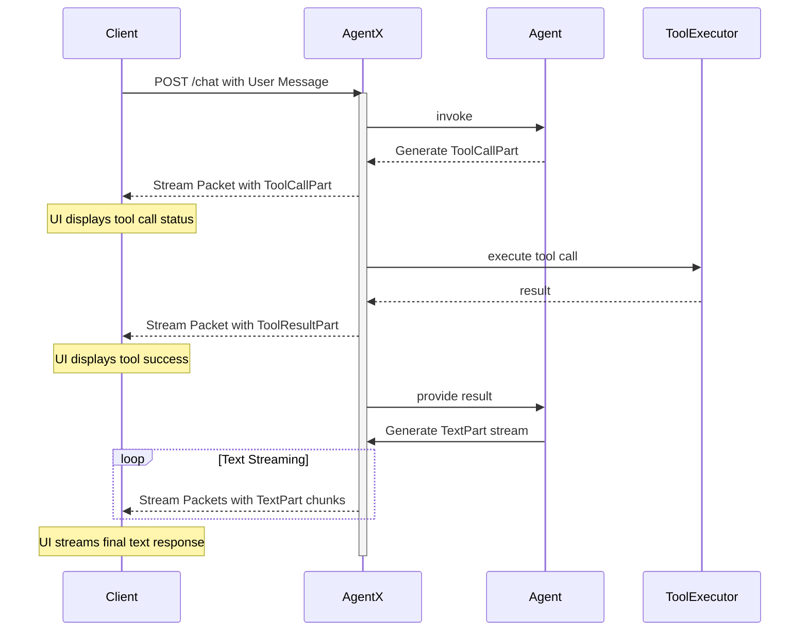

# Communication and Message Architecture

## 1. Core Principles

The communication architecture in AgentX is designed to be robust, extensible, and streamable, drawing inspiration from modern standards like the Vercel AI SDK. The core principles are:

- **Message-Oriented**: The fundamental unit of communication is a `Message`. All interactions, whether from a user, an agent, or a tool, are encapsulated in this structure.
- **Composable Parts**: A `Message` is composed of a list of `Part` objects. This allows for rich, multi-modal content and a clear separation of concerns (e.g., text, tool calls, and tool results all have their own part type).
- **Streaming First**: The entire model is designed for real-time streaming. A `Message` and its `Part`s can be sent incrementally, allowing for responsive user interfaces and efficient data flow.

## 2. The `Message` and `Part` Schema

This section defines the core data structures for communication.

### 2.1. The `Message` Object

A `Message` represents a single entry in the conversation history. It contains a list of `Part` objects that make up its content.

```python
from pydantic import BaseModel, Field
from typing import List, Union, Literal, Dict, Any
import uuid

class Message(BaseModel):
    """
    Represents a single message in the conversation, composed of multiple parts.
    """
    id: str = Field(default_factory=lambda: f"msg_{uuid.uuid4().hex}")
    role: Literal["user", "assistant"]
    parts: List[Union[
        "TextPart",
        "ToolCallPart",
        "ToolResultPart",
        "ToolErrorPart"
    ]]
```

### 2.2. The `Part` Objects

These are the building blocks of a `Message`.

#### `TextPart`

The simplest part, containing a piece of text. During streaming, multiple `TextPart` objects can be sent to represent a continuous flow of text.

```python
class TextPart(BaseModel):
    type: Literal["text"] = "text"
    text: str
```

#### `ToolCallPart`

A structured request from an agent to call a specific tool with a given set of arguments.

```python
class ToolCallPart(BaseModel):
    type: Literal["tool_call"] = "tool_call"
    tool_call_id: str = Field(default_factory=lambda: f"tc_{uuid.uuid4().hex}")
    tool_name: str
    args: Dict[str, Any]
```

#### `ToolResultPart`

The successful result of a tool execution. It is explicitly linked back to the originating call by its `tool_call_id`.

```python
class ToolResultPart(BaseModel):
    type: Literal["tool_result"] = "tool_result"
    tool_call_id: str
    result: Any  # The structured output from the tool
```

#### `ToolErrorPart`

Used when a tool call fails, either due to a validation error or an execution error. This is the key to the self-correction loop.

```python
class ToolErrorPart(BaseModel):
    type: Literal["tool_error"] = "tool_error"
    tool_call_id: str
    error_type: Literal["VALIDATION", "EXECUTION"]
    message: str # A human-readable error message for the LLM
```

## 3. Example Message Flows

### 3.1. Simple Text Conversation

**User Message:**

```json
{
  "role": "user",
  "parts": [{ "type": "text", "text": "Hello, world!" }]
}
```

**Assistant Response (streamed):**

```json
// Stream Packet 1
{ "role": "assistant", "parts": [{ "type": "text", "text": "Hello" }] }
// Stream Packet 2
{ "role": "assistant", "parts": [{ "type": "text", "text": " there!" }] }
```

### 3.2. Successful Tool Call Flow

This example shows the full lifecycle, from the agent requesting a tool to receiving the result.

**1. Assistant requests a tool call:**
The agent's message contains both explanatory text and a `ToolCallPart`.

```json
{
  "role": "assistant",
  "parts": [
    {
      "type": "text",
      "text": "Sure, I can write that file for you. I will now call the tool."
    },
    {
      "type": "tool_call",
      "tool_call_id": "tc_123",
      "tool_name": "write_file",
      "args": { "path": "/hello.txt", "content": "Hello, world!" }
    }
  ]
}
```

**2. The system provides the tool result:**
A new message is created containing the `ToolResultPart`. This is sent back to the agent for its next reasoning step.

```json
{
  "role": "assistant",
  "parts": [
    {
      "type": "tool_result",
      "tool_call_id": "tc_123",
      "result": { "status": "success", "message": "File written successfully." }
    }
  ]
}
```

**3. The agent generates its final response:**
After receiving the result, the agent formulates its final answer.

```json
{
  "role": "assistant",
  "parts": [
    {
      "type": "text",
      "text": "I have successfully written the file to `/hello.txt`."
    }
  ]
}
```

### 3.3. Tool Call with Self-Correction (Validation Error)

This flow demonstrates how `ToolErrorPart` enables the agent to fix its own mistakes.

**1. Assistant makes a malformed tool call (missing `path`):**

```json
{
  "role": "assistant",
  "parts": [
    {
      "type": "tool_call",
      "tool_call_id": "tc_456",
      "tool_name": "write_file",
      "args": { "content": "This call is missing the path." }
    }
  ]
}
```

**2. The `Orchestrator` returns a `ToolErrorPart`:**
Instead of executing the tool, the system provides a structured validation error.

```json
{
  "role": "assistant",
  "parts": [
    {
      "type": "tool_error",
      "tool_call_id": "tc_456",
      "error_type": "VALIDATION",
      "message": "Validation failed for tool 'write_file': Missing required argument 'path'."
    }
  ]
}
```

**3. The agent receives the error and provides a corrected call:**
The error message is now part of the agent's context. Its `Brain` sees the mistake and generates a valid call in the next turn.

```json
{
  "role": "assistant",
  "parts": [
    {
      "type": "text",
      "text": "My apologies, I missed a required parameter. I will correct it now."
    },
    {
      "type": "tool_call",
      "tool_call_id": "tc_789",
      "tool_name": "write_file",
      "args": {
        "path": "/corrected.txt",
        "content": "This call should now be valid."
      }
    }
  ]
}
```

This new message now proceeds down the successful tool call path.

## 4. Streaming and Progressive Responses

To build a truly responsive UI, a client needs to be aware of the agent's progress throughout its turn, not just at the end. This is especially important for multi-step operations like tool calls. AgentX achieves this by streaming a sequence of `Message` updates for a single logical turn.

### 4.1. The Streaming Protocol

The client should not assume a single request will yield a single response. Instead, it should be prepared to receive multiple, distinct `Message` objects over the same streaming connection. Each object provides a real-time snapshot of the agent's activity.

The following sequence diagram illustrates how a client receives progressive updates during a tool call.



### 4.2. Example Streamed Packets

Here is what the client would see for the successful tool call flow from section 3.2, but as a real-time stream.

**1. Client sends a request:**
`POST /chat` with a user message asking to write a file.

**2. AgentX streams back the agent's decision to call the tool:**
The UI can immediately show that a tool is being used.

```json
{
  "role": "assistant",
  "id": "msg_abc",
  "parts": [
    {
      "type": "tool_call",
      "tool_call_id": "tc_123",
      "tool_name": "write_file",
      "args": { "path": "/hello.txt", "content": "Hello, world!" }
    }
  ]
}
```

**3. AgentX streams the result of the tool execution:**
The UI knows the tool call has completed successfully _before_ the agent has formulated its final textual response.

```json
{
  "role": "assistant",
  "id": "msg_abc",
  "parts": [
    {
      "type": "tool_result",
      "tool_call_id": "tc_123",
      "result": { "status": "success", "message": "File written successfully." }
    }
  ]
}
```

**4. AgentX streams the final text response, token by token:**
The `id` field links these text chunks back to the same logical message.

```json
// Packet 1
{ "role": "assistant", "id": "msg_abc", "parts": [{ "type": "text", "text": "I have" }] }
// Packet 2
{ "role": "assistant", "id": "msg_abc", "parts": [{ "type": "text", "text": " successfully" }] }
// Packet 3
{ "role": "assistant", "id": "msg_abc", "parts": [{ "type": "text", "text": " written the file." }] }
```

This progressive, part-based streaming model gives a UI all the information it needs to render a rich, real-time view of the agent's work.
