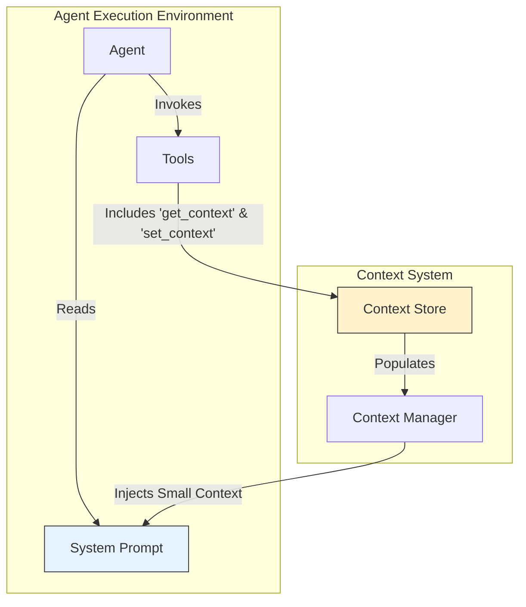

# Context Management Architecture

## 1. Overview

Effective context management is critical for multi-agent systems, as it enables stateful, coordinated, and efficient task execution. This document specifies RoboCo's hybrid context management architecture, designed to provide agents with seamless access to information while optimizing for performance and cost.

The architecture addresses two primary challenges:

- **Context Window Limitations**: Providing access to information that exceeds the token limits of LLM prompts.
- **State Persistence**: Enabling agents to record and retrieve progress, ensuring tasks are resumable and fault-tolerant.

## 2. Architectural Design

RoboCo employs a hybrid model that intelligently distributes context between two primary mechanisms: direct injection and on-demand retrieval.



- **Context Store**: A key-value persistence layer for all session-related information.
- **Context Manager**: A system component responsible for assembling agent prompts and making tools available.
- **Direct Injection**: Small, critical context variables are rendered directly into the agent's system prompt using the Jinja2 templating engine.
- **On-Demand Retrieval**: Large or volatile context is accessed by the agent at runtime via dedicated tools (`get_context`, `set_context`).

## 3. Core Components

### 3.1. The Context Store

The Context Store is an abstraction over a namespaced key-value database. Its design supports multiple backends to suit different operational needs:

- **In-Memory**: For single-session, transient workflows.
- **File-Based/Redis**: For multi-session, persistent operations where state must be preserved.

All keys are automatically namespaced by `session_id` to ensure strict data isolation between concurrent conversations.

### 3.2. Templated System Prompts

System prompts are constructed using Jinja2, the standard templating engine for RoboCo. This allows for dynamic and logic-driven prompt assembly.

**Design Rationale**: Jinja2 is chosen for its rich feature set (conditionals, loops), security (sandboxing, auto-escaping), and seamless integration with the Python ecosystem.

```python
# Example of a context-aware prompt template
prompt_template = env.from_string("""
As a {{agent_role}}, your task is to complete the '{{task_name}}' section.

**Project Overview**: {{project_summary}}


**Completed Work**: The following sections are done: {{ previously_completed_sections | join(', ') }}.
Don't repeat work on these sections unless explicitly asked.


To see the full content of a fetched source, use `get_context(key='source_document_X')`.
""")
```

### 3.3. Context-Aware Tools

Agents interact with the Context Store through a set of built-in tools. This approach makes context interaction an explicit, observable, and controllable action.

#### `get_context(key: str) -> str`

Retrieves a value from the Context Store. This is the primary mechanism for accessing large documents, fetched data, or complex state that does not fit in the prompt.

#### `set_context(key: str, value: Any)`

Writes or updates a value in the Context Store. This is critical for agents to record their progress. For example, an agent can save a list of fetched URLs or a newly written document section.

## 4. Operational Principles

### 4.1. Context Lifecycle

1.  **Initialization**: A new Context Store namespace is created at the start of a session.
2.  **Enrichment**: As agents execute tools (e.g., web search), the results are stored in the context via `set_context`.
3.  **Consumption**: Agents read from the context via prompt injection or `get_context` to inform their next actions.
4.  **Termination**: The context is archived or destroyed when the session concludes.

### 4.2. Agent Awareness

Agents are designed to be "context-aware" through carefully crafted instructions in their system prompts. The prompt guides the agent on _when_ and _how_ to use the context tools, turning context management into a solvable part of the agent's reasoning process.

### 4.3. Security and Isolation

- **Namespacing**: All context is strictly partitioned by `session_id`. Agents have no access to the context of other sessions.
- **Access Control**: Future extensions may include read-only keys or role-based access to specific parts of the context, further securing the system.

## 5. Quality Attributes

- **Efficiency**: Minimizes LLM token usage by keeping large data out of prompts.
- **Resilience**: Storing state in the context allows for the resumption of interrupted tasks.
- **Observability**: Tool-based context interactions are explicit events that can be logged and monitored.
- **Maintainability**: Decouples agent logic from the context persistence mechanism.
