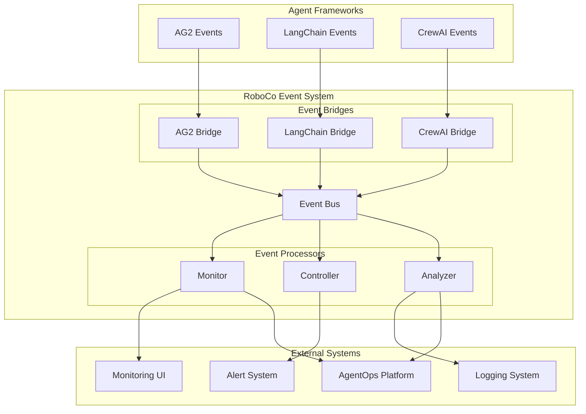

# Event System Architecture

## 1. Overview

The Event System serves as the central nervous system of the RoboCo framework, providing unified observability and control across all agent activities. The system follows a publish-subscribe architecture that decouples event producers from consumers, enabling real-time monitoring, debugging, and dynamic intervention capabilities.

## 2. Design Goals

### 2.1 Core Objectives

- **Unified Observability**: Provide a single view of all system activities regardless of underlying agent frameworks
- **Framework Agnostic**: Support any agent framework (AG2, LangChain, CrewAI) through standardized event translation
- **Real-time Control**: Enable dynamic intervention and workflow modification during execution
- **Performance Monitoring**: Collect comprehensive metrics for system optimization
- **Extensibility**: Allow easy addition of new event types and handlers

### 2.2 Non-Goals

- Replace existing agent framework event systems
- Provide synchronous request-response communication
- Store long-term event data (delegated to external systems)

## 3. Architectural Design

### 3.1 High-Level Architecture



### 3.2 Component Responsibilities

#### Event Bus

- **Purpose**: Central message broker for all system events
- **Responsibilities**: Route events between producers and consumers, maintain subscriptions
- **Design**: Asynchronous, topic-based routing with wildcard support

#### Event Bridges

- **Purpose**: Translate framework-specific events into RoboCo's unified event schema
- **Responsibilities**: Event normalization, metadata enrichment, error handling
- **Design**: Pluggable adapters for each supported framework

#### Event Processors

- **Monitor**: Real-time collaboration tracking and performance metrics
- **Controller**: Dynamic workflow control through event injection
- **Analyzer**: Pattern detection and performance analysis

## 4. Event Schema Design

### 4.1 Unified Event Structure

All events follow a standardized schema regardless of their origin:

```json
{
  "eventId": "uuid",
  "timestamp": "ISO8601",
  "sessionId": "uuid",
  "source": "component.subcomponent",
  "eventType": "domain.action.state",
  "payload": {
    "domain-specific": "data"
  }
}
```

### 4.2 Event Taxonomy

#### Collaboration Events

- `collaboration.started` - Team collaboration begins
- `collaboration.paused` - Collaboration temporarily halted
- `collaboration.completed` - Collaboration finished successfully
- `collaboration.failed` - Collaboration terminated due to error

#### Agent Events

- `agent.message.sent` - Agent sends message to another agent
- `agent.message.received` - Agent receives message
- `agent.decision.made` - Agent makes a decision point
- `agent.error.occurred` - Agent encounters an error

#### Tool Events

- `tool.call.initiated` - Tool execution begins
- `tool.call.completed` - Tool execution finishes
- `tool.call.failed` - Tool execution fails

#### Context Events

- `context.updated` - Context store modified
- `context.accessed` - Context data retrieved

## 5. Framework Integration Strategy

### 5.1 Bridge Pattern

Each supported agent framework requires a dedicated bridge component that:

1. **Subscribes** to the framework's native event system
2. **Translates** framework events to RoboCo's unified schema
3. **Enriches** events with additional metadata (session tracking, performance metrics)
4. **Publishes** normalized events to the RoboCo event bus

### 5.2 Translation Mapping

| Framework Event         | RoboCo Event          | Notes                       |
| ----------------------- | --------------------- | --------------------------- |
| AG2 TextEvent           | agent.message.sent    | Map sender/recipient        |
| AG2 ToolCallEvent       | tool.call.initiated   | Extract tool name/args      |
| LangChain on_tool_start | tool.call.initiated   | Different payload structure |
| CrewAI task_started     | collaboration.started | Map to collaboration scope  |

### 5.3 Framework Independence

The event system maintains framework independence through:

- **Abstraction Layer**: RoboCo events hide framework implementation details
- **Consistent Interface**: Same event types across all frameworks
- **Pluggable Bridges**: Add new frameworks without core system changes

## 6. Observability Design

### 6.1 Real-time Monitoring

The system provides multiple observability layers:

#### Session Tracking

- Track collaboration lifecycle from start to completion
- Monitor active sessions and their current state
- Correlate events across the collaboration timeline

#### Performance Metrics

- Tool execution times and success rates
- Agent response latencies
- System resource utilization
- Error rates and patterns

#### Activity Visualization

- Real-time event streams for live monitoring
- Historical event replay for debugging
- Collaboration flow diagrams

### 6.2 Metrics Collection Strategy

**Push Model**: Components actively emit events rather than being polled
**Structured Data**: All metrics embedded in event payloads
**Time-series Ready**: Events designed for time-series database ingestion
**Correlation**: Session and trace IDs for event correlation

## 7. Control Plane Design

### 7.1 Bidirectional Communication

The event bus supports both outbound observability and inbound control:

#### Outbound (Observability)

- System components publish events about their activities
- External systems consume events for monitoring and analysis

#### Inbound (Control)

- External systems publish control events
- System components subscribe to control events and modify behavior

### 7.2 Control Event Types

#### Workflow Control

- `control.collaboration.pause` - Halt collaboration execution
- `control.collaboration.resume` - Resume paused collaboration
- `control.collaboration.terminate` - Force stop collaboration

#### Agent Control

- `control.agent.override` - Override agent's next action
- `control.agent.redirect` - Change agent's current focus
- `control.agent.inject_guidance` - Provide human guidance

#### System Control

- `control.system.scale` - Adjust system resources
- `control.system.failover` - Switch to backup systems

### 7.3 Safety Mechanisms

**Event Validation**: All control events validated before processing
**Permission Checks**: Control events require appropriate authorization
**Circuit Breakers**: Prevent control event storms
**Audit Trail**: All control actions logged for accountability

## 8. Performance Considerations

### 8.1 Scalability Design

#### Asynchronous Processing

- Non-blocking event publishing and consumption
- Buffered event queues to handle traffic spikes
- Backpressure handling to prevent system overload

#### Event Batching

- Group related events for efficient processing
- Configurable batch sizes based on system load
- Time-based and count-based batching strategies

#### Resource Management

- Memory-bounded event queues
- Configurable event retention policies
- Automatic cleanup of completed sessions

### 8.2 Reliability Design

#### Event Durability

- Optional event persistence for critical events
- Configurable retention periods
- Integration with external event stores

#### Fault Tolerance

- Graceful degradation when event system unavailable
- Retry mechanisms for failed event deliveries
- Dead letter queues for unprocessable events

## 9. Security Considerations

### 9.1 Event Content Security

**Sensitive Data Handling**: Events may contain sensitive information requiring protection
**Payload Sanitization**: Remove or mask sensitive data before event publishing
**Encryption**: Encrypt event payloads when containing confidential information

### 9.2 Access Control

**Consumer Authorization**: Verify consumers have permission to access specific event types
**Producer Authentication**: Validate event sources to prevent spoofing
**Control Event Security**: Strict authorization for control events affecting system behavior

## 10. Scenario Study: Dynamic Human Intervention

### 10.1 Scenario Overview

During a collaborative writing task, a human supervisor observes the team's progress in real-time and identifies quality issues that require immediate course correction. The system must dynamically adjust the ongoing collaboration based on human feedback.

### 10.2 Concrete Example: Writing Quality Control

**Initial State**: A research team (PlannerAgent, ResearcherAgent, WriterAgent, ReviewerAgent) is producing a technical report. The collaboration is 60% complete when the human supervisor reviews the current draft.

**Human Observation**:

- "Section 3 is only 800 words but should be at least 4000 words"
- "The analysis lacks depth - need 3 more technical diagrams"
- "Sources are insufficient - require at least 10 peer-reviewed papers"

### 10.3 Event Flow Sequence

#### Phase 1: Real-time Observation

```
1. collaboration.progress.updated
   → sessionId: "collab_001"
   → payload: { section: "section_3", wordCount: 800, status: "draft_complete" }

2. content.quality.assessed
   → source: "HumanSupervisor"
   → payload: { section: "section_3", qualityScore: 3/10, issues: [...] }
```

#### Phase 2: Human Intervention

```
3. control.collaboration.pause
   → source: "HumanSupervisor"
   → payload: { reason: "quality_review", sessionId: "collab_001" }

4. control.requirements.updated
   → payload: {
       section: "section_3",
       newRequirements: {
         minWordCount: 4000,
         requiredDiagrams: 3,
         minSources: 10,
         sourceTypes: ["peer-reviewed"]
       }
     }
```

#### Phase 3: Dynamic Workflow Adjustment

```
5. orchestration.workflow.modified
   → payload: {
       addedTasks: [
         "research.additional_sources",
         "content.diagram_creation",
         "writing.section_expansion"
       ],
       modifiedAgents: ["ResearcherAgent", "WriterAgent"]
     }

6. agent.instructions.updated
   → target: "ResearcherAgent"
   → payload: {
       newObjective: "Find 7 additional peer-reviewed sources for Section 3",
       priority: "high"
     }
```

#### Phase 4: Collaborative Re-execution

```
7. collaboration.resumed
   → payload: { modifiedWorkflow: true, newRequirements: {...} }

8. tool.call.initiated
   → agent: "ResearcherAgent"
   → tool: "academic_search"
   → payload: { query: "technical analysis methodology", limit: 10 }

9. content.updated
   → section: "section_3"
   → payload: { wordCount: 4200, diagramCount: 3, sourceCount: 12 }
```

### 10.4 System Requirements

#### Event System Requirements

- **Real-time Event Streaming**: Low-latency event delivery to human interfaces
- **Bidirectional Communication**: Support both observability and control events
- **Event Correlation**: Link control events to specific collaboration sessions
- **Event Validation**: Ensure control events are authorized and well-formed

#### Orchestration System Requirements

- **Pauseable Workflows**: Ability to halt collaboration at any point
- **Dynamic Reconfiguration**: Modify agent instructions and workflow steps during execution
- **State Preservation**: Maintain collaboration context during intervention
- **Incremental Execution**: Resume from pause point with new requirements

### 10.5 Technical Challenges

#### State Management

- **Collaboration Checkpointing**: Save workflow state before accepting control events
- **Rollback Capability**: Ability to revert changes if intervention fails
- **Context Continuity**: Ensure agents understand requirement changes in context

#### Event Ordering

- **Control Event Priority**: Control events must preempt normal workflow events
- **Dependency Resolution**: New requirements may create task dependencies
- **Conflict Resolution**: Handle conflicting requirements from multiple supervisors

#### Human-AI Interface

- **Intuitive Controls**: Simple interface for non-technical supervisors
- **Real-time Feedback**: Immediate confirmation of control event reception
- **Impact Visualization**: Show how changes will affect workflow completion

### 10.6 Architecture Implications

This scenario reveals additional architectural requirements:

#### Enhanced Event Bus

- **Priority Queues**: Control events need higher priority than standard events
- **Event Filtering**: Supervisors need filtered views of relevant events only
- **Real-time Subscriptions**: WebSocket connections for immediate event delivery

#### Workflow Engine Integration

- **Dynamic DAG Modification**: Workflow graphs must support runtime changes
- **Agent State Synchronization**: Ensure all agents understand new requirements
- **Resource Reallocation**: Adjust computational resources for modified workflows

#### Monitoring Dashboard

- **Live Collaboration View**: Real-time visualization of agent activities
- **Intervention Controls**: User-friendly controls for workflow modification
- **Impact Simulation**: Preview effects of proposed changes before applying

This scenario demonstrates how the event system enables sophisticated human-AI collaboration where humans can actively guide and correct AI workflows in real-time, rather than just observing them passively.

## 11. Future Extensions

### 10.1 Planned Enhancements

#### Event Analytics

- Machine learning on event patterns
- Predictive failure detection
- Performance optimization recommendations

#### External Integrations

- OpenTelemetry compatibility
- Prometheus metrics export
- Grafana dashboard templates

#### Advanced Control

- Conditional event routing
- Event transformation pipelines
- Complex event processing (CEP)

### 10.2 Extensibility Points

The system design supports future extensions through:

- **Plugin Architecture**: Easy addition of new event processors
- **Schema Evolution**: Backward-compatible event schema updates
- **Custom Bridges**: Support for proprietary agent frameworks
- **Integration APIs**: REST and WebSocket APIs for external systems
