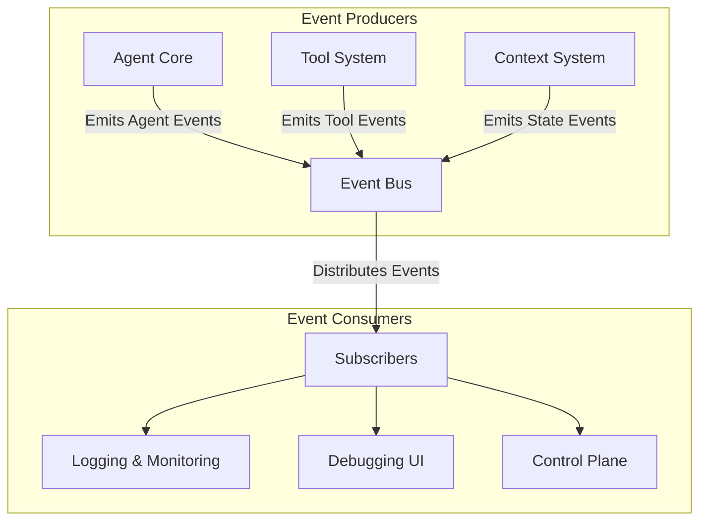

# RoboCo: Event System Architecture

## 1. Overview

The Event System is the central nervous system of the RoboCo framework, providing a unified mechanism for observability and control. It is designed as a publish-subscribe bus that allows components to emit and consume structured events, enabling real-time monitoring, debugging, and dynamic intervention in agent workflows.

## 2. Architectural Design

The architecture is centered around a central **Event Bus**, which decouples event producers from consumers.



-   **Event Producers**: Core framework components (Agent, Tool, Context) that generate events based on their activities.
-   **Event Bus**: A message broker that receives all events and routes them to interested subscribers.
-   **Event Consumers**: Services that listen for specific events to perform actions like logging, updating a UI, or intervening in the workflow.

## 3. Event Schema

All events adhere to a standardized JSON schema to ensure consistency and facilitate automated processing. Each event contains a header and a payload.

-   **Header**: Contains metadata common to all events.
-   **Payload**: Contains data specific to the event type.

```json
{
  "eventId": "evt_2a7d-4b8f-9c1e-3e6f",
  "timestamp": "2023-10-27T10:00:00Z",
  "sessionId": "sess_abc123",
  "source": "ToolSystem.ExecutionEngine",
  "eventType": "ToolCallCompleted",
  "payload": {
    "agentName": "ResearchAgent",
    "toolName": "web_search",
    "executionTimeMs": 1250,
    "outputSummary": "Found 5 relevant articles on AI advancements."
  }
}
```

### Key Event Types
-   `AgentMessageSent`: An agent sends a message to another.
-   `ToolCallInitiated`: An agent begins executing a tool.
-   `ToolCallCompleted`: A tool execution finishes (successfully or not).
-   `ContextUpdated`: A value in the Context Store is created or modified.

## 4. System Integration

### Event Out (Observability)
All significant actions within the framework are designed to be event-emitting. This creates a comprehensive audit trail that is invaluable for:
-   **Live Monitoring**: Visualizing the flow of conversation and tool usage in real-time.
-   **Performance Analysis**: Measuring tool execution times and agent response latencies.
-   **Post-Mortem Debugging**: Reconstructing the exact sequence of events that led to an error.

### Event In (Control)
The Event Bus is bidirectional. External systems can inject **Control Events** to influence the workflow. This enables advanced capabilities such as:
-   **Human-in-the-Loop**: A user can pause the system, inspect the current state, and provide guidance to an agent.
-   **Automated Intervention**: A monitoring system could detect a recurring tool failure and inject an event to reroute the task to a different agent or tool.
