# Event System Architecture

## 1. Overview

The Event System provides real-time observability and control across all agent activities in the Roboco framework. Using our unified Brain-powered architecture, the system offers a simplified, efficient approach to monitoring agent thinking, tool executions, and team collaborations through a clean publish-subscribe pattern.

## 2. Design Goals

### 2.1 Core Objectives

- **Unified Observability**: Single view of all agent, Brain, team, and tool activities
- **Real-time Monitoring**: Live tracking of conversations, Brain thinking, decisions, and executions
- **Performance Insights**: Comprehensive metrics for optimization including Brain reasoning performance
- **Simple Integration**: Built into every Agent, Brain, and Team automatically
- **Extensibility**: Easy addition of custom event handlers and processors

### 2.2 Simplified Architecture

Unlike complex multi-framework event systems, Roboco's event system is designed specifically for our unified Brain-powered architecture:

- **Agent-Level Events**: Each agent has its own event bus
- **Brain Events**: Dedicated events for Brain thinking and reasoning processes
- **Global Events**: System-wide event bus for cross-agent monitoring
- **Built-in Integration**: Events automatically emitted by core components including Brain
- **Simple Callbacks**: Function-based event handlers instead of complex async systems

## 3. Architectural Design

### 3.1 High-Level Architecture

```mermaid
graph TB


    subgraph "Team"
        subgraph "Agent 1"
            Agent1
            Brain1[🧠 Brain]
            Tools1[🔧 Tools]
            Memory1[💾 Memory]
            Agent1 --> Brain1
            Agent1 --> Tools1
            Agent1 --> Memory1
        end
        Agent2["Agent 2"]
        Agent3["Agent 3"]
    end

    subgraph "Event System"
        GlobalBus[Event Bus]

        Monitor[Real-time Monitor]
        Logger[Event Logger]
        Metrics[Metrics Collector]
        Debugger[Debug Handler]
    end



    Agent1 --> GlobalBus
    Brain1 --> GlobalBus
    Tools1 --> GlobalBus
    Memory1 --> GlobalBus
    Agent2 --> GlobalBus
    Agent3 --> GlobalBus
    Team --> GlobalBus

    GlobalBus --> Monitor
    GlobalBus --> Logger
    GlobalBus --> Metrics
    GlobalBus --> Debugger
```



### 3.2 Component Responsibilities

#### Global Event Bus

- **Purpose**: Central event coordination across all agents, Brains, and teams
- **Responsibilities**: Route events, manage global subscriptions, emit system events
- **Design**: Simple callback-based system with topic filtering

#### Agent Event Bus

- **Purpose**: Agent-specific event handling and local subscriptions
- **Responsibilities**: Emit agent and Brain events, handle local subscriptions, forward to global bus
- **Design**: Lightweight, synchronous event emission with async handler support

#### Event Handlers

- **Monitor**: Real-time activity tracking and visualization including Brain thinking processes
- **Logger**: Structured event logging for debugging and audit
- **Metrics**: Performance metrics collection and analysis including Brain reasoning metrics
- **Debugger**: Development-time debugging and inspection

## 4. Event Schema Design

### 4.1 Unified Event Structure

All events follow a simple, consistent schema:

```python
@dataclass
class Event:
    id: str
    timestamp: datetime
    source: str          # agent_id, team_id, or "system"
    event_type: str      # "brain.thinking.started", "agent.message.sent", etc.
    data: Dict[str, Any] # Event-specific payload
    session_id: Optional[str] = None
    trace_id: Optional[str] = None
```

### 4.2 Event Types

#### Brain Events

```python
# Brain thinking events
"brain.thinking.started"    # Brain begins thinking process
"brain.thinking.completed"  # Brain completes thinking
"brain.reasoning.trace"     # Brain reasoning step (if enabled)
"brain.tool.orchestrated"   # Brain orchestrates tool usage
"brain.memory.integrated"   # Brain integrates memory into thinking
"brain.response.generated"  # Brain generates response
"brain.error.occurred"      # Brain encounters error

# Brain configuration events
"brain.configured"          # Brain configuration updated
"brain.model.changed"       # Brain LLM model changed
```

#### Agent Events

```python
# Message events
"agent.message.sent"     # Agent sends message
"agent.message.received" # Agent receives message
"agent.decision.made"    # Agent makes decision
"agent.error.occurred"   # Agent encounters error

# Lifecycle events
"agent.created"          # Agent instantiated
"agent.activated"        # Agent becomes active
"agent.deactivated"      # Agent becomes inactive
"agent.reset"            # Agent state reset
```

#### Tool Events

```python
# Tool execution events
"tool.started"           # Tool execution begins
"tool.completed"         # Tool execution completes
"tool.failed"            # Tool execution fails

# Specific tool events
"code.executed"          # Code execution (Daytona)
"web.extracted"          # Web content extraction (Firecrawl)
"browser.automated"      # Browser automation (browser-use)
"search.performed"       # Web search (SERP API)
```

#### Memory Events

```python
# Memory operations
"memory.saved"           # Memory item stored
"memory.searched"        # Memory search performed
"memory.updated"         # Memory item modified
"memory.deleted"         # Memory item removed
"memory.cleaned"         # Memory cleanup performed
```

#### Team Events

```python
# Team collaboration
"team.created"           # Team instantiated
"team.conversation.started"  # Team conversation begins
"team.speaker.selected"  # Speaker selection made
"team.conversation.completed" # Team conversation ends
"team.conversation.terminated" # Team conversation terminated
"team.reset"             # Team state reset
```

#### Task Events

```python
# High-level task events
"task.created"           # Task instantiated
"task.started"           # Task execution begins
"task.completed"         # Task execution completes
"task.failed"            # Task execution fails
"task.status.changed"    # Task status updated
```

## 5. Event Usage Patterns

### 5.1 Global Event Monitoring

```python
from roboco.core import global_events

# Monitor all Brain thinking processes
@global_events.on("brain.thinking.started")
async def log_brain_activity(event):
    print(f"[{event.timestamp}] {event.source} Brain started thinking")

# Monitor Brain reasoning traces
@global_events.on("brain.reasoning.trace")
async def log_reasoning(event):
    if event.data.get('reasoning_enabled'):
        print(f"Brain reasoning: {event.data['reasoning_step']}")

# Monitor all agent messages
@global_events.on("agent.message.sent")
async def log_all_messages(event):
    print(f"[{event.timestamp}] {event.source}: {event.data['content']}")

# Monitor tool executions
@global_events.on("tool.*")  # Wildcard pattern
async def track_tool_usage(event):
    metrics.increment(f"tool.{event.data['tool_name']}.executions")
    metrics.timing(f"tool.{event.data['tool_name']}.duration", event.data.get('duration', 0))

# Monitor team activities
@global_events.on("team.speaker.selected")
async def track_speaker_changes(event):
    print(f"Speaker changed to: {event.data['speaker_name']}")
```

### 5.2 Agent-Level Event Handling

```python
from roboco.core import Agent, AgentRole

# Create agent with event handling
agent = Agent(name="researcher", role=AgentRole.ASSISTANT)

# Agent-specific event handlers
@agent.events.on("tool.completed")
async def handle_tool_completion(event):
    if event.data['tool_name'] == 'web_search':
        # Store search results in memory
        await agent.memory.add(f"Search results: {event.data['result']}")

@agent.events.on("memory.added")
async def track_memory_growth(event):
    memory_count = len(agent.memory.items)
    if memory_count > 1000:
        await agent.memory.cleanup()
```

### 5.3 Team Event Coordination

```python
from roboco.core import Team

team = Team(name="research_team", agents=[researcher, writer, executor])

# Team-level event handling
@team.events.on("speaker.selected")
async def coordinate_handoff(event):
    current_speaker = event.data['speaker']
    previous_speaker = event.data.get('previous_speaker')

    if previous_speaker:
        # Share context between agents
        context = await previous_speaker.memory.search("current task context")
        await current_speaker.memory.add(f"Handoff context: {context}")

@team.events.on("conversation.completed")
async def archive_results(event):
    # Archive conversation and results
    conversation = event.data['conversation']
    await archive_conversation(team.name, conversation)
```

## 6. Built-in Event Handlers

### 6.1 Real-time Monitor

```python
from roboco.events import RealTimeMonitor

# Built-in real-time monitoring
monitor = RealTimeMonitor()

# Start monitoring all events
await monitor.start()

# Access real-time metrics
print(f"Active agents: {monitor.active_agents}")
print(f"Messages per minute: {monitor.message_rate}")
print(f"Tool execution rate: {monitor.tool_rate}")
print(f"Average response time: {monitor.avg_response_time}")
```

### 6.2 Event Logger

```python
from roboco.events import EventLogger

# Structured event logging
logger = EventLogger(
    output_format="json",
    log_level="INFO",
    include_payload=True
)

# Automatic logging of all events
global_events.add_handler("*", logger.log_event)

# Example log output:
# {
#   "timestamp": "2024-01-15T10:30:45Z",
#   "event_type": "agent.message.sent",
#   "source": "researcher",
#   "data": {
#     "content": "I found 10 relevant research papers...",
#     "recipient": "writer",
#     "message_id": "msg_123"
#   }
# }
```

### 6.3 Metrics Collector

```python
from roboco.events import MetricsCollector

# Performance metrics collection
metrics = MetricsCollector()

# Automatic metric collection
global_events.add_handler("tool.*", metrics.collect_tool_metrics)
global_events.add_handler("agent.*", metrics.collect_agent_metrics)

# Access collected metrics
print(f"Tool success rate: {metrics.tool_success_rate}")
print(f"Average tool execution time: {metrics.avg_tool_time}")
print(f"Agent response times: {metrics.agent_response_times}")
```

## 7. Custom Event Handlers

### 7.1 Creating Custom Handlers

```python
from roboco.core import Event

class CustomEventHandler:
    def __init__(self, webhook_url: str):
        self.webhook_url = webhook_url

    async def handle_critical_events(self, event: Event):
        """Handle critical system events."""
        if event.event_type in ["agent.error.occurred", "tool.failed", "task.failed"]:
            await self.send_alert(event)

    async def send_alert(self, event: Event):
        """Send alert to external system."""
        payload = {
            "alert_type": "roboco_error",
            "timestamp": event.timestamp.isoformat(),
            "source": event.source,
            "error": event.data.get("error_message"),
            "context": event.data
        }

        async with httpx.AsyncClient() as client:
            await client.post(self.webhook_url, json=payload)

# Register custom handler
handler = CustomEventHandler("https://alerts.company.com/webhook")
global_events.on("*.error.*", handler.handle_critical_events)
global_events.on("*.failed", handler.handle_critical_events)
```

### 7.2 Event Filtering and Processing

```python
class EventProcessor:
    def __init__(self):
        self.event_buffer = []
        self.processing_interval = 5  # seconds

    async def buffer_events(self, event: Event):
        """Buffer events for batch processing."""
        self.event_buffer.append(event)

        if len(self.event_buffer) >= 100:  # Process in batches
            await self.process_batch()

    async def process_batch(self):
        """Process buffered events."""
        if not self.event_buffer:
            return

        # Analyze event patterns
        patterns = self.analyze_patterns(self.event_buffer)

        # Send to analytics system
        await self.send_to_analytics(patterns)

        # Clear buffer
        self.event_buffer.clear()

    def analyze_patterns(self, events):
        """Analyze event patterns for insights."""
        patterns = {
            "message_frequency": len([e for e in events if "message" in e.event_type]),
            "tool_usage": {},
            "error_rate": len([e for e in events if "error" in e.event_type]) / len(events)
        }

        # Tool usage analysis
        for event in events:
            if event.event_type == "tool.completed":
                tool_name = event.data.get("tool_name")
                if tool_name:
                    patterns["tool_usage"][tool_name] = patterns["tool_usage"].get(tool_name, 0) + 1

        return patterns

# Register event processor
processor = EventProcessor()
global_events.on("*", processor.buffer_events)
```

## 8. Performance and Optimization

### 8.1 Event System Performance

| Component             | Performance Target | Implementation                 |
| --------------------- | ------------------ | ------------------------------ |
| **Event Emission**    | <1ms               | Synchronous callback execution |
| **Event Routing**     | <5ms               | In-memory topic-based routing  |
| **Handler Execution** | <10ms              | Async handler execution        |
| **Global Event Bus**  | 10,000+ events/sec | Efficient callback management  |

### 8.2 Optimization Strategies

**Async Handlers**: Event handlers run asynchronously to avoid blocking
**Selective Subscription**: Subscribe only to needed event types
**Batch Processing**: Buffer events for efficient batch processing
**Memory Management**: Automatic cleanup of old event handlers

```python
# Optimized event handling
@global_events.on("agent.message.sent", max_handlers=100)  # Limit handlers
async def optimized_handler(event):
    # Fast, non-blocking processing
    await asyncio.create_task(process_event_async(event))

# Cleanup old handlers
global_events.cleanup_handlers(max_age=3600)  # Remove handlers older than 1 hour
```

## 9. Integration with Opinionated Tools

### 9.1 Tool-Specific Events

**Daytona Code Execution**:

```python
@global_events.on("code.executed")
async def track_code_execution(event):
    execution_time = event.data['execution_time']
    if execution_time > 5000:  # >5 seconds
        print(f"Slow code execution detected: {execution_time}ms")
```

**Firecrawl Web Extraction**:

```python
@global_events.on("web.extracted")
async def track_web_extraction(event):
    content_size = len(event.data['content'])
    url = event.data['url']
    print(f"Extracted {content_size} chars from {url}")
```

**Mem0 Memory Operations**:

```python
@global_events.on("memory.added")
async def track_memory_growth(event):
    importance = event.data['importance']
    if importance > 0.9:
        print(f"High-importance memory added: {event.data['content'][:100]}...")
```

### 9.2 Integration Events

```python
# Monitor integration health
@global_events.on("integration.error")
async def handle_integration_errors(event):
    integration = event.data['integration']  # "firecrawl", "mem0", etc.
    error = event.data['error']

    # Implement fallback strategies
    if integration == "firecrawl":
        # Fallback to basic HTTP request
        await fallback_web_extraction(event.data['url'])
    elif integration == "mem0":
        # Fallback to local memory
        await fallback_local_memory(event.data['content'])
```

## 10. Development and Debugging

### 10.1 Debug Event Handler

```python
from roboco.events import DebugEventHandler

# Enable debug mode
debug_handler = DebugEventHandler(
    log_level="DEBUG",
    include_stack_trace=True,
    filter_events=["agent.*", "tool.*"]  # Only debug specific events
)

global_events.add_handler("*", debug_handler.debug_event)

# Example debug output:
# [DEBUG] 2024-01-15 10:30:45 - agent.message.sent
# Source: researcher
# Data: {"content": "Research complete", "recipient": "writer"}
# Stack: agent.py:123 -> team.py:456 -> task.py:789
```

### 10.2 Event Replay for Testing

```python
from roboco.events import EventRecorder, EventReplayer

# Record events during development
recorder = EventRecorder("test_session.json")
global_events.add_handler("*", recorder.record_event)

# Replay events for testing
replayer = EventReplayer("test_session.json")
await replayer.replay_events(speed=2.0)  # 2x speed replay
```

## 11. Best Practices

### 11.1 Event Handler Guidelines

**Keep Handlers Fast**: Avoid blocking operations in event handlers

```python
# Good: Non-blocking
@global_events.on("agent.message.sent")
async def fast_handler(event):
    await asyncio.create_task(slow_operation(event))

# Avoid: Blocking
@global_events.on("agent.message.sent")
async def slow_handler(event):
    time.sleep(5)  # Blocks event system
```

**Use Specific Event Types**: Subscribe to specific events rather than wildcards when possible

```python
# Good: Specific subscription
@global_events.on("tool.completed")
async def handle_tool_completion(event):
    pass

# Less efficient: Wildcard with filtering
@global_events.on("*")
async def handle_all_events(event):
    if event.event_type == "tool.completed":
        pass
```

**Handle Errors Gracefully**: Event handlers should not crash the system

```python
@global_events.on("agent.error.occurred")
async def safe_error_handler(event):
    try:
        await process_error(event)
    except Exception as e:
        logger.error(f"Error in error handler: {e}")
        # Don't re-raise - would crash event system
```

### 11.2 Performance Optimization

**Batch Event Processing**: Process multiple events together when possible

```python
class BatchProcessor:
    def __init__(self, batch_size=50):
        self.batch = []
        self.batch_size = batch_size

    async def add_event(self, event):
        self.batch.append(event)
        if len(self.batch) >= self.batch_size:
            await self.process_batch()

    async def process_batch(self):
        # Process all events in batch
        await analytics.send_events(self.batch)
        self.batch.clear()
```

**Memory Management**: Clean up event handlers and data regularly

```python
# Automatic cleanup
@global_events.on("system.cleanup")
async def cleanup_old_data(event):
    # Remove old event handlers
    global_events.cleanup_handlers(max_age=3600)

    # Clear old metrics
    metrics.clear_old_data(max_age=86400)
```

## 12. Conclusion

The Roboco Event System provides:

**Unified Observability**: Complete visibility into agent activities, tool executions, and team collaborations through a single event system.

**Simple Integration**: Built into every Agent, Brain, and Team automatically with no additional setup required.

**Real-time Monitoring**: Live tracking of all system activities with sub-millisecond event emission.

**Extensible Architecture**: Easy addition of custom event handlers and processors for specific monitoring needs.

**Performance Optimized**: Efficient callback-based system designed for high-throughput agent operations.

The event system transforms agent monitoring from complex instrumentation to simple event subscription, providing the observability needed for production agent deployments while maintaining the simplicity of our unified architecture.
