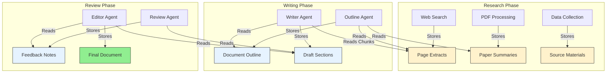

# Memory System Validation & Requirements

## 1. Overview

Before fully committing to AG2's built-in memory system, we need to validate that it can handle the demanding requirements of complex, multi-agent workflows. This document evaluates AG2's memory capabilities against real-world scenarios, particularly document writing tasks that involve large data volumes and long-form content.

The evaluation addresses three critical requirements:

- **Large Data Volume Handling**: Managing extracted web pages, research papers, and bulk data that exceed token limits.
- **Chunked Content Access**: Reading long documents in manageable pieces to avoid context window overflow.
- **Complex Workflow Support**: Enabling stateful, resumable document writing processes with multiple agents.

## 2. Document Writing Scenario Requirements

Document writing represents one of the most demanding use cases for memory systems. Let's define the specific requirements:



### 2.1. Data Volume Requirements

- **Web Page Extracts**: 50-100 pages, 5-15KB each (250KB-1.5MB total)
- **Research Papers**: 10-20 papers, 10-50KB each (100KB-1MB total)
- **Source Materials**: Various formats, up to 2MB total
- **Draft Content**: Growing document, potentially 50-200KB

### 2.2. Access Pattern Requirements

- **Sequential Writing**: Agents need to read previous sections before writing new ones
- **Random Access**: Agents need to reference specific sources or data points
- **Chunked Reading**: Long documents must be readable in token-limited pieces
- **Metadata Filtering**: Ability to find relevant sources by topic, date, or type

## 3. AG2 Memory System Evaluation

### 3.1. Core Capabilities Assessment

**AG2's `ChromaDBVectorMemory`**:

- ✅ **Vector Search**: Semantic similarity for finding relevant content
- ✅ **Metadata Filtering**: Can store and filter by custom metadata
- ✅ **Persistent Storage**: Saves to disk, supports resumable workflows
- ❓ **Chunk Size Handling**: Need to verify if it automatically chunks large content
- ❓ **Memory Limits**: Unknown limits on total storage and retrieval size

**AG2's `ListMemory`**:

- ✅ **Simple Storage**: Good for small, sequential content
- ❌ **No Persistence**: Lost when process ends
- ❌ **No Search**: Only chronological access
- ❌ **No Chunking**: Would hit token limits quickly

### 3.2. Critical Gap Analysis

**Potential Limitations**:

1. **Chunking Strategy**: Does AG2 automatically break large documents into retrievable chunks?
2. **Token Limit Management**: How does `query()` handle results that exceed context windows?
3. **Structured Data**: Can it handle complex data structures (outlines, metadata, references)?
4. **Memory Size Limits**: Are there practical limits on total memory storage?

### 3.3. Required Validation Tests

We need to test AG2's memory system with realistic scenarios:

```python
# Test 1: Large Document Storage and Retrieval
async def test_large_document_handling():
    memory = ChromaDBVectorMemory(config=config)

    # Store a 100KB document
    large_content = "..." * 100000  # 100KB of text
    await memory.add(MemoryContent(
        content=large_content,
        metadata={"type": "research_paper", "topic": "AI agents"}
    ))

    # Query and verify chunking behavior
    results = await memory.query("AI agents", k=5)
    # Does it return manageable chunks or the full 100KB?

# Test 2: Volume and Performance
async def test_memory_scalability():
    memory = ChromaDBVectorMemory(config=config)

    # Store 100 documents of 10KB each (1MB total)
    for i in range(100):
        content = f"Document {i}: " + "content " * 1000
        await memory.add(MemoryContent(
            content=content,
            metadata={"doc_id": i, "type": "source"}
        ))

    # Test retrieval performance and accuracy
    results = await memory.query("specific topic", k=10)
    # Does performance degrade? Are results relevant?

# Test 3: Sequential Access for Document Writing
async def test_document_writing_workflow():
    memory = ChromaDBVectorMemory(config=config)

    # Simulate a writing workflow
    await memory.add(MemoryContent("# Document Outline\n1. Introduction\n2. Methods"))
    await memory.add(MemoryContent("## Introduction\nThis paper explores..."))

    # Writer agent needs to read previous sections
    outline = await memory.query("document outline", k=1)
    intro = await memory.query("introduction section", k=1)

    # Write next section referencing previous work
    methods = f"Based on the introduction: {intro[0].content[:200]}..."
    await memory.add(MemoryContent(methods, metadata={"section": "methods"}))
```

## 4. Implementation Strategy

Based on our evaluation, here's the proposed approach:

### 4.1. Hybrid Memory Architecture

If AG2's memory system has limitations, we can supplement it:

```python
class MemoryManager:
    def __init__(self):
        self.vector_memory = ChromaDBVectorMemory()  # For search and small content
        self.chunk_store = None  # Custom chunking for large documents
        self.metadata_index = None  # Enhanced metadata management

    async def add_large_document(self, content: str, metadata: dict):
        # Custom chunking logic
        chunks = self._chunk_document(content, max_size=4000)
        for i, chunk in enumerate(chunks):
            chunk_metadata = {**metadata, "chunk_id": i, "total_chunks": len(chunks)}
            await self.vector_memory.add(MemoryContent(chunk, metadata=chunk_metadata))

    async def get_document_chunks(self, query: str, max_tokens: int = 8000):
        # Retrieve and reassemble chunks within token limits
        results = await self.vector_memory.query(query, k=20)
        return self._assemble_chunks(results, max_tokens)
```

### 4.2. Memory Tools Implementation

Our memory tools will handle the complexity:

```python
async def add_memory(content: str, metadata: dict = None):
    """Smart memory addition with automatic chunking"""
    if len(content) > CHUNK_THRESHOLD:
        return await memory_manager.add_large_document(content, metadata)
    else:
        return await memory_manager.vector_memory.add(
            MemoryContent(content, metadata=metadata)
        )

async def query_memory(query: str, max_tokens: int = 8000, filter: dict = None):
    """Query with token limit management"""
    return await memory_manager.get_document_chunks(query, max_tokens)
```

## 5. Validation Plan

**Phase 1: Basic Capability Testing**

- Test AG2's memory system with increasing data volumes
- Measure performance and identify breaking points
- Validate chunking and retrieval behavior

**Phase 2: Document Writing Simulation**

- Implement a complete document writing workflow
- Test with realistic data volumes (1-2MB total)
- Measure agent performance and output quality

**Phase 3: Gap Analysis and Enhancement**

- Identify specific limitations
- Implement custom solutions where needed
- Validate the complete system

## 6. Success Criteria

The memory system validation is successful if:

1. **Handles Large Volumes**: Can store and retrieve 2MB+ of content efficiently
2. **Supports Chunking**: Automatically manages token limits during retrieval
3. **Enables Complex Workflows**: Supports multi-agent document writing end-to-end
4. **Maintains Performance**: Sub-second response times for typical queries
5. **Preserves Quality**: Agent output quality doesn't degrade with large memory stores

This validation will determine whether AG2's memory system meets our needs or requires custom enhancements.

# Memory System Implementation Strategy

## 1. Overview

After extensive evaluation of available memory solutions, we recommend **integrating Mem0 open source** as our memory backend while implementing **AG2's memory protocol interface**. This hybrid approach provides the best of both worlds: AG2 ecosystem compatibility with a production-ready, powerful memory system.

## 2. Why Mem0 Open Source

### Production-Ready Architecture

- **26% higher accuracy** than OpenAI Memory on benchmarks
- **91% faster responses** than full-context approaches
- **90% lower token usage** through intelligent chunking
- **Used by companies** achieving 98% task completion rates

### Perfect Fit for Our Requirements

- **Local & Self-Hosted**: No external service dependencies
- **Hybrid Storage**: Vector + Graph + Key-value for optimal retrieval
- **Chunking Support**: Handles large documents automatically
- **Multi-modal**: Images, PDFs, documents via URL/Base64
- **Multi-Agent Ready**: Designed for complex, stateful workflows

### Technical Capabilities

```python
# Mem0 handles exactly what we need:
memory.add(large_document, user_id="session_123")  # Auto-chunking
results = memory.search("find research about X", limit_tokens=2000)  # Token-aware retrieval
memories = memory.get_all(filters={"document_type": "research"})  # Metadata filtering
```

## 3. Implementation Architecture

### AG2 Protocol Wrapper

```python
from ag2.memory import Memory  # AG2's memory interface
from mem0 import Memory as Mem0Memory

class Mem0AGWrapper(Memory):
    """AG2-compatible wrapper around Mem0 backend"""

    def __init__(self, config):
        # Initialize Mem0 with local configuration
        self.mem0 = Mem0Memory.from_config({
            "vector_store": {"provider": "qdrant", "config": {"path": "./memory_db"}},
            "llm": {"provider": "openai", "config": {"model": "gpt-4o-mini"}},
            "graph_store": {"provider": "neo4j", "config": {"url": "bolt://localhost:7687"}}
        })

    def add(self, content: str, metadata: dict = None):
        """AG2 protocol method - implemented with Mem0"""
        return self.mem0.add(content, user_id=metadata.get("session_id"))

    def query(self, query_str: str, **kwargs) -> str:
        """AG2 protocol method with chunking support"""
        results = self.mem0.search(query_str, limit=kwargs.get("max_items", 5))
        return self._format_results(results, max_tokens=kwargs.get("max_tokens"))

    def update_context(self, context: str):
        """AG2 protocol method"""
        # Implementation for context updates

    def clear(self):
        """AG2 protocol method"""
        # Clear all memories for current session
```

### Memory Tools Implementation

```python
# Tools that work with any AG2-compatible memory system
def add_memory(content: str, metadata: dict = None) -> str:
    """Add content to memory with automatic chunking"""
    result = memory.add(content, metadata=metadata)
    return f"Added memory: {result['memory_id']}"

def query_memory(query: str, max_tokens: int = 2000) -> str:
    """Retrieve relevant memories with token limit awareness"""
    results = memory.query(query, max_tokens=max_tokens)
    return results

def list_memory(filter_metadata: dict = None) -> List[dict]:
    """List memories with metadata filtering"""
    return memory.get_all(filters=filter_metadata)
```

## 4. Configuration Strategy

### Local Development Setup

```yaml
# config.yaml
memory:
  provider: "mem0_local"
  config:
    vector_store:
      provider: "qdrant"
      config:
        path: "./workspace/memory/vector_db"
    llm:
      provider: "openai"
      config:
        model: "gpt-4o-mini"
    graph_store: # Optional for relationships
      provider: "neo4j"
      config:
        url: "bolt://localhost:7687"
```

### Production Setup

```yaml
# Production with persistent storage
memory:
  provider: "mem0_production"
  config:
    vector_store:
      provider: "qdrant"
      config:
        url: "https://qdrant-server:6333"
    storage_backend:
      provider: "s3"
      config:
        bucket: "roboco-memory"
        region: "us-west-2"
```

## 5. Document Writing Scenario Validation

### Test Case: Large Document Generation

```python
# Test Mem0's chunking capabilities
test_content = {
    "research_papers": [large_pdf_content],  # 50MB of research
    "outline": detailed_outline,              # 10KB structured outline
    "user_preferences": style_guide,          # 2KB preferences
    "draft_sections": section_drafts          # 100KB of draft content
}

# Validate chunking and retrieval
for content_type, content in test_content.items():
    memory.add(content, metadata={"type": content_type, "session": "doc_gen_test"})

# Test token-aware retrieval
context = memory.query("writing style preferences", max_tokens=1500)
assert len(tokenize(context)) <= 1500, "Token limit exceeded"

# Test complex queries
related_research = memory.query("find research supporting argument about X")
assert len(related_research) > 0, "Failed to retrieve relevant research"
```

## 6. Implementation Timeline

### Phase 1: Core Integration (1-2 weeks)

- [ ] Install and configure Mem0 open source
- [ ] Implement AG2 protocol wrapper
- [ ] Create basic memory tools (add_memory, query_memory, list_memory)
- [ ] Set up local development environment

### Phase 2: Advanced Features (1-2 weeks)

- [ ] Implement chunking validation tests
- [ ] Add metadata filtering capabilities
- [ ] Configure graph relationships (if needed)
- [ ] Optimize for document writing workflows

### Phase 3: Production Readiness (1 week)

- [ ] Production configuration setup
- [ ] Performance optimization
- [ ] Documentation and examples
- [ ] Integration with existing tool system

## 7. Benefits of This Approach

### For Developers

- **AG2 Compatibility**: Works with any AG2-based agents seamlessly
- **No Vendor Lock-in**: Open source, self-hosted, fully controllable
- **Production Ready**: Battle-tested architecture with proven performance

### For Complex Workflows

- **Intelligent Chunking**: Handles large documents automatically
- **Semantic Search**: Better than keyword-based retrieval
- **Persistent State**: Survives restarts, perfect for long-running tasks
- **Multi-modal**: Supports text, images, PDFs out of the box

### For Framework Purity

- **Generic Memory Interface**: Not document-specific, works for any domain
- **Configurable Backend**: Can swap implementations without changing tools
- **Standards-Based**: Follows AG2 protocol, ensuring future compatibility

## 8. Risk Mitigation

### Dependency Management

- **Mem0 Stability**: Active project with 34k+ stars, regular releases
- **Fallback Options**: Can implement simple file-based memory if needed
- **Version Pinning**: Lock to stable Mem0 versions for production

### Performance Considerations

- **Local Testing**: Validate performance with realistic document sizes
- **Monitoring**: Track memory usage, query latency, chunk effectiveness
- **Optimization**: Configure vector dimensions, chunk sizes based on use case

## Conclusion

Integrating Mem0 open source provides a robust, scalable memory foundation while maintaining AG2 compatibility. This approach gives us:

1. **Best-in-class memory capabilities** proven in production
2. **Full control** over data and infrastructure
3. **AG2 ecosystem compatibility** for maximum flexibility
4. **Framework-agnostic design** that avoids document-specific pollution

This is the optimal path forward for our memory system implementation.
