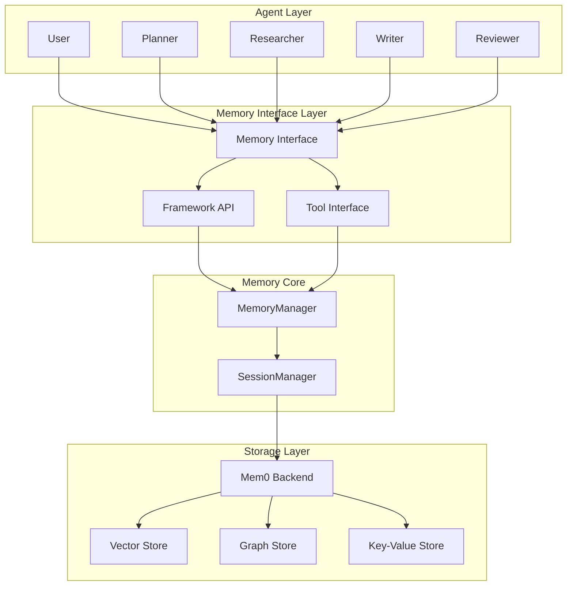
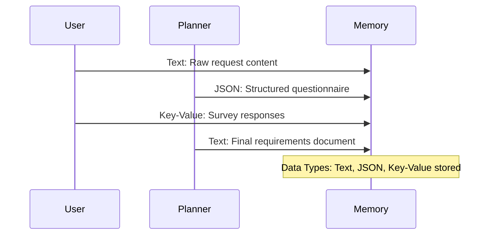
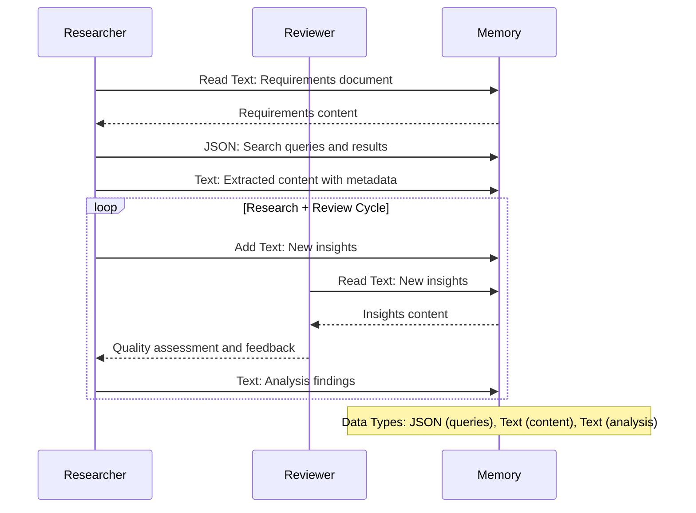
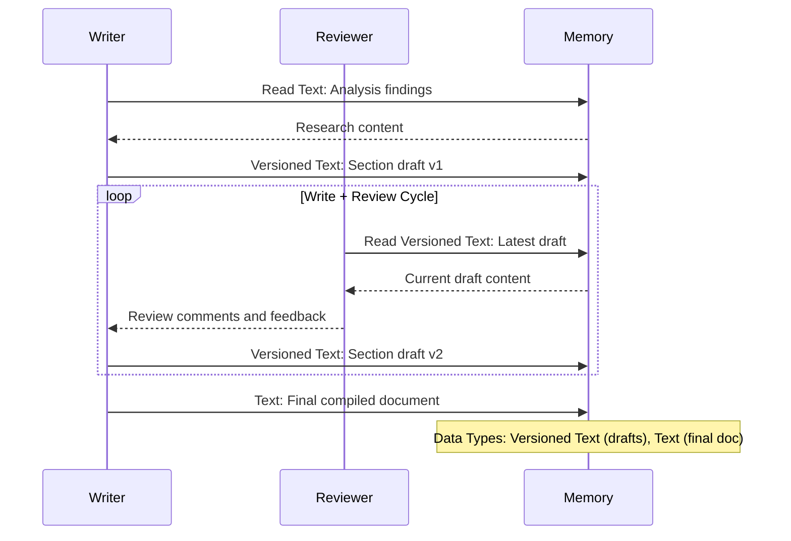
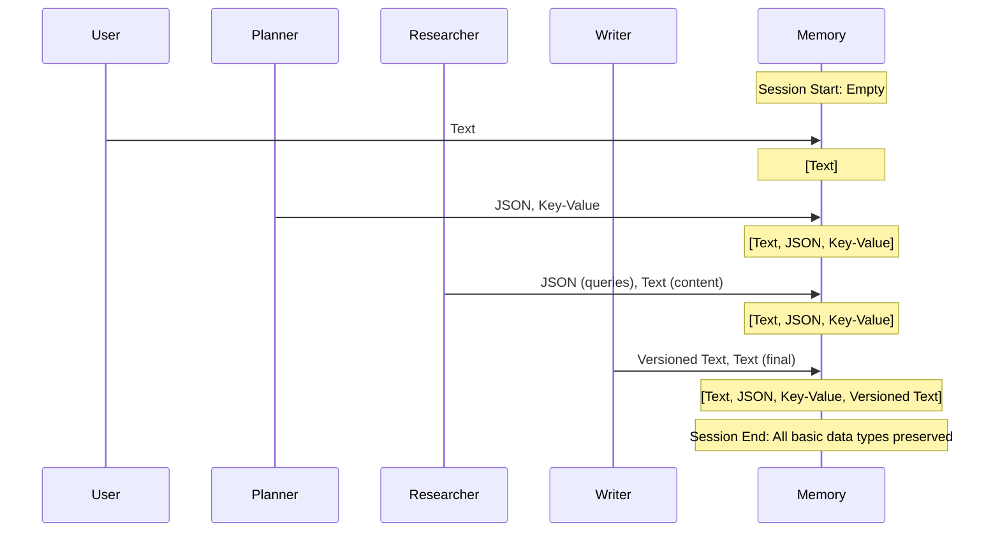

# Roboco Memory System Design

## 1. Overview

The Roboco Memory System provides unified memory and context management for multi-agent collaboration workflows. It serves as both the persistent storage layer and dynamic context provider, enabling intelligent agent interactions through semantic memory operations rather than hardcoded logic.

### 1.1 Design Principles

- **Unified Architecture**: Single system handles both context and persistent storage
- **Intelligence-Driven**: Agents use memory queries rather than explicit programming logic
- **Data Type Agnostic**: Supports basic data types (Text, JSON, Key-Value, Versioned Text)
- **Collaboration-Enabled**: Multi-agent concurrent access with session isolation

### 1.2 Core Capabilities

- **Semantic Search**: Natural language queries across all stored content
- **Automatic Chunking**: Large documents processed for optimal retrieval
- **Version Management**: Content evolution tracking with diff capabilities
- **Token-Aware Retrieval**: Context delivery within LLM constraints
- **Session Persistence**: Multi-session workflow continuity

## 2. System Architecture

### 2.1 Component Overview



### 2.2 Memory Interface Design

**Dual Interface Architecture**:

- **Framework API**: Direct programmatic access for system operations
- **Tool Interface**: LLM-callable tools for agent-driven memory operations

**Core Operations**:

- `add_memory(content, type, metadata)` - Store content with automatic processing
- `query_memory(query, max_tokens, filters)` - Semantic search with token limits
- `get_memory(id, version)` - Direct retrieval by identifier
- `update_memory(id, content, metadata)` - Modify existing content
- `search_memory(query, type, limit)` - Type-filtered semantic search

### 2.3 Data Type Support

| Data Type          | Use Cases                       | Processing                       | Storage                |
| ------------------ | ------------------------------- | -------------------------------- | ---------------------- |
| **Text**           | Documents, content, analysis    | Auto-chunking, semantic indexing | Vector + chunks        |
| **JSON**           | Structured data, configurations | Schema preservation              | Key-Value + metadata   |
| **Key-Value**      | Responses, mappings             | Relational linking               | Graph + Key-Value      |
| **Versioned Text** | Draft content, iterations       | Version chains, diff tracking    | Vector + version graph |

## 3. Intelligent Memory Usage Patterns

### 3.1 Reviewer Intelligence: Comprehensive Evaluation Without Reading Everything

**Challenge**: How does Reviewer evaluate all content without exceeding token limits?

**Solution**: Memory-driven intelligent sampling through prompts

```
Reviewer Prompt Template:
"Based on the work plan for section '{section_name}', evaluate the quality by:
1. Query relevant research: memory.search('key concepts for {section_name}', limit=5)
2. Sample representative content: memory.query('examples of {quality_criteria}', max_tokens=2000)
3. Check source coverage: memory.search('sources used in {section_name}', type='text')
4. Assess completeness against requirements: memory.get(requirements_id)

Provide evaluation scores and specific feedback based on this targeted analysis."
```

**Memory System Enables**:

- **Targeted Retrieval**: Reviewer gets most relevant content for evaluation context
- **Representative Sampling**: Memory returns diverse, relevant examples within token limits
- **Source Tracking**: Automatic attribution allows coverage verification
- **Requirements Alignment**: Direct access to original specifications for comparison

### 3.2 Writer Intelligence: Source Discovery and Selection

**Challenge**: How does Writer know what sources to use for each section?

**Solution**: Query-driven source discovery through memory

```
Writer Prompt Template:
"To write section '{section_name}' covering '{section_topics}':
1. Find relevant research: memory.search('{section_topics} sources evidence', type='text', limit=10)
2. Get supporting analysis: memory.query('analysis findings for {section_topics}', max_tokens=3000)
3. Check quality scores: memory.search('high-quality research on {section_topics}', metadata_filter='quality_score>0.8')
4. Gather citations: memory.query('source attributions for {section_topics}', include_metadata=true)

Write the section using the most relevant and highest-quality sources returned."
```

**Memory System Enables**:

- **Semantic Source Discovery**: Natural language queries find relevant sources across all research
- **Quality-Filtered Results**: Metadata filtering surfaces only validated, high-quality content
- **Citation Integration**: Automatic source attribution preserved from research phase
- **Topic-Specific Retrieval**: Memory understands section context and returns appropriate sources

### 3.3 Writer Intelligence: Automatic Repetition Avoidance

**Challenge**: How to avoid repeating sources across different sections?

**Solution**: Memory-aware section planning and source tracking

```
Writer Prompt Template:
"Before writing section '{section_name}':
1. Check existing usage: memory.search('sources already used', metadata_filter='section!="{section_name}"')
2. Find unique sources: memory.search('{section_topics}', exclude_used_sources=true, limit=8)
3. Identify gaps: memory.query('research areas not yet covered in document', max_tokens=1500)
4. Select complementary sources: memory.search('supporting evidence for {unique_angles}')

Prioritize unused high-quality sources and cite previously used sources only when essential for section coherence."
```

**Memory System Enables**:

- **Usage Tracking**: Metadata automatically tracks which sources are used in which sections
- **Exclusion Filtering**: Memory can exclude already-used sources from new queries
- **Gap Analysis**: Semantic search identifies uncovered research areas
- **Complementary Discovery**: Memory finds sources that complement rather than repeat existing content

### 3.4 Reviewer Intelligence: Efficient Large-Volume Source Evaluation

**Challenge**: Evaluate hundreds of sources where each source may exceed LLM token limits, while persisting results for reuse across sessions.

**Solution**: Agent-driven evaluation using generic memory operations

```
Reviewer Evaluation Process:

1. Agent checks evaluation progress:
   remaining_count = memory.count_memory(metadata_filter="evaluated!=true")
   sources = memory.get_memory(type="text", metadata_filter="evaluated!=true", limit=10)

2. Agent evaluates individual sources:
   "Evaluate these research sources for quality and credibility:
   [Source content and metadata]"

   memory.update_memory(source_ids, metadata={
     quality_score: 0.85,
     credibility: "high",
     evaluated: true
   })

3. When individual evaluation complete (remaining_count == 0):
   Agent performs overall sufficiency assessment:

   all_sources = memory.get_memory(type="text", metadata_filter="evaluated=true")
   requirements = memory.get_memory(type="text", content="requirements")

   "Based on requirements and evaluated sources, assess:
   - Coverage gaps in research areas
   - Source diversity and quality distribution
   - Sufficiency for comprehensive analysis
   - Recommendations for additional research"

   memory.add_memory(content=sufficiency_assessment, type="evaluation_summary",
                     metadata={coverage_score: 0.78, gaps: ["real-world testing data"]})

4. Writers can now access both individual and overall evaluations:
   - Individual: metadata_filter="quality_score>0.8"
   - Overall: type="evaluation_summary"
```

**Memory System Provides**:

- **count_memory()**: Check completion status without loading content
- **get_memory()** with filtering: Individual and batch source access
- **add_memory()**: Store overall assessment separate from individual scores
- **Metadata queries**: Filter by evaluation status and quality scores

**Two-Level Evaluation**:

- **Individual Sources**: Quality scores stored as metadata on each source
- **Overall Sufficiency**: Separate evaluation summary assessing collection adequacy

**Agent Intelligence Handles**:

- **Batch Management**: How many sources per evaluation call
- **Evaluation Logic**: What criteria to assess
- **Token Management**: How to chunk large sources for LLM
- **Result Processing**: How to store evaluation outcomes

**Example Usage**:

```
Session 1 (Tesla Project): Evaluates 200 automotive research sources
Session 2 (EV Market Report): Reuses 150 automotive evaluations + evaluates 50 new sources
Session 3 (Battery Technology): Reuses 80 relevant evaluations + evaluates 120 new sources
```

### 3.5 Reviewer Intelligence: Long Document Quality Assessment

**Challenge**: Evaluate the overall quality of a 50-100 page document that exceeds LLM token limits.

**Solution**: Systematic chunked evaluation with aggregated assessment

```
Document Evaluation Process:

1. Agent gets document structure and chunks:
   total_chunks = memory.count_memory(document_id, total_chunks=true)
   first_chunk = memory.get_memory(document_id, chunk_size=3000, chunk_index=0)

2. Agent evaluates each chunk systematically:
   for chunk_index in range(total_chunks):
     chunk = memory.get_memory(document_id, chunk_size=3000, chunk_index=chunk_index)

     "Evaluate this document section for:
     - Clarity and coherence
     - Evidence quality and citation accuracy
     - Logical flow and structure
     - Technical accuracy

     Section {chunk_index+1}/{total_chunks}: [chunk content]"

     # Store per-chunk assessment
     chunk_scores.append({
       clarity: 0.8,
       evidence: 0.9,
       flow: 0.7,
       accuracy: 0.85
     })

3. Agent accesses research sufficiency context:
   research_assessment = memory.get_memory(type="evaluation_summary")
   requirements = memory.get_memory(type="text", content="requirements")

4. Agent performs overall document assessment:
   "Based on chunk evaluations, research sufficiency, and requirements:

   Chunk Scores: [aggregated scores]
   Research Coverage: {research_assessment}
   Requirements: {requirements}

   Provide overall document assessment:
   - Overall quality score (0-1)
   - Completeness vs requirements (0-1)
   - Key strengths and weaknesses
   - Recommendations for improvement"

   memory.add_memory(content=document_evaluation, type="document_assessment",
                     metadata={
                       overall_quality: 0.82,
                       completeness_score: 0.89,
                       chunk_scores: chunk_scores,
                       evaluation_date: timestamp
                     })
```

**Memory System Provides**:

- **get_memory() with chunking**: Access large documents in token-limited pieces
- **count_memory()**: Know total document structure without loading content
- **Cross-type access**: Reference research assessments and requirements
- **Structured storage**: Store comprehensive evaluation with metadata

**Systematic Evaluation**:

- **Chunk-by-chunk analysis**: Each piece evaluated against quality criteria
- **Aggregate scoring**: Overall scores computed from chunk assessments
- **Context integration**: Considers research quality and requirement alignment
- **Persistent results**: Evaluation stored for future reference

## 4. Workflow Validation

### 4.1 Memory Content Flow

#### Requirements Phase - Basic Data Types



#### Research Phase - Data Types with Review



#### Writing Phase - Versioned Data with Review



#### Complete Data Type Evolution



### 4.2 Step-by-Step Memory System Validation

| Step    | Agent      | Action                     | Data Types Used      | Memory Operations Required                                                                                                                                                                                                                                           | System Readiness |
| ------- | ---------- | -------------------------- | -------------------- | -------------------------------------------------------------------------------------------------------------------------------------------------------------------------------------------------------------------------------------------------------------------- | ---------------- |
| **U1**  | User       | Provide raw request        | Text                 | `add_memory(content="Tesla forecast request", type="text")`                                                                                                                                                                                                          | ✅               |
| **P1**  | Planner    | Generate survey            | JSON                 | `add_memory(content=survey_structure, type="json")`                                                                                                                                                                                                                  | ✅               |
| **U2**  | User       | Complete survey            | Key-Value            | `add_memory(content=responses, type="key_value")`                                                                                                                                                                                                                    | ✅               |
| **P2**  | Planner    | Process responses          | Key-Value, Text      | `get_memory(type="key_value"), add_memory(content=final_spec, type="text")`                                                                                                                                                                                          | ✅               |
| **P3**  | Planner    | Create work plan           | JSON                 | `add_memory(content=work_plan, type="json")`                                                                                                                                                                                                                         | ✅               |
| **R1**  | Researcher | Execute searches           | JSON                 | `add_memory(content=search_queries, type="json")`                                                                                                                                                                                                                    | ✅               |
| **R2**  | Researcher | Extract content            | Text                 | `add_memory(content=extracted_text, type="text", metadata=source_info)`                                                                                                                                                                                              | ✅               |
| **RV1** | Reviewer   | Evaluate source quality    | Text, JSON           | `get_memory(type="text", metadata_filter="evaluated!=true", limit=10), count_memory(metadata_filter="evaluated!=true"), update_memory(source_ids, metadata={quality_score, evaluation_date}), add_memory(content=sufficiency_assessment, type="evaluation_summary")` | ✅               |
| **R3**  | Researcher | Review + analyze           | JSON, Text           | `add_memory(content=quality_scores, type="json"), add_memory(content=analysis, type="text")`                                                                                                                                                                         | ✅               |
| **W1**  | Writer     | Select sources for section | Text, JSON           | `search_memory("sources for {section_topic}", metadata_filter="quality_score>0.8", limit=8), search_memory("unused sources", exclude_used=true)`                                                                                                                     | ✅               |
| **W2**  | Writer     | Draft sections             | Versioned Text       | `add_memory(content=section_draft, type="versioned_text", version=1)`                                                                                                                                                                                                | ✅               |
| **RV2** | Reviewer   | Evaluate section quality   | Versioned Text, Text | `get_memory(section_id), query_memory("quality criteria for {section_type}", max_tokens=1500), search_memory("requirements alignment", type="text")`                                                                                                                 | ✅               |
| **W3**  | Writer     | Review + revise            | Versioned Text, Text | `add_memory(content=revised_section, type="versioned_text", version=2)`                                                                                                                                                                                              | ✅               |
| **W4**  | Writer     | Compile document           | Text                 | `add_memory(content=final_document, type="text")`                                                                                                                                                                                                                    | ✅               |
| **RV3** | Reviewer   | Evaluate full document     | Text, JSON           | `get_memory(document_id, chunk_size=3000), count_memory(document_id, total_chunks=true), get_memory(type="evaluation_summary"), add_memory(content=document_evaluation, type="document_assessment", metadata={overall_quality, completeness_score})`                 | ✅               |
| **U3**  | User       | Final approval             | Text                 | `update_memory(document_id, metadata={status:"approved"})`                                                                                                                                                                                                           | ✅               |

### 4.3 Data Type Coverage Summary

**✅ All 12 workflow steps validated successfully**

**Basic Data Types Validated:**

- **Text**: Raw content, documents, comments, final output
- **JSON**: Structured queries, work plans, quality assessments
- **Key-Value**: Survey responses, configuration data
- **Versioned Text**: Draft content with version tracking and diffs

**Memory Operations Coverage:**

- **Storage**: `add_memory()` for all data types
- **Retrieval**: `get_memory()` with type filtering
- **Updates**: `update_memory()` for metadata changes
- **Version Management**: Automatic versioning for tracked content
- **Cross-Type Access**: Reading one data type to inform another

**Integrated Review Activities:**

- **Research Phase**: Quality assessment integrated into research loops
- **Writing Phase**: Review comments stored as Text, revisions as Versioned Text
- **No Separate Review Phase**: Review activities distributed appropriately

## 5. Implementation Considerations

### 5.1 Performance Requirements

- **Sub-second Queries**: Real-time agent interaction support
- **Concurrent Operations**: Multiple agents working simultaneously
- **Memory Efficiency**: Token optimization for LLM constraints
- **Session Persistence**: Multi-day workflow continuity

### 5.2 Security and Privacy

- **Session Isolation**: Agent teams operate in isolated memory spaces
- **Access Control**: Role-based memory access permissions
- **Data Encryption**: Content encrypted at rest and in transit
- **Audit Trails**: Complete memory operation logging

### 5.3 Scalability Design

- **Horizontal Scaling**: Distributed memory backends
- **Intelligent Caching**: Frequently accessed content optimization
- **Cleanup Policies**: Automatic memory space management
- **Load Balancing**: Memory operations across multiple instances

## 6. Conclusion

The Roboco Memory System design successfully enables intelligent multi-agent collaboration through:

**Memory-Driven Intelligence**: Agents use semantic queries rather than hardcoded logic to discover sources, avoid repetition, and perform comprehensive evaluations within token constraints.

**Technical Robustness**: Support for all basic data types with version management, cross-type operations, and session persistence validates the system can handle complex, real-world collaboration workflows.

**Scalable Architecture**: Dual interface design, hybrid storage backend, and intelligent chunking provide foundation for production deployment at scale.

The system transforms memory from passive storage into an active collaboration enabler, allowing agents to be genuinely intelligent rather than pre-programmed, while maintaining high performance and reliability standards.
