# Roboco Memory System Design

## 1. Overview

The Roboco Memory System provides unified memory and context management for multi-agent collaboration workflows. It serves as both the persistent storage layer and dynamic context provider, enabling intelligent agent interactions through semantic memory operations integrated with Brain-powered reasoning.

### 1.1 Design Principles

- **Brain-Integrated Architecture**: Memory operations seamlessly integrated with agent Brain reasoning
- **Task-Level Context**: Memory scoped to tasks with shared access across team agents
- **Intelligence-Driven**: Agents use memory queries through their Brains rather than explicit programming logic
- **Data Type Agnostic**: Supports basic data types (Text, JSON, Key-Value, Versioned Text)
- **Collaboration-Enabled**: Multi-agent concurrent access with session isolation

### 1.2 Core Capabilities

- **Semantic Search**: Natural language queries across all stored content via Brain integration
- **Automatic Chunking**: Large documents processed for optimal retrieval
- **Version Management**: Content evolution tracking with diff capabilities
- **Token-Aware Retrieval**: Context delivery within LLM constraints for Brain processing
- **Session Persistence**: Multi-session workflow continuity

## 2. System Architecture

### 2.1 Component Overview

```mermaid
graph TB
    subgraph "Agent Layer"
        subgraph "Agent 1"
            A1[Agent]
            Brain1[🧠 Brain]
            A1 --> Brain1
        end

        subgraph "Agent 2"
            A2[Agent]
            Brain2[🧠 Brain]
            A2 --> Brain2
        end

        subgraph "Agent 3"
            A3[Agent]
            Brain3[🧠 Brain]
            A3 --> Brain3
        end
    end

    subgraph "Team Layer"
        Team[Team]
        ChatHistory[Task-Level ChatHistory]
        Team --> ChatHistory
    end

    subgraph "Memory Interface Layer"
        API[Memory API]
        TOOLS[Memory Tools]
    end

    subgraph "Backend"
        MEM0[Mem0 Backend]
        VS[Vector Store]
        GS[Graph Store]
        KV[Key-Value Store]
    end

    Brain1 --> TOOLS
    Brain2 --> TOOLS
    Brain3 --> TOOLS
    TOOLS --> API
    Team --> API

    API --> MEM0
    MEM0 --> VS
    MEM0 --> GS
    MEM0 --> KV
```



### 2.2 Memory Interface Design

**Brain-Integrated Architecture**:

- **Brain API**: Direct memory access through agent Brain reasoning
- **Tool Interface**: LLM-callable tools for Brain-driven memory operations
- **Task-Level Scoping**: Memory automatically scoped to task context

**Core Operations**:

- `save(content, metadata)` - Store content with automatic processing via Brain
- `search(query, filters)` - Brain-powered semantic search across content
- `get(id, version)` - Direct retrieval by identifier
- `update(id, content, metadata)` - Modify existing content

**Brain Integration**:

- **`brain.integrate_memory()`**: Brain automatically integrates relevant memories into reasoning
- **`brain.reason_with_tools()`**: Brain can orchestrate memory operations during thinking
- **Task-Level Context**: All agents in a team share the same memory space

### 2.3 Data Type Support

| Data Type          | Use Cases                       | Brain Processing                 | Storage                |
| ------------------ | ------------------------------- | -------------------------------- | ---------------------- |
| **Text**           | Documents, content, analysis    | Auto-chunking, semantic indexing | Vector + chunks        |
| **JSON**           | Structured data, configurations | Schema preservation              | Key-Value + metadata   |
| **Key-Value**      | Responses, mappings             | Relational linking               | Graph + Key-Value      |
| **Versioned Text** | Draft content, iterations       | Version chains, diff tracking    | Vector + version graph |

## 3. Brain-Powered Memory Usage Patterns

### 3.1 Brain Memory Integration: Automatic Context Enhancement

**Challenge**: How does Brain automatically integrate relevant memories into reasoning?

**Solution**: Brain's `integrate_memory()` method automatically pulls relevant context

```python
# Brain automatically integrates memory during thinking
class Brain:
    async def think(self, messages, context=None):
        # Brain automatically integrates relevant memories
        memory_context = await self.integrate_memory(messages)

        # Enhanced reasoning with memory context
        enhanced_context = {**context, **memory_context}
        return await self._generate_response(messages, enhanced_context)

    async def integrate_memory(self, messages, memory_context=None):
        if not self.config.enable_memory_integration:
            return {}

        # Brain determines what memories are relevant
        query = self._extract_memory_query(messages)
        relevant_memories = await self.agent.memory.search(query)

        return {
            "memory_integrated": True,
            "relevant_memories": relevant_memories,
            "context_enhanced": True
        }
```

### 3.2 Brain Tool Orchestration: Memory-Driven Research

**Challenge**: How does Brain orchestrate memory operations during complex reasoning?

**Solution**: Brain's `reason_with_tools()` method manages memory tool usage

```python
# Brain orchestrates memory tools during reasoning
async def reason_with_tools(self, messages, available_tools):
    results = []

    if "memory" in available_tools and messages:
        last_message = messages[-1]

        # Brain decides when to use memory tools
        if self._should_search_memory(last_message):
            # Brain constructs semantic queries
            query = self._construct_memory_query(last_message)

            # Brain executes memory search
            memory_results = await available_tools["memory"].search(query)

            # Brain processes memory results
            memory_response = self._process_memory_results(memory_results)
            results.append(memory_response)

    return results
```

### 3.3 Task-Level Memory Sharing: Team Intelligence

**Challenge**: How do multiple agents share memory context in a team?

**Solution**: Task-level memory scoping with Brain-powered access

```python
# Task-level memory shared across team agents
class Team:
    def __init__(self, config, agents):
        # Task-level memory shared by all agents
        self.memory = Memory(task_id=self.task_id)

        # Each agent's Brain can access shared memory
        for agent in agents:
            agent.memory = self.memory

    async def start_conversation(self, initial_message):
        # All agents share the same memory context
        for agent in self.agents:
            # Each agent's Brain has access to shared memories
            agent.brain.memory_context = self.memory

        return await self._conversation_loop(initial_message)

# Agent Brain automatically uses shared memory
class Agent:
    async def receive_message(self, message):
        # Brain automatically integrates shared team memory
        response = await self.brain.think(
            messages=[message],
            context={"shared_memory": self.memory}
        )
        return response
```

### 3.4 Brain Memory Learning: Continuous Intelligence Enhancement

**Challenge**: How does Brain learn and improve from memory over time?

**Solution**: Brain analyzes memory patterns and adapts reasoning

```python
# Brain learns from memory patterns
class Brain:
    async def think(self, messages, context=None):
        # Brain analyzes memory patterns for learning
        memory_patterns = await self._analyze_memory_patterns()

        # Brain adapts reasoning based on learned patterns
        adapted_context = self._adapt_reasoning_context(context, memory_patterns)

        # Enhanced thinking with learned insights
        response = await self._generate_response(messages, adapted_context)

        # Brain stores reasoning results for future learning
        await self._store_reasoning_results(response)

        return response

    async def _analyze_memory_patterns(self):
        # Brain analyzes successful reasoning patterns
        successful_patterns = await self.agent.memory.search(
            "successful reasoning patterns",
            metadata_filter={"success": True}
        )

        return {
            "learned_patterns": successful_patterns,
            "reasoning_improvements": self._extract_improvements(successful_patterns)
        }
```

## 4. Memory System Integration with Brain

### 4.1 Automatic Memory Integration

```python
# Brain automatically integrates memory without explicit calls
agent = Agent(
    name="researcher",
    role=AgentRole.ASSISTANT,
    brain_config=BrainConfig(
        enable_memory_integration=True,  # Brain auto-integrates memory
        enable_tool_calling=True         # Brain can use memory tools
    )
)

# Brain automatically uses memory during thinking
response = await agent.brain.think(
    messages=[user_message],
    # Brain automatically pulls relevant memories
    # No explicit memory calls needed
)
```

### 4.2 Task-Level Memory Scoping

```python
# Memory automatically scoped to task
team = Team(
    name="research_team",
    agents=[researcher, writer, analyst],
    config=TeamConfig(enable_memory=True)
)

# All agents share task-level memory
chat_history = await team.start_conversation(
    initial_message="Research AI trends and create report"
)

# Each agent's Brain has access to shared memories
# Memory is automatically scoped to this task
```

### 4.3 Brain-Powered Memory Operations

```python
# Brain can orchestrate complex memory workflows
class ResearchAgent(Agent):
    async def conduct_research(self, topic):
        # Brain orchestrates memory-driven research
        research_results = await self.brain.reason_with_tools(
            messages=[Message(content=f"Research {topic}")],
            available_tools={
                "memory": self.memory,
                "search": self.tools.get("search"),
                "web_extraction": self.tools.get("web_extraction")
            }
        )

        # Brain automatically stores research results
        for result in research_results:
            await self.memory.save(
                content=result.content,
                metadata={
                    "type": "research",
                    "topic": topic,
                    "agent": self.name,
                    "brain_generated": True
                }
            )

        return research_results
```

## 5. Advanced Brain-Memory Patterns

### 5.1 Intelligent Memory Curation

Brain automatically curates and organizes memories:

```python
# Brain curates memory based on importance and relevance
class Brain:
    async def curate_memories(self):
        # Brain analyzes memory importance
        all_memories = await self.agent.memory.get_all()

        # Brain scores memory importance
        for memory in all_memories:
            importance_score = await self._calculate_importance(memory)
            await self.agent.memory.update(
                memory.id,
                metadata={**memory.metadata, "importance": importance_score}
            )

        # Brain organizes memories by topics
        topics = await self._extract_memory_topics(all_memories)
        await self._organize_memories_by_topics(topics)
```

### 5.2 Cross-Agent Memory Learning

Brain learns from other agents' memory patterns:

```python
# Brain learns from team memory patterns
class Brain:
    async def learn_from_team(self, team_memory):
        # Brain analyzes successful collaboration patterns
        successful_collaborations = await team_memory.search(
            "successful team collaborations",
            metadata_filter={"outcome": "success"}
        )

        # Brain extracts collaboration insights
        insights = await self._extract_collaboration_insights(successful_collaborations)

        # Brain adapts reasoning based on team learnings
        self._update_reasoning_patterns(insights)
```

This Brain-integrated memory system enables intelligent, adaptive agents that continuously learn and improve their reasoning through shared memory experiences.
