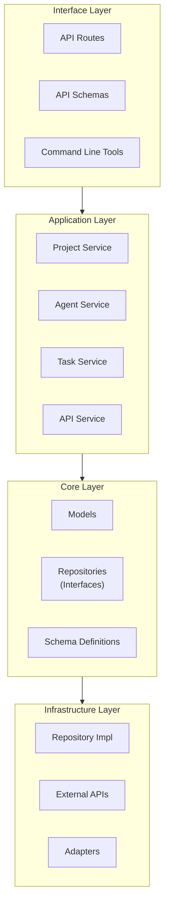
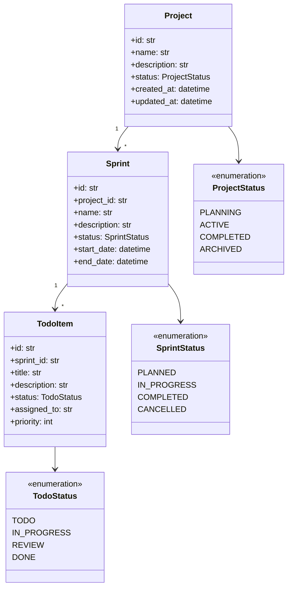
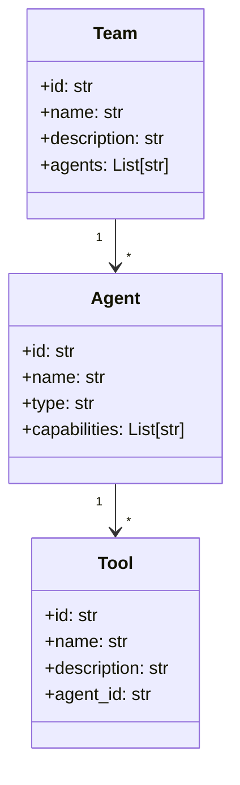
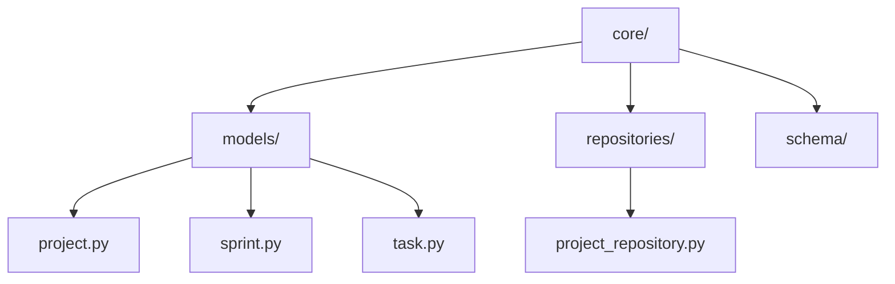
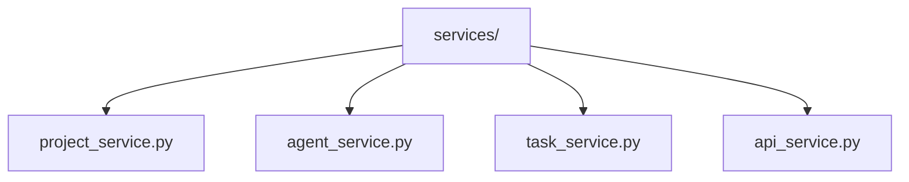
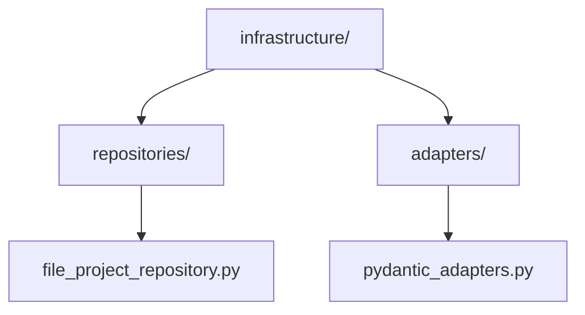
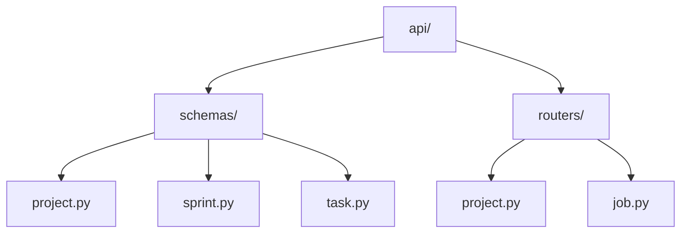
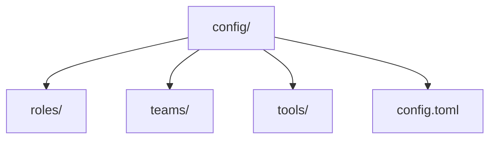

# Roboco Object Model

This document describes the high-level object model and architecture of the Roboco system, focusing on the relationships between components rather than specific implementations.

## System Architecture

Roboco follows Domain-Driven Design principles with a clear separation of concerns across different layers:

## Core Domain Objects

### Project Management Domain

### Agent Orchestration Domain

## Core Layer

The core layer contains the domain models, interfaces, and schema definitions that form the heart of the system.

### Domain Models

Domain models represent the core business entities with behavior, not just data structures. They encapsulate business rules and invariants.

**Key Characteristics:**
- Rich behavior methods
- Business rule enforcement
- Domain-specific operations

**Example Structure:**

### Repository Interfaces

Repository interfaces define the contract for data access operations without specifying implementation details.

**Key Characteristics:**
- Abstract interfaces
- CRUD operations
- Domain-specific queries

## Application Layer

The application layer orchestrates the core layer to perform business operations.

### Services

Services coordinate domain objects to perform business operations that span multiple entities.

**Key Characteristics:**
- Orchestration of domain objects
- Transaction management
- No business rules (delegated to domain)

**Example Structure:**

## Infrastructure Layer

The infrastructure layer provides technical capabilities to support the higher layers.

### Repository Implementations

Concrete implementations of repository interfaces that handle data persistence.

**Key Characteristics:**
- Implement repository interfaces
- Handle data storage details
- Manage serialization/deserialization

**Example Structure:**

### Adapters

Adapters convert between domain models and external representations (like API DTOs).

**Key Characteristics:**
- Bidirectional conversion
- Prevent domain model leakage
- Handle format differences

## Interface Layer

The interface layer handles interaction with external systems or users.

### API Schemas

Pydantic models for API validation and serialization.

**Key Characteristics:**
- Input validation
- Response serialization
- No business logic

**Example Structure:**

### API Routers

FastAPI routers that handle HTTP requests and delegate to the application services.

**Key Characteristics:**
- Route definition
- Request handling
- Response formatting
- Error handling

## Extension Points

Roboco is designed to be extensible in several key areas:

1. **New Agent Types**: The system can be extended with new agent types by implementing the base Agent class
2. **New Tools**: New tools can be added by implementing the Tool interface
3. **New Repository Implementations**: Alternative storage mechanisms can be implemented by creating new repository classes
4. **New API Endpoints**: The API can be extended with new endpoints by adding routers

## Configuration System

The configuration system allows for customization without code changes:

## Dependency Flow

The system follows a dependency rule where inner layers do not depend on outer layers:

- Core layer has no external dependencies
- Application layer depends only on the core layer
- Infrastructure layer implements interfaces defined in the core layer
- Interface layer depends on the application layer

This ensures that the core business logic remains isolated from technical concerns and can evolve independently.
