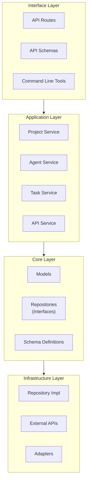
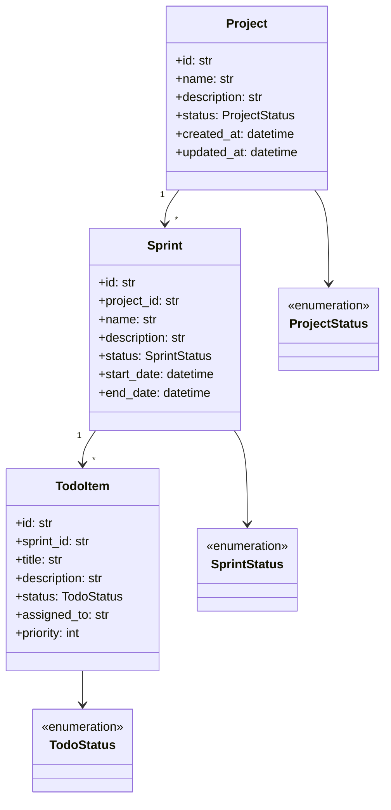
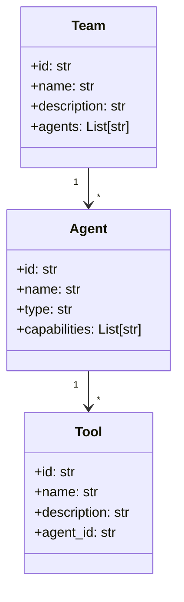

# Roboco Object Model

This document describes Roboco's architecture and core components.

## System Architecture

Roboco follows Domain-Driven Design with four layers:



## Core Domain Objects

### Project Management Domain



### Agent Orchestration Domain



## Unified Model Approach

We use a unified model approach where the same classes serve as both domain models and database models.

### Architecture Components

- **Core Models** (`core/models/`): Primary SQLModel-based definitions with business logic
- **Database Layer** (`db/`): Service functions importing core models
- **API Layer**: Request/response models with converters to core models

### Model Types

1. **Domain/DB Models**: Used for business logic and persistence
2. **API Request Models**: For validating API requests with conversion to domain models
3. **API Response Models**: Customized for specific API endpoints

### Benefits

- **Simplicity**: One source of truth for data structure
- **Maintainability**: Changes only needed in one place
- **Performance**: Direct database operations without mapping overhead

### Example Usage

```python
# Creating entity
project_data = ProjectCreate(name="New Project", description="...")
project = project_data.to_db_model()
db_service.create_project(project)

# Using model
project = db_service.get_project(project_id)
project.update_timestamp()
db_service.update_project(project.id, updated_data)
```

## Layer Details

### Core Layer

- **Domain Models**: Business entities with behavior
- **Repository Interfaces**: Contracts for data access

### Application Layer

- **Services**: Coordinate domain objects for operations

### Infrastructure Layer

- **Repository Implementations**: Database persistence
- **Adapters**: Convert between domain models and external representations

### Interface Layer

- **API Schemas**: Validation and serialization models
- **API Routers**: Handle HTTP requests

## Extension Points

Roboco is extensible via:

1. New Agent Types
2. New Tools
3. New Repository Implementations
4. New API Endpoints

## Dependency Flow

Inner layers never depend on outer layers:

- Core → No external dependencies
- Application → Core only
- Infrastructure → Implements core interfaces
- Interface → Application only

This isolation keeps business logic independent from technical concerns.
