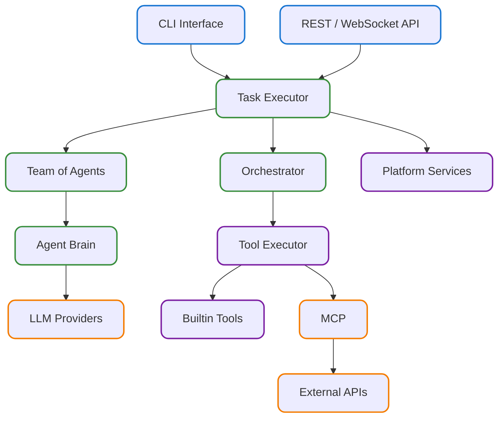
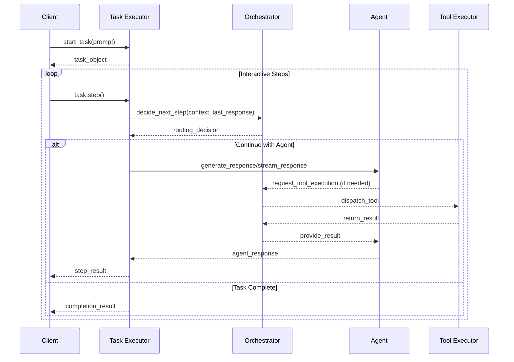
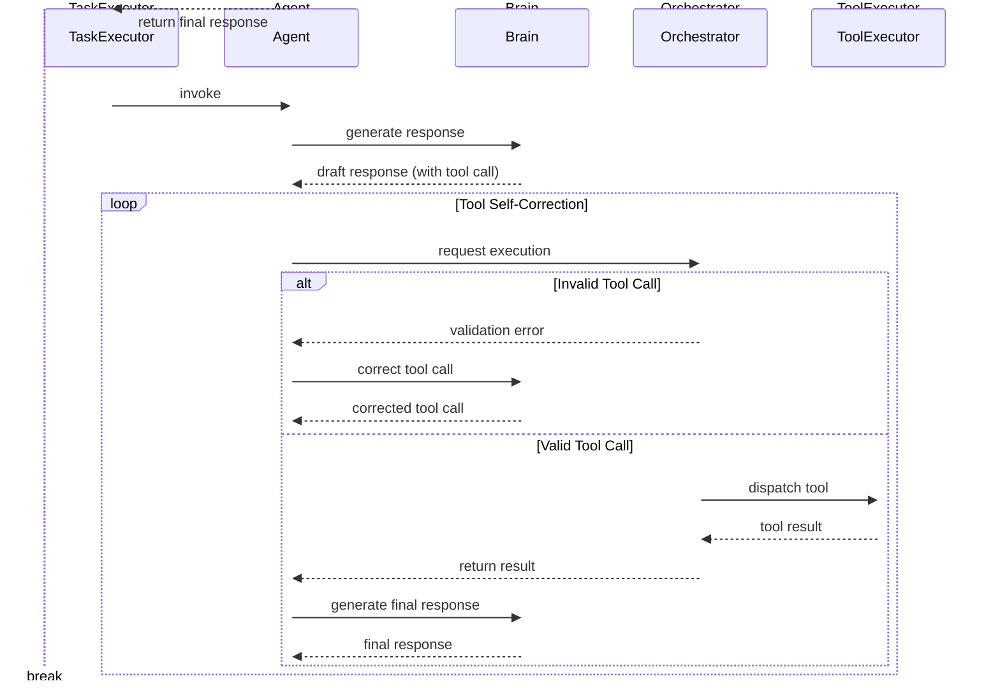

# AgentX System Architecture

## 1. Executive Summary

AgentX is an open-source backbone for building secure, observable, and fully autonomous multi-agent systems. A lightweight micro-kernel orchestrates specialised agents, turning a single user request into a coordinated workflow that spans tool execution, memory retrieval, and artifact management—all within isolated, version-controlled workspaces. Every decision, message, and side effect is captured as a structured event, providing complete auditability and real-time insight into system behaviour.

## 2. Vision & Principles

### 2.1 Project Vision

AgentX enables organisations to decompose complex goals into collaborative **Teams** of agents, each focusing on a well-defined role. A central **Orchestrator** governs the conversation, selects the next agent to speak, and executes tools on the agents' behalf, while a **Task Executor** drives the lifecycle of the task itself. The result is a flexible framework that elevates individual agent capabilities into a cohesive, self-optimising system that can learn, adapt, and scale with minimal human intervention.

### 2.2 Architectural Principles

The architecture rests on the following foundational principles:

- **Separation of Concerns**: Each subsystem has a single, well-defined responsibility, which reduces coupling and simplifies maintenance.
- **Centralised Orchestration**: A single Orchestrator governs coordination, security, and resource allocation, providing a uniform control plane.
- **Agent Autonomy**: Agents manage their own reasoning loops and private Brains, delegating only cross-cutting concerns upward.
- **Event-Driven Coordination**: Asynchronous, structured events enable scalable, loosely-coupled communication among subsystems.
- **Configuration-Driven Behaviour**: Teams, agents, and workflows are defined declaratively, allowing rapid iteration without code changes.
- **Security by Design**: All external interactions pass through audited, policy-enforced channels; least-privilege boundaries are maintained throughout.
- **Workspace Isolation**: Every task executes in its own version-controlled workspace, ensuring reproducibility and clean separation of artifacts.

## 3. System Architecture Overview



The AgentX architecture is composed of four distinct layers:

- **Client Layer**: Provides the primary user-facing interfaces, including a Command-Line Interface (CLI) for developers, a REST/WebSocket API for programmatic integration, and a web-based Dashboard for real-time monitoring.
- **AgentX Core**: Contains the essential components for task execution and agent collaboration. The `Task Executor` drives the workflow, the `Orchestrator` makes routing decisions, and the `Team of Agents` performs the reasoning.
- **Platform Services**: A suite of shared, pluggable services that support the core. These include the secure `Tool Executor`, `Configuration System`, `Event Bus`, and stateful services for `Memory` and `Observability`.
- **External Systems**: Represents all external dependencies, such as `LLM Providers`, `Vector Databases` for memory, `Git` for workspace versioning, and any third-party `APIs` that tools may call.

## 4. Collaboration Model

In AgentX, a **Team** of collaborating agents is the primary mechanism for executing complex tasks. The core runtime consists of three key components that work in concert to manage the task lifecycle.

### 4.0 Execution Flow

The AgentX execution flow follows a precise pattern where the TaskExecutor always consults the Orchestrator for routing decisions:

1. **Initialization**: TaskExecutor sets up the workspace and initializes the task context
2. **Routing Consultation**: TaskExecutor calls `Orchestrator.decide_next_step(context, last_response)` to determine the next action
3. **Agent Execution**: Based on the routing decision, TaskExecutor directly invokes the selected agent via `agent.generate_response()` or `agent.stream_response()`
4. **Result Processing**: TaskExecutor receives the agent's response and updates the task context
5. **Cycle Repeat**: TaskExecutor returns to step 2, consulting the Orchestrator again with the new response until the task is marked complete

This pattern ensures centralized routing intelligence while maintaining clear separation of concerns between task management, routing decisions, and agent execution.

### 4.1 Key Roles

- **Task Executor**: Owns the end-to-end lifecycle of a single task. It acts as the primary workflow engine, responsible for provisioning the workspace, managing the overall task state, and orchestrating the execution flow. The TaskExecutor always consults the Orchestrator for routing decisions via `decide_next_step()`, then directly invokes the selected agent using `generate_response()` or `stream_response()`, and repeats this cycle until task completion.
- **Orchestrator**: Acts as the centralized coordination service for both tool execution and agent routing. It provides two key functions: (1) makes intelligent routing decisions through `decide_next_step()` based on current task context and previous agent responses, determining which agent should act next or if the task is complete, and (2) validates tool-call requests against schemas and dispatches them to the secure `ToolExecutor`.
- **Agent**: Encapsulates a specialised role (e.g., _researcher_, _writer_). It receives control from the `Task Executor` through direct invocation, reasons with its private **Brain**, and can invoke the `Orchestrator` if it needs to execute a tool.

### 4.2 Execution Modes

AgentX supports two primary modes of execution, offering a trade-off between autonomy and control.

**1. Autonomous Execution (`execute_task`)**

This "fire-and-forget" mode is ideal for production. A client submits a task and waits for a final result, while the `Task Executor` runs the entire multi-agent collaboration autonomously.

```mermaid
sequenceDiagram
    participant C as Client
    participant TX as Task Executor
    participant OR as Orchestrator
    participant AG as Agent
    participant TE as Tool Executor

    C->>TX: execute_task(prompt)
    loop Autonomous Agent Loop
        TX->>OR: decide_next_step(context, last_response)
        OR-->>TX: routing_decision
        alt Continue with Agent
            TX->>AG: generate_response/stream_response
            AG-->>OR: request_tool_execution (if needed)
            OR-->>TE: dispatch_tool
            TE-->>OR: return_result
            OR-->>AG: provide_result
            AG-->>TX: agent_response
        else Task Complete
            break
        end
    end

    TX-->>C: final_result

```

**2. Interactive Execution (`start_task` & `step`)**

For debugging or human-in-the-loop workflows, a client can call `start_task` to get a `Task` object, then repeatedly call `step()` to advance the execution one turn at a time.



## 5. Agent Execution Flow

The AgentX execution flow is built around a clear separation of concerns where the `Task Executor` coordinates with the `Orchestrator` for agent routing decisions, while each `Agent` focuses on its specialized reasoning process. This iterative consultation pattern ensures optimal agent selection based on dynamic task context.

### 5.1 Prompt Templating

An agent's core behavior and persona are defined by its system prompt, which is typically loaded from a Jinja2 template file. Before the `Task Executor` invokes an agent, it injects dynamic context into this template. This ensures the agent is fully aware of the current state of the task. Common context variables include:

- The full conversation history.
- A list of available tools and their JSON schemas.
- The initial task objective and any user-provided parameters.
- Summaries or references to artifacts in the workspace.

This just-in-time templating allows agents to be both powerful and reusable, adapting their behavior to the specific needs of each task.

### 5.2 Complete Execution Flow

The complete AgentX execution flow combines the coordination protocol with agent-specific reasoning in a continuous loop:

#### Coordination Loop

1. **Agent Selection**: TaskExecutor consults Orchestrator with current context and previous response
2. **Agent Invocation**: TaskExecutor invokes the selected agent's `generate_response()` or `stream_response()`
3. **Response Collection**: TaskExecutor receives the agent's complete response
4. **Routing Decision**: TaskExecutor consults Orchestrator again to determine next action (continue, handoff, or complete)

#### Agent Execution (Step 2 Detail)

When an agent is invoked, it follows its own internal reasoning loop:

1. **Initial Reasoning**: Agent's `Brain` (LLM) generates a response, potentially including tool calls
2. **Tool Execution**: If tools are needed, Agent requests execution from Orchestrator
   - Orchestrator validates tool calls against schemas
   - Invalid calls trigger self-correction loop with Brain
   - Valid calls are dispatched to ToolExecutor for secure execution
3. **Response Integration**: Agent integrates tool results and generates final response
4. **Return**: Agent returns complete response to TaskExecutor

This two-level architecture ensures that routing decisions are centralized and context-aware, while agents can focus on domain-specific reasoning and autonomous tool usage.



### 5.3 End-to-End Streaming

To provide maximum transparency and a highly responsive user experience, AgentX is designed for **end-to-end streaming**. This is more than just streaming the final answer; it means that every significant piece of text generated during the task lifecycle is yielded back to the client in real-time.

This is achieved by making streaming the default behavior at every layer of the stack:

- **Brain**: The `Brain` streams token-by-token output directly from the underlying LLM provider.
- **Agent**: The `Agent` streams its internal monologue, including its reasoning process and its decision to call tools.
- **Task Executor**: The `Task Executor` orchestrates these streams, interleaving agent monologues with tool execution status messages and final outputs.

This architecture allows a developer or user to watch the entire multi-agent collaboration unfold in real-time, offering unparalleled insight for debugging, monitoring, and human-in-the-loop interaction. It transforms the "black box" of agent reasoning into a transparent, observable process.

## 6. State and Context Management

AgentX is designed around the core principle that agents should operate on a rich, durable, and easily accessible context. This is achieved through two tightly integrated components: the **Workspace** and the **Memory System**.

### 6.1 Workspace: A Durable Foundation

The **Workspace** is the stateful heart of every task. It is a version-controlled directory that provides the foundation for iterative development, task resumption, and human-in-the-loop collaboration. By persisting every message, artifact, and state change to the workspace, AgentX guarantees full auditability and allows tasks to be paused, inspected, modified, and resumed at any point.

Every workspace contains:

- A complete, append-only log of the conversation history (`history.jsonl`).
- A version-controlled `artifacts` directory where all agent outputs (code, documents, data) are stored.
- A `state.json` file capturing the latest state of the Task Executor and all agents.

This robust state management is what enables developers to treat tasks not as ephemeral processes, but as durable, long-running workflows that can be debugged, refined, and improved over time.

### 6.2 Memory: Intelligent Context Retrieval

The **Memory** acts as the intelligent, unified gateway for retrieving contextual data from the Workspace. It is more than a simple wrapper around a vector database; it is the sole entry point for agents to perform intelligent data fetching, ensuring they have the most relevant information without exceeding token limits.

Its responsibilities are twofold:

1.  **Context Ingestion**: It automatically captures and indexes conversational history, agent-generated artifacts, and other designated data sources from the Workspace into a long-term, searchable store.
2.  **Intelligent Retrieval**: It provides a simple query interface for agents to retrieve contextually relevant information. The system handles the complexity of searching across different data types and uses semantic ranking to return only the most salient facts.

By abstracting away the complexities of data storage and retrieval, the Memory System allows agents to remain focused on reasoning, while ensuring their prompts are always grounded with high-quality, relevant context from the Workspace.

### 6.3 Example Scenario: Context-Aware Writing

To illustrate how these components work together, consider a `Writer` agent tasked with drafting a report. A `Researcher` agent has already run, populating the `Workspace` with dozens of source documents.

1.  **Initial State**: The `Workspace` contains all source documents as artifacts (e.g., `source_01.txt`, `source_02.txt`, etc.). The `Memory System` has indexed the content of each of these sources. The main report is still empty.
2.  **Writing the First Section**: The `Writer` is tasked with "Write the introduction." It queries the `Memory System`: _"Find sources relevant to the overall topic."_ The `Memory System` returns the most relevant source documents. The `Writer` uses them to draft the introduction, which is then saved back to the `Workspace` as `report_v1.md`.
3.  **Preventing Redundancy**: When the `Writer` is next tasked with "Write the 'History of AI' section," it performs a more sophisticated query: _"Find sources related to 'the history of AI' that are not already referenced in `report_v1.md`."_
4.  **Intelligent Retrieval**: The `Memory System` understands this query. It performs a semantic search for "history of AI" across all source documents, but it also performs a negative semantic search, filtering out any sources whose content closely matches what is already in `report_v1.md`.
5.  **Grounded Response**: The `Memory System` returns a fresh, relevant, and unused set of sources. The `Writer` can now draft the new section with confidence, knowing it is not repeating information.

This scenario demonstrates how the combination of a durable `Workspace` and an intelligent `Memory System` enables agents to perform complex, stateful tasks that would be impossible with a simple conversational context window.

## 7. Platform Services

Platform Services provide common capabilities that sit outside the tight execution loop yet remain essential to every task. They are deployed as shared, multi-tenant components and accessed via well-defined APIs, allowing the core runtime to stay lightweight while still benefiting from robust storage, configuration, and monitoring facilities.

### 7.1 Configuration System

The Configuration System is the single source of truth for teams, agents, tools, and runtime policies. It loads declarative YAML files, validates them against versioned schemas, and exposes the resulting objects to the Task Executor and Orchestrator at startup or on hot-reload.

### 7.2 Event Bus

All significant actions in the framework emit structured events that flow through the Event Bus. This design decouples producers from consumers, enabling real-time monitoring, auditing, and external integrations without burdening the hot code-path.

### 7.3 Memory System Infrastructure

While Section 6 described the Memory System from a business logic perspective, this section focuses on its infrastructure implementation. The Memory System uses a pluggable backend architecture that abstracts away the complexities of different memory storage implementations.

**Implementation Architecture**:

- **Memory Backend Interface**: A standardized interface that allows different memory providers (mem0, vector databases, etc.) to be plugged in seamlessly
- **mem0 Integration**: The default backend leverages mem0 for intelligent memory management, providing automatic memory extraction, storage, and retrieval
- **Vector Database Support**: Direct integration with vector databases for semantic search capabilities
- **Memory Factory Pattern**: A factory that instantiates the appropriate memory backend based on configuration

**Key Infrastructure Features**:

- **Automatic Indexing**: Background processes that continuously index new content from workspaces
- **Scalable Storage**: Support for both local and distributed memory storage backends
- **Memory Lifecycle Management**: Automatic cleanup, archival, and optimization of stored memories
- **Provider Abstraction**: Clean separation between the memory interface and underlying storage technology

This infrastructure design ensures that the Memory System can scale from development environments using local storage to production deployments using enterprise-grade vector databases, all without changing the business logic layer.

### 7.4 Observability

The Observability service provides real-time insight into the inner workings of the AgentX framework. It subscribes to the `Event Bus` to receive a live stream of all system events—from task creation to agent handoffs to tool executions. This data is then exposed through a built-in web dashboard, allowing developers to:

- Visually trace the entire lifecycle of a task.
- Inspect the contents of any agent's workspace, including conversation history and artifacts.
- Debug complex multi-agent interactions in real-time.

By making the system transparent by default, the Observability service dramatically reduces the time required to build, test, and refine sophisticated agent-based workflows.

## 8. Builtin Tools

Builtin Tools extend AgentX with first-class capabilities without requiring users to write custom plugins. They are registered automatically at startup and are available to any agent subject to security policy. These tools are designed to be general-purpose and cover the most common needs of autonomous agents.

Key builtin tools include:

- **Storage Tools**: Clean file operations that use the storage layer, providing secure workspace-scoped file management with proper isolation and version control. Includes `read_file`, `write_file`, `list_directory`, `delete_file`, and other essential file operations.
- **Web Tools**: Advanced web capabilities including `web_search`, `extract_content` for web scraping, and `automate_browser` for AI-driven browser automation using natural language instructions.
- **Memory Tools**: Direct interface to the Memory system for storing and retrieving contextual information across task sessions.
- **Context Tools**: Tools for managing and updating task context variables, allowing agents to maintain and share state information.
- **Planning Tools**: Sophisticated task planning and execution tracking tools that help agents break down complex tasks into manageable phases.
- **Search Tools**: Web search capabilities using multiple search engines (Google, Bing, DuckDuckGo) with configurable parameters.

By providing these foundational capabilities, AgentX ensures that developers can build powerful and effective agent teams from day one.

## 9. Extensibility

AgentX is designed as a production-ready backbone, which means it must be extensible at every layer.

- **Adding LLM Providers**: The `Brain` component uses a provider model that allows new LLMs to be integrated by implementing a simple, common interface.
- **Custom Tools**: Developers can add their own tools by decorating Python functions. These are registered alongside builtin tools and exposed to agents in the same way.
- **MCP Tools & API Integration**: For complex integrations, the framework supports Multi-Container Platform (MCP) tools, which run in secure sandboxes, allowing safe interaction with enterprise APIs and SaaS platforms.

## 10. The Future of AgentX

AgentX will continue to evolve along three pillars: performance, interoperability, and safety. Upcoming priorities include native support for streaming multimodal models, tighter integration with external knowledge graphs to improve grounding, and progressive guardrail policies that adapt to organisational compliance requirements. We also plan to introduce a plug-and-play planning module so that teams can experiment with alternative orchestration strategies without modifying core code. Finally, deeper observability hooks—spanning trace-level token accounting through to high-level outcome metrics—will help users fine-tune cost, latency, and quality trade-offs.
