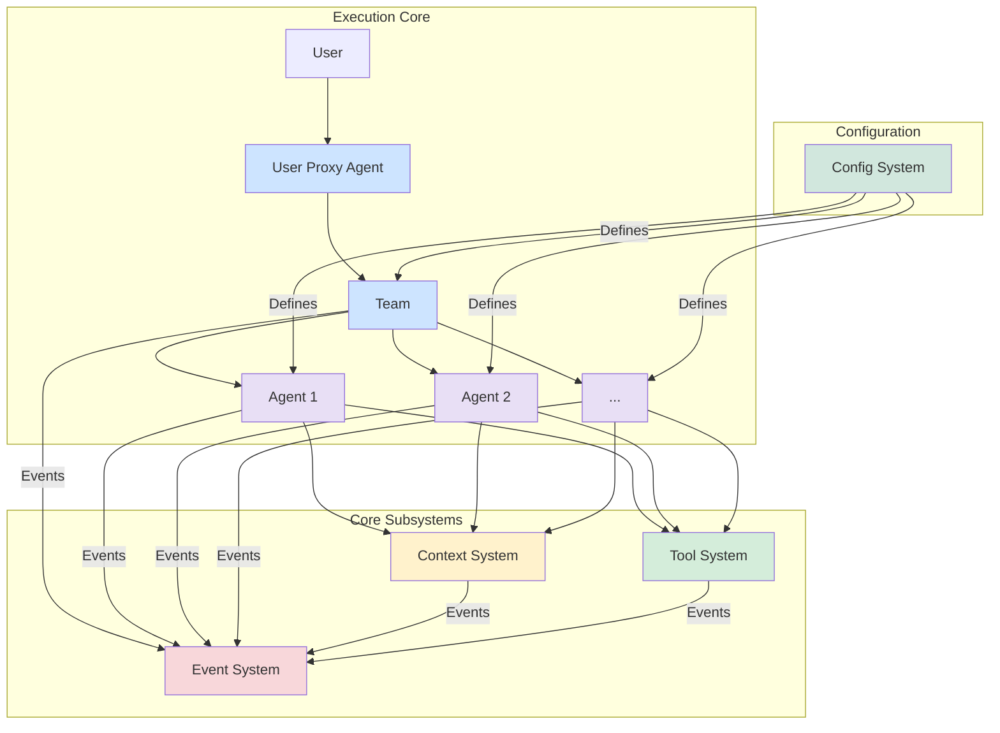
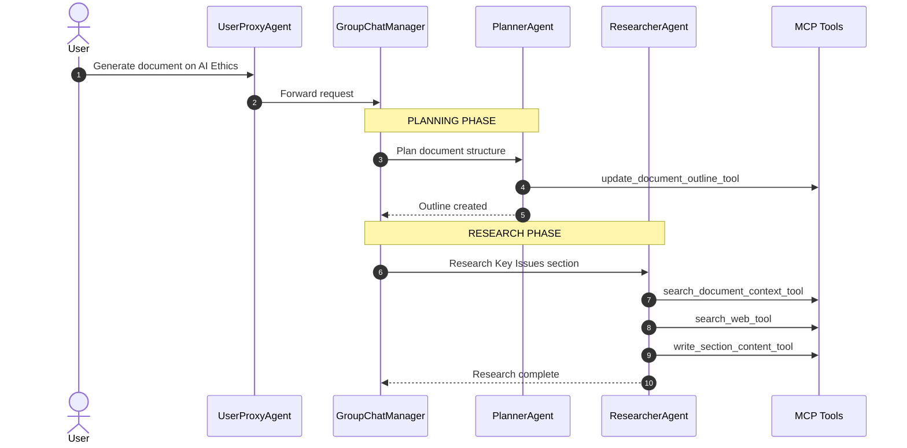
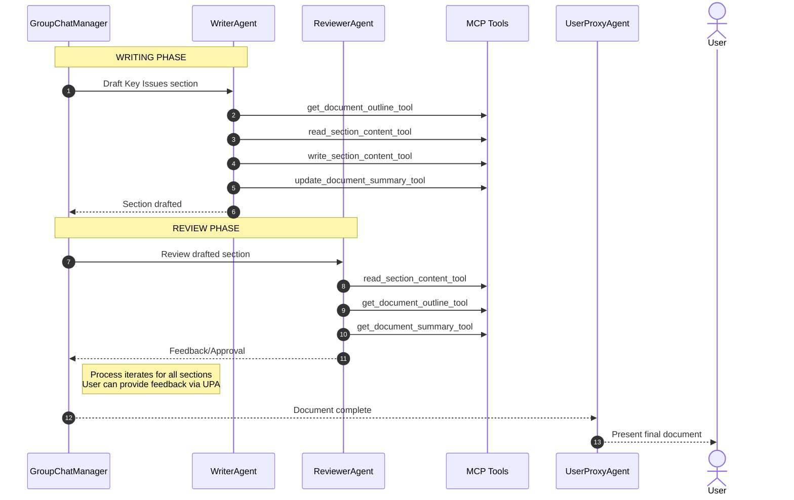

# RoboCo: System Architecture

## 1. Introduction

RoboCo is a multi-agent framework designed for building, orchestrating, and operating sophisticated AI systems. It provides a robust, modular, and observable environment for collaborative agents to perform complex tasks. This document outlines the high-level architecture of the framework and its core subsystems.

## 2. Architectural Vision

The design of RoboCo is guided by a set of core principles:

- **Modularity**: The system is composed of distinct, loosely coupled components that can be developed and scaled independently.
- **Observability**: All significant actions within the system are transparent and traceable through a centralized event stream.
- **Extensibility**: The framework can be easily extended with new agents, tools, and other capabilities.
- **Resilience**: The architecture supports stateful recovery, allowing agent workflows to be paused, resumed, and tolerant to failures.

## 3. High-Level Architecture

The RoboCo framework is composed of an **Execution Core** and four primary subsystems: the **Config System**, **Context System**, **Tool System**, and **Event System**. This architecture emphasizes a configuration-driven approach where individual agents are the primary consumers of the framework's capabilities.

### 3.1. Execution Core

The Execution Core is responsible for orchestrating agent collaboration based on a given configuration.

- **User Proxy Agent**: The primary interface between a human user and the agent system.
- **Team**: An orchestrator, defined by the **Config System**, that manages the interaction between a group of specialized agents to achieve a goal.
- **Agents (`Agent 1`, `Agent 2`, ...)**: Individual, specialized agents that perform specific tasks. Each agent independently consumes capabilities from the **Tool** and **Context** systems.

### 3.2. Core Subsystems

**Config System**
The Config System is the foundation of the framework's "config-based design" philosophy. It provides the schemas and tools to define the structure and behavior of the agent system, including the composition of teams, the roles of individual agents, and the tools they are permitted to use.

> For a detailed design, see: [Config-Based Design](./config-based-design.md)

**Context System**
The Context System provides the memory for the agent framework. It allows agents to persist and retrieve state, ensuring that workflows are resilient and can handle information that exceeds LLM context windows.

> For a detailed design, see: [Context Management Architecture](./context-management.md)

**Tool System**
The Tool System enables agents to interact with the outside world. It provides a secure and observable framework for discovering, executing, and monitoring tools like web search, code interpreters, and other APIs.

> For a detailed design, see: [Tool System Architecture](./tool-system.md)

**Event System**
The Event System is the central nervous system of the framework. It operates on a publish-subscribe model, where all other components emit events about their state and actions. This provides a unified stream for observability, debugging, and control.

> For a detailed design, see: [Event System Architecture](./event-system.md)

- **`GroupChat`**: A collaborative environment managed by the `GroupChatManager` where multiple agents can interact.
- **`Tools (via MCP)`**: Capabilities or functions (e.g., file I/O, web search, database access) that agents can invoke to perform actions or retrieve information. These are accessed via the Model Context Protocol (MCP).
- **`Context`**: Shared information and the state of the ongoing task, managed through mechanisms like the File-Based Context Management system.

## 3. Config-based Agents (AutoGen 2 Integration)

The foundation of RoboCo is built upon the `ag2` (AutoGen 2) library, leveraging its robust features for creating and managing conversational AI agents.

- **`Config-based Agents`**: Each agent in RoboCo is an instance of `ConversableAgent` (or a class derived from it). Agents are configured with a specific `system_message` defining their role, capabilities, and personality, along with an `llm_config`. This configuration-driven approach, detailed in [Config-based Design](./config_based_design.md), allows for flexible customization and easy definition of new agent types.
- **`GroupChatManager` for Orchestration**: In RoboCo, orchestration is handled by an `ag2.GroupChatManager`. It manages a `GroupChat` consisting of specialized agents and, potentially, the `UserProxyAgent`. The `GroupChatManager` is responsible for:
  - Receiving initial tasks and subsequent user inputs (often via the `UserProxyAgent`).
  - Determining the overall strategy and sequence of actions required to fulfill the task.
  - Selecting the appropriate specialized agent to speak or act next based on the current task state, conversation history, and predefined agent roles and capabilities.
- **Event-Driven Processing**: RoboCo employs manual iteration over the event stream generated by an agent's `run()` method (particularly the `GroupChatManager`'s `run()` call). Instead of relying on `ag2`'s default console output (`response.process()`), the RoboCo backend iterates event by event. This fine-grained control allows for:
  - **Observability**: Streaming progress updates, agent messages, and tool usage information to user interfaces or logging systems.
  - **State Management**: Tracking the progress of tasks and maintaining system state.
  - **Interruption Points**: Checking for user commands or other external signals between processing individual events, enabling responsive control.
- **User Command Queue**: To handle asynchronous user inputs and ensure interruptibility without blocking agent processing, a dedicated User Command Queue (e.g., `asyncio.Queue`) is utilized.
  - User commands from the UI (e.g., pause, resume, new instructions) are enqueued by the backend.
  - The main agent control loop checks this queue between processing events from the `ag2` event stream.
  - This mechanism allows the system to pause, resume, or redirect the agent workflow dynamically based on user commands.

## 4. File-Based Context Management

To address the limitations of LLM context windows and provide persistent, structured storage for tasks like long-form document generation, RoboCo incorporates a file-based context management sub-system. This system ensures that agents can work with large volumes of information effectively.

- **Rationale**:
  - **Scalability**: Enables agents to work with information volumes far exceeding typical prompt limits.
  - **Persistence**: Provides a persistent workspace for tasks, allowing for resumption and iterative refinement over extended periods.
  - **Structure**: Allows for structured organization of complex information, making it easier for agents to navigate and utilize relevant context.
- **Storage Structure**:
  - Contexts are stored under a configurable base path (defined by `ROBOCO_DATA_PATH`, e.g., `~/roboco_data/contexts/`).
  - Each document or task context has its own dedicated directory: `[document_id]/`.
  - Inside each `[document_id]/` directory, the following components are typically found:
    - `metadata.json`: Stores high-level information about the document or task, such as title, creation date, status, and other custom metadata.
    - `outline.json`: Defines the document's structure, including section order, hierarchy, and potentially section-specific goals, keywords, or instructions for agents.
    - `sections/`: A subdirectory containing the actual content of each section, typically as individual Markdown files (e.g., `01_introduction.md`, `02_main_body.md`).
    - `_document_summary.json`: A special file holding a running summary of key points, arguments, decisions, and data established across the entire document. This aids coherence, reduces redundancy, and helps agents maintain a consistent understanding as the document evolves.
- **Key MCP Tools for Context Interaction**: Agents interact with this file-based context via a set of specialized MCP tools:
  - `initialize_document_context_tool`: Creates the necessary directory structure and initial files for a new document context.
  - `get_document_outline_tool` / `update_document_outline_tool`: Read and modify the `outline.json` file.
  - `read_section_content_tool`: Reads content from section files, supporting chunking by token count to manage large sections.
  - `write_section_content_tool`: Writes or appends content to section files.
  - `list_document_sections_tool`: Lists available sections based on the `outline.json`.
  - `get_document_metadata_tool` / `update_document_metadata_tool`: Read and modify the `metadata.json` file.
  - `get_document_summary_tool` / `update_document_summary_tool`: Read and update the `_document_summary.json` file.
  - `search_document_context_tool`: Performs a keyword-based search across section content within the current document context.
  - `delete_document_context_tool`: Removes an entire document context and its associated files.

## 5. Core Interaction Workflow

A typical task execution in RoboCo follows this general pattern, emphasizing the event-driven nature and interruption handling:

1.  **Initiation**:
    - A user sends a request (e.g., "Write a research paper on AI ethics") via a user interface (e.g., WPS add-in, Streamlit web UI).
    - The RoboCo backend receives this request and typically passes it to the `UserProxyAgent`.
    - The `UserProxyAgent` initiates a chat with the `GroupChatManager`, sending the user's initial request.
    - The `GroupChatManager` starts its execution cycle: `chat_response_iterator = group_chat_manager.run(message=initial_user_request, ...)`.
2.  **Event-Driven Processing (RoboCo Backend Logic)**:
    - The backend iterates through the `chat_response_iterator` event by event: `for event in chat_response_iterator:`.
    - **Observability**: For each event, relevant information (e.g., which agent spoke, the content of the message, tool calls made, current status) is extracted. This information can be streamed to the UI for real-time progress monitoring or logged for later analysis.
    - **State Update**: The internal state tracking the task's progress is updated based on the event.
    - **Interruption Check**: Crucially, before fetching the next event from the iterator, the backend checks the User Command Queue for any pending user inputs.
3.  **Handling Interruptions**:
    - If a command exists in the User Command Queue (e.g., user issues a "Pause" command, or "Focus on section 2 instead"), the backend reacts:
      - It stops iterating the current `chat_response_iterator`, effectively pausing the ongoing agent interaction.
      - It processes the user's command. This might involve sending a new message to the `GroupChatManager` (e.g., conveying new instructions), modifying the task state directly, or triggering other system-level actions.
      - The `GroupChatManager`, upon receiving new input or detecting state changes, adapts its plan or instructs the specialized agents accordingly.
4.  **GroupChat Dynamics within Orchestration**:
    - The `GroupChatManager` manages the flow of conversation and action within the `GroupChat`.
    - It selects the next specialized agent to speak or act based on the overall plan, the current state of the conversation, and the defined capabilities of each agent.
    - Specialized agents perform their tasks, using their registered MCP tools as needed (e.g., accessing the file context, searching the web), and contribute their findings, drafted content, or results back to the group chat.
    - If an agent requires clarification or further input that only the human user can provide, the `GroupChatManager` can direct the conversation towards the `UserProxyAgent` to query the user.
5.  **Task Completion**:
    - The process of event iteration, agent interaction, and potential interruptions continues until the task is completed as defined by the `GroupChatManager`'s logic or a predefined termination condition (e.g., `max_turns` reached, all sections reviewed and approved).
    - The final result or output is then typically relayed to the user via the `UserProxyAgent`.

## 6. Extensibility with Model Context Protocol (MCP)

The **Model Context Protocol (MCP)** is an open standard that defines how AI agents (acting as clients) connect to and interact with external data sources, tools, and services (exposed by MCP servers) via a unified protocol. MCP is central to RoboCo's design, enabling modular, extensible, and secure integration of context and capabilities into agent workflows.

RoboCo leverages and extends MCP to provide a standardized interface for agents to access not only external resources (like web search or databases) but also the internal File-Based Context Management system (document outlines, sections, metadata, summaries).

- **MCP Clients**: These are the AI agents or applications within RoboCo (e.g., those built with `ag2`) that require access to external data, context, or tools to perform their tasks.
- **MCP Servers**: These are dedicated, often lightweight, servers that expose access to specific resources or capabilities through the MCP protocol. Each MCP server implements a standard interface for a particular type of resource (e.g., a server for document context operations, a server for file system access, a server for web search, a server for a specific database or business tool).
- **MCP Registration**: In the RoboCo framework, all tools registered with agents are essentially MCP protocol clients. When an agent decides to use a tool, it communicates with the appropriate MCP server to fulfill its request. This abstraction decouples the agent's logic from the specific implementation of the tool or resource access.

## 7. Design Principles

The system design is guided by several key design principles:

- **Modularity**: Each distinct resource, tool, or capability is encapsulated within its own MCP server. This promotes separation of concerns and makes the system easier to manage and update.
- **Extensibility**: Integrating new tools, data sources, or capabilities into RoboCo primarily involves developing a new MCP server for that resource and registering the corresponding client-side tool with the agents. This makes the framework highly extensible.
- **Security & Observability**: Since all external access is mediated through MCP servers, this provides a natural point for implementing security policies (authentication, authorization) and for comprehensive logging and auditing of resource access and tool usage.
- **Uniformity**: Agents interact with all diverse resources (file context, web search, databases, etc.) through the same MCP protocol. This simplifies the agent's reasoning process and the code required for tool integration, as they don't need to handle multiple different APIs or access methods.

The MCP server architecture ensures that agent workflows in RoboCo are robust, maintainable, and future-proof. It makes all context interactions explicit and protocol-driven, enhancing the overall reliability and transparency of the system.

## 8. Scenario: Document Generation

The RoboCo architecture is particularly well-suited for building sophisticated, multi-step document generation services. Here's how the components align in such a scenario:

### Agents

| Agent                | Role                  | Key MCP Tools Used                                                                                                                                  | Function                                                                                                |
| -------------------- | --------------------- | --------------------------------------------------------------------------------------------------------------------------------------------------- | ------------------------------------------------------------------------------------------------------- |
| **PlannerAgent**     | Document structuring  | `update_document_outline_tool`                                                                                                                      | Creates detailed document structure in `outline.json`, defining sections, subsections, and their order  |
| **ResearcherAgent**  | Information gathering | `search_web_tool`, `search_document_context_tool`, `write_section_content_tool`                                                                     | Gathers external information and existing context; saves findings to research notes or content sections |
| **WriterAgent**      | Content creation      | `get_document_outline_tool`, `read_section_content_tool`, `write_section_content_tool`, `get_document_summary_tool`, `update_document_summary_tool` | Drafts section content based on outline and research; maintains document coherence                      |
| **ReviewerAgent**    | Quality control       | `read_section_content_tool`, `get_document_outline_tool`, `get_document_summary_tool`                                                               | Reviews for accuracy, coherence, style, and adherence to outline; suggests revisions                    |
| **GroupChatManager** | Workflow management   | N/A (coordinates other agents)                                                                                                                      | Sequences tasks between agents; ensures dependencies are met; routes information                        |
| **UserProxyAgent**   | User interface        | N/A (interfaces with user)                                                                                                                          | Presents drafts for review; collects feedback; relays to GroupChatManager                               |

### MCP Tools (File Context Focused)

| Tool                                                           | Function                                               | Data Managed               |
| -------------------------------------------------------------- | ------------------------------------------------------ | -------------------------- |
| `initialize_document_context_tool`                             | Sets up workspace for a new document                   | Initial folder structure   |
| `get_document_outline_tool` / `update_document_outline_tool`   | Retrieve or modify document structure                  | `outline.json`             |
| `read_section_content_tool`                                    | Reads content from section files with chunking support | Section content files      |
| `write_section_content_tool`                                   | Writes content to section files (overwrite or append)  | Section content files      |
| `list_document_sections_tool`                                  | Lists sections based on the outline                    | N/A (reads `outline.json`) |
| `get_document_metadata_tool` / `update_document_metadata_tool` | Retrieve or modify document metadata                   | `metadata.json`            |
| `get_document_summary_tool` / `update_document_summary_tool`   | Retrieve or modify document summary                    | `_document_summary.json`   |
| `search_document_context_tool`                                 | Performs keyword search within document sections       | N/A (searches all files)   |
| `delete_document_context_tool`                                 | Archives or removes a document context                 | All document files         |

### Key Workflow: Document Generation Example

The document generation workflow can be broken down into two main parts: initial planning/research and content creation/review. The following diagrams illustrate this process:

#### Part 1: Planning and Research

#### Part 2: Writing and Review

This workflow is iterative. For instance, the `ReviewerAgent` might request revisions, leading the `GroupChatManager` to re-engage the `WriterAgent`. The `UserProxyAgent` can also inject user feedback at various stages.

## 9. Deployment and Maintenance

In a typical RoboCo deployment:

- **MCP Servers**: Each MCP server (for file context, web search, etc.) is deployed as an independent service. These can be containerized (e.g., using Docker) and managed by an orchestrator like Kubernetes for scalability and resilience, or run as simple processes depending on the scale.
- **RoboCo Backend**: The core RoboCo application, which includes the agent definitions, orchestration logic (including the `GroupChatManager` and `UserProxyAgent`), and the event loop processing, is deployed as a central service. This backend communicates with the various MCP servers.
- **Agents**: The agents themselves are part of the RoboCo backend's execution environment. They are instantiated and run as processes or threads within the backend application.
- **Configuration**: Agent configurations, system messages, LLM API keys, and `ROBOCO_DATA_PATH` are managed through configuration files or environment variables.

Maintenance involves updating individual MCP servers (if their underlying tools or resources change), updating the RoboCo backend with new agent logic or orchestration strategies, and managing the LLM configurations and dependencies.

## 10. Conclusion

The RoboCo v2 architecture, built on `ag2` and significantly enhanced with a robust Model Context Protocol (MCP) tool system and a dedicated file-based context management sub-system, provides a powerful and flexible platform for developing sophisticated multi-agent applications. Its core emphasis on modularity, extensibility, observability, interruptibility, and scalable context handling makes it particularly suitable for complex, iterative tasks such as automated document generation, research synthesis, and other knowledge-intensive workflows.

By clearly defining agent roles, providing them with standardized access to tools and context via MCP, and orchestrating their collaboration effectively through `ag2`'s `GroupChatManager` and an event-driven backend, RoboCo enables the creation of advanced AI-driven solutions that can tackle challenges beyond the scope of single-agent systems.
