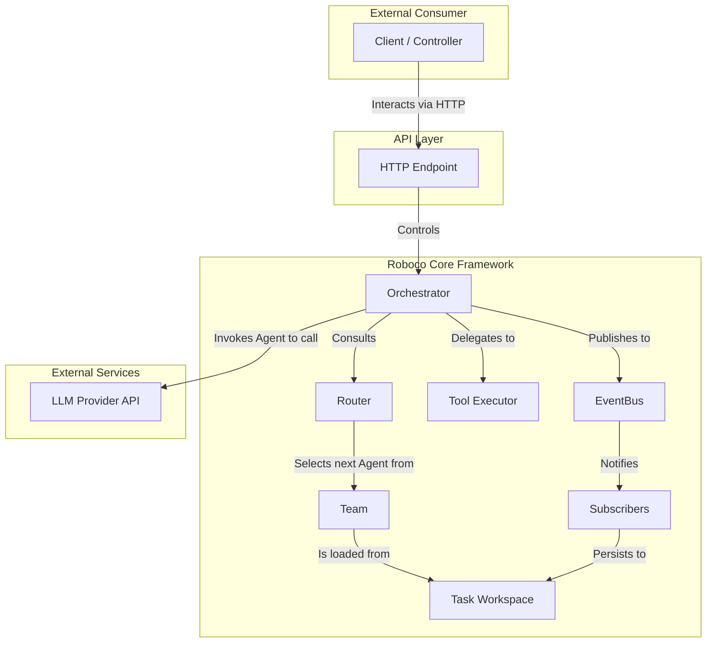
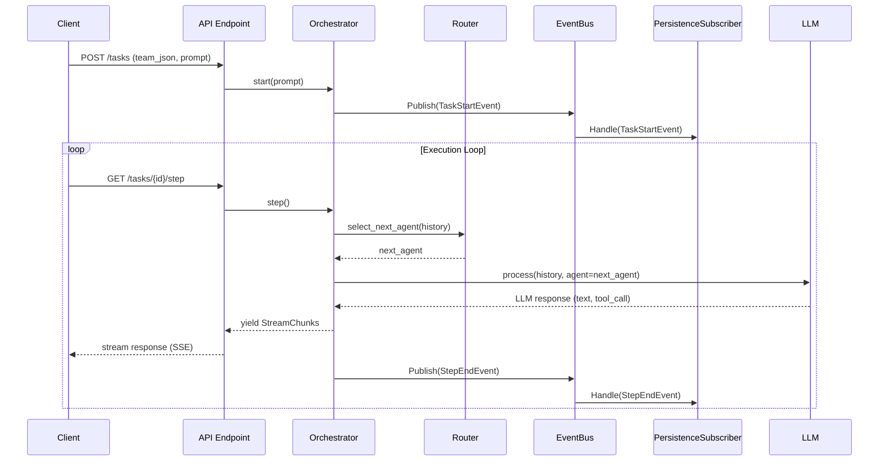

# Roboco: System Architecture

This document provides a high-level overview of the Roboco framework's architecture. It is the master blueprint that illustrates how the components of the system fit together and interact.

## 1. Core Mission: What Problem Does Roboco Solve?

The Roboco framework is being built to serve as the **headless, config-driven backend for the Agentok Studio**, a visual orchestration environment for multi-agent systems. It is designed to solve the critical limitations of existing agent frameworks that prevent them from being used in production-grade, user-facing applications.

**Q: What is the primary design problem?**

**A:** Most agent frameworks are **code-first**, requiring developers to define agents, tools, and collaboration logic in imperative Python code. This is inflexible, difficult to abstract, and completely unsuitable for a visual builder like Agentok Studio.

**Roboco's Solution:** A **config-driven architecture**. The entire system—agents, tools, prompts, and collaboration logic—is defined in a declarative `team.json` file. This allows Agentok Studio to act as a visual front-end that generates this configuration, separating the _what_ from the _how_.

**Q: Why do current agent systems feel like "black boxes"?**

**A:** They lack sufficient observability. It is often impossible to understand _why_ a system made a particular decision or to debug it when it fails. This makes them untrustworthy for critical tasks.

**Roboco's Solution:** A **dual-channel output system** and a **persistent task workspace**. The framework produces both a real-time content stream for UIs and a series of structured `ExecutionEvent`s for a complete, auditable log of every decision, tool call, and state change.

**Q: How does Roboco move beyond being a "toy"?**

**A:** "Toy" systems typically use simple, in-memory message lists, which cannot handle large data artifacts (like files or long reports) and quickly run into LLM context window limits on long-running tasks.

**Roboco's Solution:** A **robust data and memory model**. By using a persistent `Task Workspace`, an `Artifact Store` for large data blobs, and giving agents `memory_search` tools to actively query their own history, the framework can scale to complex tasks without being constrained by context windows.

**Q: How is multi-agent collaboration handled?**

**A:** Many frameworks implement a simple conversational loop that often devolves into a single-agent-like sequence. True multi-agent collaboration, where different specialized agents contribute at the right time, is difficult to orchestrate.

**Roboco's Solution:** A decoupled **`Orchestrator` and `Router`**. The `Router` implements a `collaboration_model` from the configuration (e.g., a graph), making it the explicit decision-maker for which agent should act next. This puts flexible, logic-driven collaboration at the core of the framework.

## 2. Architectural Vision

The Roboco framework is designed as a **headless, config-driven engine** for executing complex tasks with teams of AI agents. The core principles are:

- **Decoupling**: The core engine is a backend framework, completely decoupled from any specific client or UI.
- **Observability**: Every aspect of a task's execution is captured through a robust eventing and persistence layer.
- **Control**: The execution flow is managed by an external consumer, allowing for fine-grained control and real-time user interruptions.
- **Configuration as Code**: The definition of an agent team and its capabilities is based on declarative configuration files, not imperative code.

## 3. Component Architecture

This diagram illustrates the **static structure** of the Roboco framework, showing the core components and their relationships.

### Component Descriptions

- **Configuration (`team.json`) & Task Workspace**: The declarative source of truth and the on-disk persistence layer for a task.
  - _For details, see: [Config-Driven Architecture](./config-driven-architecture.md)_
- **Team**: A passive, in-memory model representing the complete state of a task (agents, tools, history).
- **Agent**: The fundamental unit of intelligence. An agent uses an LLM and tools to generate the next `TaskStep`.
  - _Design Note: Unlike some frameworks where an agent acts as the executor (e.g., AutoGen's `UserProxyAgent`), we explicitly separate the reasoning of an agent from the privileged act of execution. This enhances security and simplifies the agent's role._
- **Router**: A runtime component, created from the `collaboration_model` in the configuration. The `Orchestrator` consults the `Router` to determine which agent should act next based on the defined strategy (e.g., graph-based routing). This component is the engine of the multi-agent collaboration.
- **Tool Executor**: A dedicated component for securely executing tool calls requested by an agent.
- **Orchestrator**: The active execution engine. It drives the task forward by consulting the `Router` to select an agent, invoking that agent, executing any resulting tool calls, and managing the overall state.
- **EventBus & Subscribers**: A pub/sub system for decoupling system events (like logging and persistence) from the main execution flow.
- **Dual-Output System**: The Orchestrator produces two outputs: a real-time `StreamChunk` for content and `ExecutionEvent`s for integration.
  - _For details on all runtime components, see: [Task-Oriented Collaboration](./collaboration-with-tools.md)_
- **Data & Memory Model**: The system for managing data, including the `TaskStep` structure and agent memory.
  - _For details, see: [Data and Memory](./data-and-memory.md)_

## 4. Key Workflow: Sequence Diagram

This diagram illustrates the **dynamic flow** of a typical task execution from start to finish, showing the sequence of interactions between the components defined above.

This architecture provides a robust, scalable, and observable foundation for building powerful and reliable multi-agent systems.
