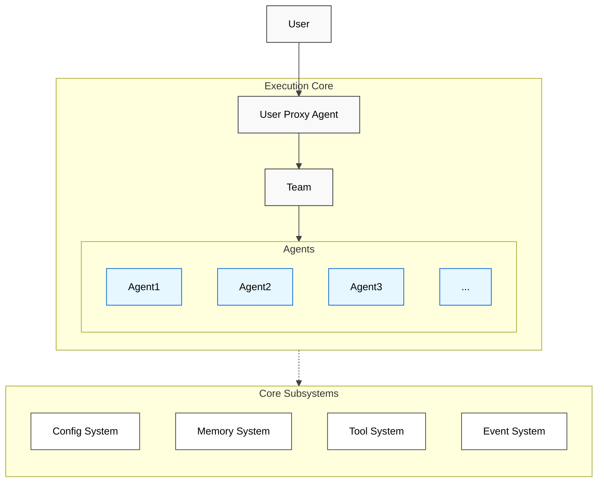
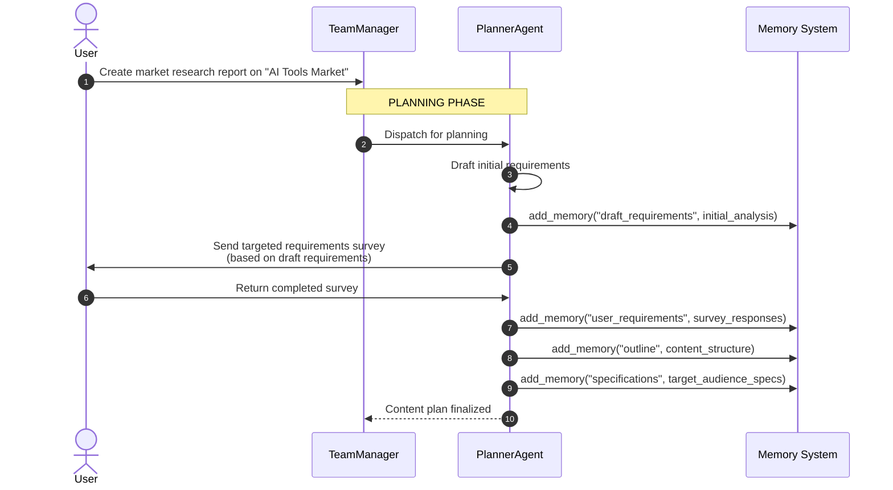
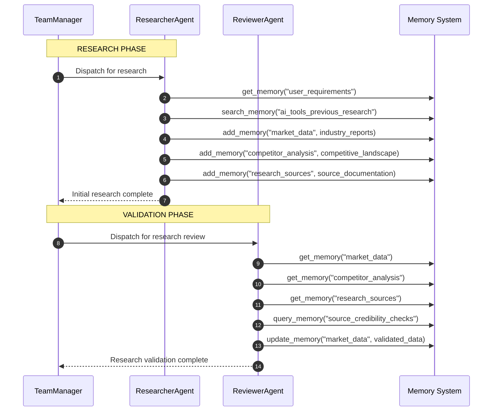
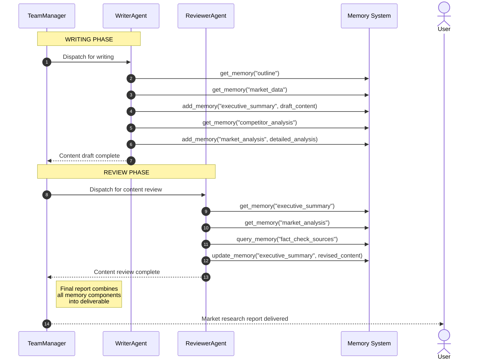

# System Architecture Design

## 1. Introduction

Roboco is a multi-agent framework designed for building, orchestrating, and operating sophisticated AI systems. It provides a robust, modular, and observable environment for collaborative agents to perform complex tasks. This document outlines the high-level architecture, its core components, and the design principles that govern its evolution.

The architecture is designed to meet the following key non-functional requirements:

- **Scalability**: Support for teams of 100+ specialized agents operating concurrently.
- **Resilience**: High availability with stateful recovery from agent and component failures.
- **Extensibility**: A pluggable architecture for integrating new tools, models, and storage backends.
- **Performance**: Sub-second latency for core message passing and event processing.

## 2. Design Principles

The system design is guided by several key architectural principles. Each principle is a strategic choice made to satisfy the non-functional requirements outlined in the introduction.

- **Modular by Design**: Components are designed with high cohesion and low coupling, communicating through well-defined, versioned APIs. This principle is critical for achieving our **Scalability** and **Extensibility** requirements, allowing subsystems to be developed, deployed, and scaled independently.
- **Event-First Architecture**: All significant state changes and actions within the system are communicated via a central event bus. This approach is fundamental to meeting our **Performance** and **Resilience** goals while enabling system-wide observability.
- **Secure by Default**: The architecture incorporates security at every layer, from agent authentication to fine-grained tool authorization and comprehensive audit trails. This directly supports the core requirement of a secure and resilient system.
- **Human-in-the-Loop by Design**: The system is built to facilitate human oversight and intervention. Control points are intentionally designed into workflows, ensuring the system is not only automated but also governable. This is crucial for complex, high-stakes tasks.
- **Configuration as Code**: The structure, behavior, and permissions of agent teams are defined in declarative configuration files. This enables version control, automated deployment, and repeatable collaboration patterns, directly contributing to the **Resilience** and **Extensibility** of the framework.

## 3. High-Level Architecture

The Roboco framework is composed of an **Execution Core** and the **Core Subsystems** that support it.



The diagram illustrates the primary relationship: the `Execution Core` is defined by and utilizes the `Core Subsystems`. Specifically, the `Config System` defines the team, which in turn uses the `Memory`, `Tool`, and `Event` Systems to orchestrate its agents.

### 3.1 Execution Core

The Execution Core is responsible for orchestrating agent collaboration based on a given configuration.

- **User Proxy Agent**: The primary interface between a human user and the agent system.
- **Team**: An orchestrator, defined by the **Config System**, that manages the interaction between a group of specialized agents to achieve a goal.
- **Agents (`Agent 1`, `Agent 2`, ...)**: Individual, specialized agents that perform specific tasks. Each agent independently consumes capabilities from the **Tool** and **Memory** systems.

### 3.2 Core Subsystems

**Config System**
The Config System is the foundation of the framework's "config-as-code" philosophy. It provides the schemas and tools to define the structure and behavior of the agent system, including the composition of teams, the roles of individual agents, and the tools they are permitted to use.

> For a detailed design, see: [Config-Based Design](./config-based-design.md)

**Memory System**
The Memory System provides agents with a robust capacity for learning and context retention across complex, long-running tasks. Its architecture is designed to manage information of varying types and sizes, ensuring that agents have access to relevant context without exceeding LLM token limits.

### Architecture Overview

- **Hybrid Storage Model**: The system integrates multiple storage strategies to optimize for different data types. It combines a **Vector Store** for fast semantic search on unstructured data with a **Key-Value Store** for structured metadata, enabling rich, filterable queries.
- **Chunking and Retrieval Engine**: To handle large documents and long conversations, all incoming content is passed through an intelligent chunking engine. This engine segments data into semantically meaningful pieces. The retrieval process then reassembles these chunks based on relevance, ensuring the most pertinent information is provided to the agent within its context window.

### Memory Interface

The MemoryManager provides two levels of access:

1. **Tool Interface**: Memory operations are registered as tools that agents can call through LLM function calling
2. **Framework API**: Direct programmatic access for framework-level operations

| Tool Name       | MemoryManager Method | Description                                               |
| --------------- | -------------------- | --------------------------------------------------------- |
| `add_memory`    | `add_memory()`       | Adds content with automatic chunking for large items      |
| `query_memory`  | `query_memory()`     | Retrieves relevant information with token limit awareness |
| `list_memory`   | `list_memory()`      | Lists memories with metadata filtering and pagination     |
| `get_memory`    | `get_memory()`       | Retrieves specific memory by ID with chunk information    |
| `update_memory` | `update_memory()`    | Updates existing memory while preserving structure        |
| `delete_memory` | `delete_memory()`    | Removes memory and associated chunks/metadata             |
| `clear_memory`  | `clear_memory()`     | Clears session memories with backup options               |
| `search_memory` | `search_memory()`    | Performs semantic search with relevance ranking           |

**Agent Access (Tool Interface)**: LLMs can decide when and how to use memory through tool calls
**Framework Access (Direct API)**: Framework code calls MemoryManager methods directly for system operations

> **Implementation Details**: For a comprehensive discussion of the memory architecture, including the storage provider pattern, chunking strategies, and data models, see the [Memory System Design](./memory-system.md) document.

**Tool System**
The Tool System enables agents to interact with external systems and capabilities. It provides a secure and observable framework for discovering, executing, and monitoring tools.

**Event System**
The Event System is the central nervous system of the framework. It operates on a publish-subscribe model, where all other components emit events about their state and actions. This provides a unified stream for observability, debugging, and control.

### 3.3 Extensibility

The framework supports tool extensibility through multiple approaches:

- **Native Tools**: Built-in tools implemented directly in the framework
- **Model Context Protocol (MCP)**: Integration with external services through the MCP standard
- **Custom Integrations**: Direct API integrations for specialized requirements

The MCP approach provides standardized tool integration where agents act as MCP clients connecting to external MCP servers that expose specific capabilities (web search, databases, etc.). This promotes modularity and makes tool integration uniform across different resource types.

> For a detailed design, see: [Tool System Architecture](./tool-system.md)

## 4. Memory System

The Memory System provides agents with a robust capacity for learning and context retention across complex, long-running tasks. Its architecture is designed to manage information of varying types and sizes, ensuring that agents have access to relevant context without exceeding LLM token limits.

### Architecture Overview

- **Hybrid Storage Model**: The system integrates multiple storage strategies to optimize for different data types. It combines a **Vector Store** for fast semantic search on unstructured data with a **Key-Value Store** for structured metadata, enabling rich, filterable queries.
- **Chunking and Retrieval Engine**: To handle large documents and long conversations, all incoming content is passed through an intelligent chunking engine. This engine segments data into semantically meaningful pieces. The retrieval process then reassembles these chunks based on relevance, ensuring the most pertinent information is provided to the agent within its context window.

### MemoryManager Implementation

The MemoryManager class implements all memory operations and provides both framework API access and tool interfaces:

```python
class MemoryManager:
    def __init__(self, config: MemoryConfig):
        self.backend = Mem0Backend(config)
        self.chunker = IntelligentChunker()
        self.retriever = TokenAwareRetriever()

    # Core memory operations
    async def add_memory(self, content: str, metadata: dict = None) -> str:
        """Adds content with automatic chunking for large items"""

    async def query_memory(self, query: str, max_tokens: int = 2000) -> str:
        """Retrieves relevant information with token limit awareness"""

    async def list_memory(self, filters: dict = None) -> List[dict]:
        """Lists memories with metadata filtering and pagination"""

    async def get_memory(self, memory_id: str) -> Memory:
        """Retrieves specific memory by ID with chunk information"""

    async def update_memory(self, memory_id: str, content: str) -> str:
        """Updates existing memory while preserving structure"""

    async def delete_memory(self, memory_id: str) -> str:
        """Removes memory and associated chunks/metadata"""

    async def clear_memory(self, session_id: str) -> str:
        """Clears session memories with backup options"""

    async def search_memory(self, query: str, limit: int = 5) -> List[dict]:
        """Performs semantic search with relevance ranking"""
```

### Memory Interface

The MemoryManager methods are exposed to agents through the tool system:

| Tool Name       | MemoryManager Method | Description                                               |
| --------------- | -------------------- | --------------------------------------------------------- |
| `add_memory`    | `add_memory()`       | Adds content with automatic chunking for large items      |
| `query_memory`  | `query_memory()`     | Retrieves relevant information with token limit awareness |
| `list_memory`   | `list_memory()`      | Lists memories with metadata filtering and pagination     |
| `get_memory`    | `get_memory()`       | Retrieves specific memory by ID with chunk information    |
| `update_memory` | `update_memory()`    | Updates existing memory while preserving structure        |
| `delete_memory` | `delete_memory()`    | Removes memory and associated chunks/metadata             |
| `clear_memory`  | `clear_memory()`     | Clears session memories with backup options               |
| `search_memory` | `search_memory()`    | Performs semantic search with relevance ranking           |

> **Implementation Details**: For a comprehensive discussion of the memory architecture, including the storage provider pattern, chunking strategies, and data models, see the [Memory System Design](./memory-system.md) document.

## 5. Tool System

The Tool System is designed to provide agents with secure, reliable, and observable access to external capabilities. Its architecture is founded on the principles of protocol-based interaction and separation of concerns, ensuring that agent logic remains decoupled from tool implementation details.

- **Multiple Integration Patterns**: The system supports multiple tool integration patterns. For **external tools**, the framework mandates the use of the **Model Context Protocol (MCP)** to ensure a uniform, secure, and discoverable interface. For **built-in tools**, a more direct and optimized internal API is used to maximize performance for core functionalities.

  ```python
  # Example of an MCP-compliant tool endpoint
  @tool_protocol.mcp_endpoint("web_search")
  async def search(query: str, filters: dict):
      # Implementation logic for the search tool
      return await brave_search_api.call(query, **filters)
  ```

- **Separation of Concerns**: The system distinguishes between the **Tool Registry** for discovery, the **Execution Engine** for invocation, and the **Physical Tools** themselves. This allows each part of the system to be managed and scaled independently.

**Key Capabilities**

1.  **Execution Modes**: The Execution Engine supports multiple invocation patterns to suit different use cases:

    - **Synchronous**: For fast, blocking operations (<500ms).
    - **Asynchronous**: For long-running tasks, providing progress updates via callbacks.
    - **Streaming**: For tools that produce continuous output, such as LLM responses.

2.  **Security Model**: A multi-layered security model governs tool access:
    - **Authentication**: All agents and tools must authenticate using OAuth 2.0 or managed API keys.
    - **Authorization**: Access is controlled by per-agent or per-team capability matrices defined in the configuration. These policies specify which agents can execute which tools and enforce rate limits.
    - **Auditing**: Every tool call generates a `tool.call.initiated` event and a corresponding `completed` or `failed` event, creating a comprehensive and immutable audit trail.

> For the full specification, including the MCP definition, security policy schema, and monitoring integration, see the [Tool System Design](./tool-system.md) document.

## 6. Event System

The Event System is the observability and control backbone of the framework. It is designed for high throughput and low latency, enabling real-time monitoring and dynamic intervention in agent workflows.

The system is built around a central **Event Bus** that routes events between producers and consumers. This decouples components and allows for flexible integration with external monitoring and control systems.

- **Unified Event Schema**: All events adhere to a standardized, versioned JSON schema. This ensures consistency and simplifies the development of consumers.

  ```typescript
  // Example of a standardized RobocoEvent
  interface RobocoEvent {
    eventId: string; // UUID for the event
    timestamp: ISO8601; // UTC timestamp
    eventType: string; // e.g., "agent.message.sent", "tool.call.failed"
    payload: Record<string, unknown>; // Event-specific data
    metadata: {
      sessionId: string; // Correlates all events in a single workflow
      source: string; // e.g., "Agent/Planner", "Tool/WebSearch"
    };
  }
  ```

- **Bidirectional Communication**: The event bus is not just for observability; it's also a control plane.
  - **Outbound Events**: Components publish events about their state and actions (e.g., `agent.decision.made`).
  - **Inbound Events**: External systems (or human supervisors) can publish control events (e.g., `control.collaboration.pause`) to dynamically influence the workflow.

The Event System is designed to meet stringent performance and reliability targets suitable for production environments.

| Metric         | Target                 | Description                                                               |
| -------------- | ---------------------- | ------------------------------------------------------------------------- |
| **Throughput** | >10,000 events/sec     | The number of events the bus can process per second.                      |
| **Latency**    | <50ms (p99)            | The time from when an event is published to when it is delivered.         |
| **Durability** | At-least-once delivery | Ensures that critical events are not lost, with configurable persistence. |

> For a detailed exploration of the event-driven architecture, including the bridge pattern for framework integration and the control plane design, see the [Event System Design](./event-sytem.md) document.

## 7. Framework Extensibility

The framework is designed with extensibility as a core principle, enabling seamless integration of new capabilities across multiple dimensions. This extensible architecture ensures the framework can adapt to evolving requirements and integrate with diverse technology stacks.

### 7.1 Tool Extensibility

The Tool System provides multiple pathways for extending agent capabilities with new tools and integrations:

**Native Tool Implementation**

- Direct Python implementation within the framework
- Full access to framework internals and optimizations
- Example: Custom database connectors, specialized algorithms

**Model Context Protocol (MCP) Integration**

- Standardized protocol for external tool services
- Language-agnostic tool development (Python, Node.js, etc.)
- Automatic tool discovery and registration
- Example: Web search services, API integrations, specialized AI models

**Direct API Integration**

- RESTful API endpoints as tools
- GraphQL and other modern API patterns
- Authentication and rate limiting support
- Example: CRM systems, cloud services, third-party analytics

**Plugin Architecture**

- Hot-pluggable tool modules
- Configuration-driven tool activation
- Version management and dependency resolution
- Example: Domain-specific tool packages, community contributions

### 7.2 Storage Backend Extensibility

The Storage System's provider pattern enables support for diverse storage solutions:

**Cloud Storage Providers**

- AWS S3 with multi-region support
- Azure Blob Storage with enterprise integration
- Google Cloud Storage with AI/ML optimizations
- Custom cloud providers through standardized interfaces

**Specialized Storage Systems**

- Vector databases (Qdrant, Pinecone, Weaviate) for semantic search
- Graph databases (Neo4j, Amazon Neptune) for relationship modeling
- Time-series databases (InfluxDB, TimescaleDB) for temporal data
- Distributed file systems (HDFS, Ceph) for large-scale deployments

**Hybrid Storage Architectures**

- Multi-tier storage with automatic data lifecycle management
- Caching layers for performance optimization
- Replication and backup strategies
- Cross-provider data migration and synchronization

### 7.3 LLM Provider Extensibility

The framework supports multiple LLM providers through a unified interface:

**Major Commercial Providers**

- OpenAI (GPT-4, GPT-4 Turbo, GPT-4o)
- Anthropic (Claude 3.5 Sonnet, Claude 3 Opus)
- Google (Gemini Pro, Gemini Ultra)
- Microsoft Azure OpenAI Service

**Open Source Models**

- Local deployment with Ollama, LM Studio
- Self-hosted inference servers (vLLM, TensorRT-LLM)
- Fine-tuned domain-specific models
- Quantized models for resource-constrained environments

**Specialized AI Services**

- Code generation models (GitHub Copilot, CodeT5)
- Multimodal models (GPT-4 Vision, LLaVA)
- Domain-specific models (legal, medical, financial)
- Real-time inference and streaming capabilities

**Provider Configuration**

```yaml
llm_providers:
  primary:
    provider: "openai"
    model: "gpt-4o"
    api_key: ${OPENAI_API_KEY}

  fallback:
    provider: "anthropic"
    model: "claude-3-5-sonnet-20241022"
    api_key: ${ANTHROPIC_API_KEY}

  local:
    provider: "ollama"
    model: "llama3.1:8b"
    endpoint: "http://localhost:11434"
```

### 7.4 Observability Platform Integration

The Event System enables integration with diverse monitoring and observability platforms:

**Application Performance Monitoring (APM)**

- Datadog for comprehensive application monitoring
- New Relic for performance insights and alerting
- Dynatrace for AI-powered application intelligence
- Custom metrics collection and dashboard creation

**Log Management Systems**

- ELK Stack (Elasticsearch, Logstash, Kibana) for log analytics
- Splunk for enterprise log management and security
- Fluentd/Fluent Bit for unified logging layers
- CloudWatch, Azure Monitor for cloud-native logging

**Event Streaming Platforms**

- Apache Kafka for high-throughput event streaming
- Redis Streams for lightweight event processing
- Amazon EventBridge for serverless event routing
- Custom webhook endpoints for real-time notifications

**Business Intelligence & Analytics**

- Grafana for custom visualization dashboards
- Tableau for business intelligence integration
- Power BI for Microsoft ecosystem integration
- Custom analytics pipelines with Apache Spark

**Observability Configuration**

```yaml
observability:
  metrics:
    provider: "datadog"
    api_key: ${DATADOG_API_KEY}
    tags:
      environment: "production"
      service: "roboco"

  logs:
    provider: "elasticsearch"
    endpoint: "https://elasticsearch:9200"
    index_pattern: "roboco-logs-*"

  events:
    provider: "kafka"
    brokers: ["kafka1:9092", "kafka2:9092"]
    topic: "roboco-events"
```

### 7.5 Integration Patterns

**Configuration-Driven Extension**

- YAML/JSON configuration for new integrations
- Environment variable injection for secrets
- Runtime configuration updates without restarts
- Validation and schema checking for configurations

**Plugin Discovery & Loading**

- Automatic plugin detection in configured directories
- Dependency resolution and compatibility checking
- Hot-loading capabilities for development workflows
- Plugin lifecycle management (install, update, remove)

**API Gateway Pattern**

- Unified API interface for external integrations
- Rate limiting and authentication middleware
- Request/response transformation capabilities
- Circuit breaker patterns for resilience

**Event-Driven Integration**

- Publish-subscribe patterns for loose coupling
- Event schemas for integration contracts
- Dead letter queues for failed event processing
- Event replay capabilities for debugging

This extensible architecture ensures the framework can evolve with changing technological landscapes while maintaining backward compatibility and operational stability.

## 8. Cross-Cutting Concerns

Several concerns are fundamental to the entire framework and are addressed systematically across multiple subsystems.

### Security

Security is a first-class citizen in the Roboco framework, not an afterthought. It is implemented through a defense-in-depth strategy:

- **Authentication**: All external interactions, particularly with tools via the **MCP**, require authenticated agents and services (via OAuth 2.0 or API keys).
- **Authorization**: The **Config System** defines fine-grained permissions, specifying which agents can access which tools. These policies are enforced by the **Tool System's** execution engine.
- **Auditing**: The **Event System** provides a comprehensive and immutable audit log of all actions, including every tool call and configuration change.

### Observability

System-wide observability is achieved through the **Event-First Architecture**.

- **Centralized Event Bus**: The **Event System** acts as the single source of truth for system state and activity, capturing everything from agent messages to tool performance.
- **Structured Events**: The use of a unified event schema allows for consistent processing, monitoring, and alerting by external platforms.
- **Real-time Control**: The bidirectional nature of the event bus allows monitoring systems to inject control events, enabling dynamic, human-in-the-loop oversight.

### Configuration Management

The framework's behavior is driven by declarative configuration, managed as code.

- **Declarative Definitions**: The **Config System** allows the entire agent team structure, including roles, tools, and workflows, to be defined in version-controllable files.
- **Dynamic Reloading**: The system can dynamically reload configurations in response to `control.configuration.reload` events from the **Event System**, allowing for updates without requiring a full system restart.

## 9. Scenario: Market Research Writing Task

The Roboco architecture is particularly well-suited for building sophisticated, multi-step content creation workflows. Here's how the components align in a market research writing scenario:

### Agents

| Agent               | Role                  | Key Memory Tools Used                                      | Function                                                                     |
| ------------------- | --------------------- | ---------------------------------------------------------- | ---------------------------------------------------------------------------- |
| **PlannerAgent**    | Content structuring   | `add_memory`, `update_memory`                              | Creates research outline and writing plan, stores content strategy in memory |
| **ResearcherAgent** | Information gathering | `add_memory`, `search_memory`, `query_memory`              | Gathers market data, industry reports, and competitive intelligence          |
| **ReviewerAgent**   | Quality assurance     | `get_memory`, `search_memory`, `list_memory`               | Reviews research quality, validates sources, and reviews content drafts      |
| **WriterAgent**     | Content creation      | `get_memory`, `add_memory`, `update_memory`, `list_memory` | Drafts sections, creates content, stores drafts and revisions                |
| **TeamManager**     | Workflow coordination | N/A (coordinates other agents)                             | Sequences tasks between agents; manages dependencies and deadlines           |

### Memory Tool Usage Examples

| Tool            | Usage Context                      | Data Pattern                       |
| --------------- | ---------------------------------- | ---------------------------------- |
| `add_memory`    | Save research findings & drafts    | Structured content with metadata   |
| `get_memory`    | Retrieve specific data or sections | Chunked reading for large reports  |
| `search_memory` | Find related research or sources   | Semantic and keyword matching      |
| `query_memory`  | Discover relevant past reports     | Vector-based semantic search       |
| `update_memory` | Revise drafts and content versions | Update existing content blocks     |
| `list_memory`   | Track writing progress and status  | Session memory management          |
| `clear_memory`  | Backup before major revisions      | Point-in-time content preservation |

### Key Workflow: Market Research Report Creation

The content creation workflow demonstrates memory-driven collaboration between specialized writing agents:

#### Part 1: Planning



#### Part 2: Research & Validation



#### Part 3: Writing & Review



This workflow is collaborative and iterative. The `ReviewerAgent` might request revisions, leading the `TeamManager` to re-engage the `WriterAgent` with specific feedback. Users can also provide feedback or content direction at any stage through control events, and the memory system ensures all research, drafts, and revisions are preserved for future reference or similar projects.

## 10. Deployment and Maintenance

In a typical Roboco deployment:

- **Tool Services**: External tool services (for web search, databases, etc.) are deployed as independent services. These can be containerized and managed by orchestrators like Kubernetes for scalability and resilience.
- **Storage Infrastructure**: Storage backend (local filesystem, AWS S3, Azure Blob) is configured based on deployment requirements. Cloud deployments typically use object storage for scalability and durability.
- **Roboco Backend**: The core Roboco application, which includes the agent definitions, team orchestration logic, and event processing, is deployed as a central service. This backend communicates with external tool services and storage through their respective systems.
- **Agents**: The agents themselves are part of the Roboco backend's execution environment. They are instantiated and run as processes or threads within the backend application.
- **Configuration**: Agent configurations, system messages, LLM API keys, and storage provider settings are managed through configuration files or environment variables.

Maintenance involves updating tool services as needed, updating the Roboco backend with new agent logic or orchestration strategies, and managing the LLM configurations and dependencies.

## 11. Conclusion

The framework provides a powerful and flexible platform for developing sophisticated multi-agent applications. Its core emphasis on modularity, extensibility, observability, and human-in-the-loop collaboration makes it particularly suitable for complex, iterative tasks.

By clearly defining component responsibilities and their interactions through a robust, event-driven architecture, the framework enables the creation of advanced AI-driven solutions that can tackle challenges beyond the scope of single-agent systems.
