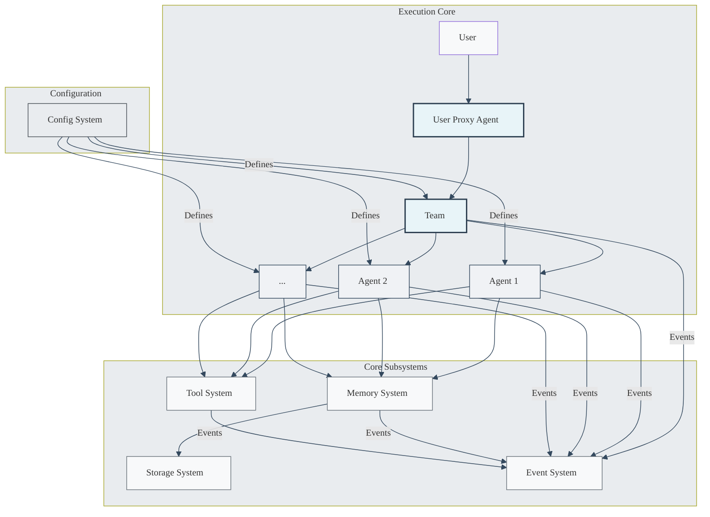
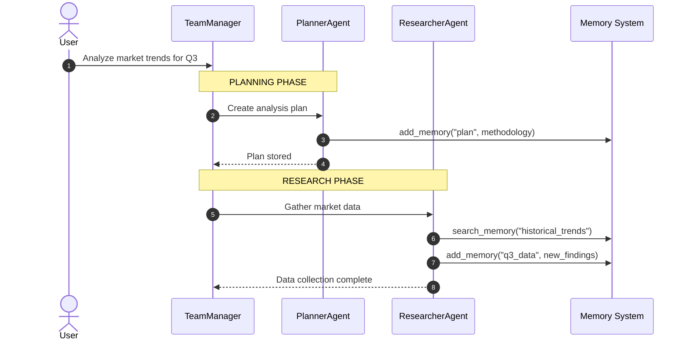
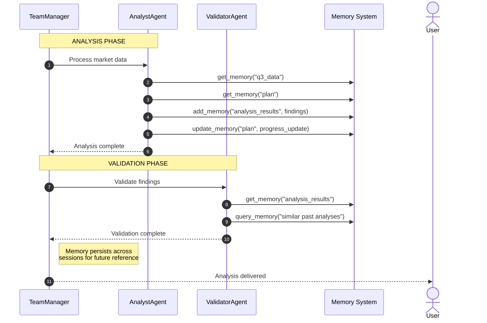

# Roboco System Architecture

## 1. Introduction

Roboco is a multi-agent framework designed for building, orchestrating, and operating sophisticated AI systems. It provides a robust, modular, and observable environment for collaborative agents to perform complex tasks. This document outlines the high-level architecture of the framework and its core subsystems.
The design of Roboco is guided by a set of core principles:

- **Modularity**: The system is composed of distinct, loosely coupled components that can be developed and scaled independently.
- **Observability**: All significant actions within the system are transparent and traceable through a centralized event stream.
- **Extensibility**: The framework can be easily extended with new agents, tools, and other capabilities.
- **Resilience**: The architecture supports stateful recovery, allowing agent workflows to be paused, resumed, and tolerant to failures.

## 2. High-Level System Architecture

The Roboco framework is composed of an **Execution Core** and five primary subsystems: the **Config System**, **Memory System**, **Tool System**, **Storage System**, and **Event System**. This architecture emphasizes a configuration-driven approach where individual agents are the primary consumers of the framework's capabilities.



### 2.1. Execution Core

The Execution Core is responsible for orchestrating agent collaboration based on a given configuration.

- **User Proxy Agent**: The primary interface between a human user and the agent system.
- **Team**: An orchestrator, defined by the **Config System**, that manages the interaction between a group of specialized agents to achieve a goal.
- **Agents (`Agent 1`, `Agent 2`, ...)**: Individual, specialized agents that perform specific tasks. Each agent independently consumes capabilities from the **Tool** and **Memory** systems.

### 2.2. Core Subsystems

**Config System**
The Config System is the foundation of the framework's "config-based design" philosophy. It provides the schemas and tools to define the structure and behavior of the agent system, including the composition of teams, the roles of individual agents, and the tools they are permitted to use.

> For a detailed design, see: [Config-Based Design](./config-based-design.md)

**Memory System**
The Memory System provides persistent information storage for the agent framework. It allows agents to store and retrieve state, ensuring that workflows are resilient and can handle information that exceeds LLM context windows.

> For a detailed design, see: [Memory Management Architecture](./memory-management.md)

**Tool System**
The Tool System enables agents to interact with the outside world. It provides a secure and observable framework for discovering, executing, and monitoring tools like web search, code interpreters, and other APIs.

### 2.3 Extensibility

The framework supports tool extensibility through multiple approaches:

- **Native Tools**: Built-in tools implemented directly in the framework
- **Model Context Protocol (MCP)**: Integration with external services through the MCP standard
- **Custom Integrations**: Direct API integrations for specialized requirements

The MCP approach provides standardized tool integration where agents act as MCP clients connecting to external MCP servers that expose specific capabilities (web search, databases, etc.). This promotes modularity and makes tool integration uniform across different resource types.

> For a detailed design, see: [Tool System Architecture](./tool-system.md)

**Storage System**
The Storage System provides an abstraction layer for persistent data storage, enabling the framework to support multiple storage backends. It decouples memory management from specific storage implementations, allowing seamless transitions between local filesystems, cloud object storage (AWS S3, Azure Blob), and other storage solutions.

**Event System**
The Event System is the central nervous system of the framework. It operates on a publish-subscribe model, where all other components emit events about their state and actions. This provides a unified stream for observability, debugging, and control.

> For a detailed design, see: [Event System Architecture](./event-system.md)

## 3. Agent Collaboration

Roboco provides a framework for orchestrating multi-agent collaboration through its Team Management system.

- **Config-based Agents**: Each agent in Roboco is defined through configuration that specifies their role, capabilities, and behavior patterns. This configuration-driven approach, detailed in [Config-based Design](./config_based_design.md), allows for flexible customization and easy definition of new agent types.
- **Team Orchestration**: Roboco's TeamManager coordinates multi-agent collaboration by:
  - Receiving initial tasks and managing the overall collaboration lifecycle
  - Determining collaboration strategy and agent interaction patterns
  - Routing messages and coordinating task execution across specialized agents
  - Managing conversation flow and ensuring task completion
- **Event System Integration**: The interruption system is tightly integrated with the Event System (see [Event System Architecture](./event-system.md)) to enable sophisticated human intervention:
  - **Real-time Observability**: Human supervisors observe collaboration progress through live event streams showing agent activities, content generation, and quality metrics
  - **Quality Assessment Events**: The system emits `content.quality.assessed` events that can trigger human review workflows
  - **Bidirectional Control**: Control events like `control.requirements.updated` and `control.collaboration.pause` flow from human interfaces back into the collaboration
  - **Event Correlation**: All intervention actions are correlated with specific collaboration sessions and workflow states through event tracing

## 4. Memory System

To provide agents with robust short-term and long-term memory capabilities for complex workflows, the framework integrates a persistent memory system that implements AG2's standard memory protocol. This ensures ecosystem compatibility while providing the advanced features needed for document generation, code projects, and other content-intensive tasks.

### Key Capabilities

- **Persistent State**: Memory survives restarts and sessions, enabling long-running workflows
- **Intelligent Chunking**: Automatically handles large documents and datasets with token-aware retrieval
- **AG2 Compatibility**: Implements the standard AG2 Memory interface for seamless integration
- **Multi-modal Support**: Handles text, images, PDFs, and various document formats
- **Semantic Search**: Goes beyond keyword matching with vector-based similarity search

### Architecture Integration

The Memory System integrates seamlessly with other framework components:

- **Storage System**: Leverages configurable storage backends (local filesystem, S3, Azure)
- **Event System**: Emits memory events for observability and monitoring
- **Config System**: Memory provider and parameters managed through standard configuration
- **Tool System**: Exposes memory operations as standard tools available to all agents

### Memory Tools

Standard memory tools are available to all agents in the framework:

| Tool Name       | Description                                               |
| --------------- | --------------------------------------------------------- |
| `add_memory`    | Adds content with automatic chunking for large items      |
| `query_memory`  | Retrieves relevant information with token limit awareness |
| `list_memory`   | Lists memories with metadata filtering and pagination     |
| `get_memory`    | Retrieves specific memory by ID with chunk information    |
| `update_memory` | Updates existing memory while preserving structure        |
| `delete_memory` | Removes memory and associated chunks/metadata             |
| `clear_memory`  | Clears session memories with backup options               |
| `search_memory` | Performs semantic search with relevance ranking           |

> **Implementation Details**: For specific implementation strategy, configuration options, and integration examples, see [Memory System Documentation](./memory-system.md).

## 5. Storage System

The Storage System provides an abstraction layer for persistent data storage, enabling the framework to support multiple storage backends. It decouples memory management from specific storage implementations, allowing seamless transitions between local filesystems, cloud object storage (AWS S3, Azure Blob), and other storage solutions.

## 6. Framework Extensibility

The framework is designed with extensibility as a core principle, enabling seamless integration of new capabilities across multiple dimensions. This extensible architecture ensures the framework can adapt to evolving requirements and integrate with diverse technology stacks.

### 6.1 Tool Extensibility

The Tool System provides multiple pathways for extending agent capabilities with new tools and integrations:

**Native Tool Implementation**

- Direct Python implementation within the framework
- Full access to framework internals and optimizations
- Example: Custom database connectors, specialized algorithms

**Model Context Protocol (MCP) Integration**

- Standardized protocol for external tool services
- Language-agnostic tool development (Python, Node.js, etc.)
- Automatic tool discovery and registration
- Example: Web search services, API integrations, specialized AI models

**Direct API Integration**

- RESTful API endpoints as tools
- GraphQL and other modern API patterns
- Authentication and rate limiting support
- Example: CRM systems, cloud services, third-party analytics

**Plugin Architecture**

- Hot-pluggable tool modules
- Configuration-driven tool activation
- Version management and dependency resolution
- Example: Domain-specific tool packages, community contributions

### 6.2 Storage Backend Extensibility

The Storage System's provider pattern enables support for diverse storage solutions:

**Cloud Storage Providers**

- AWS S3 with multi-region support
- Azure Blob Storage with enterprise integration
- Google Cloud Storage with AI/ML optimizations
- Custom cloud providers through standardized interfaces

**Specialized Storage Systems**

- Vector databases (Qdrant, Pinecone, Weaviate) for semantic search
- Graph databases (Neo4j, Amazon Neptune) for relationship modeling
- Time-series databases (InfluxDB, TimescaleDB) for temporal data
- Distributed file systems (HDFS, Ceph) for large-scale deployments

**Hybrid Storage Architectures**

- Multi-tier storage with automatic data lifecycle management
- Caching layers for performance optimization
- Replication and backup strategies
- Cross-provider data migration and synchronization

### 6.3 LLM Provider Extensibility

The framework supports multiple LLM providers through a unified interface:

**Major Commercial Providers**

- OpenAI (GPT-4, GPT-4 Turbo, GPT-4o)
- Anthropic (Claude 3.5 Sonnet, Claude 3 Opus)
- Google (Gemini Pro, Gemini Ultra)
- Microsoft Azure OpenAI Service

**Open Source Models**

- Local deployment with Ollama, LM Studio
- Self-hosted inference servers (vLLM, TensorRT-LLM)
- Fine-tuned domain-specific models
- Quantized models for resource-constrained environments

**Specialized AI Services**

- Code generation models (GitHub Copilot, CodeT5)
- Multimodal models (GPT-4 Vision, LLaVA)
- Domain-specific models (legal, medical, financial)
- Real-time inference and streaming capabilities

**Provider Configuration**

```yaml
llm_providers:
  primary:
    provider: "openai"
    model: "gpt-4o"
    api_key: ${OPENAI_API_KEY}

  fallback:
    provider: "anthropic"
    model: "claude-3-5-sonnet-20241022"
    api_key: ${ANTHROPIC_API_KEY}

  local:
    provider: "ollama"
    model: "llama3.1:8b"
    endpoint: "http://localhost:11434"
```

### 6.4 Observability Platform Integration

The Event System enables integration with diverse monitoring and observability platforms:

**Application Performance Monitoring (APM)**

- Datadog for comprehensive application monitoring
- New Relic for performance insights and alerting
- Dynatrace for AI-powered application intelligence
- Custom metrics collection and dashboard creation

**Log Management Systems**

- ELK Stack (Elasticsearch, Logstash, Kibana) for log analytics
- Splunk for enterprise log management and security
- Fluentd/Fluent Bit for unified logging layers
- CloudWatch, Azure Monitor for cloud-native logging

**Event Streaming Platforms**

- Apache Kafka for high-throughput event streaming
- Redis Streams for lightweight event processing
- Amazon EventBridge for serverless event routing
- Custom webhook endpoints for real-time notifications

**Business Intelligence & Analytics**

- Grafana for custom visualization dashboards
- Tableau for business intelligence integration
- Power BI for Microsoft ecosystem integration
- Custom analytics pipelines with Apache Spark

**Observability Configuration**

```yaml
observability:
  metrics:
    provider: "datadog"
    api_key: ${DATADOG_API_KEY}
    tags:
      environment: "production"
      service: "roboco"

  logs:
    provider: "elasticsearch"
    endpoint: "https://elasticsearch:9200"
    index_pattern: "roboco-logs-*"

  events:
    provider: "kafka"
    brokers: ["kafka1:9092", "kafka2:9092"]
    topic: "roboco-events"
```

### 6.5 Integration Patterns

**Configuration-Driven Extension**

- YAML/JSON configuration for new integrations
- Environment variable injection for secrets
- Runtime configuration updates without restarts
- Validation and schema checking for configurations

**Plugin Discovery & Loading**

- Automatic plugin detection in configured directories
- Dependency resolution and compatibility checking
- Hot-loading capabilities for development workflows
- Plugin lifecycle management (install, update, remove)

**API Gateway Pattern**

- Unified API interface for external integrations
- Rate limiting and authentication middleware
- Request/response transformation capabilities
- Circuit breaker patterns for resilience

**Event-Driven Integration**

- Publish-subscribe patterns for loose coupling
- Event schemas for integration contracts
- Dead letter queues for failed event processing
- Event replay capabilities for debugging

This extensible architecture ensures the framework can evolve with changing technological landscapes while maintaining backward compatibility and operational stability.

## 7. Core Interaction Workflow

A typical task execution in Roboco follows this general pattern, emphasizing the event-driven nature and interruption handling:

1.  **Initiation**:
    - A user sends a request (e.g., "Write a research paper on AI ethics") via a user interface.
    - The Roboco backend receives this request and passes it to the TeamManager.
    - The TeamManager initializes the collaboration with the appropriate agent team configuration.
    - The collaboration begins with the TeamManager coordinating agent interactions.
2.  **Event-Driven Processing**:
    - The backend processes collaboration events as they are generated by agent interactions.
    - **Observability**: For each event, relevant information (agent activities, tool usage, progress status) is extracted and published to the Event Bus for monitoring and logging.
    - **State Update**: The internal collaboration state is updated based on processed events.
    - **Interruption Check**: The system continuously monitors for control events from the Event Bus to enable human intervention.
3.  **Handling Interruptions**:

    - If a control event is received from the Event Bus, the backend processes two types of intervention:

      **Basic Control Commands** (Structured Events):

      - `control.collaboration.pause` - Stops current event iteration, preserves workflow state
      - `control.collaboration.resume` - Continues from last checkpoint
      - `control.collaboration.terminate` - Cleanly shuts down collaboration
      - `control.configuration.reload` - Reloads agent configurations from updated config files

      **User Intervention Messages** (Natural Language):

      - `control.user.message` - Contains human feedback as natural language text
        - Example: "This section is not long enough, should be at least 4000 words"
        - Example: "The sources are not rich enough, need more technical diagrams"
        - The message is injected into the collaboration as if coming from the UserProxyAgent
        - Agents interpret and respond to the feedback naturally through conversation

      **Configuration Management**:

      - **Agent Configuration Updates**: Changes to agent behavior are made by updating configuration files directly
      - **Configuration Reload**: Agents either check for config updates before each execution, or respond to `control.configuration.reload` events
      - **No Complex Structured Updates**: Agent reconfiguration happens through the config system, not through control events

4.  **Team Collaboration Dynamics**:
    - The TeamManager orchestrates the flow of collaboration between specialized agents.
    - It determines which agent should act next based on the overall plan, current collaboration state, and agent capabilities.
    - Agents perform their tasks using registered tools (via MCP) and contribute their results back to the shared collaboration memory.
    - When human input is required, the system can pause and request user feedback through the interface.
5.  **Task Completion**:
    - The collaboration continues with event processing and potential human interventions until completion criteria are met.
    - The final results are compiled and delivered to the user through the interface.

## 8. Design Principles

The system design is guided by several key design principles:

- **Modularity**: Each distinct resource, tool, or capability is encapsulated within its own service component. This promotes separation of concerns and makes the system easier to manage and update.
- **Extensibility**: The framework is designed to accommodate new tools, data sources, storage backends, LLM providers, and observability platforms through multiple integration approaches. See [Framework Extensibility](#6-framework-extensibility) for comprehensive coverage of extension mechanisms.
- **Human-in-the-Loop**: The architecture is designed for seamless human collaboration, enabling real-time observation, intervention, and guidance throughout agent workflows. Humans can provide feedback, adjust requirements, pause/resume operations, and steer collaboration direction through natural language input and control events.
- **Security & Observability**: All external access is mediated through the Tool System, providing natural points for implementing security policies and comprehensive auditing of resource access.
- **Uniformity**: The Tool System provides consistent interfaces for agents to interact with diverse resources, simplifying agent reasoning and reducing integration complexity.
- **Event-Driven Architecture**: All system activities generate events that flow through the Event Bus, enabling comprehensive observability and dynamic control capabilities.

## 9. Example Scenario: Data Analysis Task

The Roboco architecture is particularly well-suited for building sophisticated, multi-step analysis workflows. Here's how the components align in such a scenario:

### Agents

| Agent               | Role                  | Key Memory Tools Used                                      | Function                                                                     |
| ------------------- | --------------------- | ---------------------------------------------------------- | ---------------------------------------------------------------------------- |
| **PlannerAgent**    | Task structuring      | `add_memory`, `update_memory`                              | Creates analysis plan and methodology, stores in structured memory           |
| **ResearcherAgent** | Information gathering | `add_memory`, `search_memory`, `query_memory`              | Gathers external data and existing knowledge; saves findings to memory       |
| **AnalystAgent**    | Data processing       | `get_memory`, `add_memory`, `update_memory`, `list_memory` | Processes data, performs analysis, stores intermediate and final results     |
| **ValidatorAgent**  | Quality control       | `get_memory`, `search_memory`, `list_memory`               | Reviews analysis methodology and results; validates findings and conclusions |
| **TeamManager**     | Workflow management   | N/A (coordinates other agents)                             | Sequences tasks between agents; ensures dependencies are met                 |

### Memory Tool Usage Examples

| Tool            | Usage Context                       | Data Pattern                      |
| --------------- | ----------------------------------- | --------------------------------- |
| `add_memory`    | Save analysis findings              | Key-value with metadata           |
| `get_memory`    | Retrieve specific data sets         | Chunked reading for large files   |
| `search_memory` | Find related research               | Semantic and keyword matching     |
| `query_memory`  | Discover relevant past analyses     | Vector-based semantic search      |
| `update_memory` | Optimize historical data            | Update existing findings          |
| `list_memory`   | Save working state for resumption   | Session memory management         |
| `clear_memory`  | Backup before major processing step | Point-in-time memory preservation |

### Key Workflow: Analysis Task Example

The analysis workflow demonstrates memory-driven collaboration between specialized agents:

#### Part 1: Planning and Data Gathering



#### Part 2: Analysis and Validation



This workflow is iterative. For instance, the `ValidatorAgent` might request revisions, leading the `TeamManager` to re-engage the `AnalystAgent`. Users can also provide feedback at any stage through control events.

## 10. Deployment and Maintenance

In a typical Roboco deployment:

- **Tool Services**: External tool services (for web search, databases, etc.) are deployed as independent services. These can be containerized and managed by orchestrators like Kubernetes for scalability and resilience.
- **Storage Infrastructure**: Storage backend (local filesystem, AWS S3, Azure Blob) is configured based on deployment requirements. Cloud deployments typically use object storage for scalability and durability.
- **Roboco Backend**: The core Roboco application, which includes the agent definitions, team orchestration logic, and event processing, is deployed as a central service. This backend communicates with external tool services and storage through their respective systems.
- **Agents**: The agents themselves are part of the Roboco backend's execution environment. They are instantiated and run as processes or threads within the backend application.
- **Configuration**: Agent configurations, system messages, LLM API keys, and storage provider settings are managed through configuration files or environment variables.

Maintenance involves updating tool services as needed, updating the Roboco backend with new agent logic or orchestration strategies, and managing the LLM configurations and dependencies.

## 11. Conclusion

The framework provides a powerful and flexible platform for developing sophisticated multi-agent applications. Its core emphasis on modularity, extensibility, observability, interruptibility, and scalable memory handling makes it particularly suitable for complex, iterative tasks such as automated document generation, research synthesis, and other knowledge-intensive workflows.

By clearly defining agent roles, providing them with standardized access to tools and memory through the Tool System, and orchestrating their collaboration effectively through the TeamManager and event-driven architecture, the framework enables the creation of advanced AI-driven solutions that can tackle challenges beyond the scope of single-agent systems.
