# System Architecture Design

## 1. Introduction

Roboco is an opinionated multi-agent framework designed for building, orchestrating, and operating sophisticated AI systems. It provides a robust, unified, and observable environment for collaborative agents to perform complex tasks with best-in-class integrations by default.

**Architecture Pattern**: `Task → Team → Agent → (Brain, Tool, Memory, Event)`

**Philosophy**: An opinionated framework with freedom of extensibility - we make the best choices by default while providing complete freedom to extend and customize.

The architecture is designed to meet the following key requirements:

- **Simplicity**: Unified classes (Agent, Team) with Brain-powered intelligence
- **Performance**: Sub-90ms code execution, intelligent memory, real-time events
- **Best-in-Class**: Opinionated integrations chosen for superior capabilities
- **Extensibility**: MCP protocol support and plugin architecture
- **Observability**: Real-time event system with comprehensive monitoring

## 2. Design Principles

The system design is guided by several key architectural principles:

- **Brain-Centric Intelligence**: Each agent has a Brain component that handles all LLM reasoning, tool orchestration, and intelligent decision-making
- **Task-Level Conversations**: ChatHistory managed at Team/Task level, not individual agents
- **Unified Architecture**: Single `Agent` class with role-based behavior, single `Team` class for all collaboration patterns
- **Opinionated Excellence**: Best-in-class tools chosen by default (Firecrawl > Jina, browser-use > Playwright, Mem0 > basic memory, Daytona > Docker)
- **Event-First Architecture**: All significant state changes communicated via real-time event system
- **Secure by Default**: Built-in security with workspace isolation, tool permissions, and audit trails
- **Human-in-the-Loop**: Designed for human oversight and intervention at every level
- **Configuration as Code**: Declarative configuration with type safety and validation

## 3. High-Level Architecture

The Roboco framework consists of a **Core Framework** with **Brain-Powered Intelligence** and **Opinionated Integrations**:

```mermaid
flowchart TB
    User["User"] --> Task

    Task --> Team
    Task --> CS

    subgraph CF["Core Framework"]
        Task["Task<br/>(Backwards Compatibility)"]
        Team["Team<br/>(Task-Level ChatHistory)"]

        subgraph "Agents"
          Team --> Agent1["Agent 1<br/>(Assistant)"]
          Team --> Agent2["Agent 2<br/>(User/Code)"]
          Team --> Agent3["Agent 3<br/>(System)"]

          subgraph "Agent1"
              Brain["🧠 Brain"]
              Tool["🔧 Tool"]
              CodeExecutor["CodeExecutor"]
          end
        end

        subgraph CS["Core Subsystems"]
            direction LR
            MS["Memory System"]:::sub
            Config["Config System"]:::sub
            ES["Event System"]:::sub
        end
    end

    subgraph LLM["LLM"]
      direction TB
      OpenAI
      DeepSeek
      Anthropic
      Qwen
    end

    subgraph ToolIntegration["Opinionated Integrations"]
      direction TB
      Firecrawl
      BrowserUse
      Daytona
      Mem0
    end

    subgraph OpenAPI["Open API"]
      MCP["MCP"]
      MCP --> Github
      MCP --> Notion
      MCP --> MCPTools["More MCP Tools"]
    end

    CF --> CS
    Brain --> LLM
    Tool --> Firecrawl
    Tool --> BrowserUse
    Tool --> MCP
    MS --> Mem0
    CodeExecutor --> Daytona
```



### 3.1 Core Framework

**Task (High-Level API)**

- Backwards compatibility layer for existing workflows
- Simplified interface: `Task.start()` creates Team and executes
- Configuration-driven team creation
- Task-level conversation management

**Team (Unified Collaboration)**

- Single class replacing GroupChat + GroupChatManager
- Manages task-level ChatHistory (not agent-level)
- Built-in conversation flow and termination logic
- Supports all collaboration patterns (sequential, round-robin, auto)

**Agent (Unified Agent Class)**

- Single class with role-based behavior (assistant/user/system)
- Brain-powered intelligence for reasoning and decision-making
- Built-in tool access, memory, and events
- No separate UserAgent/ConversableAgent classes
- Integrated human interaction and code execution

**Core Components**

- **Agent**: Coordinates Brain, Tools, Memory, and Events as peer modules
- **Brain**: The intelligent thinking component handling LLM reasoning and decision-making
- **Tool**: Function calling, code execution, and tool registry
- **Memory**: Intelligent memory with importance scoring
- **Event**: Real-time event system with global and agent-level buses

### 3.2 Brain Architecture

The **Brain** is the core intelligence component of each agent:

**Key Responsibilities:**

- **LLM Integration**: Direct interface to OpenAI and other LLM providers
- **Reasoning Engine**: Handles complex thinking and decision-making processes
- **Tool Decision Making**: Determines which tools to call (Agent coordinates execution)
- **Context Management**: Token counting, conversation windows, memory integration
- **Response Generation**: Produces thoughtful, contextual responses

**Brain Components:**

```python
@dataclass
class BrainConfig:
    model: str = "gpt-4"
    temperature: float = 0.7
    enable_reasoning_traces: bool = True
    enable_memory_integration: bool = True
    enable_tool_calling: bool = True

class Brain:
    async def think(self, messages, context) -> Message:
        """Core thinking method - generates intelligent responses"""

    async def reason_with_tools(self, messages, tools) -> List[Message]:
        """Advanced reasoning with tool integration"""

    async def integrate_memory(self, messages, memory_context) -> Dict:
        """Integrate memory into thinking process"""
```

### 3.3 Task-Level Conversation Management

**ChatHistory Architecture:**

- **Task-Level**: Conversations managed at Team/Task level, not individual agents
- **Shared Context**: All agents in a team share the same conversation history
- **Message Flow**: Messages flow through the team's ChatHistory, not agent-specific chats

```python
class Team:
    def __init__(self, config, agents):
        # Task-level conversation history
        self.chat_history = ChatHistory(task_id="")

    async def start_conversation(self, initial_message):
        # All agents share this conversation history
        return self.chat_history

class Agent:
    def __init__(self, config):
        # No agent-level chat history
        self.brain = Brain(agent=self)

    async def receive_message(self, message):
        # Brain processes message and generates response
        return await self.brain.think([message])
```

### 3.4 Opinionated Integrations

We've chosen best-in-class tools for each capability:

| Capability             | Integration | Why Better                                    |
| ---------------------- | ----------- | --------------------------------------------- |
| **Web Search**         | SERP API    | Reliable, fast, comprehensive results         |
| **Content Extraction** | Firecrawl   | Superior quality, JS support, markdown output |
| **Browser Automation** | browser-use | AI-first design, natural language control     |
| **Memory**             | Mem0        | 26% higher accuracy, 91% faster than basic    |
| **Code Execution**     | Daytona     | Sub-90ms sandboxes vs Docker's slow startup   |
| **Tool Protocol**      | MCP         | Standardized, extensible tool integration     |
| **LLM Inference**      | OpenAI      | Best function calling, reliable API           |

## 4. Core Components Deep Dive

### 4.1 Agent Architecture

The unified `Agent` class supports three roles through a single interface:

```python
# Assistant Agent (AI-powered with Brain)
assistant = Agent(
    name="researcher",
    role=AgentRole.ASSISTANT,
    system_message="You are a research specialist...",
    brain_config=BrainConfig(model="gpt-4", temperature=0.7)
)

# User Agent (Human proxy + code execution)
user = Agent(
    name="executor",
    role=AgentRole.USER,
    enable_human_interaction=True,
    enable_code_execution=True
)

# System Agent (Automated responses)
system = Agent(
    name="coordinator",
    role=AgentRole.SYSTEM,
    system_message="Coordinate team activities..."
)
```

**Key Features:**

- **Brain-Powered**: Each agent has a Brain for intelligent reasoning
- **Role-based behavior**: Same class, different capabilities
- **Integrated components**: Brain, tools, memory, events built-in
- **Type safety**: Full TypeScript-style type hints
- **Configuration-driven**: Declarative setup with validation

### 4.2 Team Architecture

The unified `Team` class handles all collaboration patterns with task-level conversation management:

```python
team = Team(
    name="research_team",
    agents=[researcher, writer, executor],
    config=TeamConfig(
        speaker_selection=SpeakerSelectionMethod.ROUND_ROBIN,
        max_rounds=10,
        termination_keywords=["TERMINATE"]
    )
)

# Execute team conversation with shared ChatHistory
chat_history = await team.start_conversation(
    initial_message="Research AI market trends and write a report"
)
```

**Collaboration Patterns:**

- **Round-robin**: Circular agent rotation
- **Random**: Random speaker selection
- **LLM-based**: Brain-driven speaker selection
- **Manual**: Human-controlled handoffs
- **Custom**: User-defined selection logic

### 4.3 Brain System

Brain-powered intelligence for each agent:

```python
# Agent automatically gets Brain
agent = Agent(
    name="researcher",
    role=AgentRole.ASSISTANT,
    brain_config=BrainConfig(
        model="gpt-4",
        enable_tool_calling=True,
        enable_memory_integration=True
    )
)

# Brain handles all thinking
response = await agent.brain.think(
    messages=[user_message],
    context={"task": "research", "domain": "AI"}
)

# Brain can reason with tools
tool_responses = await agent.brain.reason_with_tools(
    messages=[user_message],
    available_tools=agent.tools.get_all()
)
```

### 4.4 Memory System

Intelligent memory with Mem0 integration:

```python
# Agent automatically gets memory
agent = Agent(name="researcher", role=AgentRole.ASSISTANT)

# Memory operations through agent
await agent.memory.save("Important research finding...")
results = await agent.memory.search("previous findings about AI")
```

**Features:**

- **Intelligent storage**: Automatic importance scoring
- **Semantic search**: Natural language queries
- **Memory cleanup**: Automatic relevance-based cleanup
- **Cross-agent sharing**: Team-level memory access

### 4.5 Tool System

Unified tool system with opinionated integrations:

```python
# Built-in web tools (opinionated choices)
from roboco.tools import FirecrawlTool, BrowserUseTool, SearchTool

# Register with agent
agent.register_tool(FirecrawlTool())
agent.register_tool(BrowserUseTool())

# MCP tool integration
agent.register_mcp_server("http://localhost:8080")
```

**Tool Categories:**

- **Web Tools**: Firecrawl (extraction) + browser-use (automation)
- **Search Tools**: SERP API for reliable web search
- **Memory Tools**: Mem0-powered intelligent memory
- **Basic Tools**: File operations, calculations
- **Code Tools**: Daytona-powered execution
- **MCP Tools**: External tool protocol support

### 4.6 Event System

Real-time event system for observability and control:

```python
# Global event bus
from roboco.core import global_events

# Listen to all agent messages
@global_events.on("agent.message.sent")
async def log_message(event):
    print(f"Agent {event.agent_id}: {event.message}")

# Agent-level events
@agent.events.on("tool.executed")
async def track_tool_usage(event):
    print(f"Tool {event.tool_name} executed")
```

**Event Types:**

- **Agent events**: Messages, decisions, state changes
- **Tool events**: Execution, results, errors
- **Team events**: Speaker selection, termination
- **Memory events**: Storage, retrieval, cleanup
- **System events**: Initialization, configuration changes

## 5. Opinionated Integration Details

### 5.1 Web Capabilities

**Firecrawl for Content Extraction**

```python
from roboco.tools import extract_web_content

content = await extract_web_content(
    url="https://example.com",
    formats=["markdown", "html"],
    include_links=True
)
```

**browser-use for AI Automation**

```python
from roboco.tools import automate_browser

result = await automate_browser(
    task="Find the latest AI research papers on arxiv.org",
    max_steps=10
)
```

### 5.2 Memory Intelligence

**Mem0 Integration**

```python
# Automatic intelligent memory
agent = Agent(name="researcher")

# Add with automatic processing
await agent.memory.add("Research shows AI adoption increased 40% in 2024")

# Intelligent search
results = await agent.memory.search("AI adoption trends")
# Returns: Relevant memories with importance scores
```

### 5.3 Code Execution

**Daytona Integration**

```python
# Agent with code execution
agent = Agent(
    name="coder",
    role=AgentRole.USER,
    code_execution=True,
    execution_config={
        "provider": "daytona",
        "timeout": 30
    }
)

# Sub-90ms sandbox creation
result = await agent.execute_code("""
import pandas as pd
df = pd.read_csv('data.csv')
print(df.describe())
""")
```

## 6. Configuration System

### 6.1 Agent Configuration

```yaml
# agents.yaml
agents:
  researcher:
    role: assistant
    system_message: "You are a research specialist..."
    brain_config:
      model: "gpt-4"
      temperature: 0.7
    tools: ["search", "web_extraction", "memory"]

  executor:
    role: user
    enable_human_interaction: true
    enable_code_execution: true
    execution_config:
      provider: "daytona"
      timeout: 30
```

### 6.2 Team Configuration

```yaml
# team.yaml
team:
  name: "research_team"
  agents: ["researcher", "writer", "executor"]
  config:
    speaker_selection: "round_robin"
    max_rounds: 10
    termination_keywords: ["TERMINATE"]

integrations:
  search: "serp"
  web_extraction: "firecrawl"
  browser_automation: "browser-use"
  memory: "mem0"
  execution: "daytona"
```

## 7. Extensibility

### 7.1 MCP Tool Integration

```python
# Connect to external MCP server
agent.register_mcp_server("http://data-science-tools:8080")

# Tools automatically discovered and registered
# Agent can now use: analyze_data, create_visualization, etc.
```

### 7.2 Custom Tool Development

```python
from roboco.core import Tool

class CustomTool(Tool):
    async def execute(self, **kwargs):
        # Custom implementation
        return "Custom result"

# Register with agent
agent.register_tool(CustomTool())
```

### 7.3 Memory Backend Extension

```python
# Custom memory backend
from roboco.core import Memory

class CustomMemory(Memory):
    async def add(self, content: str) -> str:
        # Custom storage implementation
        pass

# Use with agent
agent = Agent(name="test", memory=CustomMemory())
```

## 8. Performance Characteristics

| Component            | Performance Target     | Implementation                |
| -------------------- | ---------------------- | ----------------------------- |
| **Code Execution**   | <90ms sandbox creation | Daytona vs Docker's ~5s       |
| **Memory Search**    | <100ms semantic search | Mem0 optimized vectors        |
| **Web Extraction**   | <2s content extraction | Firecrawl parallel processing |
| **Event Processing** | <10ms event delivery   | In-memory event bus           |
| **Tool Execution**   | <500ms average         | Async execution with timeouts |

## 9. Security Model

### 9.1 Multi-Layer Security

- **Workspace Isolation**: All file operations within sandboxed workspace
- **Tool Permissions**: Fine-grained access control per agent
- **Code Execution**: Secure Daytona sandboxes with resource limits
- **API Security**: Encrypted API keys and secure credential management
- **Audit Trail**: Complete event logging for all operations

### 9.2 Permission Matrix

```yaml
permissions:
  researcher:
    tools: ["search", "web_extraction", "memory"]
    file_access: "read"
    network_access: true

  executor:
    tools: ["all"]
    file_access: "write"
    code_execution: true
    human_interaction: true
```

## 10. Migration from Legacy Systems

### 10.1 From AG2/AutoGen

```python
# Old AG2 approach
from autogen import ConversableAgent, GroupChat, GroupChatManager

assistant = ConversableAgent(name="assistant", llm_config=config)
user_proxy = UserProxyAgent(name="user", code_execution_config=True)
group_chat = GroupChat(agents=[assistant, user_proxy])
manager = GroupChatManager(groupchat=group_chat)

# New Roboco approach
from roboco.core import Agent, Team, AgentRole

assistant = Agent(name="assistant", role=AgentRole.ASSISTANT, llm_config=config)
executor = Agent(name="executor", role=AgentRole.USER, code_execution=True)
team = Team(name="team", agents=[assistant, executor])
```

### 10.2 Benefits of Migration

- **Simplified API**: Single classes instead of complex hierarchies
- **Better Performance**: Sub-90ms execution vs Docker's slow startup
- **Superior Tools**: Firecrawl vs Jina, browser-use vs Playwright
- **Intelligent Memory**: Mem0 vs basic storage
- **Real-time Events**: Built-in observability
- **Type Safety**: Full type hints and validation

## 11. Deployment Architecture

### 11.1 Production Deployment

```yaml
# docker-compose.yml
services:
  roboco:
    image: roboco:latest
    environment:
      - OPENAI_API_KEY=${OPENAI_API_KEY}
      - SERP_API_KEY=${SERP_API_KEY}
      - FIRECRAWL_API_KEY=${FIRECRAWL_API_KEY}
    volumes:
      - ./workspace:/app/workspace
      - ./config:/app/config

  daytona:
    image: daytona/daytona:latest
    privileged: true

  mem0:
    image: mem0/mem0:latest
    environment:
      - OPENAI_API_KEY=${OPENAI_API_KEY}
```

### 11.2 Scaling Considerations

- **Horizontal Scaling**: Multiple Roboco instances with shared memory
- **Load Balancing**: Event bus clustering for high availability
- **Resource Management**: Daytona sandbox pooling
- **Monitoring**: Comprehensive metrics and alerting

## 12. Example: Complete Research Workflow

```python
from roboco.core import Agent, Team, AgentRole

# Create specialized agents
researcher = Agent(
    name="researcher",
    role=AgentRole.ASSISTANT,
    system_message="You are a research specialist. Use web search and content extraction to gather comprehensive information.",
    tools=["search", "web_extraction", "memory"]
)

writer = Agent(
    name="writer",
    role=AgentRole.ASSISTANT,
    system_message="You are a technical writer. Create well-structured documents from research.",
    tools=["memory", "basic"]
)

executor = Agent(
    name="executor",
    role=AgentRole.USER,
    enable_human_interaction=True,
    enable_code_execution=True,
    tools=["all"]
)

# Create team
team = Team(
    name="research_team",
    agents=[researcher, writer, executor],
    config=TeamConfig(
        speaker_selection=SpeakerSelectionMethod.ROUND_ROBIN,
        max_rounds=10,
        termination_keywords=["TERMINATE"]
    )
)

# Execute research workflow
result = await team.start_conversation(
    initial_message="Research the latest AI agent frameworks and write a comprehensive comparison report"
)

print(f"Research completed: {result}")
```

This example demonstrates the complete workflow:

1. **Researcher** uses SERP API and Firecrawl to gather information
2. **Writer** accesses shared memory to create structured content
3. **Executor** handles human interaction and code execution
4. **Team** coordinates the entire process automatically

## 13. Conclusion

The Roboco framework provides a modern, opinionated approach to multi-agent systems with:

**Unified Architecture**: Single Agent/Team classes eliminate complexity while maintaining full functionality.

**Best-in-Class Integrations**: Carefully chosen tools (Firecrawl, browser-use, Mem0, Daytona) provide superior capabilities out of the box.

**Complete Extensibility**: MCP protocol support and plugin architecture enable unlimited customization.

**Production Ready**: Sub-90ms performance, comprehensive security, real-time observability, and horizontal scaling support.

The framework transforms multi-agent development from complex orchestration to simple, declarative configuration while providing the performance and capabilities needed for production deployments.
