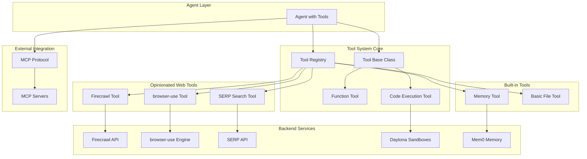

# Tool System Design

## 1. Overview

The Roboco Tool System provides a unified, extensible framework for agent capabilities with opinionated best-in-class integrations. It combines function calling, code execution, web tools, and MCP protocol support in a single, coherent system.

### 1.1 Design Principles

- **Unified Tool Interface**: Single `Tool` class with consistent API across all capabilities
- **Opinionated Integrations**: Best-in-class tools chosen by default (Firecrawl, browser-use, Daytona)
- **MCP Protocol Support**: Standardized tool integration and discovery
- **Security by Default**: Workspace isolation, permission controls, audit trails
- **Real-time Events**: All tool operations emit events for observability

### 1.2 Core Capabilities

- **Function Calling**: Register Python functions as agent tools
- **Code Execution**: Secure Daytona-powered sandboxes (sub-90ms startup)
- **Web Tools**: Firecrawl content extraction + browser-use automation
- **Search Tools**: SERP API for reliable web search
- **Memory Tools**: Mem0-powered intelligent memory operations
- **MCP Integration**: External tool protocol support

## 2. System Architecture

### 2.1 Component Overview



### 2.2 Tool Interface Design

**Unified Tool Registration**:

```python
from roboco.core import Agent, register_tool, register_function

# Agent automatically gets tool registry
agent = Agent(name="researcher", role=AgentRole.ASSISTANT)

# Register function as tool
@register_function
async def calculate_sum(a: int, b: int) -> int:
    """Calculate the sum of two numbers."""
    return a + b

agent.register_tool(calculate_sum)

# Register built-in tools
from roboco.tools import FirecrawlTool, SearchTool
agent.register_tool(FirecrawlTool())
agent.register_tool(SearchTool())

# Register MCP server
agent.register_mcp_server("http://localhost:8080")
```

**Core Tool Operations**:

- `agent.register_tool(tool)` - Register tool instance with agent
- `agent.register_function(func)` - Register Python function as tool
- `agent.register_mcp_server(url)` - Connect to external MCP server
- `agent.execute_code(code)` - Execute code in secure sandbox
- `agent.list_tools()` - List all available tools

## 3. Opinionated Web Tools

### 3.1 Firecrawl Integration (Content Extraction)

**Why Firecrawl over Jina**: Superior quality, JavaScript support, markdown output

```python
from roboco.tools import FirecrawlTool, extract_web_content

# Register with agent
agent.register_tool(FirecrawlTool(api_key="fc-..."))

# Direct usage
content = await extract_web_content(
    url="https://example.com/article",
    formats=["markdown", "html"],
    include_links=True,
    wait_for_js=True
)

print(content.markdown)  # Clean markdown content
print(content.metadata)  # Title, description, etc.
```

**Features**:

- **JavaScript Rendering**: Full SPA and dynamic content support
- **Multiple Formats**: Markdown, HTML, structured data
- **Link Extraction**: Automatic link discovery and processing
- **Metadata Extraction**: Title, description, author, publish date
- **Rate Limiting**: Built-in request throttling

### 3.2 browser-use Integration (AI Automation)

**Why browser-use over Playwright**: AI-first design, natural language control, self-healing

```python
from roboco.tools import BrowserUseTool, automate_browser

# Register with agent
agent.register_tool(BrowserUseTool())

# Natural language browser automation
result = await automate_browser(
    task="Go to arxiv.org and find the latest papers on AI agents",
    max_steps=10,
    screenshot=True
)

print(result.success)      # True/False
print(result.final_url)    # Where the automation ended
print(result.screenshot)   # Base64 screenshot
print(result.extracted_data)  # Structured data found
```

**Features**:

- **Natural Language Control**: Describe tasks in plain English
- **Self-Healing**: Automatically adapts to page changes
- **Visual Understanding**: Screenshot-based navigation
- **Data Extraction**: Automatic structured data extraction
- **Error Recovery**: Intelligent retry and fallback mechanisms

### 3.3 SERP API Integration (Web Search)

**Why SERP API**: Reliable, fast, comprehensive results without rate limits

```python
from roboco.tools import SearchTool

# Register with agent
agent.register_tool(SearchTool(api_key="serp-..."))

# Reliable web search
results = await agent.search_web(
    query="latest AI agent frameworks 2024",
    num_results=10,
    include_snippets=True
)

for result in results:
    print(f"{result.title}: {result.url}")
    print(f"Snippet: {result.snippet}")
```

**Features**:

- **No Rate Limits**: Unlike Google Custom Search
- **Rich Results**: Snippets, featured snippets, knowledge panels
- **Multiple Engines**: Google, Bing, DuckDuckGo support
- **Location Targeting**: Geo-specific search results
- **Real-time Results**: Always fresh, up-to-date information

## 4. Code Execution System

### 4.1 Daytona Integration

**Why Daytona over Docker**: Sub-90ms sandbox creation vs Docker's ~5s startup

```python
# Agent with code execution
agent = Agent(
    name="coder",
    role=AgentRole.USER,
    code_execution=True,
    execution_config={
        "provider": "daytona",
        "timeout": 30,
        "memory_limit": "512MB",
        "cpu_limit": "1.0"
    }
)

# Execute code with sub-90ms startup
result = await agent.execute_code("""
import pandas as pd
import matplotlib.pyplot as plt

# Load and analyze data
df = pd.read_csv('data.csv')
summary = df.describe()
print(summary)

# Create visualization
plt.figure(figsize=(10, 6))
df['value'].hist(bins=20)
plt.title('Data Distribution')
plt.savefig('distribution.png')
plt.show()
""")

print(result.stdout)      # Code output
print(result.stderr)      # Error messages
print(result.files)       # Generated files
print(result.execution_time)  # <90ms typical
```

**Features**:

- **Ultra-Fast Startup**: Sub-90ms sandbox creation
- **Full Isolation**: Secure execution environment
- **Resource Limits**: Memory, CPU, disk quotas
- **File Persistence**: Generated files available to agent
- **Real-time Output**: Streaming stdout/stderr

### 4.2 Code Execution Events

```python
# Monitor code execution
@agent.events.on("code.executed")
async def track_code_execution(event):
    print(f"Code executed in {event.execution_time}ms")
    print(f"Exit code: {event.exit_code}")
    if event.files_created:
        print(f"Files created: {event.files_created}")

@agent.events.on("code.error")
async def handle_code_error(event):
    print(f"Code execution failed: {event.error}")
    print(f"Stderr: {event.stderr}")
```

## 5. Built-in Tools

### 5.1 Memory Tools

Mem0-powered intelligent memory operations:

```python
from roboco.tools import MemoryTool

# Automatically registered with agents
agent = Agent(name="researcher")

# Memory operations with clean method names
await agent.add("Important research finding about AI adoption")
results = await agent.search("AI adoption trends")
await agent.update(memory_id, "Updated research finding")
```

**Available Memory Functions:**

- `add(content, metadata)` - Store with automatic importance scoring
- `search(query, limit)` - Semantic search with relevance ranking
- `get(memory_id)` - Direct retrieval by ID
- `update(memory_id, content)` - Modify existing memory
- `delete(memory_id)` - Remove specific memory

### 5.2 Basic Tools

File system and utility operations:

```python
from roboco.tools import BasicTool

# File operations within workspace
await agent.read_file("data/report.txt")
await agent.write_file("output/summary.md", content)
await agent.list_directory("workspace/")
await agent.create_directory("results/")
await agent.copy_file("source.txt", "backup.txt")
```

**Security Features**:

- **Workspace Isolation**: All operations within agent workspace
- **Path Validation**: Prevents directory traversal attacks
- **Permission Checks**: Role-based file access control
- **Audit Logging**: All file operations logged

## 6. MCP Protocol Integration

### 6.1 External Tool Discovery

```python
# Connect to MCP server
agent.register_mcp_server("http://data-science-tools:8080")

# Tools automatically discovered and registered
# Agent can now use: analyze_data, create_visualization, etc.

# List discovered tools
mcp_tools = agent.list_mcp_tools()
for tool in mcp_tools:
    print(f"{tool.name}: {tool.description}")
```

### 6.2 Custom MCP Server

```python
# Create custom MCP server
from roboco.mcp import MCPServer

server = MCPServer(name="custom-tools", port=8081)

@server.tool("custom_analysis")
async def custom_analysis(data: str) -> str:
    """Perform custom data analysis."""
    # Custom implementation
    return analysis_result

# Start server
await server.start()

# Register with agents
agent.register_mcp_server("http://localhost:8081")
```

## 7. Tool Development

### 7.1 Custom Tool Creation

```python
from roboco.core import Tool

class CustomTool(Tool):
    def __init__(self, config: dict):
        super().__init__()
        self.config = config

    async def execute(self, function_name: str, **kwargs) -> str:
        """Execute tool function."""
        if function_name == "custom_operation":
            return await self._custom_operation(**kwargs)
        else:
            raise ValueError(f"Unknown function: {function_name}")

    async def _custom_operation(self, param1: str, param2: int) -> str:
        """Custom operation implementation."""
        # Your custom logic here
        result = f"Processed {param1} with value {param2}"

        # Emit event for observability
        await self.emit_event("tool.executed", {
            "tool_name": "custom_operation",
            "parameters": {"param1": param1, "param2": param2},
            "result": result
        })

        return result

# Register with agent
agent.register_tool(CustomTool(config={"api_key": "..."}))
```

### 7.2 Function Registration

```python
from roboco.core import register_function
from typing import Annotated

@register_function
async def analyze_sentiment(
    text: Annotated[str, "Text to analyze"],
    model: Annotated[str, "Model to use"] = "default"
) -> str:
    """Analyze sentiment of given text."""
    # Implementation
    sentiment_score = await sentiment_analysis(text, model)
    return f"Sentiment: {sentiment_score}"

# Automatically available to agents
agent.register_tool(analyze_sentiment)
```

## 8. Security and Permissions

### 8.1 Tool Permissions

```python
# Agent with restricted tool access
agent = Agent(
    name="restricted_agent",
    role=AgentRole.ASSISTANT,
    tool_permissions={
        "web_tools": ["search", "extract_content"],  # No browser automation
        "file_tools": ["read"],  # No write access
        "code_execution": False,  # No code execution
        "memory_tools": ["search", "add"]  # No delete/update
    }
)
```

### 8.2 Workspace Isolation

```python
# Each agent gets isolated workspace
agent = Agent(
    name="researcher",
    workspace_path="/workspaces/researcher_001",
    workspace_config={
        "max_size": "1GB",
        "allowed_extensions": [".txt", ".md", ".json", ".csv"],
        "network_access": True,
        "internet_access": ["https://api.serp.com", "https://api.firecrawl.dev"]
    }
)
```

### 8.3 Audit Trail

```python
# All tool operations logged
@global_events.on("tool.executed")
async def audit_tool_usage(event):
    audit_log.info({
        "timestamp": event.timestamp,
        "agent_id": event.agent_id,
        "tool_name": event.tool_name,
        "function": event.function_name,
        "parameters": event.parameters,
        "result_size": len(str(event.result)),
        "execution_time": event.execution_time,
        "success": event.success
    })
```

## 9. Performance and Monitoring

### 9.1 Performance Characteristics

| Tool Category          | Target Performance | Implementation                    |
| ---------------------- | ------------------ | --------------------------------- |
| **Function Calls**     | <10ms              | Direct Python function execution  |
| **Code Execution**     | <90ms startup      | Daytona sandboxes vs Docker's ~5s |
| **Web Extraction**     | <2s per page       | Firecrawl parallel processing     |
| **Browser Automation** | <5s per action     | browser-use optimized engine      |
| **Memory Operations**  | <100ms             | Mem0 optimized vectors            |
| **MCP Tools**          | <200ms             | HTTP/gRPC protocol overhead       |

### 9.2 Tool Events

```python
# Comprehensive tool monitoring
@agent.events.on("tool.started")
async def track_tool_start(event):
    metrics.increment(f"tool.{event.tool_name}.started")

@agent.events.on("tool.completed")
async def track_tool_completion(event):
    metrics.timing(f"tool.{event.tool_name}.duration", event.execution_time)
    metrics.increment(f"tool.{event.tool_name}.completed")

@agent.events.on("tool.failed")
async def track_tool_failure(event):
    metrics.increment(f"tool.{event.tool_name}.failed")
    logger.error(f"Tool {event.tool_name} failed: {event.error}")
```

## 10. Best Practices

### 10.1 Tool Selection Guidelines

**Web Content Extraction**:

- Use **Firecrawl** for high-quality content extraction
- Use **browser-use** for complex interactions requiring visual understanding
- Use **SERP API** for reliable search results

**Code Execution**:

- Use **Daytona** for fast, secure code execution
- Set appropriate resource limits (memory, CPU, timeout)
- Handle execution errors gracefully

**Memory Operations**:

- Store meaningful, specific information
- Use descriptive metadata for better search
- Regular cleanup of low-importance memories

### 10.2 Error Handling

```python
# Robust tool error handling
async def safe_tool_execution(agent, tool_name, **kwargs):
    try:
        result = await agent.execute_tool(tool_name, **kwargs)
        return result
    except ToolExecutionError as e:
        logger.error(f"Tool {tool_name} failed: {e}")
        # Fallback strategy
        if tool_name == "web_extraction":
            # Fallback to basic HTTP request
            return await fallback_web_request(kwargs.get("url"))
        raise
    except TimeoutError:
        logger.warning(f"Tool {tool_name} timed out")
        return "Tool execution timed out. Please try again."
```

### 10.3 Resource Management

```python
# Tool resource limits
tool_config = {
    "code_execution": {
        "timeout": 30,
        "memory_limit": "512MB",
        "cpu_limit": "1.0",
        "disk_limit": "100MB"
    },
    "web_tools": {
        "max_concurrent": 3,
        "timeout": 10,
        "rate_limit": "10/minute"
    },
    "memory_tools": {
        "max_memories": 1000,
        "cleanup_threshold": 0.3
    }
}
```

## 11. Conclusion

The Roboco Tool System provides:

**Opinionated Excellence**: Best-in-class tools chosen by default (Firecrawl, browser-use, Daytona, SERP API) provide superior capabilities out of the box.

**Unified Interface**: Single tool registration and execution model across all capabilities eliminates complexity.

**Extensibility**: MCP protocol support and custom tool development enable unlimited expansion.

**Security by Default**: Workspace isolation, permission controls, and audit trails ensure safe operation.

**Performance**: Sub-90ms code execution, optimized web tools, and intelligent memory operations deliver production-ready performance.

The tool system transforms agents from simple chatbots to capable entities that can interact with the web, execute code, manage memory, and integrate with external systems through a unified, secure, and observable interface.
