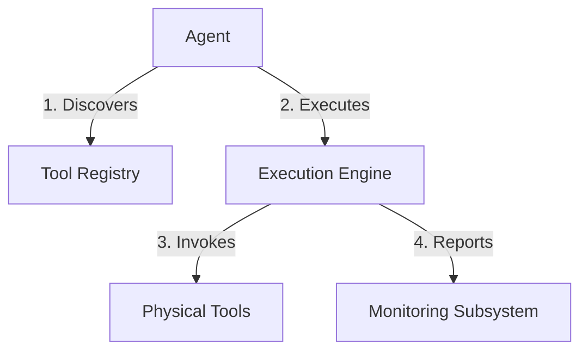
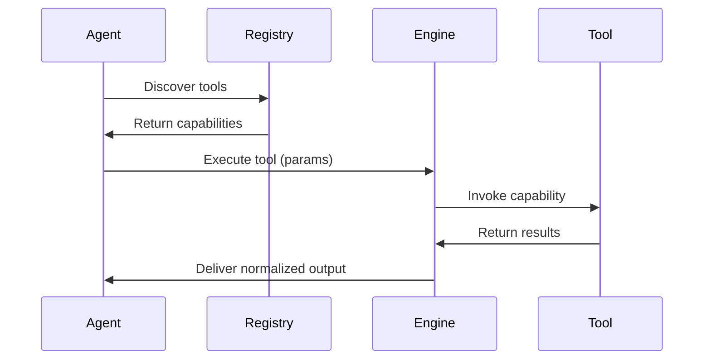

# RoboCo Tool System Design Document

## 1. Introduction

The RoboCo Tool System forms the foundation for extending agent capabilities within the RoboCo ecosystem. This design document outlines how the system enables agents to interact with external systems through a standardized, secure, and discoverable framework. By abstracting tool implementation details, the system allows agents to focus on problem-solving while providing robust mechanisms for tool lifecycle management.

### 1.1 Purpose and Value Proposition
The tool system addresses the fundamental challenge of extending agent capabilities beyond their core functionality. Rather than requiring agents to implement specialized functionality directly, the system provides:

- A protocol-based interface for agent-tool interaction
- Centralized discovery mechanism for available capabilities
- Security enforcement at the protocol level
- Observable and monitorable tool execution

The value lies in enabling agents to dynamically adapt to available capabilities while maintaining a clean separation between agent reasoning and tool implementation.

### 1.2 Design Philosophy
The system follows three core philosophical principles:

1. **Capability Abstraction**: Tools encapsulate domain-specific knowledge and operations, allowing agents to remain focused on high-level reasoning rather than implementation details.

2. **Protocol-Centric Interaction**: All tool interactions occur through the standardized Model Context Protocol (MCP), ensuring consistency regardless of tool complexity or location.

3. **Observability as First-Class Concern**: Comprehensive monitoring is built into the system architecture rather than added as an afterthought, enabling operational excellence.

## 2. Architectural Principles

### 2.1 Foundational Principles

The tool system architecture is built on five core principles that guide design decisions:

**Protocol-First Architecture**
All tool interactions are mediated through the Model Context Protocol (MCP), creating a consistent communication layer that abstracts implementation details. This approach ensures that agents interact with all tools through a uniform interface, regardless of whether the tool is running locally or as a remote service.

**Separation of Concerns**
Agents specialize in reasoning and decision-making, while tools encapsulate specific capabilities. This separation allows each component to evolve independently - agents can be upgraded without affecting tools, and new tools can be introduced without modifying agent logic.

## 3. Tool Integration Patterns

The framework is designed to support a flexible range of tool types:

-   **Local Tools**: Functions executed directly within the agent's process. Ideal for low-latency, trusted operations.
-   **Remote Tools**: Services accessed over the network via the Model Context Protocol (MCP). This allows for a distributed and scalable tool architecture.
-   **Managed Services**: Third-party, enterprise-grade services (e.g., SaaS APIs) integrated via secure connectors.

## 4. System Integration

The Tool System is a core pillar of the RoboCo framework and is deeply integrated with other subsystems:

-   **Event System**: Every phase of a tool's lifecycle—`ToolCallInitiated`, `ToolCallCompleted`, `ToolCallFailed`—generates a structured event on the central **Event Bus**. This provides the foundation for real-time monitoring, auditing, and debugging.

-   **Context Management**: The framework provides a set of built-in tools for state manipulation, most notably `get_context` and `set_context`. These system tools are managed by the Execution Engine and generate events just like any other tool, making agent state changes fully observable and traceable actions.

## 5. Security and Governance

Security is a paramount concern and is enforced through a multi-layered approach:

-   **Authentication**: Agents and tools must authenticate via mechanisms like OAuth 2.0 or API Keys before they can interact.
-   **Authorization**: Fine-grained policies, managed in the Tool Registry, define which agents are permitted to execute which tools.
-   **Auditing**: A comprehensive, immutable log of all tool executions is maintained for security analysis and compliance.
-   **Sandboxing**: High-risk tools can be designated to run in isolated, sandboxed environments to mitigate potential security threats.

The Execution Engine handles the end-to-end lifecycle of tool invocation, providing critical services that abstract complexity from agents:

**Core Capabilities**
- **Protocol Translation**: Bridges agent requests to tool-specific interfaces
- **Execution Mode Management**: Supports both synchronous and asynchronous patterns
- **State Management**: Maintains context for long-running operations
- **Error Handling**: Standardizes error reporting and recovery mechanisms

**Design Rationale**
The engine is designed to:
- Abstract execution complexity from agents
- Ensure consistent behavior across tool types
- Provide fault isolation between tool executions
- Enable cross-tool transaction management

### 3.3 Monitoring Subsystem: The Observability Backbone

This subsystem provides comprehensive observability into tool operations:

**Core Features**
- **Health Assessment**: Continuous monitoring of tool operational status
- **Performance Telemetry**: Latency, throughput, and error rate metrics
- **Usage Analytics**: Insights into tool adoption patterns
- **Audit Trail**: Immutable logs of all tool invocations

**Design Rationale**
Monitoring is integrated as a first-class concern to:
- Enable proactive issue detection
- Provide data-driven insights for optimization
- Support service level objectives (SLOs)
- Facilitate root cause analysis

## 4. Integration Patterns

### 4.1 Tool Integration Taxonomy

The system supports three fundamental integration patterns, each with distinct characteristics:

**Local Tools**
These execute within the agent's runtime environment, offering minimal latency at the cost of resource sharing. Typical use cases include file operations and local data processing where speed is critical.

**Remote Tools**
Operating through the MCP protocol, these tools run in separate environments. This pattern is ideal for resource-intensive operations or when tools need to be shared across multiple agents.

**Managed Services**
These represent enterprise-grade capabilities provided as professional services. The system integrates with these through standardized APIs while maintaining the same security and observability standards as internal tools.

### 4.2 Security Framework

The security architecture employs a defense-in-depth strategy:

**Core Mechanisms**
- **Authentication**: OAuth 2.0 and API key support with token rotation
- **Authorization**: Attribute-based access control with policy engines
- **Auditing**: Immutable logs of all tool invocations with context
- **Isolation**: Sandboxed execution for untrusted tools

**Design Rationale**
Security is protocol-embedded to ensure:
- Consistent enforcement across tool types
- Minimal overhead for tool developers
- Centralized policy management
- Comprehensive audit trails

## 5. Agent-Tool Interaction

### 5.1 Workflow Architecture

The agent-tool interaction follows a carefully designed workflow:

**Key Design Features**
- **Discovery Phase**: Enables agents to adapt to available capabilities
- **Execution Abstraction**: Shields agents from implementation details
- **Result Normalization**: Presents outputs in agent-consumable format
- **Error Standardization**: Provides consistent error handling

### 5.2 Quality Attributes

The system ensures rigorous quality standards through:

**Reliability Mechanisms**
- Redundant components with automatic failover
- Graceful degradation during partial failures
- Automated recovery from transient errors

**Performance Optimization**
- Local caching of frequently accessed tools
- Request batching for high-volume operations
- Adaptive load balancing based on real-time metrics

**Security Enforcement**
- End-to-end encryption for sensitive data
- Context-aware access control decisions
- Automated security policy updates

## 6. Deployment Architecture

### 6.1 Deployment Strategies

The system supports multiple deployment topologies to accommodate different operational requirements:

**Centralized Deployment**
Ideal for development environments and small-scale deployments, this model uses a single registry and execution engine. While operationally simpler, it presents a single point of failure.

**Federated Model**
For large-scale deployments, this approach uses multiple synchronized registries. It provides geographic distribution and fault tolerance at the cost of increased operational complexity.

**Hybrid Approach**
This recommended model combines a central registry with distributed execution engines. It balances control with scalability, allowing execution resources to scale independently.

### 6.2 Scaling Considerations

The architecture supports elastic scaling through:

**Horizontal Scaling Patterns**
- Stateless execution workers behind load balancers
- Registry sharding based on tool categories
- Distributed caching layers for discovery requests

**Capacity Management**
- Predictive scaling based on usage patterns
- Queue-based load leveling with backpressure signaling
- Resource allocation based on priority tiers

## 7. Monitoring and Maintenance

### 7.1 Observability Framework

The monitoring subsystem provides comprehensive insights through:

**Key Metrics**
- Tool health scores with weighted indicators
- Success rates segmented by error type
- Latency distributions across percentiles
- Resource consumption trends

**Operational Insights**
- Dependency impact analysis
- Capacity utilization forecasting
- Anomaly detection for abnormal patterns
- Root cause analysis workflows

### 7.2 Maintenance Operations

Lifecycle management includes:

**Update Management**
- Zero-downtime deployments with blue-green patterns
- Version compatibility matrices
- Automated rollback mechanisms

**Dependency Management**
- Vulnerability scanning for third-party components
- Automated patching with testing gates
- Impact analysis before dependency updates

## 8. Future Extensions

### 8.1 Evolution Roadmap

The system is designed for extensibility with planned enhancements:

**Capability Composition**
Workflows that combine multiple tools into higher-order capabilities, enabling agents to accomplish complex tasks through coordinated tool sequences.

**Quality-of-Service Tiers**
Differentiated service levels for tools based on criticality, allowing prioritization of mission-critical capabilities during resource contention.

**Marketplace Integration**
A curated ecosystem where tool developers can publish capabilities and agents can discover specialized functionality on demand.

### 8.2 Extension Points

The architecture provides well-defined extension mechanisms:

**Authentication Providers**
Pluggable modules for integrating enterprise identity systems or specialized authentication requirements.

**Protocol Adapters**
Framework for bridging legacy systems into the tool ecosystem without modifying core protocols.

**Analytics Plugins**
Extensible framework for adding custom analytics and monitoring capabilities tailored to specific operational needs.
