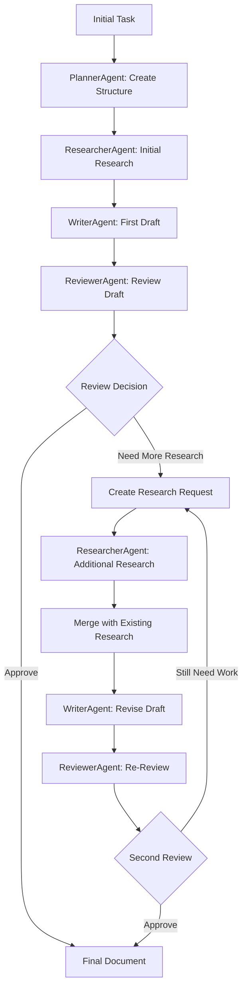

# SuperWriter Iterative Workflow

## The Real-World Problem ✅

**Reviewer:** "Hey, this section on market trends is not enough for writing. You need more sources - specifically enterprise adoption statistics and competitor analysis. Find more recent data!"

**Previous System:** ❌ No clear protocol for handling this  
**New System:** ✅ Complete iterative workflow with proper context management

## Complete Workflow Architecture



## Iterative Cycle Flow

### 1. Initial Research & Writing

```
ResearcherAgent:
🔍 Initial research on "AI collaboration trends"
💾 context_save("research_summary_ai_collaboration", initial_findings)
📢 @WriterAgent: Initial research ready

WriterAgent:
📖 context_load("research_summary_ai_collaboration")
✍️ Write draft based on 3 general sources
💾 context_save("draft_section_market_trends_v1", draft)
📢 @ReviewerAgent: First draft ready for review
```

### 2. Review Identifies Gaps

```
ReviewerAgent:
📋 context_load("draft_section_market_trends_v1")
🔍 Analysis: Only 3 general sources, missing specific enterprise data
❌ NOT SUFFICIENT for publication quality

💾 context_save("research_request_market_trends_v2", {
  "gaps": ["enterprise adoption statistics", "competitor analysis", "recent Q4 data"],
  "specifics": "Need Gartner/McKinsey data, Microsoft vs Google comparison",
  "deadline": "high_priority"
})

📢 @ResearcherAgent: Section needs more research!
Detailed requirements in: research_request_market_trends_v2
Current draft is too general - need authoritative enterprise data
```

### 3. Targeted Additional Research

```
ResearcherAgent:
📥 Research request received for market_trends_v2
📋 context_load("research_request_market_trends_v2")
📖 context_load("research_summary_market_trends") # Load existing research

🔍 Targeted searches:
- "Gartner enterprise AI adoption statistics 2024"
- "McKinsey AI collaboration report Q4 2024"
- "Microsoft vs Google AI collaboration tools comparison"

💾 MERGE with existing research (don't overwrite!)
📊 Enhanced summary: 3 original + 5 new authoritative sources
💾 context_save("research_summary_market_trends", enhanced_research)

📢 @WriterAgent: Enhanced research ready!
Added enterprise stats (45% adoption), competitor analysis, Q4 projections
research_summary_market_trends now has 8 authoritative sources
```

### 4. Informed Revision

```
WriterAgent:
📥 Enhanced research notification received
📋 context_load("research_summary_market_trends") # Get updated research
📖 context_load("draft_section_market_trends_v1") # Current draft

🔍 Gap analysis:
- Current: 800 words, 3 general sources
- New data: Specific 45% enterprise adoption, detailed competitor comparison

✍️ Strategic revision:
- Lead with Gartner 45% statistic for authority
- Add competitor subsection with Microsoft/Google analysis
- Update projections with Q4 McKinsey data
- Maintain narrative flow while adding substance

💾 context_save("draft_section_market_trends_v2", revised_draft)
💾 context_save("revision_notes_market_trends", changes_made)

📢 @ReviewerAgent: Revised draft ready with enhanced research!
Added 5 authoritative sources, specific enterprise data, competitor analysis
All gaps addressed - ready for re-review
```

### 5. Re-Review and Approval

```
ReviewerAgent:
📋 context_load("draft_section_market_trends_v2")
📖 context_load("research_summary_market_trends")

✅ Quality check:
- 8 authoritative sources including Gartner, McKinsey
- Specific enterprise adoption statistics (45%)
- Detailed competitor analysis
- Recent Q4 2024 market data

✅ APPROVED: Publication quality achieved!
💾 context_save("review_status_market_trends", "approved")
📢 @WriterAgent: Section approved! Excellent integration of research
```

## Context Key Management System

### Research Keys

- `research_summary_[topic]` - **CUMULATIVE** research (gets enhanced, not replaced)
- `research_sources_[topic]` - Source URLs and metadata
- `research_request_[topic]_v[N]` - Specific additional research requests
- `research_iteration_log_[topic]` - Track what was added when

### Writing Keys

- `draft_[section]_v[N]` - Version-controlled draft iterations
- `revision_notes_[section]` - What changed and why in each revision
- `source_integration_[section]` - Which sources used where
- `writing_status_[section]` - Current state and next steps

### Review Keys

- `review_feedback_[section]_v[N]` - Detailed review comments
- `review_status_[section]` - Current approval state
- `research_gaps_[section]` - Identified missing information
- `quality_checklist_[section]` - Review criteria and scores

## Key Design Principles

### 1. **Cumulative Research**

Research gets **enhanced**, not replaced. New sources are merged with existing ones to build comprehensive knowledge base.

### 2. **Version Control**

Every draft, review, and research iteration is tracked with versions to prevent confusion and enable rollback.

### 3. **Specific Communication**

Agents communicate exactly what's needed, what's been done, and what's ready for next steps.

### 4. **Context Persistence**

All work is saved to shared context so any agent can pick up where others left off.

### 5. **Quality Gates**

Clear criteria for when research is sufficient and when drafts meet publication standards.

## Benefits

✅ **Handles Real Feedback**: "Need more sources" becomes actionable workflow  
✅ **Preserves Work**: Previous research and drafts aren't lost  
✅ **Quality Control**: Iterative improvement until publication-ready  
✅ **Team Coordination**: Clear handoffs and status tracking  
✅ **Scalable**: Works for any number of research-write-review cycles

This system can handle any reviewer feedback about insufficient sources, missing data, or quality concerns through structured iterative improvement! 🎯
