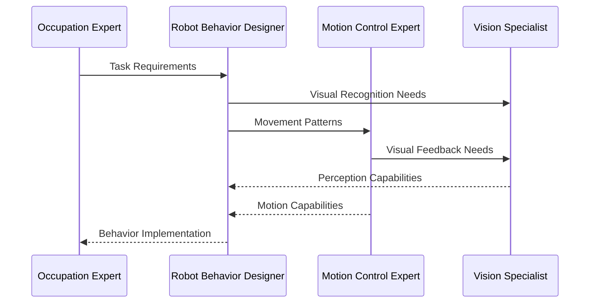
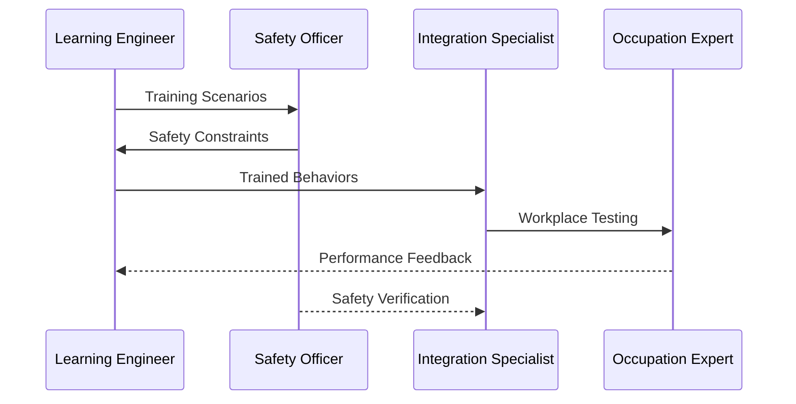

# RoboCo System Architecture

> **Version:** 1.1.0  
> **Last Updated:** [Date]  
> **Author:** RoboCo Team  
> **AG2 Version:** 1.0.0

## Table of Contents

1. [Overview](#overview)
2. [Vision: Universal Occupational Adaptation](#vision)
3. [Technical Foundation](#technical-foundation)
4. [Team Structure](#team-structure)
5. [Workflow and Collaboration](#workflow-and-collaboration)
6. [Success Metrics](#success-metrics)

## Overview

RoboCo is a multi-agent system designed to develop and adapt humanoid robots for specific occupations. Using AG2 (AutoGen) framework, our system combines expertise in robotics, human behavior analysis, and occupation-specific knowledge to create effective robot workers that can naturally integrate into human workplaces.

## Vision: Universal Occupational Adaptation

RoboCo's mission is to create a universal adaptation system that can rapidly transform any humanoid robot platform into a qualified worker for specific occupations. Whether it's a Tesla Optimus, Figure 01, or any other humanoid robot, our system will enable:

**Goal**: "From Robot to Role in 30 Days"

**Key Capabilities**:

- Rapid skill acquisition through multi-modal learning
- Occupation-specific behavior adaptation
- Real-world environment integration
- Human-like task execution and interaction

**Target Occupations** (Initial Focus):

- Customer Service (e.g., Receptionist, Hotel Concierge)
- Food Service (e.g., Waiter, Barista)
- Retail (e.g., Store Assistant, Inventory Manager)
- Office Support (e.g., Office Assistant, Mail Room Operator)

**Adaptation Process**:

1. Occupation Analysis (Day 1-3)
2. Core Skill Programming (Day 4-10)
3. Interactive Learning (Day 11-20)
4. Workplace Integration (Day 21-25)
5. Final Validation (Day 26-30)

## Technical Foundation

### Robot Definition

**Robot Definition**:

- Robot description in URDF format, including joint specifications and limits
- 3D models in STL format
- Sensor configurations, such as camera, lidar, and IMU
- Computing platform specifications such as CPU, GPU, RAM, etc.
- A full product specification document including all above information and other details
- Customer service information, such as contact information, support channels, etc.

### Development Stack

**Core Technologies**:

- ROS2 (Humble/Iron) for robot control
- Python 3.10+ for high-level logic
- C++17/20 for performance-critical components
- CUDA for GPU acceleration
- PyTorch/JAX for ML components

**Development and Simulation Environment**:

- PC with CUDA-enabled GPU such as RTX 4090
- Ubuntu 24.04 LTS
- ROS2 Humble/Iron
- Primary: MuJoCo for physics simulation
- Alternative: Gazebo for ROS integration

## Organization Structure

We should define a set of key roles and responsibilities for the RoboCo project, each will be implemented as an AutoGen agent (as AssistantAgent, or UserProxyAgent etc.).

The key roles are:

- Executive Board
- Occupation Expert
- Robot Behavior Designer
- Vision and Perception Specialist
- Motion Control Expert
- Learning System Engineer

Below we will define the key areas of responsibility for each role.

Considering the limitation of AI and AutoGen, we should not let the system run in fully autonomous mode without human intervention. Therefore, we need to design a set of human-in-the-loop mechanisms, as well as the observability and operability of the system, which will be exposed as API and then we will view and manage the system status and performance in the Studio.

### 1. Executive Board

**Role**: Strategic Direction and Occupation Selection  
**Responsibilities**:

- Select target occupations based on market needs and technical feasibility
- Allocate resources for different occupation adaptations
- Set success criteria for each occupation
- Make go/no-go decisions for deployment
- Manage stakeholder relationships (employers, regulators, unions)

### 2. Product Manager

**Role**: Domain Knowledge and Product Specification  
**Key Areas**:

- Take the vision as input and define the product specification document
- Define the success criteria for each occupation
- Define the key performance metrics for each occupation
- Sign off the release of each version of the product

### 3. Embodied AI Researcher

**Role**: Embodied AI and Robotics Kinematics  
**Focus Areas**:

- Research and implement the state-of-the-art embodied AI and robotics kinematics
- Design and train the world model, and evaluate the performance to make the robot behavior more human-like
- Implement the model and algorithms as easy-to-use modules for the developers
- Iterate the models based the engineering feedback

### 4. Robotics Developer

**Role**: Apply the research results to the robots
**Responsibilities**:

- Prepare the development environment and continous integration proccess
- Implement the models from researchers on both simulation and real robots
- Implement the observability (data collection and visualization, monitoring, etc.) and operability systems including APIs and Studio
- Analyze the engineering feedback and iterate the systems

### 5. Quality Assurance Engineer

**Role**: Quality Assurance and Field Engineering  
**Key Functions**:

- Define the quality assurance metrics based on the product specification document
- Design the test scenarios and run the tests
- Analyze the test results and report to the developers

## Workflow and Collaboration

### 1. Occupation Adaptation Process

### 2. Learning and Validation

## Success Metrics

### 1. Occupational Performance

- Task completion accuracy
- Work speed compared to humans
- Adaptation to variations
- Tool handling proficiency
- Error recovery rate

### 2. Safety and Compliance

- Safety incident rate
- Regulatory compliance score
- Emergency response time
- Human comfort ratings
- Risk assessment scores

### 3. Integration Metrics

- Deployment success rate
- Workplace adaptation time
- Maintenance requirements
- System reliability
- Human coworker acceptance
