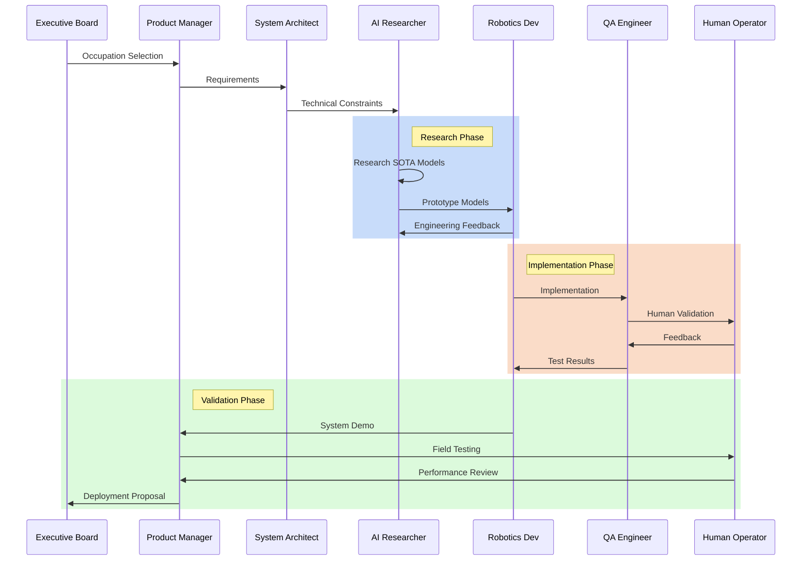
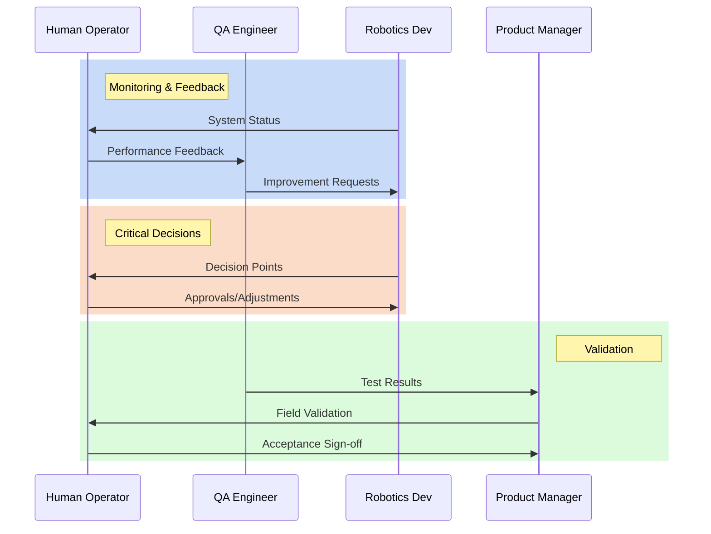

# RoboCo System Architecture

> **Version:** 1.1.0  
> **Last Updated:** [Date]  
> **Author:** RoboCo Team  
> **AG2 Version:** 1.0.0

## Table of Contents

1. [Overview](#overview)
2. [Vision: Universal Occupational Adaptation](#vision)
3. [Technical Foundation](#technical-foundation)
4. [Team Structure](#team-structure)
5. [Workflow and Collaboration](#workflow-and-collaboration)
6. [Success Metrics](#success-metrics)
7. [Development Phases](#development-phases)
8. [Testing Framework](#testing-framework)
9. [Observability and Operations](#observability-and-operations)

## Overview

RoboCo is a multi-agent system designed to develop and adapt humanoid robots for specific occupations. Using AG2 (AutoGen) framework, our system combines expertise in robotics, human behavior analysis, and occupation-specific knowledge to create effective robot workers that can naturally integrate into human workplaces.

## Vision: Universal Occupational Adaptation

RoboCo's mission is to create a universal adaptation system that can rapidly transform any humanoid robot platform into a qualified worker for specific occupations. Whether it's a Tesla Optimus, Figure 01, or any other humanoid robot, our system will enable:

**Goal**: "From Robot to Role in 30 Days"

**Key Capabilities**:

- Rapid skill acquisition through multi-modal learning
- Occupation-specific behavior adaptation
- Real-world environment integration
- Human-like task execution and interaction

**Target Occupations** (Initial Focus):

- Customer Service (e.g., Receptionist, Hotel Concierge)
- Food Service (e.g., Waiter, Barista)
- Retail (e.g., Store Assistant, Inventory Manager)
- Office Support (e.g., Office Assistant, Mail Room Operator)

**Adaptation Process**:

1. Occupation Analysis (Day 1-3)
2. Core Skill Programming (Day 4-10)
3. Interactive Learning (Day 11-20)
4. Workplace Integration (Day 21-25)
5. Final Validation (Day 26-30)

## Technical Foundation

### Robot Definition

**Robot Definition**:

- Robot description in URDF format, including joint specifications and limits
- 3D models in STL format
- Sensor configurations, such as camera, lidar, and IMU
- Computing platform specifications such as CPU, GPU, RAM, etc.
- A full product specification document including all above information and other details
- Customer service information, such as contact information, support channels, etc.

### Development Stack

**Core Technologies**:

- ROS2 (Humble/Iron) for robot control
- Python 3.10+ for high-level logic
- C++17/20 for performance-critical components
- CUDA for GPU acceleration
- PyTorch/JAX for ML components

**Development and Simulation Environment**:

- PC with CUDA-enabled GPU such as RTX 4090
- Ubuntu 24.04 LTS
- ROS2 Humble/Iron
- Primary: MuJoCo for physics simulation
- Alternative: Gazebo for ROS integration

## Organization Structure

We should define a set of key roles and responsibilities for the RoboCo project, each will be implemented as an AutoGen agent (as AssistantAgent, or UserProxyAgent etc.).

The key roles are:

- Executive Board
- Product Manager
- System Architect
- Embodied AI Researcher
- Robotics Developer
- Quality Assurance Engineer

Below we will define the key areas of responsibility for each role.

Considering the limitation of AI and AutoGen, we should not let the system run in fully autonomous mode without human intervention. Therefore, we need to design a set of human-in-the-loop mechanisms, as well as the observability and operability of the system.

### 1. Executive Board

**Role**: Strategic Direction and Occupation Selection  
**Responsibilities**:

- Select target occupations based on market needs and technical feasibility
- Allocate resources for different occupation adaptations
- Set success criteria for each occupation
- Make go/no-go decisions for deployment
- Manage stakeholder relationships (employers, regulators, unions)

### 2. Product Manager

**Role**: Domain Knowledge and Product Specification  
**Key Areas**:

- Take the vision as input and define the product specification document
- Define the success criteria for each occupation
- Define the key performance metrics for each occupation
- Sign off the release of each version of the product

### 3. System Architect

**Role**: Technical Architecture and System Design
**Key Areas**:

- Define technical stack and standards
- Design the overall system architecture ensures scalability and maintainability
- Design APIs and system interfaces

### 4. Embodied AI Researcher

**Role**: Embodied AI and Robotics Kinematics  
**Focus Areas**:

- Research and implement the state-of-the-art embodied AI and robotics kinematics
- Design and train the world model, and evaluate the performance to make the robot behavior more human-like
- Implement the model and algorithms as easy-to-use modules for the developers
- Iterate the models based the engineering feedback

### 5. Robotics Developer

**Role**: Apply the research results to the robots
**Responsibilities**:

- Prepare the development environment and continous integration proccess
- Implement the models from researchers on both simulation and real robots
- Implement the observability and operability systems
- Analyze the engineering feedback and iterate the systems

### 6. Quality Assurance Engineer

**Role**: Quality Assurance and Field Engineering  
**Key Functions**:

- Define the quality assurance metrics based on the product specification document
- Design the test scenarios and run the tests
- Analyze the test results and report to the developers

## Workflow and Collaboration

### 1. Development Lifecycle

### 2. Human-in-the-Loop Process

## Success Metrics

### 1. Agent System Performance

**Multi-Agent Collaboration**:

- Successful role execution by each agent (Executive Board, Product Manager, etc.)
- Effective communication and handoffs between agents
- Proper handling of decision points requiring human intervention
- Clear logging and traceability of agent interactions and decisions

**System Stability**:

- Continuous operation without agent crashes or hangs
- Proper error handling and recovery across agent interactions
- Memory usage remains stable during extended operations
- Clean termination and restart capabilities

### 2. Simulation Results

**Task Completion**:

- Successfully complete occupation-specific tasks in MuJoCo/Gazebo
- Demonstrate adaptive behaviors in varying simulation scenarios
- Handle common edge cases and unexpected situations
- Show consistent performance across multiple simulation runs

**Learning Effectiveness**:

- Measurable improvement in task performance over training iterations
- Successful transfer of learned skills between similar tasks
- Effective use of human feedback for behavior refinement
- Clear metrics showing learning progress and convergence

### 3. Development Efficiency

**System Integration**:

- Complete integration between AG2 agents and simulation environment
- Reliable data flow between different system components
- Efficient resource utilization during operation
- Easy-to-use interfaces for human operators

**Iteration Speed**:

- Quick deployment of new agent configurations
- Fast simulation cycles for rapid testing
- Efficient debugging and monitoring capabilities
- Rapid incorporation of human feedback

## Development Phases

### Phase 1: Agent Framework (Week 1-2)

- Implement core agent roles with basic communication
- Set up human intervention points
- Establish logging and monitoring
- Success Criteria: All agents can communicate and make decisions in their roles

### Phase 2: Simulation Integration (Week 3-4)

- Set up MuJoCo environment with required task scenarios
- Integrate agent system with simulation
- Implement basic task execution
- Success Criteria: System can run end-to-end task simulations

### Phase 3: Learning System (Week 5-8)

- Implement task learning mechanisms
- Add adaptation capabilities
- Develop feedback integration
- Success Criteria: System shows measurable improvement in task performance

## Testing Framework

### Core Test Scenarios

- Agent role validation
- Task completion verification
- Learning progress measurement
- Performance benchmarks

### Monitoring Points

- Agent communication latency
- Task success rates
- Resource utilization
- Learning convergence

## Observability and Operations

### System State Tracking

**Agent Status**:

- Current role and task assignment
- Message queue status
- Last successful interaction timestamp
- Resource consumption (memory, CPU)

**Simulation State**:

- Current scenario and progress
- Task completion status
- Learning iteration count
- Performance metrics for current task

### Operation Controls

**System Management**:

- Start/stop individual agents
- Pause/resume simulation
- Save/load system state
- Force cleanup and restart

**Human Intervention**:

- Task approval checkpoints
- Manual task demonstration interface
- Emergency stop mechanism
- Performance feedback input

### Data Collection

**Critical Metrics**:

- Agent interaction success rate
- Task completion times
- Learning convergence rate
- Resource utilization trends

**Debug Information**:

- Agent communication logs
- Decision point traces
- Error states and stack traces
- Performance bottlenecks
